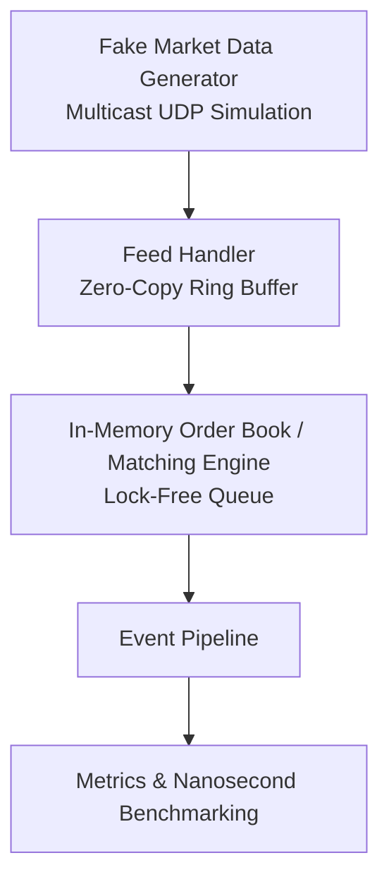

# Helios ☀️

An ultra-low latency, cache-optimized C++20 HFT Order Book and Matching Engine designed to explore hardware-level systems design and microsecond-level execution paths.

---

## 🚀 Key Engineering Focus Areas
* **Kernel Bypass & Network Ingestion:** Simulating zero-copy multicast feed handling using custom ring buffers to bypass traditional OS network stack bottlenecks.
* **Mechanical Sympathy:** Cache-friendly data structures (e.g., contiguous memory pools for Limit/Order structs, avoiding `std::map` node allocation overhead).
* **Lock-Free Concurrency:** Single-writer architecture using lock-free ring buffers (SPSC/MPMC) for thread-safe event streaming between the market feed and the strategy engine.
* **Deterministic Performance:** Zero-allocation critical path to eliminate runtime heap allocation latencies and garbage collection jitter.

---

## 🛠️ Architecture Flow


---

## ✨ Features & Roadmap
- [ ] **Ultra-Fast Matching Engine:** Price-time priority ($L3$ order book depth) supporting Limit, Market, and Cancel orders.
- [ ] **High-Fidelity Simulated Feed:** Packet-generator replaying synthetic market ticks via IPC or UDP.
- [ ] **Metrics Engine:** Automated benchmarking suite measuring P50, P99, and P99.9 tick-to-trade latencies using `std::chrono::high_resolution_clock`.

## 📦 Building and Running
*Requirements: A modern C++20 compiler (GCC 11+ or Clang 13+) and CMake.*

```bash
mkdir build && cd build
cmake -DCMAKE_BUILD_TYPE=Release ..
make -j$(nproc)
./helios_bench

### Why this changes the game:
1. **Elevates the Terminology:** Changing "concurrency" to "Lock-Free Concurrency" and "performance optimization" to "Mechanical Sympathy" immediately signals that you understand actual low-latency paradigms.
2. **Establishes Context:** Explicitly mentioning a *zero-allocation critical path* tells anyone reading it that you know how heap allocations ruin latency. 

Are you planning to implement the order book using a classic pointer-based doubly-linked list for price levels, or are you leaning toward a flat, array-based structure to maximize CPU cache hits?
