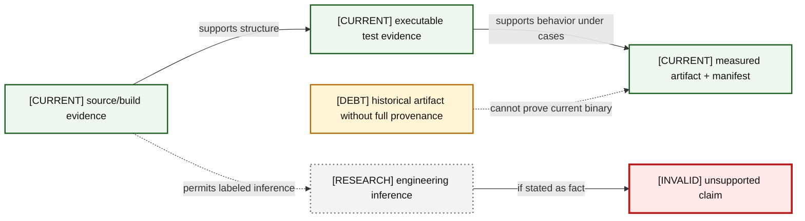

```mermaid
flowchart LR
    C["[CURRENT] tracked component"]:::current
    D["[DEBT] current but compromised"]:::debt
    I["[INVALID] demonstrably wrong path"]:::invalid
    P["[PROPOSED] backlog correction"]:::proposed
    R["[RESEARCH] experiment, no commitment"]:::research
    N["[CONTEXT — NOT IMPLEMENTED] educational neighbor"]:::context
    O["[OUT OF SCOPE] explicitly excluded"]:::context
    C -->|solid current relationship| D
    D -->|known violation| I
    I -.->|candidate correction| P
    P -.->|may require study| R
    N -.->|context only| C
    classDef current fill:#eef7ee,stroke:#1b5e20,stroke-width:2px,color:#111;
    classDef debt fill:#fff4d6,stroke:#b26a00,stroke-width:2px,color:#111;
    classDef invalid fill:#ffe8e8,stroke:#b71c1c,stroke-width:3px,color:#111;
    classDef proposed fill:#e8f1ff,stroke:#1565c0,stroke-width:2px,stroke-dasharray: 6 4,color:#111;
    classDef research fill:#f3f3f3,stroke:#666,stroke-width:2px,stroke-dasharray: 2 4,color:#111;
    classDef context fill:#fafafa,stroke:#777,stroke-width:2px,stroke-dasharray: 2 4,color:#111;
```

# 00 — Legend and Evidence Rules

These rules are normative for every atlas chapter. Text prefixes carry truth even when color is unavailable.

### A00-01 — Truth-state notation

| Diagram card field | Value |
|---|---|
| Purpose and scope | Define the only allowed truth states and their visual treatment. |
| Evidence/status | Normative atlas convention. |
| Source evidence | [12-technical-debt-and-limitations.md](../../docs/helios-study-guide/12-technical-debt-and-limitations.md) |
| Backlog | [DOC-01](../../ENGINEERING_BACKLOG.md#doc-01--reconcile-architecture-and-evidence-documentation) |
| Findings | [HEL-014](11-current-technical-debt-overlay.md#hel-014) |
| Related atlas material | — |

- **Important edges**
  - Solid current edges are implementation relationships.
  - Dashed/dotted edges cannot be read as shipped capability.
- **What exists:** All seven textual states and styles.
- **What does not exist:** Any unlabeled hypothetical node or color-only status signal.

### A00-02 — Evidence hierarchy

| Diagram card field | Value |
|---|---|
| Purpose and scope | Show how claims become defensible and where inference or historical output stops. |
| Evidence/status | Normative evidence policy. |
| Source evidence | [06-cpu-cache-and-performance-model.md](../../docs/helios-study-guide/06-cpu-cache-and-performance-model.md), [08-benchmarking-and-measurement.md](../../docs/helios-study-guide/08-benchmarking-and-measurement.md) |
| Backlog | [VER-06](../../ENGINEERING_BACKLOG.md#ver-06--establish-artifact-and-replay-provenance), [BEN-01](../../ENGINEERING_BACKLOG.md#ben-01--make-build-and-benchmark-provenance-reproducible), [DOC-03](../../ENGINEERING_BACKLOG.md#doc-03--define-performance-claim-vocabulary) |
| Findings | [HEL-005](11-current-technical-debt-overlay.md#hel-005), [HEL-007](11-current-technical-debt-overlay.md#hel-007), [HEL-033](11-current-technical-debt-overlay.md#hel-033), [HEL-048](11-current-technical-debt-overlay.md#hel-048) |
| Related atlas material | — |

- **Important edges**
  - Source proves implementation shape; tests prove only exercised behavior; a manifest binds measurements to a binary.
  - Inference remains explicitly weaker than measurement.
- **What exists:** Tracked source, tests, and artifacts at different confidence levels.
- **What does not exist:** A complete reproducible benchmark manifest or exhaustive correctness oracle.

## Diagram-card contract

Every Mermaid fence in this atlas is immediately owned by a heading with a unique diagram ID and a card containing purpose/scope, evidence/status, source evidence, backlog IDs, finding IDs, related material, edge explanations, and explicit existence/non-existence statements. Ownership arrows mean “controls lifetime”; observation arrows never imply ownership. Edge labels use `bytes`, `call`, `callback`, `owns`, `observes`, `returns`, `error`, or an equally concrete domain verb. Hypothetical/current ambiguity is a defect: a future node requires a future prefix and dashed/dotted border, and a production-context edge may not enter CURRENT without a boundary label.

## Evidence labels

- **Repository evidence:** directly tracked source, build configuration, test, or artifact.
- **Measured historical evidence:** tracked output whose original environment may be incomplete.
- **Engineering inference:** reasoned CPU/OS/algorithmic consequence, not measured fact.
- **Unmeasured hypothesis:** falsifiable future performance or architecture claim.
- **Externally verified fact:** specification-backed fact; the atlas links the repository’s study guide instead of re-asserting external citations.
