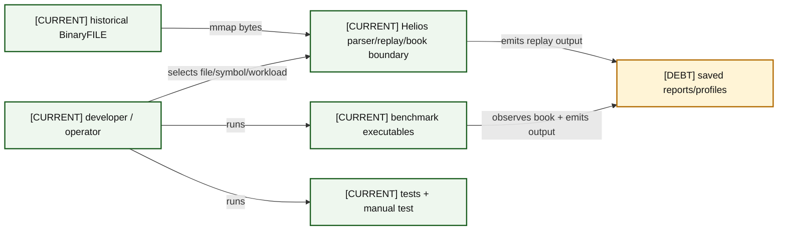
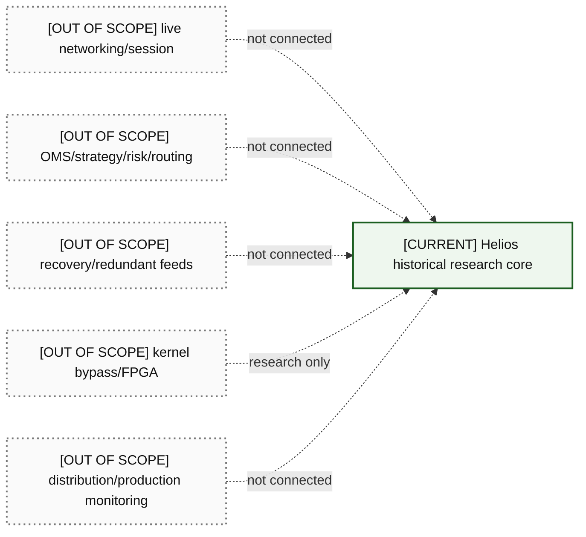

# 01 — Current System Context

The solid boundary is intentionally small: historical-file tools, a single-writer in-memory book, verification executables, and evidence artifacts.

### A01-01 — CURRENT C4-style context

| Diagram card field | Value |
|---|---|
| Purpose and scope | Place users and tracked Helios executables around the current software boundary. |
| Evidence/status | Repository evidence. |
| Source evidence | [CMakeLists.txt](../../CMakeLists.txt), [itch_replay.cpp](../../benchmarks/itch_replay.cpp), [itch_book_replay.cpp](../../benchmarks/itch_book_replay.cpp), [test_orderbook.cpp](../../tests/test_orderbook.cpp) |
| Backlog | [DOC-01](../../ENGINEERING_BACKLOG.md#doc-01--reconcile-architecture-and-evidence-documentation), [VER-06](../../ENGINEERING_BACKLOG.md#ver-06--establish-artifact-and-replay-provenance) |
| Findings | [HEL-007](11-current-technical-debt-overlay.md#hel-007), [HEL-011](11-current-technical-debt-overlay.md#hel-011), [HEL-048](11-current-technical-debt-overlay.md#hel-048) |
| Related atlas material | — |

- **Important edges**
  - The developer controls invocation; the OS owns file backing while the process owns its mapping.
  - Benchmarks and tests call the same core library where linked.
- **What exists:** Historical parser/replay tools, benchmark/test executables, and tracked output artifacts.
- **What does not exist:** An external service boundary, persistent database, daemon, or network session.

### A01-02 — Explicit out-of-scope ring

| Diagram card field | Value |
|---|---|
| Purpose and scope | Prevent adjacent trading-platform capabilities from being mistaken for Helios features. |
| Evidence/status | Scope declaration; context only. |
| Source evidence | [README.md](../../README.md), [01-project-from-first-principles.md](../../docs/helios-study-guide/01-project-from-first-principles.md) |
| Backlog | [COR-08](../../ENGINEERING_BACKLOG.md#cor-08--separate-reconstruction-and-matching-semantics), [FUT-06](../../ENGINEERING_BACKLOG.md#fut-06--design-real-time-ingestion-boundaries), [FUT-07](../../ENGINEERING_BACKLOG.md#fut-07--decide-whether-helios-will-ever-include-matching-engine-semantics) |
| Findings | [HEL-037](11-current-technical-debt-overlay.md#hel-037), [HEL-042](11-current-technical-debt-overlay.md#hel-042) |
| Related atlas material | — |

- **Important edges**
  - Every dotted edge says not connected, making the ring educational rather than architectural evidence.
- **What exists:** Only the historical-file research core.
- **What does not exist:** Live networking, OMS, strategy, risk, routing, recovery, redundant feeds, kernel bypass, FPGA, distribution, and production monitoring.
