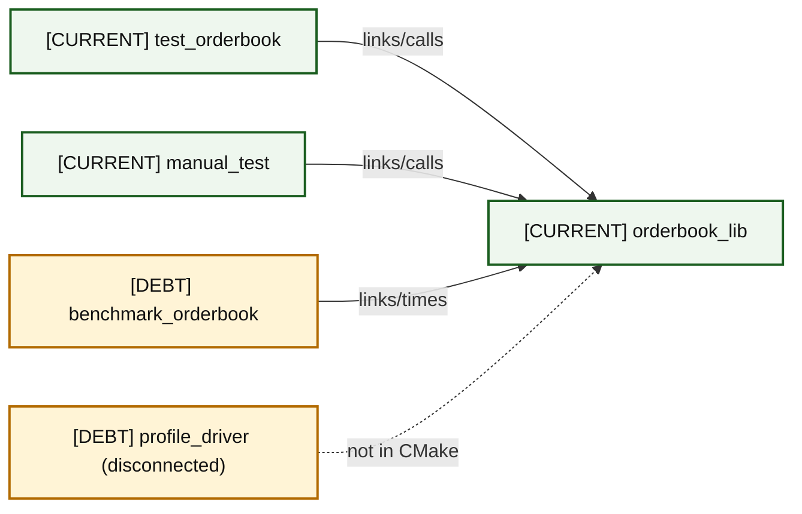
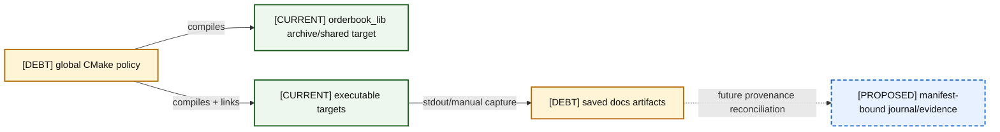

# 02 — Current Container Architecture

### A02-01 — Runtime containers

| Diagram card field | Value |
|---|---|
| Purpose and scope | Separate runtime containers from the other container concerns. |
| Evidence/status | Repository evidence; debt labels reflect the audit. |
| Source evidence | [itch_parser.hpp](../../include/itch_parser.hpp), [book_replay.hpp](../../include/book_replay.hpp), [orderbook.hpp](../../include/orderbook.hpp) |
| Backlog | [COR-01](../../ENGINEERING_BACKLOG.md#cor-01--establish-a-lossless-price-domain-model), [PRO-01](../../ENGINEERING_BACKLOG.md#pro-01--introduce-structured-framing-and-decode-outcomes), [PRO-02](../../ENGINEERING_BACKLOG.md#pro-02--validate-session-and-order-lifecycle-integrity) |
| Findings | [HEL-001](11-current-technical-debt-overlay.md#hel-001), [HEL-012](11-current-technical-debt-overlay.md#hel-012), [HEL-037](11-current-technical-debt-overlay.md#hel-037) |
| Related atlas material | — |

- **Important edges**
  - F →|framed bytes| P
  - P →|synchronous Message callback| R
  - R →|mutating calls| B
- **What exists:** Historical bytes stay valid for the synchronous parse; Message is copied local state; BookReplay observes a referenced book.
- **What does not exist:** No network receiver, persistence, asynchronous queue, or recovery service.

### A02-02 — Verification and measurement containers

| Diagram card field | Value |
|---|---|
| Purpose and scope | Separate verification and measurement containers from the other container concerns. |
| Evidence/status | Repository evidence; debt labels reflect the audit. |
| Source evidence | [CMakeLists.txt](../../CMakeLists.txt), [test_orderbook.cpp](../../tests/test_orderbook.cpp), [benchmark_orderbook.cpp](../../benchmarks/benchmark_orderbook.cpp), [profile_driver.cpp](../../benchmarks/profile_driver.cpp) |
| Backlog | [VER-01](../../ENGINEERING_BACKLOG.md#ver-01--build-protocol-golden-fixtures), [VER-02](../../ENGINEERING_BACKLOG.md#ver-02--build-a-reference-book-and-differential-invariant-harness), [VER-05](../../ENGINEERING_BACKLOG.md#ver-05--add-sanitizer-fuzzing-and-boundary-verification-strategy), [BEN-03](../../ENGINEERING_BACKLOG.md#ben-03--replace-the-add-only-headline-with-a-workload-portfolio) |
| Findings | [HEL-011](11-current-technical-debt-overlay.md#hel-011), [HEL-028](11-current-technical-debt-overlay.md#hel-028), [HEL-046](11-current-technical-debt-overlay.md#hel-046) |
| Related atlas material | — |

- **Important edges**
  - T →|links/calls| L
  - M →|links/calls| L
  - B →|links/times| L
  - P ⇢|not in CMake| L
- **What exists:** Linked executables own their local books and observe results; the disconnected profiler is tracked but not built.
- **What does not exist:** Parser/replay golden tests, differential oracle, sanitizers, fuzzing, or CI.

### A02-03 — Build and evidence containers

| Diagram card field | Value |
|---|---|
| Purpose and scope | Separate build and evidence containers from the other container concerns. |
| Evidence/status | Repository evidence; debt labels reflect the audit. |
| Source evidence | [CMakeLists.txt](../../CMakeLists.txt), [bench_array.txt](../../docs/bench_array.txt), [run_itch_replays.sh](../../run_itch_replays.sh) |
| Backlog | [BEN-01](../../ENGINEERING_BACKLOG.md#ben-01--make-build-and-benchmark-provenance-reproducible), [INF-02](../../ENGINEERING_BACKLOG.md#inf-02--modernize-target-scoped-cmake-behavior), [INF-03](../../ENGINEERING_BACKLOG.md#inf-03--define-generated-artifact-lifecycle) |
| Findings | [HEL-005](11-current-technical-debt-overlay.md#hel-005), [HEL-007](11-current-technical-debt-overlay.md#hel-007), [HEL-047](11-current-technical-debt-overlay.md#hel-047), [HEL-048](11-current-technical-debt-overlay.md#hel-048) |
| Related atlas material | — |

- **Important edges**
  - C →|compiles| L
  - C →|compiles + links| E
  - E →|stdout/manual capture| A
  - A ⇢|future provenance reconciliation| J
- **What exists:** Executable-local flags compile only executable translation units; linked library objects retain their own compilation flags.
- **What does not exist:** Target-scoped warning/optimization contracts, LTO evidence, or automatic artifact manifests.

## Complete boundary ledger

| Boundary | Responsibility | Input → output | Owner / observer | Error behavior | Dependency direction | Cleanliness | Debt / work / findings |
|---|---|---|---|---|---|---|---|
| BinaryFILE → parser | frame and decode | mapped bytes → modeled `Message` callbacks/count | mapping owns bytes; parser borrows | zero length/truncation stop; malformed and unsupported both become `false` | executable → header parser | mixed | PRO-01, PRO-06 / HEL-012, HEL-022, HEL-026 |
| Parser → BookReplay | synchronous dispatch | `Message const&` → event counters/book call | callback borrows stack message; replay owns no message | unsupported never callback; no structured reason | replay depends on parser | narrow but lossy | COR-01, PRO-02, PRO-04 / HEL-001, HEL-023, HEL-037 |
| BookReplay → OrderBook | one-symbol reconstruction | ITCH event → add/cancel/modify | replay observes book reference | missing IDs skipped; replace cancel then add is non-atomic | adapter → core | semantics blurred | COR-02, COR-08 / HEL-002, HEL-042 |
| OrderBook → pool | stable order storage | constructor args ↔ `Order*` slot | pool owns chunks/live storage | growth may allocate; rollback incomplete | book owns pool | current, capacity debt | COR-06, COR-07 / HEL-021, HEL-035 |
| OrderBook → index/levels | identity + FIFO/aggregate state | ID/price → pointers/state | pool owns order; map/level observe | duplicate may orphan old order | book coordinates siblings | invalid transaction | COR-02, VER-02 / HEL-002, HEL-009 |
| Executable → OS | file/timer/affinity | path/syscalls → mapping/timing | process owns fd/mapping | checks vary; advice/affinity often ignored | executable → OS | fragile | PRO-06, BEN-05 / HEL-026, HEL-030, HEL-031, HEL-040 |
| CMake → targets | compile/link/test graph | sources/options → binaries/tests | build system owns target recipe | GTest mandatory; global flags leak | targets consume library | composability debt | INF-01, INF-02 / HEL-005, HEL-046, HEL-047 |
| Runs → artifacts | evidence capture | binary + workload → text/SVG/Markdown | human/script owns capture | provenance incomplete/mixed | artifact observes run | historical only | VER-06, BEN-01, INF-03 / HEL-007, HEL-043, HEL-048 |
