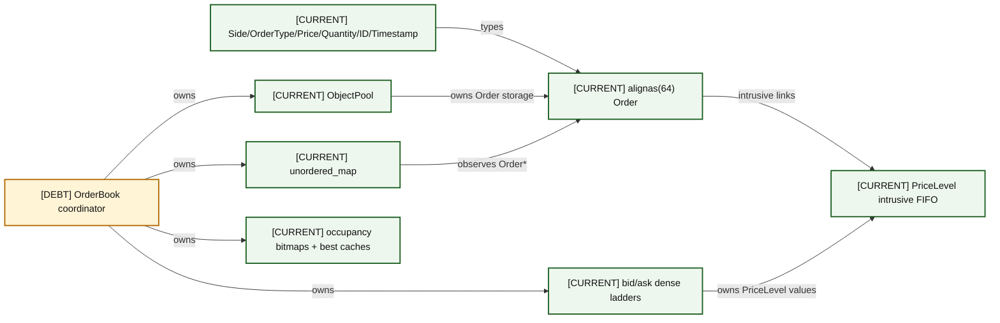
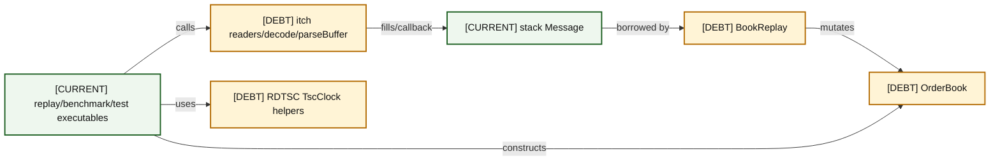
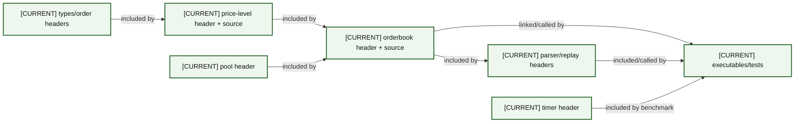
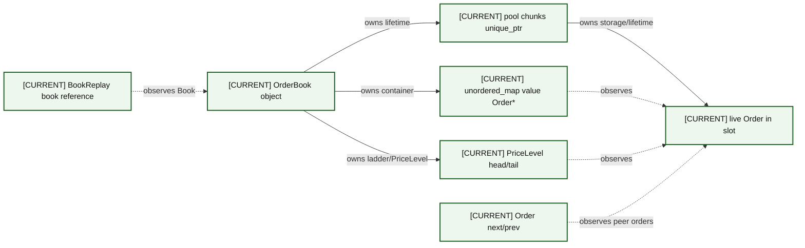

# 03 — Current Component Architecture

### A03-01 — Domain and book components

| Diagram card field | Value |
|---|---|
| Purpose and scope | Domain and book components with explicit dependency or ownership semantics. |
| Evidence/status | Repository evidence; DEBT denotes present limitations. |
| Source evidence | [orderbook.hpp](../../include/orderbook.hpp), [orderbook.cpp](../../src/orderbook.cpp), [price_level.hpp](../../include/price_level.hpp), [price_level.cpp](../../src/price_level.cpp), [object_pool.hpp](../../include/object_pool.hpp), [order.hpp](../../include/order.hpp) |
| Backlog | [COR-01](../../ENGINEERING_BACKLOG.md#cor-01--establish-a-lossless-price-domain-model), [COR-02](../../ENGINEERING_BACKLOG.md#cor-02--define-order-id-uniqueness-and-namespace-policy), [COR-03](../../ENGINEERING_BACKLOG.md#cor-03--define-zero-quantity-lifecycle-semantics), [VER-02](../../ENGINEERING_BACKLOG.md#ver-02--build-a-reference-book-and-differential-invariant-harness) |
| Findings | [HEL-001](11-current-technical-debt-overlay.md#hel-001), [HEL-002](11-current-technical-debt-overlay.md#hel-002), [HEL-003](11-current-technical-debt-overlay.md#hel-003) |
| Related atlas material | — |

- **Important edges**
  - TY -->|types| O
  - O -->|intrusive links| PL
  - POOL -->|owns Order storage| O
  - MAP -->|observes Order*| O
  - L -->|owns PriceLevel values| PL
  - B -->|owns| POOL
  - B -->|owns| MAP
  - B -->|owns| L
  - B -->|owns| BM
- **What exists:** All solid CURRENT components shown are tracked; observed pointers are non-owning.
- **What does not exist:** No smart pointer owns individual live orders; no concurrent ownership or synchronization exists.

### A03-02 — Parser, replay, timing, and executables

| Diagram card field | Value |
|---|---|
| Purpose and scope | Parser, replay, timing, and executables with explicit dependency or ownership semantics. |
| Evidence/status | Repository evidence; DEBT denotes present limitations. |
| Source evidence | [itch_parser.hpp](../../include/itch_parser.hpp), [book_replay.hpp](../../include/book_replay.hpp), [rdtsc_timer.hpp](../../include/rdtsc_timer.hpp), [itch_book_replay.cpp](../../benchmarks/itch_book_replay.cpp), [benchmark_orderbook.cpp](../../benchmarks/benchmark_orderbook.cpp) |
| Backlog | [PRO-01](../../ENGINEERING_BACKLOG.md#pro-01--introduce-structured-framing-and-decode-outcomes), [PRO-04](../../ENGINEERING_BACKLOG.md#pro-04--define-message-count-and-throughput-semantics), [BEN-05](../../ENGINEERING_BACKLOG.md#ben-05--verify-cpu-affinity-tsc-capability-and-platform-gating) |
| Findings | [HEL-012](11-current-technical-debt-overlay.md#hel-012), [HEL-023](11-current-technical-debt-overlay.md#hel-023), [HEL-040](11-current-technical-debt-overlay.md#hel-040) |
| Related atlas material | — |

- **Important edges**
  - X -->|calls| P
  - P -->|fills/callback| M
  - M -->|borrowed by| R
  - R -->|mutates| B
  - X -->|uses| T
  - X -->|constructs| B
- **What exists:** All solid CURRENT components shown are tracked; observed pointers are non-owning.
- **What does not exist:** No smart pointer owns individual live orders; no concurrent ownership or synchronization exists.

### A03-03 — Source-to-component map

| Diagram card field | Value |
|---|---|
| Purpose and scope | Source-to-component map with explicit dependency or ownership semantics. |
| Evidence/status | Repository evidence; DEBT denotes present limitations. |
| Source evidence | [types.hpp](../../include/types.hpp), [order.hpp](../../include/order.hpp), [price_level.hpp](../../include/price_level.hpp), [price_level.cpp](../../src/price_level.cpp), [object_pool.hpp](../../include/object_pool.hpp), [orderbook.hpp](../../include/orderbook.hpp), [orderbook.cpp](../../src/orderbook.cpp), [itch_parser.hpp](../../include/itch_parser.hpp), [book_replay.hpp](../../include/book_replay.hpp), [rdtsc_timer.hpp](../../include/rdtsc_timer.hpp) |
| Backlog | [INF-02](../../ENGINEERING_BACKLOG.md#inf-02--modernize-target-scoped-cmake-behavior), [DOC-01](../../ENGINEERING_BACKLOG.md#doc-01--reconcile-architecture-and-evidence-documentation) |
| Findings | [HEL-010](11-current-technical-debt-overlay.md#hel-010), [HEL-047](11-current-technical-debt-overlay.md#hel-047) |
| Related atlas material | — |

- **Important edges**
  - H1 -->|included by| H2
  - H2 -->|included by| H4
  - H3 -->|included by| H4
  - H4 -->|included by| H5
  - H4 -->|linked/called by| E
  - H5 -->|included/called by| E
  - H6 -->|included by benchmark| E
- **What exists:** All solid CURRENT components shown are tracked; observed pointers are non-owning.
- **What does not exist:** No smart pointer owns individual live orders; no concurrent ownership or synchronization exists.

### A03-04 — Owning versus observing pointers

| Diagram card field | Value |
|---|---|
| Purpose and scope | Owning versus observing pointers with explicit dependency or ownership semantics. |
| Evidence/status | Repository evidence; DEBT denotes present limitations. |
| Source evidence | [orderbook.hpp](../../include/orderbook.hpp), [orderbook.cpp](../../src/orderbook.cpp), [price_level.hpp](../../include/price_level.hpp), [price_level.cpp](../../src/price_level.cpp), [object_pool.hpp](../../include/object_pool.hpp), [order.hpp](../../include/order.hpp), [book_replay.hpp](../../include/book_replay.hpp) |
| Backlog | [COR-06](../../ENGINEERING_BACKLOG.md#cor-06--define-mutation-exception-safety-guarantees), [FUT-01](../../ENGINEERING_BACKLOG.md#fut-01--reassess-the-generic-objectpoolt-contract) |
| Findings | [HEL-013](11-current-technical-debt-overlay.md#hel-013), [HEL-021](11-current-technical-debt-overlay.md#hel-021) |
| Related atlas material | — |

- **Important edges**
  - B -->|owns lifetime| POOL
  - POOL -->|owns storage/lifetime| O
  - B -->|owns container| MAP
  - B -->|owns ladder/PriceLevel| PL
  - MAP -.->|observes| O
  - PL -.->|observes| O
  - LINK -.->|observes peer orders| O
  - R -.->|observes Book| B
- **What exists:** All solid CURRENT components shown are tracked; observed pointers are non-owning.
- **What does not exist:** No smart pointer owns individual live orders; no concurrent ownership or synchronization exists.

## Component catalog

| Component | Responsibility | Mutable state | Owner | Primary source |
|---|---|---|---|---|
| Domain types | integer units and enums | none | translation unit | `include/types.hpp` |
| `Order` | identity, price, quantity, FIFO links, metadata | fields and links | pool slot | `include/order.hpp` |
| `PriceLevel` | FIFO endpoints, quantity/count aggregate | head/tail/total/count | ladder vector | `include/price_level.hpp`, `src/price_level.cpp` |
| `ObjectPool<Order>` | chunks, free list, live construction | chunks/free head/counters | `OrderBook` | `include/object_pool.hpp` |
| ID index | ID → non-owning order pointer | buckets/nodes | `OrderBook` | `include/orderbook.hpp` |
| ladders | direct price-indexed levels | vector elements | `OrderBook` | `include/orderbook.hpp` |
| bitmaps/caches | occupied level discovery/best indexes | words, cached indexes/counts | `OrderBook` | `include/orderbook.hpp`, `src/orderbook.cpp` |
| parser/message | framed decode into one local value | local `Message`, counters | parse call | `include/itch_parser.hpp` |
| replay | symbol filter and lifecycle translation | target + counters | replay executable stack | `include/book_replay.hpp` |
| timing | calibrated TSC helpers | clock calibration | benchmark stack | `include/rdtsc_timer.hpp` |
| executables/tests | orchestration/observation | local book/input/results | process | `benchmarks/`, `tests/` |
