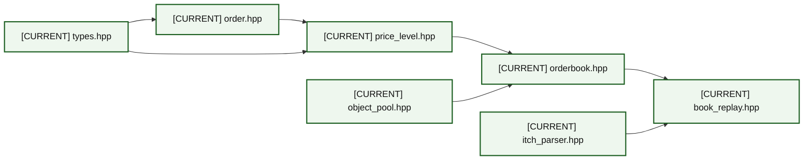
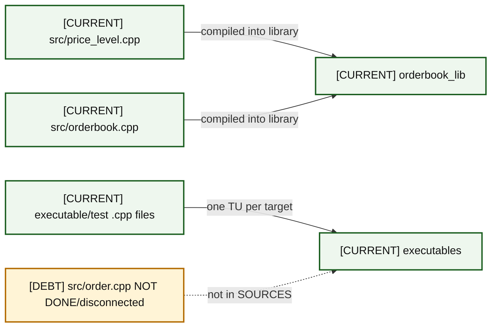
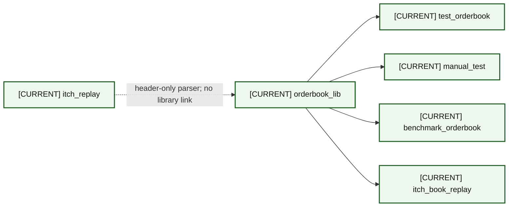
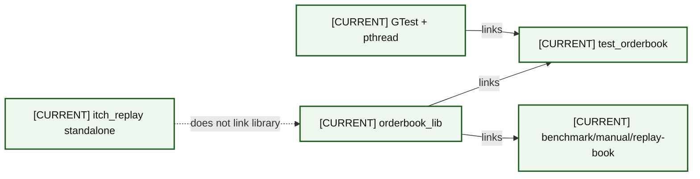
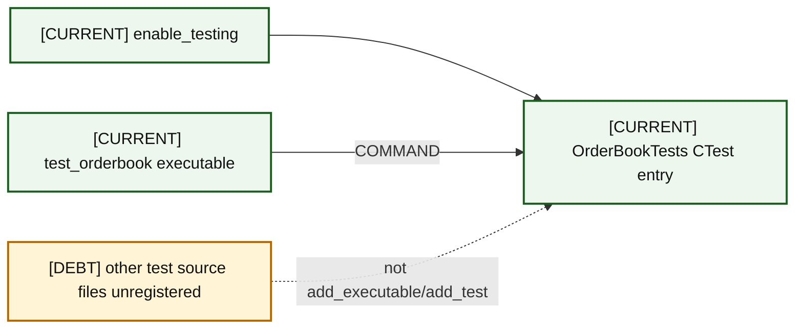
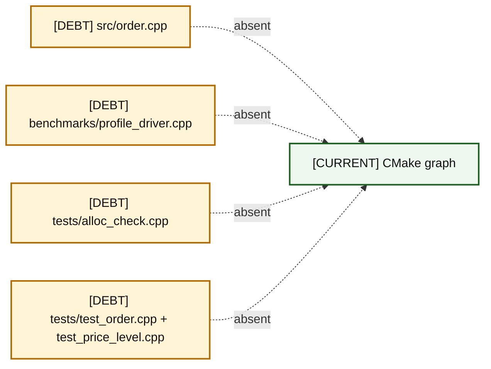
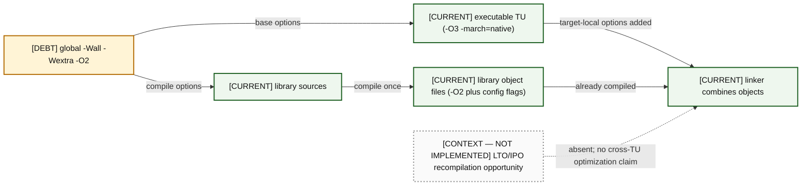

# 04 — Source and Build Architecture

The six views distinguish inclusion, compilation, linkage, test registration, and tracked-but-disconnected files.

### A04-01 — Header dependencies

| Diagram card field | Value |
|---|---|
| Purpose and scope | Show header dependencies independently so one relationship is not mistaken for another. |
| Evidence/status | Direct CMake/include/source evidence. |
| Source evidence | [types.hpp](../../include/types.hpp), [order.hpp](../../include/order.hpp), [price_level.hpp](../../include/price_level.hpp), [orderbook.hpp](../../include/orderbook.hpp), [book_replay.hpp](../../include/book_replay.hpp) |
| Backlog | [DOC-02](../../ENGINEERING_BACKLOG.md#doc-02--align-language-standard-and-platform-claims), [INF-02](../../ENGINEERING_BACKLOG.md#inf-02--modernize-target-scoped-cmake-behavior) |
| Findings | [HEL-010](11-current-technical-debt-overlay.md#hel-010), [HEL-047](11-current-technical-debt-overlay.md#hel-047) |
| Related atlas material | — |

- **Important edges**
  - T --> O
  - O --> P
  - T --> P
  - P --> B
  - POOL --> B
  - B --> R
  - I --> R
- **What exists:** The solid header dependencies relationships are present in tracked headers, translation units, or CMake configuration.
- **What does not exist:** Dotted exclusions in the header dependencies view are not part of the configured build, link, or test graph.

### A04-02 — Translation units

| Diagram card field | Value |
|---|---|
| Purpose and scope | Show translation units independently so one relationship is not mistaken for another. |
| Evidence/status | Direct CMake/include/source evidence. |
| Source evidence | [CMakeLists.txt](../../CMakeLists.txt), [order.cpp](../../src/order.cpp), [orderbook.cpp](../../src/orderbook.cpp), [price_level.cpp](../../src/price_level.cpp) |
| Backlog | [DOC-04](../../ENGINEERING_BACKLOG.md#doc-04--clean-repository-hygiene-and-unfinished-artifacts), [INF-02](../../ENGINEERING_BACKLOG.md#inf-02--modernize-target-scoped-cmake-behavior) |
| Findings | [HEL-016](11-current-technical-debt-overlay.md#hel-016), [HEL-047](11-current-technical-debt-overlay.md#hel-047) |
| Related atlas material | — |

- **Important edges**
  - PL -->|compiled into library| L["[CURRENT] orderbook_lib"]:::current
  - OB -->|compiled into library| L
  - EX -->|one TU per target| X["[CURRENT] executables"]:::current
  - OD -.->|not in SOURCES| X
- **What exists:** The solid translation units relationships are present in tracked headers, translation units, or CMake configuration.
- **What does not exist:** Dotted exclusions in the translation units view are not part of the configured build, link, or test graph.

### A04-03 — CMake targets

| Diagram card field | Value |
|---|---|
| Purpose and scope | Show cmake targets independently so one relationship is not mistaken for another. |
| Evidence/status | Direct CMake/include/source evidence. |
| Source evidence | [CMakeLists.txt](../../CMakeLists.txt) |
| Backlog | [INF-02](../../ENGINEERING_BACKLOG.md#inf-02--modernize-target-scoped-cmake-behavior) |
| Findings | [HEL-047](11-current-technical-debt-overlay.md#hel-047) |
| Related atlas material | — |

- **Important edges**
  - L --> T
  - L --> M
  - L --> B
  - L --> R
  - I -.->|header-only parser; no library link| L
- **What exists:** The solid cmake targets relationships are present in tracked headers, translation units, or CMake configuration.
- **What does not exist:** Dotted exclusions in the cmake targets view are not part of the configured build, link, or test graph.

### A04-04 — Linkage

| Diagram card field | Value |
|---|---|
| Purpose and scope | Show linkage independently so one relationship is not mistaken for another. |
| Evidence/status | Direct CMake/include/source evidence. |
| Source evidence | [CMakeLists.txt](../../CMakeLists.txt) |
| Backlog | [BEN-01](../../ENGINEERING_BACKLOG.md#ben-01--make-build-and-benchmark-provenance-reproducible), [INF-02](../../ENGINEERING_BACKLOG.md#inf-02--modernize-target-scoped-cmake-behavior) |
| Findings | [HEL-005](11-current-technical-debt-overlay.md#hel-005), [HEL-047](11-current-technical-debt-overlay.md#hel-047) |
| Related atlas material | — |

- **Important edges**
  - G -->|links| T
  - L -->|links| T
  - L -->|links| B
  - P -.->|does not link library| L
- **What exists:** The solid linkage relationships are present in tracked headers, translation units, or CMake configuration.
- **What does not exist:** Dotted exclusions in the linkage view are not part of the configured build, link, or test graph.

### A04-05 — CTest registration

| Diagram card field | Value |
|---|---|
| Purpose and scope | Show ctest registration independently so one relationship is not mistaken for another. |
| Evidence/status | Direct CMake/include/source evidence. |
| Source evidence | [CMakeLists.txt](../../CMakeLists.txt), [test_orderbook.cpp](../../tests/test_orderbook.cpp) |
| Backlog | [VER-01](../../ENGINEERING_BACKLOG.md#ver-01--build-protocol-golden-fixtures), [VER-05](../../ENGINEERING_BACKLOG.md#ver-05--add-sanitizer-fuzzing-and-boundary-verification-strategy), [INF-01](../../ENGINEERING_BACKLOG.md#inf-01--establish-a-compiler-and-verification-ci-matrix), [INF-02](../../ENGINEERING_BACKLOG.md#inf-02--modernize-target-scoped-cmake-behavior) |
| Findings | [HEL-011](11-current-technical-debt-overlay.md#hel-011), [HEL-046](11-current-technical-debt-overlay.md#hel-046), [HEL-047](11-current-technical-debt-overlay.md#hel-047) |
| Related atlas material | — |

- **Important edges**
  - C --> R
  - T -->|COMMAND| R
  - U -.->|not add_executable/add_test| R
- **What exists:** The solid ctest registration relationships are present in tracked headers, translation units, or CMake configuration.
- **What does not exist:** Dotted exclusions in the ctest registration view are not part of the configured build, link, or test graph.

### A04-06 — Disconnected tracked files

| Diagram card field | Value |
|---|---|
| Purpose and scope | Show disconnected tracked files independently so one relationship is not mistaken for another. |
| Evidence/status | Direct CMake/include/source evidence. |
| Source evidence | [CMakeLists.txt](../../CMakeLists.txt), [order.cpp](../../src/order.cpp), [profile_driver.cpp](../../benchmarks/profile_driver.cpp), [alloc_check.cpp](../../tests/alloc_check.cpp), [test_order.cpp](../../tests/test_order.cpp), [test_price_level.cpp](../../tests/test_price_level.cpp) |
| Backlog | [VER-03](../../ENGINEERING_BACKLOG.md#ver-03--replace-the-invalid-allocation-check-with-a-trustworthy-methodology), [DOC-04](../../ENGINEERING_BACKLOG.md#doc-04--clean-repository-hygiene-and-unfinished-artifacts), [INF-02](../../ENGINEERING_BACKLOG.md#inf-02--modernize-target-scoped-cmake-behavior), [VER-01](../../ENGINEERING_BACKLOG.md#ver-01--build-protocol-golden-fixtures) |
| Findings | [HEL-008](11-current-technical-debt-overlay.md#hel-008), [HEL-011](11-current-technical-debt-overlay.md#hel-011), [HEL-016](11-current-technical-debt-overlay.md#hel-016), [HEL-047](11-current-technical-debt-overlay.md#hel-047) |
| Related atlas material | — |

- **Important edges**
  - O -.->|absent| C
  - P -.->|absent| C
  - A -.->|absent| C
  - TO -.->|absent| C
- **What exists:** The solid disconnected tracked files relationships are present in tracked headers, translation units, or CMake configuration.
- **What does not exist:** Dotted exclusions in the disconnected tracked files view are not part of the configured build, link, or test graph.

### A04-07 — Compile-flag pipeline

| Diagram card field | Value |
|---|---|
| Purpose and scope | Prove why executable-local `-O3 -march=native` does not recompile linked library objects and show absent LTO only as context. |
| Evidence/status | Direct CMake semantics plus build-system inference. |
| Source evidence | [CMakeLists.txt](../../CMakeLists.txt) |
| Backlog | [BEN-01](../../ENGINEERING_BACKLOG.md#ben-01--make-build-and-benchmark-provenance-reproducible), [INF-02](../../ENGINEERING_BACKLOG.md#inf-02--modernize-target-scoped-cmake-behavior) |
| Findings | [HEL-005](11-current-technical-debt-overlay.md#hel-005), [HEL-047](11-current-technical-debt-overlay.md#hel-047) |
| Related atlas material | — |

- **Important edges**
  - Target compile options attach to the executable’s own compilation, not to a dependency target’s existing objects.
  - The LTO node is dotted context because CMake does not enable IPO/LTO.
- **What exists:** The solid compile-flag pipeline relationships are present in tracked headers, translation units, or CMake configuration.
- **What does not exist:** Dotted exclusions in the compile-flag pipeline view are not part of the configured build, link, or test graph.

## Language-standard and optimization contract

- `CMakeLists.txt` requires C++17 through `CMAKE_CXX_STANDARD 17`; the root README's C++20 description is a conflicting documentation claim, not the active build contract (HEL-010, DOC-02).
- The global flags add `-O2`; Release configuration and selected executable targets add `-O3 -march=native`. Executable-local options compile only that target's translation unit and do not retroactively recompile `orderbook_lib` (HEL-005, INF-02).
- No LTO/IPO setting is present, so this atlas makes no cross-translation-unit optimization claim.
