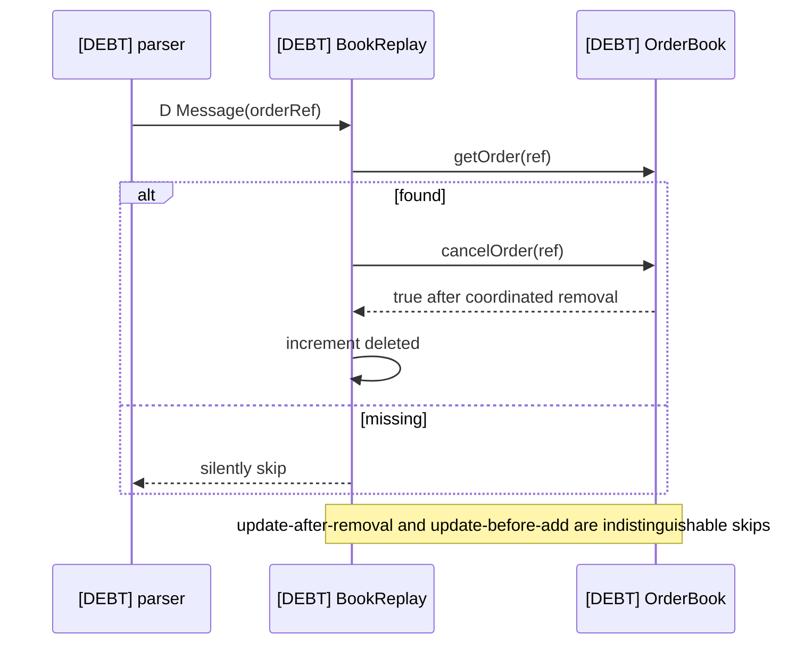
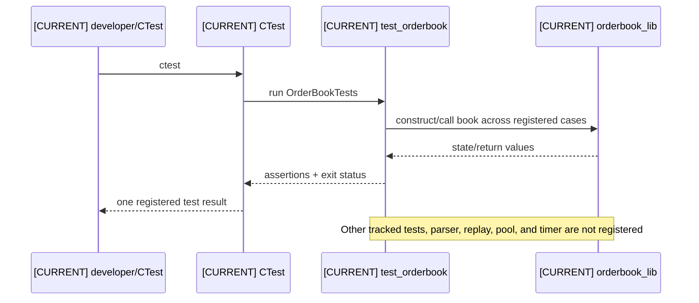
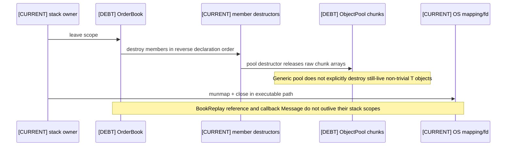

# 05 — Runtime Dataflows

Each sequence is intentionally narrow. `alt` branches expose present rejection/skip behavior and the invariant surface touched by the operation.
<a id="a05-01"></a>
### A05-01 — Historical startup

| Diagram card field | Value |
|---|---|
| Purpose and scope | Trace the current historical startup path, including transformations, ownership, rejection paths, counters, and invariant effects. |
| Evidence/status | Repository evidence; invalid/debt participants are labeled in sequence names. |
| Source evidence | [itch_book_replay.cpp](../../benchmarks/itch_book_replay.cpp), [orderbook.hpp](../../include/orderbook.hpp), [book_replay.hpp](../../include/book_replay.hpp) |
| Backlog | [COR-07](../../ENGINEERING_BACKLOG.md#cor-07--define-capacity-and-growth-policy), [PRO-06](../../ENGINEERING_BACKLOG.md#pro-06--specify-portable-file-mapping-and-prefault-behavior), [BEN-10](../../ENGINEERING_BACKLOG.md#ben-10--measure-compact-versus-cache-line-aligned-order-layouts) |
| Findings | [HEL-026](11-current-technical-debt-overlay.md#hel-026), [HEL-035](11-current-technical-debt-overlay.md#hel-035), [HEL-036](11-current-technical-debt-overlay.md#hel-036) |
| Related atlas material | — |

```mermaid
sequenceDiagram
    participant U as [CURRENT] operator
    participant X as [CURRENT] itch_book_replay
    participant OS as [CURRENT] OS
    participant B as [DEBT] OrderBook
    participant R as [DEBT] BookReplay
    U->>X: path + symbol
    X->>OS: open / fstat / mmap
    OS-->>X: fd, size, mapped bytes
    X->>B: construct dense ladders + pool reserve
    B-->>X: large initialized book
    X->>R: construct with Book& + packed symbol
    Note over B,R: Invariants begin empty; allocation/growth failures are not uniformly handled
```

- **Important edges**
  - U->>X: path + symbol
  - X->>OS: open / fstat / mmap
  - OS-->>X: fd, size, mapped bytes
  - X->>B: construct dense ladders + pool reserve
- **What exists:** The calls, transformations, counters, and state changes in the historical startup flow are present in tracked code.
- **What does not exist:** The historical startup flow implies no rollback, structured anomaly stream, concurrency, or production transport beyond what it names.

<a id="a05-02"></a>
### A05-02 — mmap and parser setup

| Diagram card field | Value |
|---|---|
| Purpose and scope | Trace the current mmap and parser setup path, including transformations, ownership, rejection paths, counters, and invariant effects. |
| Evidence/status | Repository evidence; invalid/debt participants are labeled in sequence names. |
| Source evidence | [itch_book_replay.cpp](../../benchmarks/itch_book_replay.cpp), [itch_parser.hpp](../../include/itch_parser.hpp) |
| Backlog | [PRO-01](../../ENGINEERING_BACKLOG.md#pro-01--introduce-structured-framing-and-decode-outcomes), [PRO-06](../../ENGINEERING_BACKLOG.md#pro-06--specify-portable-file-mapping-and-prefault-behavior) |
| Findings | [HEL-026](11-current-technical-debt-overlay.md#hel-026) |
| Related atlas material | — |

```mermaid
sequenceDiagram
    participant X as [CURRENT] replay executable
    participant OS as [CURRENT] OS mapping
    participant P as [DEBT] parseBuffer
    X->>OS: mmap(MAP_PRIVATE | MAP_POPULATE)
    OS-->>X: mapping or MAP_FAILED
    X->>OS: madvise sequential + will-need (returns ignored)
    X->>OS: touch one byte per assumed 4096-byte page
    X->>P: data pointer + file size + callback
    Note over X,P: Mapping lifetime encloses synchronous parse; advice/prefault guarantee is unverified
```

- **Important edges**
  - X->>OS: mmap(MAP_PRIVATE | MAP_POPULATE)
  - OS-->>X: mapping or MAP_FAILED
  - X->>OS: madvise sequential + will-need (returns ignored)
  - X->>OS: touch one byte per assumed 4096-byte page
- **What exists:** The calls, transformations, counters, and state changes in the mmap and parser setup flow are present in tracked code.
- **What does not exist:** The mmap and parser setup flow implies no rollback, structured anomaly stream, concurrency, or production transport beyond what it names.

<a id="a05-03"></a>
### A05-03 — BinaryFILE framing

| Diagram card field | Value |
|---|---|
| Purpose and scope | Trace the current binaryfile framing path, including transformations, ownership, rejection paths, counters, and invariant effects. |
| Evidence/status | Repository evidence; invalid/debt participants are labeled in sequence names. |
| Source evidence | [itch_parser.hpp](../../include/itch_parser.hpp) |
| Backlog | [PRO-01](../../ENGINEERING_BACKLOG.md#pro-01--introduce-structured-framing-and-decode-outcomes), [PRO-04](../../ENGINEERING_BACKLOG.md#pro-04--define-message-count-and-throughput-semantics), [VER-01](../../ENGINEERING_BACKLOG.md#ver-01--build-protocol-golden-fixtures) |
| Findings | [HEL-012](11-current-technical-debt-overlay.md#hel-012), [HEL-022](11-current-technical-debt-overlay.md#hel-022), [HEL-023](11-current-technical-debt-overlay.md#hel-023) |
| Related atlas material | — |

```mermaid
sequenceDiagram
    participant P as [DEBT] parseBuffer
    participant D as [DEBT] decode
    participant C as [CURRENT] callback
    loop while off + 2 <= size
    P->>P: read big-endian uint16 length
    alt length == 0
    P-->>C: stop, no structured terminator outcome
    else frame exceeds remaining bytes
    P-->>C: stop, no truncated-tail outcome
    else complete frame
    P->>D: body pointer + declared length
    D-->>P: bool + Message
    P->>C: callback only when true; increment modeled count
    P->>P: advance by declared frame
    end
    end
```

- **Important edges**
  - P->>P: read big-endian uint16 length
  - P-->>C: stop, no structured terminator outcome
  - P-->>C: stop, no truncated-tail outcome
  - P->>D: body pointer + declared length
- **What exists:** The calls, transformations, counters, and state changes in the binaryfile framing flow are present in tracked code.
- **What does not exist:** The binaryfile framing flow implies no rollback, structured anomaly stream, concurrency, or production transport beyond what it names.

<a id="a05-04"></a>
### A05-04 — Add order replay

| Diagram card field | Value |
|---|---|
| Purpose and scope | Trace the current add order replay path, including transformations, ownership, rejection paths, counters, and invariant effects. |
| Evidence/status | Repository evidence; invalid/debt participants are labeled in sequence names. |
| Source evidence | [itch_parser.hpp](../../include/itch_parser.hpp), [book_replay.hpp](../../include/book_replay.hpp), [orderbook.cpp](../../src/orderbook.cpp), [object_pool.hpp](../../include/object_pool.hpp) |
| Backlog | [COR-01](../../ENGINEERING_BACKLOG.md#cor-01--establish-a-lossless-price-domain-model), [COR-02](../../ENGINEERING_BACKLOG.md#cor-02--define-order-id-uniqueness-and-namespace-policy), [COR-03](../../ENGINEERING_BACKLOG.md#cor-03--define-zero-quantity-lifecycle-semantics), [COR-06](../../ENGINEERING_BACKLOG.md#cor-06--define-mutation-exception-safety-guarantees) |
| Findings | [HEL-001](11-current-technical-debt-overlay.md#hel-001), [HEL-002](11-current-technical-debt-overlay.md#hel-002), [HEL-003](11-current-technical-debt-overlay.md#hel-003), [HEL-021](11-current-technical-debt-overlay.md#hel-021) |
| Related atlas material | — |

```mermaid
sequenceDiagram
    participant P as [DEBT] parser
    participant R as [INVALID] BookReplay
    participant B as [DEBT] OrderBook
    participant POOL as [CURRENT] pool
    participant IDX as [CURRENT] ID index
    participant L as [CURRENT] level/bitmap/cache
    P->>R: A/F Message callback
    R->>R: compare raw 8-byte symbol
    alt non-target symbol
    R-->>P: skip mutation; seen still increments
    else target
    R->>R: Price(4) / 100 (lossy)
    R->>B: addOrder(side,cents,shares,orderRef)
    B->>B: reject out-of-range as ID 0
    B->>POOL: acquire/construct slot (may grow)
    POOL-->>B: Order*
    B->>IDX: orders_[id] = pointer (duplicate overwrites)
    B->>L: append FIFO; update totals/bit/cache/counts
    B-->>R: ID; increment added only if nonzero
    Note over IDX,L: Identity, reachability, FIFO, aggregate, occupancy, cache, pool invariants affected
    end
```

- **Important edges**
  - P->>R: A/F Message callback
  - R->>R: compare raw 8-byte symbol
  - R-->>P: skip mutation; seen still increments
  - R->>R: Price(4) / 100 (lossy)
- **What exists:** The calls, transformations, counters, and state changes in the add order replay flow are present in tracked code.
- **What does not exist:** The add order replay flow implies no rollback, structured anomaly stream, concurrency, or production transport beyond what it names.

<a id="a05-05"></a>
### A05-05 — Cancel order replay

| Diagram card field | Value |
|---|---|
| Purpose and scope | Trace the current cancel order replay path, including transformations, ownership, rejection paths, counters, and invariant effects. |
| Evidence/status | Repository evidence; invalid/debt participants are labeled in sequence names. |
| Source evidence | [book_replay.hpp](../../include/book_replay.hpp), [orderbook.cpp](../../src/orderbook.cpp) |
| Backlog | [COR-03](../../ENGINEERING_BACKLOG.md#cor-03--define-zero-quantity-lifecycle-semantics), [COR-04](../../ENGINEERING_BACKLOG.md#cor-04--separate-reduce-and-quantity-increase-priority-semantics), [PRO-02](../../ENGINEERING_BACKLOG.md#pro-02--validate-session-and-order-lifecycle-integrity) |
| Findings | [HEL-003](11-current-technical-debt-overlay.md#hel-003), [HEL-004](11-current-technical-debt-overlay.md#hel-004), [HEL-037](11-current-technical-debt-overlay.md#hel-037) |
| Related atlas material | — |

```mermaid
sequenceDiagram
    participant P as [DEBT] parser
    participant R as [DEBT] BookReplay
    participant B as [DEBT] OrderBook
    participant S as [CURRENT] map/level/bitmap/pool state
    P->>R: X Message(orderRef,cancelShares)
    R->>B: getOrder(ref)
    alt missing ID
    B-->>R: null; silently skip
    else remaining quantity greater than cancel
    R->>B: modifyOrder(ref, qty-cancel)
    B->>S: update Order quantity + aggregate in place
    else cancel consumes remainder
    R->>B: cancelOrder(ref)
    B->>S: unlink, clear occupancy/cache if last, erase, destroy/free
    end
    R->>R: increment reduced for found ID
    Note over B,S: Membership, aggregate, counts, bitmap, best, pool invariants affected
```

- **Important edges**
  - P->>R: X Message(orderRef,cancelShares)
  - R->>B: getOrder(ref)
  - B-->>R: null; silently skip
  - R->>B: modifyOrder(ref, qty-cancel)
- **What exists:** The calls, transformations, counters, and state changes in the cancel order replay flow are present in tracked code.
- **What does not exist:** The cancel order replay flow implies no rollback, structured anomaly stream, concurrency, or production transport beyond what it names.

<a id="a05-06"></a>
### A05-06 — Partial execution replay

| Diagram card field | Value |
|---|---|
| Purpose and scope | Trace the current partial execution replay path, including transformations, ownership, rejection paths, counters, and invariant effects. |
| Evidence/status | Repository evidence; invalid/debt participants are labeled in sequence names. |
| Source evidence | [itch_parser.hpp](../../include/itch_parser.hpp), [book_replay.hpp](../../include/book_replay.hpp), [orderbook.cpp](../../src/orderbook.cpp) |
| Backlog | [COR-04](../../ENGINEERING_BACKLOG.md#cor-04--separate-reduce-and-quantity-increase-priority-semantics), [PRO-02](../../ENGINEERING_BACKLOG.md#pro-02--validate-session-and-order-lifecycle-integrity), [PRO-05](../../ENGINEERING_BACKLOG.md#pro-05--preserve-diagnostic-feed-metadata) |
| Findings | [HEL-004](11-current-technical-debt-overlay.md#hel-004), [HEL-037](11-current-technical-debt-overlay.md#hel-037), [HEL-038](11-current-technical-debt-overlay.md#hel-038) |
| Related atlas material | — |

```mermaid
sequenceDiagram
    participant P as [DEBT] parser
    participant R as [DEBT] BookReplay
    participant B as [DEBT] OrderBook
    participant L as [CURRENT] PriceLevel
    P->>R: E/C Message(ref, executed shares)
    R->>B: getOrder(ref)
    B-->>R: Order* or null
    alt found and order quantity > shares
    R->>B: modifyOrder(ref, quantity-shares)
    B->>L: adjust level aggregate; retain queue position
    R->>R: increment reduced
    else missing
    R-->>P: silently skip
    end
    Note over R,L: C execution price is decoded but ignored by reconstruction mutation
```

- **Important edges**
  - P->>R: E/C Message(ref, executed shares)
  - R->>B: getOrder(ref)
  - B-->>R: Order* or null
  - R->>B: modifyOrder(ref, quantity-shares)
- **What exists:** The calls, transformations, counters, and state changes in the partial execution replay flow are present in tracked code.
- **What does not exist:** The partial execution replay flow implies no rollback, structured anomaly stream, concurrency, or production transport beyond what it names.

<a id="a05-07"></a>
### A05-07 — Full execution replay

| Diagram card field | Value |
|---|---|
| Purpose and scope | Trace the current full execution replay path, including transformations, ownership, rejection paths, counters, and invariant effects. |
| Evidence/status | Repository evidence; invalid/debt participants are labeled in sequence names. |
| Source evidence | [book_replay.hpp](../../include/book_replay.hpp), [orderbook.cpp](../../src/orderbook.cpp) |
| Backlog | [PRO-02](../../ENGINEERING_BACKLOG.md#pro-02--validate-session-and-order-lifecycle-integrity), [VER-02](../../ENGINEERING_BACKLOG.md#ver-02--build-a-reference-book-and-differential-invariant-harness), [PRO-05](../../ENGINEERING_BACKLOG.md#pro-05--preserve-diagnostic-feed-metadata) |
| Findings | [HEL-037](11-current-technical-debt-overlay.md#hel-037), [HEL-038](11-current-technical-debt-overlay.md#hel-038) |
| Related atlas material | — |

```mermaid
sequenceDiagram
    participant P as [DEBT] parser
    participant R as [DEBT] BookReplay
    participant B as [DEBT] OrderBook
    participant S as [CURRENT] coordinated state
    P->>R: E/C Message(ref, shares >= live qty)
    R->>B: getOrder(ref)
    alt found
    R->>B: cancelOrder(ref)
    B->>S: unlink + aggregate/count update + map erase + pool return
    R->>R: increment reduced
    else missing
    R-->>P: silently skip
    end
    Note over B,S: Exact over-execution anomaly is not classified; full removal restores empty-level state
```

- **Important edges**
  - P->>R: E/C Message(ref, shares >= live qty)
  - R->>B: getOrder(ref)
  - R->>B: cancelOrder(ref)
  - B->>S: unlink + aggregate/count update + map erase + pool return
- **What exists:** The calls, transformations, counters, and state changes in the full execution replay flow are present in tracked code.
- **What does not exist:** The full execution replay flow implies no rollback, structured anomaly stream, concurrency, or production transport beyond what it names.

<a id="a05-08"></a>
### A05-08 — Delete replay

| Diagram card field | Value |
|---|---|
| Purpose and scope | Trace the current delete replay path, including transformations, ownership, rejection paths, counters, and invariant effects. |
| Evidence/status | Repository evidence; invalid/debt participants are labeled in sequence names. |
| Source evidence | [book_replay.hpp](../../include/book_replay.hpp), [orderbook.cpp](../../src/orderbook.cpp) |
| Backlog | [PRO-02](../../ENGINEERING_BACKLOG.md#pro-02--validate-session-and-order-lifecycle-integrity) |
| Findings | [HEL-037](11-current-technical-debt-overlay.md#hel-037) |
| Related atlas material | — |



- **Important edges**
  - P->>R: D Message(orderRef)
  - R->>B: getOrder(ref)
  - R->>B: cancelOrder(ref)
  - B-->>R: true after coordinated removal
- **What exists:** The calls, transformations, counters, and state changes in the delete replay flow are present in tracked code.
- **What does not exist:** The delete replay flow implies no rollback, structured anomaly stream, concurrency, or production transport beyond what it names.

<a id="a05-09"></a>
### A05-09 — Replace replay

| Diagram card field | Value |
|---|---|
| Purpose and scope | Trace the current replace replay path, including transformations, ownership, rejection paths, counters, and invariant effects. |
| Evidence/status | Repository evidence; invalid/debt participants are labeled in sequence names. |
| Source evidence | [book_replay.hpp](../../include/book_replay.hpp), [orderbook.cpp](../../src/orderbook.cpp) |
| Backlog | [COR-01](../../ENGINEERING_BACKLOG.md#cor-01--establish-a-lossless-price-domain-model), [COR-02](../../ENGINEERING_BACKLOG.md#cor-02--define-order-id-uniqueness-and-namespace-policy), [COR-06](../../ENGINEERING_BACKLOG.md#cor-06--define-mutation-exception-safety-guarantees), [PRO-02](../../ENGINEERING_BACKLOG.md#pro-02--validate-session-and-order-lifecycle-integrity) |
| Findings | [HEL-001](11-current-technical-debt-overlay.md#hel-001), [HEL-002](11-current-technical-debt-overlay.md#hel-002), [HEL-021](11-current-technical-debt-overlay.md#hel-021), [HEL-037](11-current-technical-debt-overlay.md#hel-037) |
| Related atlas material | — |

```mermaid
sequenceDiagram
    participant P as [DEBT] parser
    participant R as [INVALID] BookReplay
    participant B as [DEBT] OrderBook
    P->>R: U(oldRef,newRef,shares,Price(4))
    R->>B: getOrder(oldRef)
    alt found
    R->>R: copy old side
    R->>B: cancelOrder(oldRef)
    R->>R: Price(4) / 100 (lossy)
    R->>B: addOrder(side,price,shares,newRef)
    alt add succeeds
    R->>R: increment replaced
    else add rejects/throws
    Note over R,B: old order is already gone; replacement is not atomic
    end
    else missing
    R-->>P: silently skip
    end
```

- **Important edges**
  - P->>R: U(oldRef,newRef,shares,Price(4))
  - R->>B: getOrder(oldRef)
  - R->>R: copy old side
  - R->>B: cancelOrder(oldRef)
- **What exists:** The calls, transformations, counters, and state changes in the replace replay flow are present in tracked code.
- **What does not exist:** The replace replay flow implies no rollback, structured anomaly stream, concurrency, or production transport beyond what it names.

<a id="a05-10"></a>
### A05-10 — Synthetic market buy

| Diagram card field | Value |
|---|---|
| Purpose and scope | Trace the current synthetic market buy path, including transformations, ownership, rejection paths, counters, and invariant effects. |
| Evidence/status | Repository evidence; invalid/debt participants are labeled in sequence names. |
| Source evidence | [orderbook.cpp](../../src/orderbook.cpp) |
| Backlog | [COR-03](../../ENGINEERING_BACKLOG.md#cor-03--define-zero-quantity-lifecycle-semantics), [COR-08](../../ENGINEERING_BACKLOG.md#cor-08--separate-reconstruction-and-matching-semantics), [VER-02](../../ENGINEERING_BACKLOG.md#ver-02--build-a-reference-book-and-differential-invariant-harness), [BEN-09](../../ENGINEERING_BACKLOG.md#ben-09--measure-bitmap-refresh-complexity-and-alternatives) |
| Findings | [HEL-003](11-current-technical-debt-overlay.md#hel-003), [HEL-027](11-current-technical-debt-overlay.md#hel-027), [HEL-042](11-current-technical-debt-overlay.md#hel-042) |
| Related atlas material | — |

```mermaid
sequenceDiagram
    participant C as [CURRENT] caller
    participant B as [DEBT] OrderBook
    participant A as [CURRENT] ask best/bitmap
    participant L as [CURRENT] ask FIFO
    participant S as [CURRENT] map/pool
    C->>B: executeMarketOrder(BUY, quantity)
    loop remaining > 0 and best ask exists
    B->>A: select cached best ask level
    B->>L: compute fill from total quantity
    loop FIFO head until fill
    B->>S: full head: erase, unlink, deallocate, decrement
    B->>L: partial head: reduce quantity/aggregate
    end
    B->>A: if empty clear bit/count; scan lowest occupied
    B->>B: break if filled == 0
    end
    B-->>C: requested - remaining
    Note over A,S: Price-time traversal is synthetic matching, not ITCH reconstruction
```

- **Important edges**
  - C->>B: executeMarketOrder(BUY, quantity)
  - B->>A: select cached best ask level
  - B->>L: compute fill from total quantity
  - B->>S: full head: erase, unlink, deallocate, decrement
- **What exists:** The calls, transformations, counters, and state changes in the synthetic market buy flow are present in tracked code.
- **What does not exist:** The synthetic market buy flow implies no rollback, structured anomaly stream, concurrency, or production transport beyond what it names.

<a id="a05-11"></a>
### A05-11 — Synthetic market sell

| Diagram card field | Value |
|---|---|
| Purpose and scope | Trace the current synthetic market sell path, including transformations, ownership, rejection paths, counters, and invariant effects. |
| Evidence/status | Repository evidence; invalid/debt participants are labeled in sequence names. |
| Source evidence | [orderbook.cpp](../../src/orderbook.cpp) |
| Backlog | [COR-03](../../ENGINEERING_BACKLOG.md#cor-03--define-zero-quantity-lifecycle-semantics), [COR-08](../../ENGINEERING_BACKLOG.md#cor-08--separate-reconstruction-and-matching-semantics), [BEN-09](../../ENGINEERING_BACKLOG.md#ben-09--measure-bitmap-refresh-complexity-and-alternatives) |
| Findings | [HEL-003](11-current-technical-debt-overlay.md#hel-003), [HEL-027](11-current-technical-debt-overlay.md#hel-027), [HEL-042](11-current-technical-debt-overlay.md#hel-042) |
| Related atlas material | — |

```mermaid
sequenceDiagram
    participant C as [CURRENT] caller
    participant B as [DEBT] OrderBook
    participant A as [CURRENT] bid best/bitmap
    participant L as [CURRENT] bid FIFO
    participant S as [CURRENT] map/pool
    C->>B: executeMarketOrder(SELL, quantity)
    loop remaining > 0 and best bid exists
    B->>A: select cached best bid level
    B->>L: consume head orders FIFO
    B->>S: erase/deallocate fully filled orders
    B->>L: reduce partial head
    B->>A: clear empty bit/count; scan highest occupied
    B->>B: break on zero progress
    end
    B-->>C: executed quantity
    Note over A,S: Reverse bitmap scan may cross words after best level empties
```

- **Important edges**
  - C->>B: executeMarketOrder(SELL, quantity)
  - B->>A: select cached best bid level
  - B->>L: consume head orders FIFO
  - B->>S: erase/deallocate fully filled orders
- **What exists:** The calls, transformations, counters, and state changes in the synthetic market sell flow are present in tracked code.
- **What does not exist:** The synthetic market sell flow implies no rollback, structured anomaly stream, concurrency, or production transport beyond what it names.

<a id="a05-12"></a>
### A05-12 — Primary Add benchmark

| Diagram card field | Value |
|---|---|
| Purpose and scope | Trace the current primary add benchmark path, including transformations, ownership, rejection paths, counters, and invariant effects. |
| Evidence/status | Repository evidence; invalid/debt participants are labeled in sequence names. |
| Source evidence | [benchmark_orderbook.cpp](../../benchmarks/benchmark_orderbook.cpp), [rdtsc_timer.hpp](../../include/rdtsc_timer.hpp), [bench_array.txt](../../docs/bench_array.txt) |
| Backlog | [BEN-01](../../ENGINEERING_BACKLOG.md#ben-01--make-build-and-benchmark-provenance-reproducible), [BEN-03](../../ENGINEERING_BACKLOG.md#ben-03--replace-the-add-only-headline-with-a-workload-portfolio), [BEN-04](../../ENGINEERING_BACKLOG.md#ben-04--redesign-latency-statistics-and-timer-overhead-treatment), [BEN-05](../../ENGINEERING_BACKLOG.md#ben-05--verify-cpu-affinity-tsc-capability-and-platform-gating) |
| Findings | [HEL-005](11-current-technical-debt-overlay.md#hel-005), [HEL-028](11-current-technical-debt-overlay.md#hel-028), [HEL-029](11-current-technical-debt-overlay.md#hel-029), [HEL-030](11-current-technical-debt-overlay.md#hel-030), [HEL-031](11-current-technical-debt-overlay.md#hel-031) |
| Related atlas material | — |

```mermaid
sequenceDiagram
    participant U as [CURRENT] operator
    participant X as [DEBT] benchmark_orderbook
    participant T as [DEBT] TSC/affinity
    participant B as [DEBT] OrderBook
    participant A as [DEBT] printed artifact
    U->>X: optional core number
    X->>T: pin thread; calibrate TSC; measure overhead
    X->>X: pre-generate inputs + warm-up
    loop batch and per-op samples
    X->>T: tscStart / tscEnd
    X->>B: addOrder (state grows)
    X->>X: subtract overhead; sort/summarize
    end
    X-->>A: throughput, percentiles, max
    Note over X,A: Workload is add-dominant; platform checks and full provenance are incomplete
```

- **Important edges**
  - U->>X: optional core number
  - X->>T: pin thread; calibrate TSC; measure overhead
  - X->>X: pre-generate inputs + warm-up
  - X->>T: tscStart / tscEnd
- **What exists:** The calls, transformations, counters, and state changes in the primary add benchmark flow are present in tracked code.
- **What does not exist:** The primary add benchmark flow implies no rollback, structured anomaly stream, concurrency, or production transport beyond what it names.

<a id="a05-13"></a>
### A05-13 — Test execution

| Diagram card field | Value |
|---|---|
| Purpose and scope | Trace the current test execution path, including transformations, ownership, rejection paths, counters, and invariant effects. |
| Evidence/status | Repository evidence; invalid/debt participants are labeled in sequence names. |
| Source evidence | [CMakeLists.txt](../../CMakeLists.txt), [test_orderbook.cpp](../../tests/test_orderbook.cpp), [test_order.cpp](../../tests/test_order.cpp), [test_price_level.cpp](../../tests/test_price_level.cpp) |
| Backlog | [VER-01](../../ENGINEERING_BACKLOG.md#ver-01--build-protocol-golden-fixtures), [VER-02](../../ENGINEERING_BACKLOG.md#ver-02--build-a-reference-book-and-differential-invariant-harness), [INF-01](../../ENGINEERING_BACKLOG.md#inf-01--establish-a-compiler-and-verification-ci-matrix) |
| Findings | [HEL-009](11-current-technical-debt-overlay.md#hel-009), [HEL-011](11-current-technical-debt-overlay.md#hel-011), [HEL-046](11-current-technical-debt-overlay.md#hel-046) |
| Related atlas material | — |



- **Important edges**
  - U->>C: ctest
  - C->>T: run OrderBookTests
  - T->>L: construct/call book across registered cases
  - L-->>T: state/return values
- **What exists:** The calls, transformations, counters, and state changes in the test execution flow are present in tracked code.
- **What does not exist:** The test execution flow implies no rollback, structured anomaly stream, concurrency, or production transport beyond what it names.

<a id="a05-14"></a>
### A05-14 — Destruction

| Diagram card field | Value |
|---|---|
| Purpose and scope | Trace the current destruction path, including transformations, ownership, rejection paths, counters, and invariant effects. |
| Evidence/status | Repository evidence; invalid/debt participants are labeled in sequence names. |
| Source evidence | [orderbook.hpp](../../include/orderbook.hpp), [object_pool.hpp](../../include/object_pool.hpp), [itch_book_replay.cpp](../../benchmarks/itch_book_replay.cpp) |
| Backlog | [FUT-01](../../ENGINEERING_BACKLOG.md#fut-01--reassess-the-generic-objectpoolt-contract), [PRO-06](../../ENGINEERING_BACKLOG.md#pro-06--specify-portable-file-mapping-and-prefault-behavior) |
| Findings | [HEL-013](11-current-technical-debt-overlay.md#hel-013), [HEL-026](11-current-technical-debt-overlay.md#hel-026) |
| Related atlas material | — |



- **Important edges**
  - S->>B: leave scope
  - B->>M: destroy members in reverse declaration order
  - M->>P: pool destructor releases raw chunk arrays
  - S->>O: munmap + close in executable path
- **What exists:** The calls, transformations, counters, and state changes in the destruction flow are present in tracked code.
- **What does not exist:** The destruction flow implies no rollback, structured anomaly stream, concurrency, or production transport beyond what it names.
