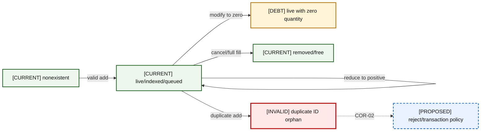
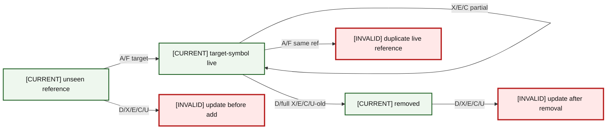
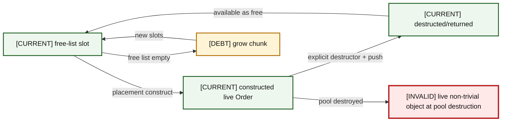
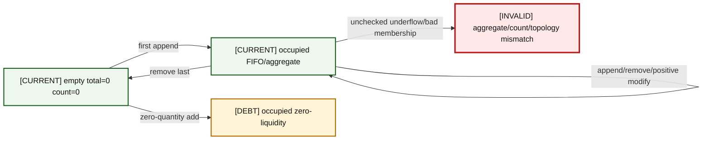
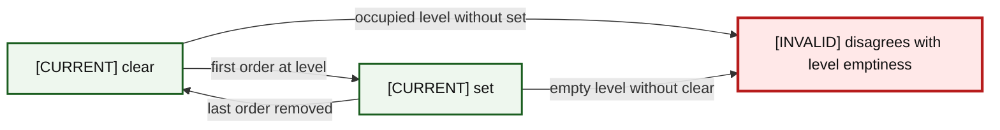
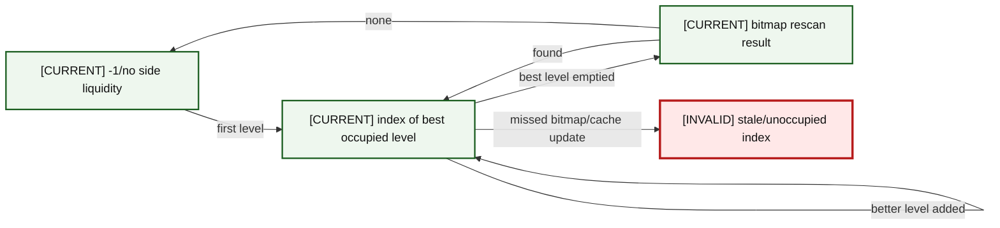
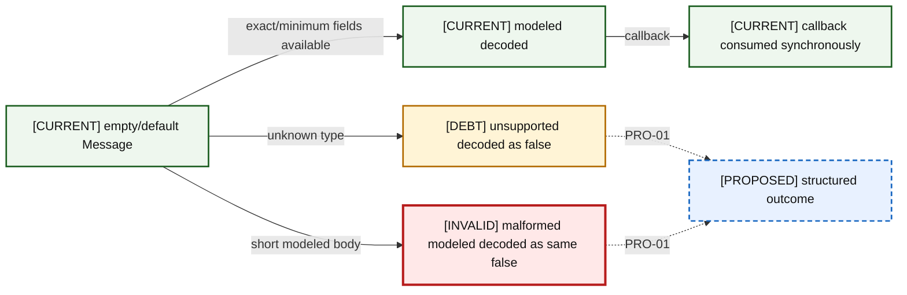
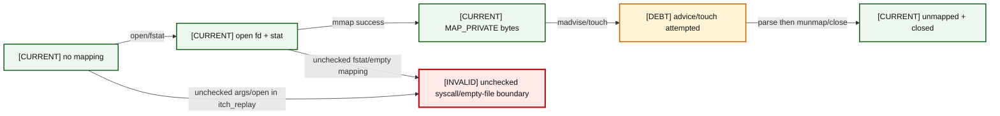

# 06 — Order Lifecycle State Machines

Red states are reachable invalid behavior or unclassified lifecycle events; dashed blue states are corrective policy, not present code.

### A06-01 — Generic order

| Diagram card field | Value |
|---|---|
| Purpose and scope | Model every meaningful generic order state and transition, including invalid transitions. |
| Evidence/status | Repository-derived state machine with audit-labeled invalid states. |
| Source evidence | [orderbook.hpp](../../include/orderbook.hpp), [orderbook.cpp](../../src/orderbook.cpp), [price_level.hpp](../../include/price_level.hpp), [price_level.cpp](../../src/price_level.cpp), [object_pool.hpp](../../include/object_pool.hpp), [order.hpp](../../include/order.hpp), [itch_parser.hpp](../../include/itch_parser.hpp), [book_replay.hpp](../../include/book_replay.hpp), [itch_replay.cpp](../../benchmarks/itch_replay.cpp) |
| Backlog | [COR-02](../../ENGINEERING_BACKLOG.md#cor-02--define-order-id-uniqueness-and-namespace-policy), [COR-03](../../ENGINEERING_BACKLOG.md#cor-03--define-zero-quantity-lifecycle-semantics), [COR-04](../../ENGINEERING_BACKLOG.md#cor-04--separate-reduce-and-quantity-increase-priority-semantics), [COR-06](../../ENGINEERING_BACKLOG.md#cor-06--define-mutation-exception-safety-guarantees), [PRO-01](../../ENGINEERING_BACKLOG.md#pro-01--introduce-structured-framing-and-decode-outcomes), [PRO-02](../../ENGINEERING_BACKLOG.md#pro-02--validate-session-and-order-lifecycle-integrity), [FUT-01](../../ENGINEERING_BACKLOG.md#fut-01--reassess-the-generic-objectpoolt-contract) |
| Findings | [HEL-002](11-current-technical-debt-overlay.md#hel-002), [HEL-003](11-current-technical-debt-overlay.md#hel-003), [HEL-004](11-current-technical-debt-overlay.md#hel-004), [HEL-012](11-current-technical-debt-overlay.md#hel-012), [HEL-013](11-current-technical-debt-overlay.md#hel-013), [HEL-021](11-current-technical-debt-overlay.md#hel-021), [HEL-037](11-current-technical-debt-overlay.md#hel-037) |
| Related atlas material | — |

- **Important edges**
  - N -->|valid add| L
  - L -->|reduce to positive| L
  - L -->|modify to zero| Q
  - L -->|cancel/full fill| R
  - L -->|duplicate add| D
  - D -.->|COR-02| P
- **What exists:** Solid CURRENT transitions are reachable in present code.
- **What does not exist:** Proposed policy transitions are not implemented; red transitions are not validated into explicit outcomes.

### A06-02 — ITCH reference

| Diagram card field | Value |
|---|---|
| Purpose and scope | Model every meaningful itch reference state and transition, including invalid transitions. |
| Evidence/status | Repository-derived state machine with audit-labeled invalid states. |
| Source evidence | [orderbook.hpp](../../include/orderbook.hpp), [orderbook.cpp](../../src/orderbook.cpp), [price_level.hpp](../../include/price_level.hpp), [price_level.cpp](../../src/price_level.cpp), [object_pool.hpp](../../include/object_pool.hpp), [order.hpp](../../include/order.hpp), [itch_parser.hpp](../../include/itch_parser.hpp), [book_replay.hpp](../../include/book_replay.hpp), [itch_replay.cpp](../../benchmarks/itch_replay.cpp) |
| Backlog | [COR-02](../../ENGINEERING_BACKLOG.md#cor-02--define-order-id-uniqueness-and-namespace-policy), [COR-03](../../ENGINEERING_BACKLOG.md#cor-03--define-zero-quantity-lifecycle-semantics), [COR-04](../../ENGINEERING_BACKLOG.md#cor-04--separate-reduce-and-quantity-increase-priority-semantics), [COR-06](../../ENGINEERING_BACKLOG.md#cor-06--define-mutation-exception-safety-guarantees), [PRO-01](../../ENGINEERING_BACKLOG.md#pro-01--introduce-structured-framing-and-decode-outcomes), [PRO-02](../../ENGINEERING_BACKLOG.md#pro-02--validate-session-and-order-lifecycle-integrity), [FUT-01](../../ENGINEERING_BACKLOG.md#fut-01--reassess-the-generic-objectpoolt-contract) |
| Findings | [HEL-002](11-current-technical-debt-overlay.md#hel-002), [HEL-003](11-current-technical-debt-overlay.md#hel-003), [HEL-004](11-current-technical-debt-overlay.md#hel-004), [HEL-012](11-current-technical-debt-overlay.md#hel-012), [HEL-013](11-current-technical-debt-overlay.md#hel-013), [HEL-021](11-current-technical-debt-overlay.md#hel-021), [HEL-037](11-current-technical-debt-overlay.md#hel-037) |
| Related atlas material | — |

- **Important edges**
  - U -->|A/F target| L
  - L -->|X/E/C partial| L
  - L -->|D/full X/E/C/U-old| R
  - U -->|D/X/E/C/U| B
  - R -->|D/X/E/C/U| A
  - L -->|A/F same ref| D
- **What exists:** Solid CURRENT transitions are reachable in present code.
- **What does not exist:** Proposed policy transitions are not implemented; red transitions are not validated into explicit outcomes.

### A06-03 — Pool slot

| Diagram card field | Value |
|---|---|
| Purpose and scope | Model every meaningful pool slot state and transition, including invalid transitions. |
| Evidence/status | Repository-derived state machine with audit-labeled invalid states. |
| Source evidence | [orderbook.hpp](../../include/orderbook.hpp), [orderbook.cpp](../../src/orderbook.cpp), [price_level.hpp](../../include/price_level.hpp), [price_level.cpp](../../src/price_level.cpp), [object_pool.hpp](../../include/object_pool.hpp), [order.hpp](../../include/order.hpp), [itch_parser.hpp](../../include/itch_parser.hpp), [book_replay.hpp](../../include/book_replay.hpp), [itch_replay.cpp](../../benchmarks/itch_replay.cpp) |
| Backlog | [COR-02](../../ENGINEERING_BACKLOG.md#cor-02--define-order-id-uniqueness-and-namespace-policy), [COR-03](../../ENGINEERING_BACKLOG.md#cor-03--define-zero-quantity-lifecycle-semantics), [COR-04](../../ENGINEERING_BACKLOG.md#cor-04--separate-reduce-and-quantity-increase-priority-semantics), [COR-06](../../ENGINEERING_BACKLOG.md#cor-06--define-mutation-exception-safety-guarantees), [PRO-01](../../ENGINEERING_BACKLOG.md#pro-01--introduce-structured-framing-and-decode-outcomes), [PRO-02](../../ENGINEERING_BACKLOG.md#pro-02--validate-session-and-order-lifecycle-integrity), [FUT-01](../../ENGINEERING_BACKLOG.md#fut-01--reassess-the-generic-objectpoolt-contract) |
| Findings | [HEL-002](11-current-technical-debt-overlay.md#hel-002), [HEL-003](11-current-technical-debt-overlay.md#hel-003), [HEL-004](11-current-technical-debt-overlay.md#hel-004), [HEL-012](11-current-technical-debt-overlay.md#hel-012), [HEL-013](11-current-technical-debt-overlay.md#hel-013), [HEL-021](11-current-technical-debt-overlay.md#hel-021), [HEL-037](11-current-technical-debt-overlay.md#hel-037) |
| Related atlas material | — |

- **Important edges**
  - F -->|placement construct| C
  - C -->|explicit destructor + push| R
  - R -->|available as free| F
  - F -->|free list empty| G
  - G -->|new slots| F
  - C -->|pool destroyed| X
- **What exists:** Solid CURRENT transitions are reachable in present code.
- **What does not exist:** Proposed policy transitions are not implemented; red transitions are not validated into explicit outcomes.

### A06-04 — Price level

| Diagram card field | Value |
|---|---|
| Purpose and scope | Model every meaningful price level state and transition, including invalid transitions. |
| Evidence/status | Repository-derived state machine with audit-labeled invalid states. |
| Source evidence | [orderbook.hpp](../../include/orderbook.hpp), [orderbook.cpp](../../src/orderbook.cpp), [price_level.hpp](../../include/price_level.hpp), [price_level.cpp](../../src/price_level.cpp), [object_pool.hpp](../../include/object_pool.hpp), [order.hpp](../../include/order.hpp), [itch_parser.hpp](../../include/itch_parser.hpp), [book_replay.hpp](../../include/book_replay.hpp), [itch_replay.cpp](../../benchmarks/itch_replay.cpp) |
| Backlog | [COR-02](../../ENGINEERING_BACKLOG.md#cor-02--define-order-id-uniqueness-and-namespace-policy), [COR-03](../../ENGINEERING_BACKLOG.md#cor-03--define-zero-quantity-lifecycle-semantics), [COR-04](../../ENGINEERING_BACKLOG.md#cor-04--separate-reduce-and-quantity-increase-priority-semantics), [COR-06](../../ENGINEERING_BACKLOG.md#cor-06--define-mutation-exception-safety-guarantees), [PRO-01](../../ENGINEERING_BACKLOG.md#pro-01--introduce-structured-framing-and-decode-outcomes), [PRO-02](../../ENGINEERING_BACKLOG.md#pro-02--validate-session-and-order-lifecycle-integrity), [FUT-01](../../ENGINEERING_BACKLOG.md#fut-01--reassess-the-generic-objectpoolt-contract) |
| Findings | [HEL-002](11-current-technical-debt-overlay.md#hel-002), [HEL-003](11-current-technical-debt-overlay.md#hel-003), [HEL-004](11-current-technical-debt-overlay.md#hel-004), [HEL-012](11-current-technical-debt-overlay.md#hel-012), [HEL-013](11-current-technical-debt-overlay.md#hel-013), [HEL-021](11-current-technical-debt-overlay.md#hel-021), [HEL-037](11-current-technical-debt-overlay.md#hel-037) |
| Related atlas material | — |

- **Important edges**
  - E -->|first append| O
  - O -->|append/remove/positive modify| O
  - O -->|remove last| E
  - E -->|zero-quantity add| Z
  - O -->|unchecked underflow/bad membership| X
- **What exists:** Solid CURRENT transitions are reachable in present code.
- **What does not exist:** Proposed policy transitions are not implemented; red transitions are not validated into explicit outcomes.

### A06-05 — Bitmap bit

| Diagram card field | Value |
|---|---|
| Purpose and scope | Model every meaningful bitmap bit state and transition, including invalid transitions. |
| Evidence/status | Repository-derived state machine with audit-labeled invalid states. |
| Source evidence | [orderbook.hpp](../../include/orderbook.hpp), [orderbook.cpp](../../src/orderbook.cpp), [price_level.hpp](../../include/price_level.hpp), [price_level.cpp](../../src/price_level.cpp), [object_pool.hpp](../../include/object_pool.hpp), [order.hpp](../../include/order.hpp), [itch_parser.hpp](../../include/itch_parser.hpp), [book_replay.hpp](../../include/book_replay.hpp), [itch_replay.cpp](../../benchmarks/itch_replay.cpp) |
| Backlog | [COR-02](../../ENGINEERING_BACKLOG.md#cor-02--define-order-id-uniqueness-and-namespace-policy), [COR-03](../../ENGINEERING_BACKLOG.md#cor-03--define-zero-quantity-lifecycle-semantics), [COR-04](../../ENGINEERING_BACKLOG.md#cor-04--separate-reduce-and-quantity-increase-priority-semantics), [COR-06](../../ENGINEERING_BACKLOG.md#cor-06--define-mutation-exception-safety-guarantees), [PRO-01](../../ENGINEERING_BACKLOG.md#pro-01--introduce-structured-framing-and-decode-outcomes), [PRO-02](../../ENGINEERING_BACKLOG.md#pro-02--validate-session-and-order-lifecycle-integrity), [FUT-01](../../ENGINEERING_BACKLOG.md#fut-01--reassess-the-generic-objectpoolt-contract) |
| Findings | [HEL-002](11-current-technical-debt-overlay.md#hel-002), [HEL-003](11-current-technical-debt-overlay.md#hel-003), [HEL-004](11-current-technical-debt-overlay.md#hel-004), [HEL-012](11-current-technical-debt-overlay.md#hel-012), [HEL-013](11-current-technical-debt-overlay.md#hel-013), [HEL-021](11-current-technical-debt-overlay.md#hel-021), [HEL-037](11-current-technical-debt-overlay.md#hel-037) |
| Related atlas material | — |

- **Important edges**
  - C -->|first order at level| S
  - S -->|last order removed| C
  - C -->|occupied level without set| X
  - S -->|empty level without clear| X
- **What exists:** Solid CURRENT transitions are reachable in present code.
- **What does not exist:** Proposed policy transitions are not implemented; red transitions are not validated into explicit outcomes.

### A06-06 — Cached best

| Diagram card field | Value |
|---|---|
| Purpose and scope | Model every meaningful cached best state and transition, including invalid transitions. |
| Evidence/status | Repository-derived state machine with audit-labeled invalid states. |
| Source evidence | [orderbook.hpp](../../include/orderbook.hpp), [orderbook.cpp](../../src/orderbook.cpp), [price_level.hpp](../../include/price_level.hpp), [price_level.cpp](../../src/price_level.cpp), [object_pool.hpp](../../include/object_pool.hpp), [order.hpp](../../include/order.hpp), [itch_parser.hpp](../../include/itch_parser.hpp), [book_replay.hpp](../../include/book_replay.hpp), [itch_replay.cpp](../../benchmarks/itch_replay.cpp) |
| Backlog | [COR-02](../../ENGINEERING_BACKLOG.md#cor-02--define-order-id-uniqueness-and-namespace-policy), [COR-03](../../ENGINEERING_BACKLOG.md#cor-03--define-zero-quantity-lifecycle-semantics), [COR-04](../../ENGINEERING_BACKLOG.md#cor-04--separate-reduce-and-quantity-increase-priority-semantics), [COR-06](../../ENGINEERING_BACKLOG.md#cor-06--define-mutation-exception-safety-guarantees), [PRO-01](../../ENGINEERING_BACKLOG.md#pro-01--introduce-structured-framing-and-decode-outcomes), [PRO-02](../../ENGINEERING_BACKLOG.md#pro-02--validate-session-and-order-lifecycle-integrity), [FUT-01](../../ENGINEERING_BACKLOG.md#fut-01--reassess-the-generic-objectpoolt-contract) |
| Findings | [HEL-002](11-current-technical-debt-overlay.md#hel-002), [HEL-003](11-current-technical-debt-overlay.md#hel-003), [HEL-004](11-current-technical-debt-overlay.md#hel-004), [HEL-012](11-current-technical-debt-overlay.md#hel-012), [HEL-013](11-current-technical-debt-overlay.md#hel-013), [HEL-021](11-current-technical-debt-overlay.md#hel-021), [HEL-037](11-current-technical-debt-overlay.md#hel-037) |
| Related atlas material | — |

- **Important edges**
  - N -->|first level| B
  - B -->|better level added| B
  - B -->|best level emptied| R
  - R -->|found| B
  - R -->|none| N
  - B -->|missed bitmap/cache update| X
- **What exists:** Solid CURRENT transitions are reachable in present code.
- **What does not exist:** Proposed policy transitions are not implemented; red transitions are not validated into explicit outcomes.

### A06-07 — Decoded message

| Diagram card field | Value |
|---|---|
| Purpose and scope | Model every meaningful decoded message state and transition, including invalid transitions. |
| Evidence/status | Repository-derived state machine with audit-labeled invalid states. |
| Source evidence | [orderbook.hpp](../../include/orderbook.hpp), [orderbook.cpp](../../src/orderbook.cpp), [price_level.hpp](../../include/price_level.hpp), [price_level.cpp](../../src/price_level.cpp), [object_pool.hpp](../../include/object_pool.hpp), [order.hpp](../../include/order.hpp), [itch_parser.hpp](../../include/itch_parser.hpp), [book_replay.hpp](../../include/book_replay.hpp), [itch_replay.cpp](../../benchmarks/itch_replay.cpp) |
| Backlog | [COR-02](../../ENGINEERING_BACKLOG.md#cor-02--define-order-id-uniqueness-and-namespace-policy), [COR-03](../../ENGINEERING_BACKLOG.md#cor-03--define-zero-quantity-lifecycle-semantics), [COR-04](../../ENGINEERING_BACKLOG.md#cor-04--separate-reduce-and-quantity-increase-priority-semantics), [COR-06](../../ENGINEERING_BACKLOG.md#cor-06--define-mutation-exception-safety-guarantees), [PRO-01](../../ENGINEERING_BACKLOG.md#pro-01--introduce-structured-framing-and-decode-outcomes), [PRO-02](../../ENGINEERING_BACKLOG.md#pro-02--validate-session-and-order-lifecycle-integrity), [FUT-01](../../ENGINEERING_BACKLOG.md#fut-01--reassess-the-generic-objectpoolt-contract) |
| Findings | [HEL-002](11-current-technical-debt-overlay.md#hel-002), [HEL-003](11-current-technical-debt-overlay.md#hel-003), [HEL-004](11-current-technical-debt-overlay.md#hel-004), [HEL-012](11-current-technical-debt-overlay.md#hel-012), [HEL-013](11-current-technical-debt-overlay.md#hel-013), [HEL-021](11-current-technical-debt-overlay.md#hel-021), [HEL-037](11-current-technical-debt-overlay.md#hel-037) |
| Related atlas material | — |

- **Important edges**
  - E -->|exact/minimum fields available| M
  - E -->|unknown type| U
  - E -->|short modeled body| F
  - M -->|callback| C
  - U -.->|PRO-01| P
  - F -.->|PRO-01| P
- **What exists:** Solid CURRENT transitions are reachable in present code.
- **What does not exist:** Proposed policy transitions are not implemented; red transitions are not validated into explicit outcomes.

### A06-08 — Mapped file

| Diagram card field | Value |
|---|---|
| Purpose and scope | Model every meaningful mapped file state and transition, including invalid transitions. |
| Evidence/status | Repository-derived state machine with audit-labeled invalid states. |
| Source evidence | [orderbook.hpp](../../include/orderbook.hpp), [orderbook.cpp](../../src/orderbook.cpp), [price_level.hpp](../../include/price_level.hpp), [price_level.cpp](../../src/price_level.cpp), [object_pool.hpp](../../include/object_pool.hpp), [order.hpp](../../include/order.hpp), [itch_parser.hpp](../../include/itch_parser.hpp), [book_replay.hpp](../../include/book_replay.hpp), [itch_replay.cpp](../../benchmarks/itch_replay.cpp) |
| Backlog | [COR-02](../../ENGINEERING_BACKLOG.md#cor-02--define-order-id-uniqueness-and-namespace-policy), [COR-03](../../ENGINEERING_BACKLOG.md#cor-03--define-zero-quantity-lifecycle-semantics), [COR-04](../../ENGINEERING_BACKLOG.md#cor-04--separate-reduce-and-quantity-increase-priority-semantics), [COR-06](../../ENGINEERING_BACKLOG.md#cor-06--define-mutation-exception-safety-guarantees), [PRO-01](../../ENGINEERING_BACKLOG.md#pro-01--introduce-structured-framing-and-decode-outcomes), [PRO-02](../../ENGINEERING_BACKLOG.md#pro-02--validate-session-and-order-lifecycle-integrity), [FUT-01](../../ENGINEERING_BACKLOG.md#fut-01--reassess-the-generic-objectpoolt-contract) |
| Findings | [HEL-002](11-current-technical-debt-overlay.md#hel-002), [HEL-003](11-current-technical-debt-overlay.md#hel-003), [HEL-004](11-current-technical-debt-overlay.md#hel-004), [HEL-012](11-current-technical-debt-overlay.md#hel-012), [HEL-013](11-current-technical-debt-overlay.md#hel-013), [HEL-021](11-current-technical-debt-overlay.md#hel-021), [HEL-037](11-current-technical-debt-overlay.md#hel-037) |
| Related atlas material | — |

- **Important edges**
  - N -->|open/fstat| FD
  - FD -->|mmap success| M
  - M -->|madvise/touch| P
  - P -->|parse then munmap/close| U
  - N -->|unchecked args/open in itch_replay| X
  - FD -->|unchecked fstat/empty mapping| X
- **What exists:** Solid CURRENT transitions are reachable in present code.
- **What does not exist:** Proposed policy transitions are not implemented; red transitions are not validated into explicit outcomes.
