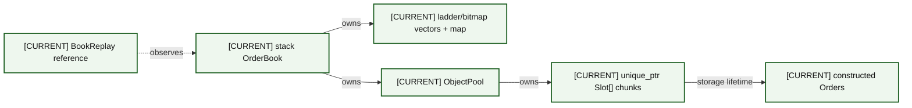
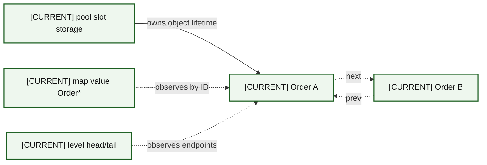
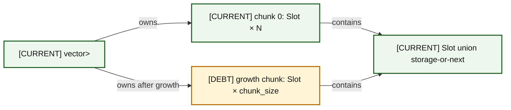
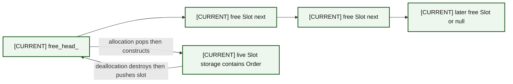
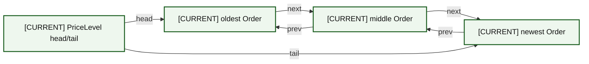
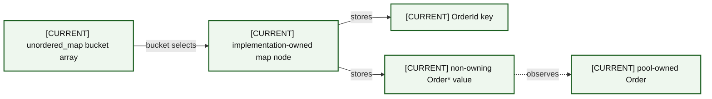
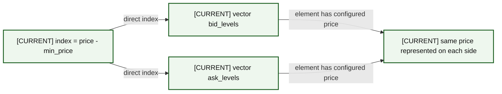
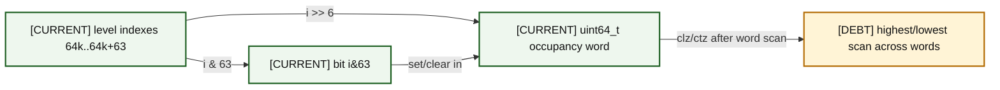
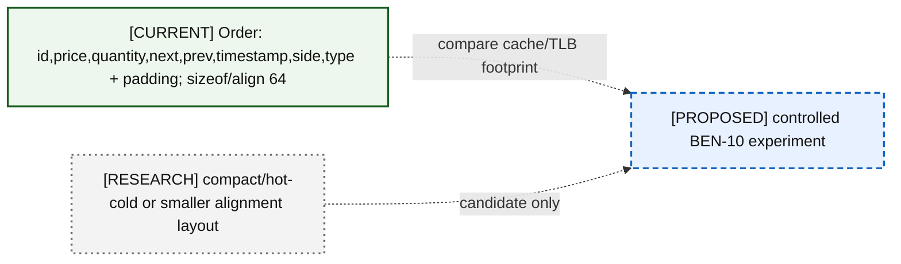

# 07 — Memory Ownership and Layout

Exact `Order` size/alignment is compile-time asserted. Other views show field order and inferred padding without inventing ABI-specific offsets.

### A07-01 — Complete ownership

| Diagram card field | Value |
|---|---|
| Purpose and scope | Clarify complete ownership without confusing storage ownership with pointer observation. |
| Evidence/status | Repository evidence; compact layout is explicitly research. |
| Source evidence | [orderbook.hpp](../../include/orderbook.hpp), [object_pool.hpp](../../include/object_pool.hpp), [book_replay.hpp](../../include/book_replay.hpp) |
| Backlog | [COR-06](../../ENGINEERING_BACKLOG.md#cor-06--define-mutation-exception-safety-guarantees), [FUT-01](../../ENGINEERING_BACKLOG.md#fut-01--reassess-the-generic-objectpoolt-contract) |
| Findings | [HEL-013](11-current-technical-debt-overlay.md#hel-013), [HEL-021](11-current-technical-debt-overlay.md#hel-021) |
| Related atlas material | — |

- **Important edges**
  - B -->|owns| V
  - B -->|owns| P
  - P -->|owns| C
  - C -->|storage lifetime| O
  - R -.->|observes| B
- **What exists:** The CURRENT/DEBT ownership or layout facts in the complete ownership view are supported by tracked source.
- **What does not exist:** The complete ownership view asserts no ABI-specific offsets or measured alternative-layout result beyond the evidence named in its card.

### A07-02 — Live pointer graph

| Diagram card field | Value |
|---|---|
| Purpose and scope | Clarify live pointer graph without confusing storage ownership with pointer observation. |
| Evidence/status | Repository evidence; compact layout is explicitly research. |
| Source evidence | [orderbook.hpp](../../include/orderbook.hpp), [orderbook.cpp](../../src/orderbook.cpp), [price_level.hpp](../../include/price_level.hpp), [object_pool.hpp](../../include/object_pool.hpp) |
| Backlog | [COR-02](../../ENGINEERING_BACKLOG.md#cor-02--define-order-id-uniqueness-and-namespace-policy), [COR-06](../../ENGINEERING_BACKLOG.md#cor-06--define-mutation-exception-safety-guarantees), [VER-02](../../ENGINEERING_BACKLOG.md#ver-02--build-a-reference-book-and-differential-invariant-harness) |
| Findings | [HEL-002](11-current-technical-debt-overlay.md#hel-002), [HEL-009](11-current-technical-debt-overlay.md#hel-009), [HEL-021](11-current-technical-debt-overlay.md#hel-021) |
| Related atlas material | — |

- **Important edges**
  - S -->|owns object lifetime| O1
  - M -.->|observes by ID| O1
  - H -.->|observes endpoints| O1
  - O1 -.->|next| O2
  - O2 -.->|prev| O1
- **What exists:** The CURRENT/DEBT ownership or layout facts in the live pointer graph view are supported by tracked source.
- **What does not exist:** The live pointer graph view asserts no ABI-specific offsets or measured alternative-layout result beyond the evidence named in its card.

### A07-03 — Pool chunk layout

| Diagram card field | Value |
|---|---|
| Purpose and scope | Clarify pool chunk layout without confusing storage ownership with pointer observation. |
| Evidence/status | Repository evidence; compact layout is explicitly research. |
| Source evidence | [object_pool.hpp](../../include/object_pool.hpp) |
| Backlog | [COR-07](../../ENGINEERING_BACKLOG.md#cor-07--define-capacity-and-growth-policy), [BEN-02](../../ENGINEERING_BACKLOG.md#ben-02--produce-a-complete-allocation-map-of-each-hot-operation), [FUT-01](../../ENGINEERING_BACKLOG.md#fut-01--reassess-the-generic-objectpoolt-contract), [BEN-07](../../ENGINEERING_BACKLOG.md#ben-07--reinvestigate-latency-tails-with-correlated-evidence), [DOC-03](../../ENGINEERING_BACKLOG.md#doc-03--define-performance-claim-vocabulary) |
| Findings | [HEL-006](11-current-technical-debt-overlay.md#hel-006), [HEL-013](11-current-technical-debt-overlay.md#hel-013), [HEL-035](11-current-technical-debt-overlay.md#hel-035), [HEL-044](11-current-technical-debt-overlay.md#hel-044) |
| Related atlas material | — |

- **Important edges**
  - V -->|owns| C1
  - V -->|owns after growth| C2
  - C1 -->|contains| S
  - C2 -->|contains| S
- **What exists:** The CURRENT/DEBT ownership or layout facts in the pool chunk layout view are supported by tracked source.
- **What does not exist:** The pool chunk layout view asserts no ABI-specific offsets or measured alternative-layout result beyond the evidence named in its card.

### A07-04 — Free list

| Diagram card field | Value |
|---|---|
| Purpose and scope | Clarify free list without confusing storage ownership with pointer observation. |
| Evidence/status | Repository evidence; compact layout is explicitly research. |
| Source evidence | [object_pool.hpp](../../include/object_pool.hpp) |
| Backlog | [COR-07](../../ENGINEERING_BACKLOG.md#cor-07--define-capacity-and-growth-policy), [BEN-02](../../ENGINEERING_BACKLOG.md#ben-02--produce-a-complete-allocation-map-of-each-hot-operation), [FUT-01](../../ENGINEERING_BACKLOG.md#fut-01--reassess-the-generic-objectpoolt-contract) |
| Findings | [HEL-006](11-current-technical-debt-overlay.md#hel-006), [HEL-013](11-current-technical-debt-overlay.md#hel-013), [HEL-035](11-current-technical-debt-overlay.md#hel-035) |
| Related atlas material | — |

- **Important edges**
  - H --> F1
  - F1 --> F2
  - F2 --> FN
  - H -->|allocation pops then constructs| L
  - L -->|deallocation destroys then pushes slot| H
- **What exists:** The CURRENT/DEBT ownership or layout facts in the free list view are supported by tracked source.
- **What does not exist:** The free list view asserts no ABI-specific offsets or measured alternative-layout result beyond the evidence named in its card.

### A07-05 — Intrusive FIFO queue

| Diagram card field | Value |
|---|---|
| Purpose and scope | Clarify intrusive fifo queue without confusing storage ownership with pointer observation. |
| Evidence/status | Repository evidence; compact layout is explicitly research. |
| Source evidence | [order.hpp](../../include/order.hpp), [price_level.hpp](../../include/price_level.hpp), [price_level.cpp](../../src/price_level.cpp) |
| Backlog | [COR-04](../../ENGINEERING_BACKLOG.md#cor-04--separate-reduce-and-quantity-increase-priority-semantics), [VER-02](../../ENGINEERING_BACKLOG.md#ver-02--build-a-reference-book-and-differential-invariant-harness) |
| Findings | [HEL-004](11-current-technical-debt-overlay.md#hel-004), [HEL-009](11-current-technical-debt-overlay.md#hel-009) |
| Related atlas material | — |

- **Important edges**
  - PL -->|head| A
  - A -->|next| B
  - B -->|next| C
  - C -->|prev| B
  - B -->|prev| A
  - PL -->|tail| C
- **What exists:** The CURRENT/DEBT ownership or layout facts in the intrusive fifo queue view are supported by tracked source.
- **What does not exist:** The intrusive fifo queue view asserts no ABI-specific offsets or measured alternative-layout result beyond the evidence named in its card.

### A07-06 — Hash bucket/node/order

| Diagram card field | Value |
|---|---|
| Purpose and scope | Clarify hash bucket/node/order without confusing storage ownership with pointer observation. |
| Evidence/status | Repository evidence; compact layout is explicitly research. |
| Source evidence | [orderbook.hpp](../../include/orderbook.hpp), [orderbook.cpp](../../src/orderbook.cpp) |
| Backlog | [COR-02](../../ENGINEERING_BACKLOG.md#cor-02--define-order-id-uniqueness-and-namespace-policy), [BEN-02](../../ENGINEERING_BACKLOG.md#ben-02--produce-a-complete-allocation-map-of-each-hot-operation), [FUT-03](../../ENGINEERING_BACKLOG.md#fut-03--evaluate-alternative-order-id-indexes) |
| Findings | [HEL-002](11-current-technical-debt-overlay.md#hel-002), [HEL-006](11-current-technical-debt-overlay.md#hel-006), [HEL-035](11-current-technical-debt-overlay.md#hel-035), [HEL-045](11-current-technical-debt-overlay.md#hel-045) |
| Related atlas material | — |

- **Important edges**
  - H -->|bucket selects| N
  - N -->|stores| K
  - N -->|stores| P
  - P -.->|observes| O
- **What exists:** The CURRENT/DEBT ownership or layout facts in the hash bucket/node/order view are supported by tracked source.
- **What does not exist:** The hash bucket/node/order view asserts no ABI-specific offsets or measured alternative-layout result beyond the evidence named in its card.

### A07-07 — Ladder layout

| Diagram card field | Value |
|---|---|
| Purpose and scope | Clarify ladder layout without confusing storage ownership with pointer observation. |
| Evidence/status | Repository evidence; compact layout is explicitly research. |
| Source evidence | [orderbook.hpp](../../include/orderbook.hpp) |
| Backlog | [COR-01](../../ENGINEERING_BACKLOG.md#cor-01--establish-a-lossless-price-domain-model), [COR-05](../../ENGINEERING_BACKLOG.md#cor-05--harden-numeric-and-construction-boundaries), [BEN-10](../../ENGINEERING_BACKLOG.md#ben-10--measure-compact-versus-cache-line-aligned-order-layouts), [FUT-04](../../ENGINEERING_BACKLOG.md#fut-04--evaluate-segmented-or-compressed-price-ladders) |
| Findings | [HEL-001](11-current-technical-debt-overlay.md#hel-001), [HEL-017](11-current-technical-debt-overlay.md#hel-017), [HEL-018](11-current-technical-debt-overlay.md#hel-018), [HEL-036](11-current-technical-debt-overlay.md#hel-036) |
| Related atlas material | — |

- **Important edges**
  - I -->|direct index| B
  - I -->|direct index| A
  - B -->|element has configured price| P
  - A -->|element has configured price| P
- **What exists:** The CURRENT/DEBT ownership or layout facts in the ladder layout view are supported by tracked source.
- **What does not exist:** The ladder layout view asserts no ABI-specific offsets or measured alternative-layout result beyond the evidence named in its card.

### A07-08 — Bitmap word

| Diagram card field | Value |
|---|---|
| Purpose and scope | Clarify bitmap word without confusing storage ownership with pointer observation. |
| Evidence/status | Repository evidence; compact layout is explicitly research. |
| Source evidence | [orderbook.hpp](../../include/orderbook.hpp), [orderbook.cpp](../../src/orderbook.cpp) |
| Backlog | [VER-02](../../ENGINEERING_BACKLOG.md#ver-02--build-a-reference-book-and-differential-invariant-harness), [BEN-09](../../ENGINEERING_BACKLOG.md#ben-09--measure-bitmap-refresh-complexity-and-alternatives) |
| Findings | [HEL-009](11-current-technical-debt-overlay.md#hel-009), [HEL-027](11-current-technical-debt-overlay.md#hel-027) |
| Related atlas material | — |

- **Important edges**
  - L -->|i >> 6| W
  - L -->|i & 63| BIT
  - BIT -->|set/clear in| W
  - W -->|clz/ctz after word scan| S
- **What exists:** The CURRENT/DEBT ownership or layout facts in the bitmap word view are supported by tracked source.
- **What does not exist:** The bitmap word view asserts no ABI-specific offsets or measured alternative-layout result beyond the evidence named in its card.

### A07-09 — Mapped bytes and Message lifetime

| Diagram card field | Value |
|---|---|
| Purpose and scope | Clarify mapped bytes and message lifetime without confusing storage ownership with pointer observation. |
| Evidence/status | Repository evidence; compact layout is explicitly research. |
| Source evidence | [itch_parser.hpp](../../include/itch_parser.hpp), [itch_replay.cpp](../../benchmarks/itch_replay.cpp), [itch_book_replay.cpp](../../benchmarks/itch_book_replay.cpp) |
| Backlog | [PRO-01](../../ENGINEERING_BACKLOG.md#pro-01--introduce-structured-framing-and-decode-outcomes), [PRO-06](../../ENGINEERING_BACKLOG.md#pro-06--specify-portable-file-mapping-and-prefault-behavior) |
| Findings | [HEL-012](11-current-technical-debt-overlay.md#hel-012), [HEL-022](11-current-technical-debt-overlay.md#hel-022), [HEL-026](11-current-technical-debt-overlay.md#hel-026) |
| Related atlas material | — |

- **Important edges**
  - OS -->|backs| MAP
  - MAP -->|parse borrows| B
  - B -->|explicit reads/copies| M
  - M -.->|callback borrows| CB
- **What exists:** The CURRENT/DEBT ownership or layout facts in the mapped bytes and message lifetime view are supported by tracked source.
- **What does not exist:** The mapped bytes and message lifetime view asserts no ABI-specific offsets or measured alternative-layout result beyond the evidence named in its card.

### A07-10 — Current versus compact Order

| Diagram card field | Value |
|---|---|
| Purpose and scope | Clarify current versus compact order without confusing storage ownership with pointer observation. |
| Evidence/status | Repository evidence; compact layout is explicitly research. |
| Source evidence | [order.hpp](../../include/order.hpp) |
| Backlog | [BEN-10](../../ENGINEERING_BACKLOG.md#ben-10--measure-compact-versus-cache-line-aligned-order-layouts), [FUT-05](../../ENGINEERING_BACKLOG.md#fut-05--investigate-prefetch-and-numa-behavior) |
| Findings | [HEL-015](11-current-technical-debt-overlay.md#hel-015), [HEL-036](11-current-technical-debt-overlay.md#hel-036) |
| Related atlas material | — |

- **Important edges**
  - C -.->|compare cache/TLB footprint| E
  - H -.->|candidate only| E
- **What exists:** The CURRENT/DEBT ownership or layout facts in the current versus compact order view are supported by tracked source.
- **What does not exist:** The current versus compact order view asserts no ABI-specific offsets or measured alternative-layout result beyond the evidence named in its card.
