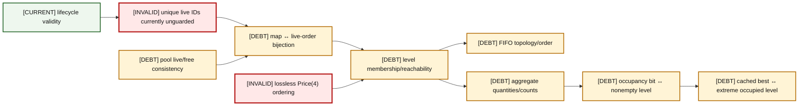
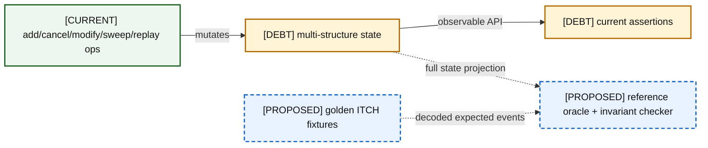

# 08 — Correctness Invariants

### A08-01 — Invariant dependency graph

| Diagram card field | Value |
|---|---|
| Purpose and scope | Show which local invariants support global observable correctness. |
| Evidence/status | Repository contracts plus audit counterexamples. |
| Source evidence | [orderbook.hpp](../../include/orderbook.hpp), [orderbook.cpp](../../src/orderbook.cpp), [price_level.hpp](../../include/price_level.hpp), [price_level.cpp](../../src/price_level.cpp), [object_pool.hpp](../../include/object_pool.hpp), [order.hpp](../../include/order.hpp), [book_replay.hpp](../../include/book_replay.hpp) |
| Backlog | [COR-01](../../ENGINEERING_BACKLOG.md#cor-01--establish-a-lossless-price-domain-model), [COR-02](../../ENGINEERING_BACKLOG.md#cor-02--define-order-id-uniqueness-and-namespace-policy), [COR-03](../../ENGINEERING_BACKLOG.md#cor-03--define-zero-quantity-lifecycle-semantics), [VER-02](../../ENGINEERING_BACKLOG.md#ver-02--build-a-reference-book-and-differential-invariant-harness) |
| Findings | [HEL-001](11-current-technical-debt-overlay.md#hel-001), [HEL-002](11-current-technical-debt-overlay.md#hel-002), [HEL-003](11-current-technical-debt-overlay.md#hel-003), [HEL-009](11-current-technical-debt-overlay.md#hel-009) |
| Related atlas material | — |

- **Important edges**
  - Lifecycle validity and pool consistency underpin identity bijection.
  - Membership supports FIFO and aggregates; aggregates support occupancy; occupancy supports best caches.
  - Lossless price identity is required before level membership represents the feed.
- **What exists:** The structures required to maintain these invariants exist.
- **What does not exist:** A centralized invariant checker, reference oracle, or proof that current invalid transitions are rejected.

### A08-02 — Invariant verification pipeline

| Diagram card field | Value |
|---|---|
| Purpose and scope | Relate operations to independent checking and current test gaps. |
| Evidence/status | Current tests plus proposed verification boundary. |
| Source evidence | [test_orderbook.cpp](../../tests/test_orderbook.cpp), [09-testing-and-correctness.md](../../docs/helios-study-guide/09-testing-and-correctness.md) |
| Backlog | [VER-01](../../ENGINEERING_BACKLOG.md#ver-01--build-protocol-golden-fixtures), [VER-02](../../ENGINEERING_BACKLOG.md#ver-02--build-a-reference-book-and-differential-invariant-harness), [VER-05](../../ENGINEERING_BACKLOG.md#ver-05--add-sanitizer-fuzzing-and-boundary-verification-strategy) |
| Findings | [HEL-009](11-current-technical-debt-overlay.md#hel-009), [HEL-011](11-current-technical-debt-overlay.md#hel-011) |
| Related atlas material | — |

- **Important edges**
  - Current tests observe selected APIs but do not independently traverse all internal structures.
  - The proposed oracle consumes an independent model and golden events.
- **What exists:** Registered OrderBook tests and selected stress scenarios.
- **What does not exist:** Differential oracle, internal state projection, golden parser/replay fixtures, property generation, fuzzing.

## Invariant-to-operation/test/finding matrix

| Invariant | Add | Cancel/full fill | Modify/partial | Replace | Sweep | Current test evidence | Findings |
|---|---:|---:|---:|---:|---:|---|---|
| Live ID uniqueness | writes | removes | looks up | old→new | removes | duplicate adversary absent | HEL-002 |
| Map/live-order bijection | creates | destroys | preserves | two-step transfer | destroys | only partial observable checks | HEL-002, HEL-021 |
| Exactly-one level membership/reachability | appends | unlinks | preserves | moves | unlinks heads | FIFO cases | HEL-002, HEL-009 |
| FIFO topology and priority | tail append | arbitrary unlink | retains position | new tail | head traversal | basic same-price FIFO | HEL-004 |
| Aggregate quantity/counts | adds | subtracts | delta | remove+add | subtracts | selected totals indirectly | HEL-003, HEL-034 |
| Occupancy iff actionable level | first sets | last clears | zero can violate | both | clears | zero adversary absent | HEL-003 |
| Bitmap ↔ level | first sets | last clears | should preserve | both | clears | best-price checks | HEL-027 |
| Cached best is extreme set bit | may improve | may rescan | preserve | both | rescan | selected best checks | HEL-027 |
| Pool allocated = live objects; free/live disjoint | acquires | returns | preserve | transfer | returns | invalid alloc check disconnected | HEL-008, HEL-013, HEL-035 |
| Price(4) values remain distinct/ordered | replay violates | lookup via ID | same level | replay violates | level order | parser/replay tests absent | HEL-001, HEL-017 |
| `total_orders_` = reachable live count | increments | decrements | preserves | transfer | decrements | one stress assertion is tautological | HEL-002, HEL-009, HEL-034 |
| Lifecycle validity | add defines | terminates | requires live | requires old live/new unique | terminates | feed sequence tests absent | HEL-037 |
