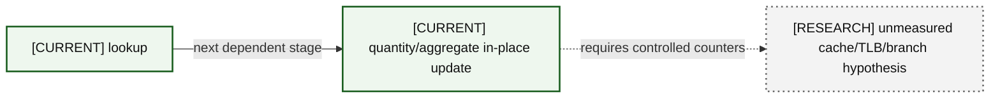

```mermaid
flowchart LR
    N0["[CURRENT] range/price arithmetic"]:::current
    N1["[CURRENT] pool pop or chunk growth"]:::current
    N2["[CURRENT] hash insert/possible rehash"]:::current
    N3["[CURRENT] ladder load"]:::current
    N4["[CURRENT] FIFO pointer writes"]:::current
    N5["[CURRENT] bitmap/cache/count update"]:::current
    H["[RESEARCH] unmeasured cache/TLB/branch hypothesis"]:::research
    N0 -->|next dependent stage| N1
    N1 -->|next dependent stage| N2
    N2 -->|next dependent stage| N3
    N3 -->|next dependent stage| N4
    N4 -->|next dependent stage| N5
    N5 -.->|requires controlled counters| H
    classDef current fill:#eef7ee,stroke:#1b5e20,stroke-width:2px,color:#111;
    classDef debt fill:#fff4d6,stroke:#b26a00,stroke-width:2px,color:#111;
    classDef invalid fill:#ffe8e8,stroke:#b71c1c,stroke-width:3px,color:#111;
    classDef proposed fill:#e8f1ff,stroke:#1565c0,stroke-width:2px,stroke-dasharray: 6 4,color:#111;
    classDef research fill:#f3f3f3,stroke:#666,stroke-width:2px,stroke-dasharray: 2 4,color:#111;
    classDef context fill:#fafafa,stroke:#777,stroke-width:2px,stroke-dasharray: 2 4,color:#111;
```

```mermaid
flowchart LR
    N0["[CURRENT] hash lookup"]:::current
    N1["[CURRENT] Order quantity load"]:::current
    N2["[CURRENT] signed delta"]:::current
    N3["[CURRENT] aggregate update"]:::current
    H["[RESEARCH] unmeasured cache/TLB/branch hypothesis"]:::research
    N0 -->|next dependent stage| N1
    N1 -->|next dependent stage| N2
    N2 -->|next dependent stage| N3
    N3 -.->|requires controlled counters| H
    classDef current fill:#eef7ee,stroke:#1b5e20,stroke-width:2px,color:#111;
    classDef debt fill:#fff4d6,stroke:#b26a00,stroke-width:2px,color:#111;
    classDef invalid fill:#ffe8e8,stroke:#b71c1c,stroke-width:3px,color:#111;
    classDef proposed fill:#e8f1ff,stroke:#1565c0,stroke-width:2px,stroke-dasharray: 6 4,color:#111;
    classDef research fill:#f3f3f3,stroke:#666,stroke-width:2px,stroke-dasharray: 2 4,color:#111;
    classDef context fill:#fafafa,stroke:#777,stroke-width:2px,stroke-dasharray: 2 4,color:#111;
```

```mermaid
flowchart LR
    N0["[CURRENT] old lookup/cancel path"]:::current
    N1["[CURRENT] new lossy price conversion"]:::current
    N2["[CURRENT] add path"]:::current
    H["[RESEARCH] unmeasured cache/TLB/branch hypothesis"]:::research
    N0 -->|next dependent stage| N1
    N1 -->|next dependent stage| N2
    N2 -.->|requires controlled counters| H
    classDef current fill:#eef7ee,stroke:#1b5e20,stroke-width:2px,color:#111;
    classDef debt fill:#fff4d6,stroke:#b26a00,stroke-width:2px,color:#111;
    classDef invalid fill:#ffe8e8,stroke:#b71c1c,stroke-width:3px,color:#111;
    classDef proposed fill:#e8f1ff,stroke:#1565c0,stroke-width:2px,stroke-dasharray: 6 4,color:#111;
    classDef research fill:#f3f3f3,stroke:#666,stroke-width:2px,stroke-dasharray: 2 4,color:#111;
    classDef context fill:#fafafa,stroke:#777,stroke-width:2px,stroke-dasharray: 2 4,color:#111;
```

```mermaid
flowchart LR
    N0["[CURRENT] lookup"]:::current
    N1["[CURRENT] cancel/unlink/erase/free"]:::current
    N2["[CURRENT] possible bitmap best refresh"]:::current
    H["[RESEARCH] unmeasured cache/TLB/branch hypothesis"]:::research
    N0 -->|next dependent stage| N1
    N1 -->|next dependent stage| N2
    N2 -.->|requires controlled counters| H
    classDef current fill:#eef7ee,stroke:#1b5e20,stroke-width:2px,color:#111;
    classDef debt fill:#fff4d6,stroke:#b26a00,stroke-width:2px,color:#111;
    classDef invalid fill:#ffe8e8,stroke:#b71c1c,stroke-width:3px,color:#111;
    classDef proposed fill:#e8f1ff,stroke:#1565c0,stroke-width:2px,stroke-dasharray: 6 4,color:#111;
    classDef research fill:#f3f3f3,stroke:#666,stroke-width:2px,stroke-dasharray: 2 4,color:#111;
    classDef context fill:#fafafa,stroke:#777,stroke-width:2px,stroke-dasharray: 2 4,color:#111;
```

```mermaid
flowchart LR
    N0["[CURRENT] best cache"]:::current
    N1["[CURRENT] per-level aggregate"]:::current
    N2["[CURRENT] repeated FIFO head loads/erase/unlink/free"]:::current
    N3["[CURRENT] bitmap scans"]:::current
    H["[RESEARCH] unmeasured cache/TLB/branch hypothesis"]:::research
    N0 -->|next dependent stage| N1
    N1 -->|next dependent stage| N2
    N2 -->|next dependent stage| N3
    N3 -.->|requires controlled counters| H
    classDef current fill:#eef7ee,stroke:#1b5e20,stroke-width:2px,color:#111;
    classDef debt fill:#fff4d6,stroke:#b26a00,stroke-width:2px,color:#111;
    classDef invalid fill:#ffe8e8,stroke:#b71c1c,stroke-width:3px,color:#111;
    classDef proposed fill:#e8f1ff,stroke:#1565c0,stroke-width:2px,stroke-dasharray: 6 4,color:#111;
    classDef research fill:#f3f3f3,stroke:#666,stroke-width:2px,stroke-dasharray: 2 4,color:#111;
    classDef context fill:#fafafa,stroke:#777,stroke-width:2px,stroke-dasharray: 2 4,color:#111;
```

```mermaid
flowchart LR
    N0["[CURRENT] copy target once"]:::current
    N1["[CURRENT] per Add memcpy 8 bytes to local uint64"]:::current
    N2["[CURRENT] compare"]:::current
    N3["[CURRENT] branch"]:::current
    H["[RESEARCH] unmeasured cache/TLB/branch hypothesis"]:::research
    N0 -->|next dependent stage| N1
    N1 -->|next dependent stage| N2
    N2 -->|next dependent stage| N3
    N3 -.->|requires controlled counters| H
    classDef current fill:#eef7ee,stroke:#1b5e20,stroke-width:2px,color:#111;
    classDef debt fill:#fff4d6,stroke:#b26a00,stroke-width:2px,color:#111;
    classDef invalid fill:#ffe8e8,stroke:#b71c1c,stroke-width:3px,color:#111;
    classDef proposed fill:#e8f1ff,stroke:#1565c0,stroke-width:2px,stroke-dasharray: 6 4,color:#111;
    classDef research fill:#f3f3f3,stroke:#666,stroke-width:2px,stroke-dasharray: 2 4,color:#111;
    classDef context fill:#fafafa,stroke:#777,stroke-width:2px,stroke-dasharray: 2 4,color:#111;
```

```mermaid
flowchart LR
    N0["[CURRENT] open/stat/mmap/advice/touch"]:::current
    N1["[CURRENT] construct very large book"]:::current
    N2["[CURRENT] parse every frame"]:::current
    N3["[CURRENT] filter target adds"]:::current
    N4["[CURRENT] mutate target lifecycle"]:::current
    N5["[CURRENT] summarize/unmap"]:::current
    H["[RESEARCH] unmeasured cache/TLB/branch hypothesis"]:::research
    N0 -->|next dependent stage| N1
    N1 -->|next dependent stage| N2
    N2 -->|next dependent stage| N3
    N3 -->|next dependent stage| N4
    N4 -->|next dependent stage| N5
    N5 -.->|requires controlled counters| H
    classDef current fill:#eef7ee,stroke:#1b5e20,stroke-width:2px,color:#111;
    classDef debt fill:#fff4d6,stroke:#b26a00,stroke-width:2px,color:#111;
    classDef invalid fill:#ffe8e8,stroke:#b71c1c,stroke-width:3px,color:#111;
    classDef proposed fill:#e8f1ff,stroke:#1565c0,stroke-width:2px,stroke-dasharray: 6 4,color:#111;
    classDef research fill:#f3f3f3,stroke:#666,stroke-width:2px,stroke-dasharray: 2 4,color:#111;
    classDef context fill:#fafafa,stroke:#777,stroke-width:2px,stroke-dasharray: 2 4,color:#111;
```

# 09 — Performance Cost Model

Annotations use four confidence labels: **measured historical evidence**, **repository evidence**, **engineering inference**, and **unmeasured hypothesis**. Complexity alone is never presented as latency.

### A09-01 — Add cost path

| Diagram card field | Value |
|---|---|
| Purpose and scope | Decompose the add path into algorithmic, memory, branch, allocation, and OS costs. |
| Evidence/status | Measured historical add artifacts exist, but current exact build provenance is incomplete. |
| Source evidence | [orderbook.hpp](../../include/orderbook.hpp), [orderbook.cpp](../../src/orderbook.cpp), [price_level.hpp](../../include/price_level.hpp), [price_level.cpp](../../src/price_level.cpp), [object_pool.hpp](../../include/object_pool.hpp), [order.hpp](../../include/order.hpp), [itch_parser.hpp](../../include/itch_parser.hpp), [book_replay.hpp](../../include/book_replay.hpp), [benchmark_orderbook.cpp](../../benchmarks/benchmark_orderbook.cpp), [itch_book_replay.cpp](../../benchmarks/itch_book_replay.cpp) |
| Backlog | [BEN-01](../../ENGINEERING_BACKLOG.md#ben-01--make-build-and-benchmark-provenance-reproducible), [BEN-02](../../ENGINEERING_BACKLOG.md#ben-02--produce-a-complete-allocation-map-of-each-hot-operation), [BEN-03](../../ENGINEERING_BACKLOG.md#ben-03--replace-the-add-only-headline-with-a-workload-portfolio) |
| Findings | [HEL-005](11-current-technical-debt-overlay.md#hel-005), [HEL-006](11-current-technical-debt-overlay.md#hel-006), [HEL-028](11-current-technical-debt-overlay.md#hel-028), [HEL-035](11-current-technical-debt-overlay.md#hel-035) |
| Related atlas material | — |

- **Important edges**
  - Path: range/price arithmetic → pool pop or chunk growth → hash insert/possible rehash → ladder load → FIFO pointer writes → bitmap/cache/count update.
  - Pool/hash/level dependent loads; growth and rehash allocate; new pages may fault; branches on range and empty level.
- **What exists:** Every CURRENT stage is visible in tracked source; historical labels identify only saved evidence.
- **What does not exist:** The research node is not a measured conclusion; no nanosecond value is inferred.

### A09-02 — Cancel cost path

| Diagram card field | Value |
|---|---|
| Purpose and scope | Decompose the cancel path into algorithmic, memory, branch, allocation, and OS costs. |
| Evidence/status | Repository evidence; no isolated current cancel distribution. |
| Source evidence | [orderbook.hpp](../../include/orderbook.hpp), [orderbook.cpp](../../src/orderbook.cpp), [price_level.hpp](../../include/price_level.hpp), [price_level.cpp](../../src/price_level.cpp), [object_pool.hpp](../../include/object_pool.hpp), [order.hpp](../../include/order.hpp), [itch_parser.hpp](../../include/itch_parser.hpp), [book_replay.hpp](../../include/book_replay.hpp), [benchmark_orderbook.cpp](../../benchmarks/benchmark_orderbook.cpp), [itch_book_replay.cpp](../../benchmarks/itch_book_replay.cpp) |
| Backlog | [BEN-02](../../ENGINEERING_BACKLOG.md#ben-02--produce-a-complete-allocation-map-of-each-hot-operation), [BEN-03](../../ENGINEERING_BACKLOG.md#ben-03--replace-the-add-only-headline-with-a-workload-portfolio), [BEN-09](../../ENGINEERING_BACKLOG.md#ben-09--measure-bitmap-refresh-complexity-and-alternatives) |
| Findings | [HEL-006](11-current-technical-debt-overlay.md#hel-006), [HEL-027](11-current-technical-debt-overlay.md#hel-027) |
| Related atlas material | — |

- **Important edges**
  - Path: hash/bucket lookup → Order* load → price/side load → intrusive unlink → possible bitmap clear/word scan → erase → pool push.
  - Hash and pointer chasing; branch on side/last level/best; no chunk allocation normally; word scan can touch broad bitmap.
- **What exists:** Every CURRENT stage is visible in tracked source; historical labels identify only saved evidence.
- **What does not exist:** The research node is not a measured conclusion; no nanosecond value is inferred.

### A09-03 — Reduce cost path

| Diagram card field | Value |
|---|---|
| Purpose and scope | Decompose the reduce path into algorithmic, memory, branch, allocation, and OS costs. |
| Evidence/status | Repository evidence; unmeasured as an isolated current workload. |
| Source evidence | [orderbook.hpp](../../include/orderbook.hpp), [orderbook.cpp](../../src/orderbook.cpp), [price_level.hpp](../../include/price_level.hpp), [price_level.cpp](../../src/price_level.cpp), [object_pool.hpp](../../include/object_pool.hpp), [order.hpp](../../include/order.hpp), [itch_parser.hpp](../../include/itch_parser.hpp), [book_replay.hpp](../../include/book_replay.hpp), [benchmark_orderbook.cpp](../../benchmarks/benchmark_orderbook.cpp), [itch_book_replay.cpp](../../benchmarks/itch_book_replay.cpp) |
| Backlog | [BEN-02](../../ENGINEERING_BACKLOG.md#ben-02--produce-a-complete-allocation-map-of-each-hot-operation), [BEN-03](../../ENGINEERING_BACKLOG.md#ben-03--replace-the-add-only-headline-with-a-workload-portfolio) |
| Findings | [HEL-004](11-current-technical-debt-overlay.md#hel-004), [HEL-020](11-current-technical-debt-overlay.md#hel-020) |
| Related atlas material | — |

- **Important edges**
  - Path: hash lookup → Order quantity load → signed delta → aggregate update.
  - Short dependent chain with unordered-map locality; no pool/free-list unless replay converts full reduction to cancel.
- **What exists:** Every CURRENT stage is visible in tracked source; historical labels identify only saved evidence.
- **What does not exist:** The research node is not a measured conclusion; no nanosecond value is inferred.

### A09-04 — Replace cost path

| Diagram card field | Value |
|---|---|
| Purpose and scope | Decompose the replace path into algorithmic, memory, branch, allocation, and OS costs. |
| Evidence/status | Repository evidence and engineering inference; no controlled measurement. |
| Source evidence | [orderbook.hpp](../../include/orderbook.hpp), [orderbook.cpp](../../src/orderbook.cpp), [price_level.hpp](../../include/price_level.hpp), [price_level.cpp](../../src/price_level.cpp), [object_pool.hpp](../../include/object_pool.hpp), [order.hpp](../../include/order.hpp), [itch_parser.hpp](../../include/itch_parser.hpp), [book_replay.hpp](../../include/book_replay.hpp), [benchmark_orderbook.cpp](../../benchmarks/benchmark_orderbook.cpp), [itch_book_replay.cpp](../../benchmarks/itch_book_replay.cpp) |
| Backlog | [COR-06](../../ENGINEERING_BACKLOG.md#cor-06--define-mutation-exception-safety-guarantees), [BEN-03](../../ENGINEERING_BACKLOG.md#ben-03--replace-the-add-only-headline-with-a-workload-portfolio) |
| Findings | [HEL-001](11-current-technical-debt-overlay.md#hel-001), [HEL-021](11-current-technical-debt-overlay.md#hel-021) |
| Related atlas material | — |

- **Important edges**
  - Path: old lookup/cancel path → new lossy price conversion → add path.
  - Combines two mutations and both slow-path risks; failed add leaves old removed; cache/TLB footprint spans map, level, pool, bitmap.
- **What exists:** Every CURRENT stage is visible in tracked source; historical labels identify only saved evidence.
- **What does not exist:** The research node is not a measured conclusion; no nanosecond value is inferred.

### A09-05 — Full execution cost path

| Diagram card field | Value |
|---|---|
| Purpose and scope | Decompose the full execution path into algorithmic, memory, branch, allocation, and OS costs. |
| Evidence/status | Repository evidence; no isolated current E/C latency evidence. |
| Source evidence | [orderbook.hpp](../../include/orderbook.hpp), [orderbook.cpp](../../src/orderbook.cpp), [price_level.hpp](../../include/price_level.hpp), [price_level.cpp](../../src/price_level.cpp), [object_pool.hpp](../../include/object_pool.hpp), [order.hpp](../../include/order.hpp), [itch_parser.hpp](../../include/itch_parser.hpp), [book_replay.hpp](../../include/book_replay.hpp), [benchmark_orderbook.cpp](../../benchmarks/benchmark_orderbook.cpp), [itch_book_replay.cpp](../../benchmarks/itch_book_replay.cpp) |
| Backlog | [PRO-05](../../ENGINEERING_BACKLOG.md#pro-05--preserve-diagnostic-feed-metadata), [BEN-03](../../ENGINEERING_BACKLOG.md#ben-03--replace-the-add-only-headline-with-a-workload-portfolio), [BEN-09](../../ENGINEERING_BACKLOG.md#ben-09--measure-bitmap-refresh-complexity-and-alternatives) |
| Findings | [HEL-027](11-current-technical-debt-overlay.md#hel-027), [HEL-038](11-current-technical-debt-overlay.md#hel-038) |
| Related atlas material | — |

- **Important edges**
  - Path: lookup → cancel/unlink/erase/free → possible bitmap best refresh.
  - Same structural costs as cancel; replay ignores execution metadata after decode.
- **What exists:** Every CURRENT stage is visible in tracked source; historical labels identify only saved evidence.
- **What does not exist:** The research node is not a measured conclusion; no nanosecond value is inferred.

### A09-06 — Partial execution cost path

| Diagram card field | Value |
|---|---|
| Purpose and scope | Decompose the partial execution path into algorithmic, memory, branch, allocation, and OS costs. |
| Evidence/status | Repository evidence plus explicitly labeled engineering inference. |
| Source evidence | [orderbook.hpp](../../include/orderbook.hpp), [orderbook.cpp](../../src/orderbook.cpp), [price_level.hpp](../../include/price_level.hpp), [price_level.cpp](../../src/price_level.cpp), [object_pool.hpp](../../include/object_pool.hpp), [order.hpp](../../include/order.hpp), [itch_parser.hpp](../../include/itch_parser.hpp), [book_replay.hpp](../../include/book_replay.hpp), [benchmark_orderbook.cpp](../../benchmarks/benchmark_orderbook.cpp), [itch_book_replay.cpp](../../benchmarks/itch_book_replay.cpp) |
| Backlog | [BEN-03](../../ENGINEERING_BACKLOG.md#ben-03--replace-the-add-only-headline-with-a-workload-portfolio) |
| Findings | [HEL-004](11-current-technical-debt-overlay.md#hel-004) |
| Related atlas material | — |

- **Important edges**
  - Path: lookup → quantity/aggregate in-place update.
  - Likely fewer stores than full removal, but hash and Order pointer remain dependent; this is inference, not measurement.
- **What exists:** Every CURRENT stage is visible in tracked source; historical labels identify only saved evidence.
- **What does not exist:** The research node is not a measured conclusion; no nanosecond value is inferred.

### A09-07 — Long sweep cost path

| Diagram card field | Value |
|---|---|
| Purpose and scope | Decompose the long sweep path into algorithmic, memory, branch, allocation, and OS costs. |
| Evidence/status | Repository evidence; long-tail performance is unmeasured hypothesis. |
| Source evidence | [orderbook.hpp](../../include/orderbook.hpp), [orderbook.cpp](../../src/orderbook.cpp), [price_level.hpp](../../include/price_level.hpp), [price_level.cpp](../../src/price_level.cpp), [object_pool.hpp](../../include/object_pool.hpp), [order.hpp](../../include/order.hpp), [itch_parser.hpp](../../include/itch_parser.hpp), [book_replay.hpp](../../include/book_replay.hpp), [benchmark_orderbook.cpp](../../benchmarks/benchmark_orderbook.cpp), [itch_book_replay.cpp](../../benchmarks/itch_book_replay.cpp) |
| Backlog | [BEN-03](../../ENGINEERING_BACKLOG.md#ben-03--replace-the-add-only-headline-with-a-workload-portfolio), [BEN-09](../../ENGINEERING_BACKLOG.md#ben-09--measure-bitmap-refresh-complexity-and-alternatives) |
| Findings | [HEL-003](11-current-technical-debt-overlay.md#hel-003), [HEL-027](11-current-technical-debt-overlay.md#hel-027), [HEL-042](11-current-technical-debt-overlay.md#hel-042) |
| Related atlas material | — |

- **Important edges**
  - Path: best cache → per-level aggregate → repeated FIFO head loads/erase/unlink/free → bitmap scans.
  - Work proportional to orders and levels consumed; many dependent loads/stores, branches, cache/TLB touches; can cross many bitmap words.
- **What exists:** Every CURRENT stage is visible in tracked source; historical labels identify only saved evidence.
- **What does not exist:** The research node is not a measured conclusion; no nanosecond value is inferred.

### A09-08 — Parse cost path

| Diagram card field | Value |
|---|---|
| Purpose and scope | Decompose the parse path into algorithmic, memory, branch, allocation, and OS costs. |
| Evidence/status | Historical replay/profile artifacts plus repository evidence; provenance limits remain. |
| Source evidence | [orderbook.hpp](../../include/orderbook.hpp), [orderbook.cpp](../../src/orderbook.cpp), [price_level.hpp](../../include/price_level.hpp), [price_level.cpp](../../src/price_level.cpp), [object_pool.hpp](../../include/object_pool.hpp), [order.hpp](../../include/order.hpp), [itch_parser.hpp](../../include/itch_parser.hpp), [book_replay.hpp](../../include/book_replay.hpp), [benchmark_orderbook.cpp](../../benchmarks/benchmark_orderbook.cpp), [itch_book_replay.cpp](../../benchmarks/itch_book_replay.cpp) |
| Backlog | [PRO-01](../../ENGINEERING_BACKLOG.md#pro-01--introduce-structured-framing-and-decode-outcomes), [PRO-06](../../ENGINEERING_BACKLOG.md#pro-06--specify-portable-file-mapping-and-prefault-behavior), [BEN-07](../../ENGINEERING_BACKLOG.md#ben-07--reinvestigate-latency-tails-with-correlated-evidence) |
| Findings | [HEL-007](11-current-technical-debt-overlay.md#hel-007), [HEL-012](11-current-technical-debt-overlay.md#hel-012), [HEL-026](11-current-technical-debt-overlay.md#hel-026), [HEL-033](11-current-technical-debt-overlay.md#hel-033) |
| Related atlas material | — |

- **Important edges**
  - Path: 2-byte frame read → bounds branches → switch → big-endian byte loads/shifts → Message writes → callback.
  - Sequential mapping favors readahead, but page/TLB faults and syscall mapping setup sit at OS boundary; malformed/unsupported status is conflated.
- **What exists:** Every CURRENT stage is visible in tracked source; historical labels identify only saved evidence.
- **What does not exist:** The research node is not a measured conclusion; no nanosecond value is inferred.

### A09-09 — Symbol filter cost path

| Diagram card field | Value |
|---|---|
| Purpose and scope | Decompose the symbol filter path into algorithmic, memory, branch, allocation, and OS costs. |
| Evidence/status | Repository evidence plus historical profiling claim. |
| Source evidence | [orderbook.hpp](../../include/orderbook.hpp), [orderbook.cpp](../../src/orderbook.cpp), [price_level.hpp](../../include/price_level.hpp), [price_level.cpp](../../src/price_level.cpp), [object_pool.hpp](../../include/object_pool.hpp), [order.hpp](../../include/order.hpp), [itch_parser.hpp](../../include/itch_parser.hpp), [book_replay.hpp](../../include/book_replay.hpp), [benchmark_orderbook.cpp](../../benchmarks/benchmark_orderbook.cpp), [itch_book_replay.cpp](../../benchmarks/itch_book_replay.cpp) |
| Backlog | [PRO-03](../../ENGINEERING_BACKLOG.md#pro-03--evaluate-stock-locate-based-symbol-routing), [BEN-01](../../ENGINEERING_BACKLOG.md#ben-01--make-build-and-benchmark-provenance-reproducible) |
| Findings | [HEL-024](11-current-technical-debt-overlay.md#hel-024), [HEL-043](11-current-technical-debt-overlay.md#hel-043) |
| Related atlas material | — |

- **Important edges**
  - Path: copy target once → per Add memcpy 8 bytes to local uint64 → compare → branch.
  - A compact comparison is current; claimed benefit is historical evidence and may depend on compiler/unaligned behavior/workload.
- **What exists:** Every CURRENT stage is visible in tracked source; historical labels identify only saved evidence.
- **What does not exist:** The research node is not a measured conclusion; no nanosecond value is inferred.

### A09-10 — Complete replay cost path

| Diagram card field | Value |
|---|---|
| Purpose and scope | Decompose the complete replay path into algorithmic, memory, branch, allocation, and OS costs. |
| Evidence/status | Historical measured artifacts, repository evidence, and unmeasured decomposition hypotheses. |
| Source evidence | [orderbook.hpp](../../include/orderbook.hpp), [orderbook.cpp](../../src/orderbook.cpp), [price_level.hpp](../../include/price_level.hpp), [price_level.cpp](../../src/price_level.cpp), [object_pool.hpp](../../include/object_pool.hpp), [order.hpp](../../include/order.hpp), [itch_parser.hpp](../../include/itch_parser.hpp), [book_replay.hpp](../../include/book_replay.hpp), [benchmark_orderbook.cpp](../../benchmarks/benchmark_orderbook.cpp), [itch_book_replay.cpp](../../benchmarks/itch_book_replay.cpp) |
| Backlog | [VER-06](../../ENGINEERING_BACKLOG.md#ver-06--establish-artifact-and-replay-provenance), [BEN-01](../../ENGINEERING_BACKLOG.md#ben-01--make-build-and-benchmark-provenance-reproducible), [BEN-03](../../ENGINEERING_BACKLOG.md#ben-03--replace-the-add-only-headline-with-a-workload-portfolio), [BEN-07](../../ENGINEERING_BACKLOG.md#ben-07--reinvestigate-latency-tails-with-correlated-evidence) |
| Findings | [HEL-007](11-current-technical-debt-overlay.md#hel-007), [HEL-023](11-current-technical-debt-overlay.md#hel-023), [HEL-036](11-current-technical-debt-overlay.md#hel-036), [HEL-048](11-current-technical-debt-overlay.md#hel-048) |
| Related atlas material | — |

- **Important edges**
  - Path: open/stat/mmap/advice/touch → construct very large book → parse every frame → filter target adds → mutate target lifecycle → summarize/unmap.
  - OS page cache/faults, decoder work, callback mix, huge ladder initialization, pool/hash growth, and output are distinct cost regions.
- **What exists:** Every CURRENT stage is visible in tracked source; historical labels identify only saved evidence.
- **What does not exist:** The research node is not a measured conclusion; no nanosecond value is inferred.
