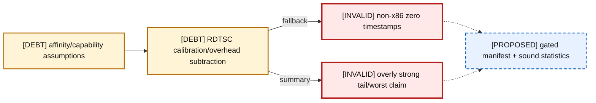

```mermaid
flowchart LR
    I["[CURRENT] file/bytes"]:::current
    F["[DEBT] frame loop"]:::debt
    D["[DEBT] bool decoder"]:::debt
    S["[DEBT] stop/skip/count"]:::debt
    P["[PROPOSED] structured outcome + offset"]:::proposed
    I --> F
    F -->|complete body| D
    F -->|zero/truncated| S
    D -->|unsupported or malformed| S
    S -.->|PRO-01| P
    classDef current fill:#eef7ee,stroke:#1b5e20,stroke-width:2px,color:#111;
    classDef debt fill:#fff4d6,stroke:#b26a00,stroke-width:2px,color:#111;
    classDef invalid fill:#ffe8e8,stroke:#b71c1c,stroke-width:3px,color:#111;
    classDef proposed fill:#e8f1ff,stroke:#1565c0,stroke-width:2px,stroke-dasharray: 6 4,color:#111;
    classDef research fill:#f3f3f3,stroke:#666,stroke-width:2px,stroke-dasharray: 2 4,color:#111;
    classDef context fill:#fafafa,stroke:#777,stroke-width:2px,stroke-dasharray: 2 4,color:#111;
```

```mermaid
flowchart LR
    A["[CURRENT] mutation request"]:::current
    B["[DEBT] coordinated structures"]:::debt
    D["[INVALID] duplicate/zero/priority/lossy-price state"]:::invalid
    R["[PROPOSED] validate + atomic commit/rollback"]:::proposed
    A --> B
    B -->|unguarded transitions| D
    D -.->|COR policies| R
    classDef current fill:#eef7ee,stroke:#1b5e20,stroke-width:2px,color:#111;
    classDef debt fill:#fff4d6,stroke:#b26a00,stroke-width:2px,color:#111;
    classDef invalid fill:#ffe8e8,stroke:#b71c1c,stroke-width:3px,color:#111;
    classDef proposed fill:#e8f1ff,stroke:#1565c0,stroke-width:2px,stroke-dasharray: 6 4,color:#111;
    classDef research fill:#f3f3f3,stroke:#666,stroke-width:2px,stroke-dasharray: 2 4,color:#111;
    classDef context fill:#fafafa,stroke:#777,stroke-width:2px,stroke-dasharray: 2 4,color:#111;
```

```mermaid
flowchart LR
    P["[CURRENT] pool free slot"]:::current
    G["[DEBT] pool grow allocation"]:::debt
    H["[DEBT] unordered_map insert/rehash"]:::debt
    X["[INVALID] partial mutation on exception"]:::invalid
    C["[PROPOSED] explicit capacity/failure contract"]:::proposed
    P -->|empty| G
    G --> H
    H -->|throws after pool acquisition| X
    X -.->|COR-06/07| C
    classDef current fill:#eef7ee,stroke:#1b5e20,stroke-width:2px,color:#111;
    classDef debt fill:#fff4d6,stroke:#b26a00,stroke-width:2px,color:#111;
    classDef invalid fill:#ffe8e8,stroke:#b71c1c,stroke-width:3px,color:#111;
    classDef proposed fill:#e8f1ff,stroke:#1565c0,stroke-width:2px,stroke-dasharray: 6 4,color:#111;
    classDef research fill:#f3f3f3,stroke:#666,stroke-width:2px,stroke-dasharray: 2 4,color:#111;
    classDef context fill:#fafafa,stroke:#777,stroke-width:2px,stroke-dasharray: 2 4,color:#111;
```

```mermaid
flowchart LR
    C["[CURRENT] CLI/CMake/script"]:::current
    O["[DEBT] open/stat/mmap/advice/affinity"]:::debt
    E["[DEBT] partial checks/ignored returns"]:::debt
    M["[INVALID] terminate, degrade, or misleading report"]:::invalid
    P["[PROPOSED] portable checked contract + CI"]:::proposed
    C --> O
    O --> E
    E --> M
    M -.-> P
    classDef current fill:#eef7ee,stroke:#1b5e20,stroke-width:2px,color:#111;
    classDef debt fill:#fff4d6,stroke:#b26a00,stroke-width:2px,color:#111;
    classDef invalid fill:#ffe8e8,stroke:#b71c1c,stroke-width:3px,color:#111;
    classDef proposed fill:#e8f1ff,stroke:#1565c0,stroke-width:2px,stroke-dasharray: 6 4,color:#111;
    classDef research fill:#f3f3f3,stroke:#666,stroke-width:2px,stroke-dasharray: 2 4,color:#111;
    classDef context fill:#fafafa,stroke:#777,stroke-width:2px,stroke-dasharray: 2 4,color:#111;
```

# 10 — Failure and Error Model

Current outcomes include rejection, silent skip, false/zero return, termination, degradation, corruption risk, and misreporting. “No signal” is itself a current behavior.

### A10-01 — Ingress and protocol

| Diagram card field | Value |
|---|---|
| Purpose and scope | Group ingress and protocol failures by detection boundary and current response. |
| Evidence/status | Repository evidence and audit classification. |
| Source evidence | [orderbook.hpp](../../include/orderbook.hpp), [orderbook.cpp](../../src/orderbook.cpp), [price_level.hpp](../../include/price_level.hpp), [price_level.cpp](../../src/price_level.cpp), [object_pool.hpp](../../include/object_pool.hpp), [order.hpp](../../include/order.hpp), [itch_parser.hpp](../../include/itch_parser.hpp), [itch_book_replay.cpp](../../benchmarks/itch_book_replay.cpp), [rdtsc_timer.hpp](../../include/rdtsc_timer.hpp), [CMakeLists.txt](../../CMakeLists.txt) |
| Backlog | [PRO-01](../../ENGINEERING_BACKLOG.md#pro-01--introduce-structured-framing-and-decode-outcomes), [PRO-02](../../ENGINEERING_BACKLOG.md#pro-02--validate-session-and-order-lifecycle-integrity), [PRO-06](../../ENGINEERING_BACKLOG.md#pro-06--specify-portable-file-mapping-and-prefault-behavior) |
| Findings | [HEL-012](11-current-technical-debt-overlay.md#hel-012), [HEL-022](11-current-technical-debt-overlay.md#hel-022), [HEL-025](11-current-technical-debt-overlay.md#hel-025), [HEL-026](11-current-technical-debt-overlay.md#hel-026), [HEL-037](11-current-technical-debt-overlay.md#hel-037) |
| Related atlas material | — |

- **Important edges**
  - I --> F
  - F -->|complete body| D
  - F -->|zero/truncated| S
  - D -->|unsupported or malformed| S
  - S -.->|PRO-01| P
- **What exists:** The CURRENT/DEBT paths and their weak signals are present.
- **What does not exist:** Proposed structured errors, rollback, platform gates, and CI are not implemented.

### A10-02 — Book and state

| Diagram card field | Value |
|---|---|
| Purpose and scope | Group book and state failures by detection boundary and current response. |
| Evidence/status | Repository evidence and audit classification. |
| Source evidence | [orderbook.hpp](../../include/orderbook.hpp), [orderbook.cpp](../../src/orderbook.cpp), [price_level.hpp](../../include/price_level.hpp), [price_level.cpp](../../src/price_level.cpp), [object_pool.hpp](../../include/object_pool.hpp), [order.hpp](../../include/order.hpp), [itch_parser.hpp](../../include/itch_parser.hpp), [itch_book_replay.cpp](../../benchmarks/itch_book_replay.cpp), [rdtsc_timer.hpp](../../include/rdtsc_timer.hpp), [CMakeLists.txt](../../CMakeLists.txt) |
| Backlog | [COR-01](../../ENGINEERING_BACKLOG.md#cor-01--establish-a-lossless-price-domain-model), [COR-02](../../ENGINEERING_BACKLOG.md#cor-02--define-order-id-uniqueness-and-namespace-policy), [COR-03](../../ENGINEERING_BACKLOG.md#cor-03--define-zero-quantity-lifecycle-semantics), [COR-04](../../ENGINEERING_BACKLOG.md#cor-04--separate-reduce-and-quantity-increase-priority-semantics), [COR-06](../../ENGINEERING_BACKLOG.md#cor-06--define-mutation-exception-safety-guarantees) |
| Findings | [HEL-001](11-current-technical-debt-overlay.md#hel-001), [HEL-002](11-current-technical-debt-overlay.md#hel-002), [HEL-003](11-current-technical-debt-overlay.md#hel-003), [HEL-004](11-current-technical-debt-overlay.md#hel-004), [HEL-021](11-current-technical-debt-overlay.md#hel-021) |
| Related atlas material | — |

- **Important edges**
  - A --> B
  - B -->|unguarded transitions| D
  - D -.->|COR policies| R
- **What exists:** The CURRENT/DEBT paths and their weak signals are present.
- **What does not exist:** Proposed structured errors, rollback, platform gates, and CI are not implemented.

### A10-03 — Allocation and capacity

| Diagram card field | Value |
|---|---|
| Purpose and scope | Group allocation and capacity failures by detection boundary and current response. |
| Evidence/status | Repository evidence and audit classification. |
| Source evidence | [orderbook.hpp](../../include/orderbook.hpp), [orderbook.cpp](../../src/orderbook.cpp), [price_level.hpp](../../include/price_level.hpp), [price_level.cpp](../../src/price_level.cpp), [object_pool.hpp](../../include/object_pool.hpp), [order.hpp](../../include/order.hpp), [itch_parser.hpp](../../include/itch_parser.hpp), [itch_book_replay.cpp](../../benchmarks/itch_book_replay.cpp), [rdtsc_timer.hpp](../../include/rdtsc_timer.hpp), [CMakeLists.txt](../../CMakeLists.txt) |
| Backlog | [COR-06](../../ENGINEERING_BACKLOG.md#cor-06--define-mutation-exception-safety-guarantees), [COR-07](../../ENGINEERING_BACKLOG.md#cor-07--define-capacity-and-growth-policy), [BEN-02](../../ENGINEERING_BACKLOG.md#ben-02--produce-a-complete-allocation-map-of-each-hot-operation) |
| Findings | [HEL-006](11-current-technical-debt-overlay.md#hel-006), [HEL-021](11-current-technical-debt-overlay.md#hel-021), [HEL-035](11-current-technical-debt-overlay.md#hel-035) |
| Related atlas material | — |

- **Important edges**
  - P -->|empty| G
  - G --> H
  - H -->|throws after pool acquisition| X
  - X -.->|COR-06/07| C
- **What exists:** The CURRENT/DEBT paths and their weak signals are present.
- **What does not exist:** Proposed structured errors, rollback, platform gates, and CI are not implemented.

### A10-04 — OS and tooling

| Diagram card field | Value |
|---|---|
| Purpose and scope | Group os and tooling failures by detection boundary and current response. |
| Evidence/status | Repository evidence and audit classification. |
| Source evidence | [orderbook.hpp](../../include/orderbook.hpp), [orderbook.cpp](../../src/orderbook.cpp), [price_level.hpp](../../include/price_level.hpp), [price_level.cpp](../../src/price_level.cpp), [object_pool.hpp](../../include/object_pool.hpp), [order.hpp](../../include/order.hpp), [itch_parser.hpp](../../include/itch_parser.hpp), [itch_book_replay.cpp](../../benchmarks/itch_book_replay.cpp), [rdtsc_timer.hpp](../../include/rdtsc_timer.hpp), [CMakeLists.txt](../../CMakeLists.txt) |
| Backlog | [PRO-06](../../ENGINEERING_BACKLOG.md#pro-06--specify-portable-file-mapping-and-prefault-behavior), [BEN-05](../../ENGINEERING_BACKLOG.md#ben-05--verify-cpu-affinity-tsc-capability-and-platform-gating), [INF-01](../../ENGINEERING_BACKLOG.md#inf-01--establish-a-compiler-and-verification-ci-matrix), [INF-02](../../ENGINEERING_BACKLOG.md#inf-02--modernize-target-scoped-cmake-behavior) |
| Findings | [HEL-025](11-current-technical-debt-overlay.md#hel-025), [HEL-026](11-current-technical-debt-overlay.md#hel-026), [HEL-030](11-current-technical-debt-overlay.md#hel-030), [HEL-046](11-current-technical-debt-overlay.md#hel-046), [HEL-047](11-current-technical-debt-overlay.md#hel-047) |
| Related atlas material | — |

- **Important edges**
  - C --> O
  - O --> E
  - E --> M
  - M -.-> P
- **What exists:** The CURRENT/DEBT paths and their weak signals are present.
- **What does not exist:** Proposed structured errors, rollback, platform gates, and CI are not implemented.

### A10-05 — Timing and platform

| Diagram card field | Value |
|---|---|
| Purpose and scope | Group timing and platform failures by detection boundary and current response. |
| Evidence/status | Repository evidence and audit classification. |
| Source evidence | [orderbook.hpp](../../include/orderbook.hpp), [orderbook.cpp](../../src/orderbook.cpp), [price_level.hpp](../../include/price_level.hpp), [price_level.cpp](../../src/price_level.cpp), [object_pool.hpp](../../include/object_pool.hpp), [order.hpp](../../include/order.hpp), [itch_parser.hpp](../../include/itch_parser.hpp), [itch_book_replay.cpp](../../benchmarks/itch_book_replay.cpp), [rdtsc_timer.hpp](../../include/rdtsc_timer.hpp), [CMakeLists.txt](../../CMakeLists.txt) |
| Backlog | [BEN-01](../../ENGINEERING_BACKLOG.md#ben-01--make-build-and-benchmark-provenance-reproducible), [BEN-04](../../ENGINEERING_BACKLOG.md#ben-04--redesign-latency-statistics-and-timer-overhead-treatment), [BEN-05](../../ENGINEERING_BACKLOG.md#ben-05--verify-cpu-affinity-tsc-capability-and-platform-gating), [BEN-07](../../ENGINEERING_BACKLOG.md#ben-07--reinvestigate-latency-tails-with-correlated-evidence), [DOC-03](../../ENGINEERING_BACKLOG.md#doc-03--define-performance-claim-vocabulary) |
| Findings | [HEL-005](11-current-technical-debt-overlay.md#hel-005), [HEL-029](11-current-technical-debt-overlay.md#hel-029), [HEL-030](11-current-technical-debt-overlay.md#hel-030), [HEL-031](11-current-technical-debt-overlay.md#hel-031), [HEL-033](11-current-technical-debt-overlay.md#hel-033), [HEL-040](11-current-technical-debt-overlay.md#hel-040) |
| Related atlas material | — |

- **Important edges**
  - A --> T
  - T -->|fallback| Z
  - T -->|summary| S
  - Z -.-> V
  - S -.-> V
- **What exists:** The CURRENT/DEBT paths and their weak signals are present.
- **What does not exist:** Proposed structured errors, rollback, platform gates, and CI are not implemented.

## Complete failure matrix

| Case | Detection point | Current outcome | State/evidence effect | Desired classification |
|---|---|---|---|---|
| missing CLI args in `itch_replay` | none before `argv[1]` | undefined/crash risk | terminate/corrupt process state | usage error |
| open failure (`itch_replay`) | unchecked | later syscalls/mapping invalid | terminate/misreport risk | system-call failure |
| open failure (`itch_book_replay`) | executable | perror + exit 1 | reject | system-call failure |
| failed `fstat` / empty file | mostly unchecked | bad size/mapping path | terminate/degrade | system-call/input failure |
| `mmap` failure | checked only in book replay | exit 1 there; unchecked parser tool | terminate | system-call failure |
| advice/prefault failure | ignored | continue | degrade/misreport “prefault” | performance hint failure |
| zero frame length | parser | stop | normal-looking partial count | explicit terminator |
| truncated prefix/tail | loop bounds | stop | silent incomplete parse | truncated input |
| unsupported type | decoder `false` | skip | not counted as modeled | unsupported |
| short modeled message | same `false` | skip | indistinguishable from unsupported | malformed modeled |
| overlong/wrong-domain fields | minimum-only checks | accept modeled | possible invalid mutation | invalid field/length |
| non-target Add | replay symbol compare | skip book; seen increments | population mismatch | filtered event |
| missing lifecycle ID | replay/book lookup | silent skip / false | anomaly hidden | lifecycle anomaly |
| duplicate live ID | `orders_[id]` | overwrite index pointer | corrupt reachability/count | reject/transaction |
| zero-quantity Add | no validation | accept | occupied non-actionable level | reject/no-op policy |
| out-of-range price | book `inRange` | return zero | reject; replay add not counted | typed range error |
| valid Price(4) > replay ladder scale | lossy conversion/range | merge or reject | corrupt/skip | lossless typed price |
| quantity increase | modify | accept in place | undocumented priority retention | explicit policy |
| full reduction/execution | replay | cancel | accepted removal | modeled success |
| over-reduction | replay | cancel | anomaly not counted | explicit anomaly |
| replace add failure after cancel | two calls | old remains removed | partial commit/corrupt replay | atomic failure |
| pool exhaustion | `allocate` | allocate new chunk | latency degrade/throw | capacity event |
| hash rehash/allocation failure | map write | exception after slot acquisition | partial mutation/leak/live mismatch | rollback guarantee |
| aggregate under/overflow | arithmetic | wrap/implementation conversion effects | corrupt totals | numeric error |
| bitmap best rescan | last best removed | linear word scan | latency degrade | measured cost/capacity |
| affinity failure | benchmark | ignored | misreport platform control | platform validation failure |
| non-x86 timer | fallback zeros | prints invalid timing | misreport | refuse/gate |
| invalid timer subtraction/statistic | summary | strong numbers | evidence misreport | validated method |
| missing GTest | configure | configuration fails | build/test unavailable | optional/feature-gated dependency |
| disconnected test/profiler | CMake | not built/run | false coverage impression | build graph coverage |
| replay child nonzero in script | captured but loop continues | report still produced | counted run with failure | explicit failed run |
| live non-trivial pool objects at destruction | pool default teardown | destructors skipped | generic lifetime violation | destroy or constrain T |
