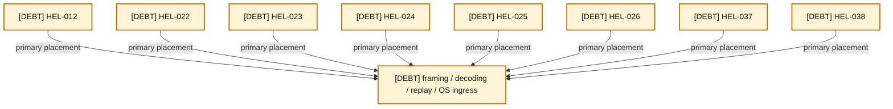
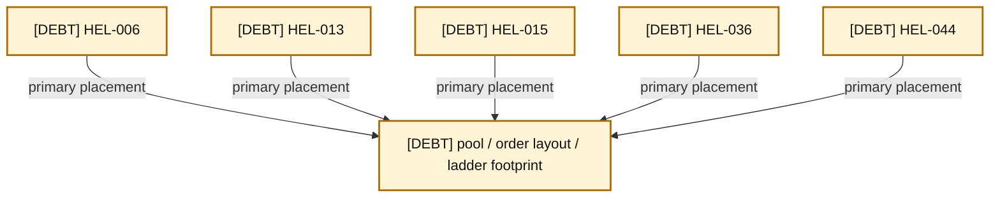
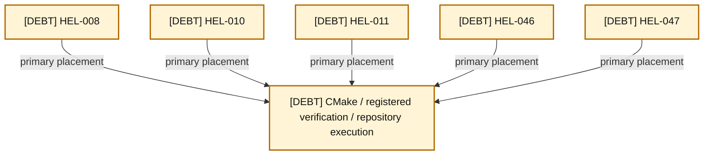
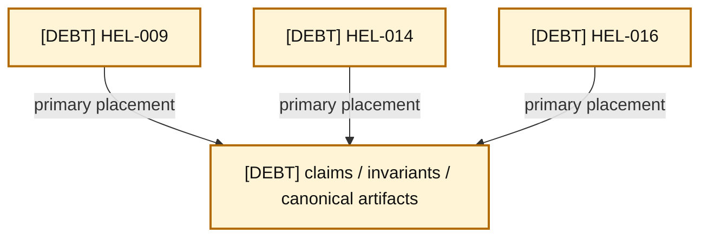

```mermaid
flowchart TB
    C["[DEBT] OrderBook / PriceLevel / replay semantics"]:::debt
    H0["[DEBT] HEL-001"]:::debt
    H1["[DEBT] HEL-002"]:::debt
    H2["[DEBT] HEL-003"]:::debt
    H3["[DEBT] HEL-004"]:::debt
    H4["[DEBT] HEL-017"]:::debt
    H5["[DEBT] HEL-018"]:::debt
    H6["[DEBT] HEL-019"]:::debt
    H7["[DEBT] HEL-020"]:::debt
    H8["[DEBT] HEL-021"]:::debt
    H9["[DEBT] HEL-027"]:::debt
    H10["[DEBT] HEL-034"]:::debt
    H11["[DEBT] HEL-035"]:::debt
    H12["[DEBT] HEL-039"]:::debt
    H13["[DEBT] HEL-041"]:::debt
    H14["[DEBT] HEL-042"]:::debt
    H0 -->|primary placement| C
    H1 -->|primary placement| C
    H2 -->|primary placement| C
    H3 -->|primary placement| C
    H4 -->|primary placement| C
    H5 -->|primary placement| C
    H6 -->|primary placement| C
    H7 -->|primary placement| C
    H8 -->|primary placement| C
    H9 -->|primary placement| C
    H10 -->|primary placement| C
    H11 -->|primary placement| C
    H12 -->|primary placement| C
    H13 -->|primary placement| C
    H14 -->|primary placement| C
    classDef current fill:#eef7ee,stroke:#1b5e20,stroke-width:2px,color:#111;
    classDef debt fill:#fff4d6,stroke:#b26a00,stroke-width:2px,color:#111;
    classDef invalid fill:#ffe8e8,stroke:#b71c1c,stroke-width:3px,color:#111;
    classDef proposed fill:#e8f1ff,stroke:#1565c0,stroke-width:2px,stroke-dasharray: 6 4,color:#111;
    classDef research fill:#f3f3f3,stroke:#666,stroke-width:2px,stroke-dasharray: 2 4,color:#111;
    classDef context fill:#fafafa,stroke:#777,stroke-width:2px,stroke-dasharray: 2 4,color:#111;
```

```mermaid
flowchart TB
    C["[DEBT] timing / workload / artifacts / experiments"]:::debt
    H0["[DEBT] HEL-005"]:::debt
    H1["[DEBT] HEL-007"]:::debt
    H2["[DEBT] HEL-028"]:::debt
    H3["[DEBT] HEL-029"]:::debt
    H4["[DEBT] HEL-030"]:::debt
    H5["[DEBT] HEL-031"]:::debt
    H6["[DEBT] HEL-032"]:::debt
    H7["[DEBT] HEL-033"]:::debt
    H8["[DEBT] HEL-040"]:::debt
    H9["[DEBT] HEL-043"]:::debt
    H10["[DEBT] HEL-045"]:::debt
    H11["[DEBT] HEL-048"]:::debt
    H0 -->|primary placement| C
    H1 -->|primary placement| C
    H2 -->|primary placement| C
    H3 -->|primary placement| C
    H4 -->|primary placement| C
    H5 -->|primary placement| C
    H6 -->|primary placement| C
    H7 -->|primary placement| C
    H8 -->|primary placement| C
    H9 -->|primary placement| C
    H10 -->|primary placement| C
    H11 -->|primary placement| C
    classDef current fill:#eef7ee,stroke:#1b5e20,stroke-width:2px,color:#111;
    classDef debt fill:#fff4d6,stroke:#b26a00,stroke-width:2px,color:#111;
    classDef invalid fill:#ffe8e8,stroke:#b71c1c,stroke-width:3px,color:#111;
    classDef proposed fill:#e8f1ff,stroke:#1565c0,stroke-width:2px,stroke-dasharray: 6 4,color:#111;
    classDef research fill:#f3f3f3,stroke:#666,stroke-width:2px,stroke-dasharray: 2 4,color:#111;
    classDef context fill:#fafafa,stroke:#777,stroke-width:2px,stroke-dasharray: 2 4,color:#111;
```

# 11 — Current Technical-Debt Overlay

Every HEL finding has exactly one primary overlay below. Secondary relationships are listed separately so cross-cutting findings do not make the diagrams unreadable. The original conversational audit has **no repository URI**; these summaries are derived from the tracked [study-guide ledger](../helios-study-guide/12-technical-debt-and-limitations.md).

### A11-01 — Core correctness overlay

| Diagram card field | Value |
|---|---|
| Purpose and scope | Place findings primarily on the core correctness component surface. |
| Evidence/status | Tracked audit findings over repository components. |
| Source evidence | [orderbook.hpp](../../include/orderbook.hpp), [orderbook.cpp](../../src/orderbook.cpp), [price_level.hpp](../../include/price_level.hpp), [price_level.cpp](../../src/price_level.cpp), [object_pool.hpp](../../include/object_pool.hpp), [order.hpp](../../include/order.hpp), [itch_parser.hpp](../../include/itch_parser.hpp), [rdtsc_timer.hpp](../../include/rdtsc_timer.hpp), [CMakeLists.txt](../../CMakeLists.txt), [README.md](../../README.md) |
| Backlog | [COR-01](../../ENGINEERING_BACKLOG.md#cor-01--establish-a-lossless-price-domain-model), [COR-02](../../ENGINEERING_BACKLOG.md#cor-02--define-order-id-uniqueness-and-namespace-policy), [COR-03](../../ENGINEERING_BACKLOG.md#cor-03--define-zero-quantity-lifecycle-semantics), [COR-04](../../ENGINEERING_BACKLOG.md#cor-04--separate-reduce-and-quantity-increase-priority-semantics), [COR-05](../../ENGINEERING_BACKLOG.md#cor-05--harden-numeric-and-construction-boundaries), [COR-06](../../ENGINEERING_BACKLOG.md#cor-06--define-mutation-exception-safety-guarantees), [COR-07](../../ENGINEERING_BACKLOG.md#cor-07--define-capacity-and-growth-policy), [COR-08](../../ENGINEERING_BACKLOG.md#cor-08--separate-reconstruction-and-matching-semantics), [COR-09](../../ENGINEERING_BACKLOG.md#cor-09--resolve-ambiguous-and-no-op-public-apis), [BEN-09](../../ENGINEERING_BACKLOG.md#ben-09--measure-bitmap-refresh-complexity-and-alternatives) |
| Findings | [HEL-001](11-current-technical-debt-overlay.md#hel-001), [HEL-002](11-current-technical-debt-overlay.md#hel-002), [HEL-003](11-current-technical-debt-overlay.md#hel-003), [HEL-004](11-current-technical-debt-overlay.md#hel-004), [HEL-017](11-current-technical-debt-overlay.md#hel-017), [HEL-018](11-current-technical-debt-overlay.md#hel-018), [HEL-019](11-current-technical-debt-overlay.md#hel-019), [HEL-020](11-current-technical-debt-overlay.md#hel-020), [HEL-021](11-current-technical-debt-overlay.md#hel-021), [HEL-027](11-current-technical-debt-overlay.md#hel-027), [HEL-034](11-current-technical-debt-overlay.md#hel-034), [HEL-035](11-current-technical-debt-overlay.md#hel-035), [HEL-039](11-current-technical-debt-overlay.md#hel-039), [HEL-041](11-current-technical-debt-overlay.md#hel-041), [HEL-042](11-current-technical-debt-overlay.md#hel-042) |
| Related atlas material | — |

- **Important edges**
  - HEL-001, HEL-002, HEL-003, HEL-004, HEL-017, HEL-018, HEL-019, HEL-020, HEL-021, HEL-027, HEL-034, HEL-035, HEL-039, HEL-041, HEL-042 are primary here.
  - Other component effects remain secondary and are indexed below.
- **What exists:** All finding IDs refer to observed debt in the present repository.
- **What does not exist:** Blue correction work is backlog only; the overlay does not claim resolution.

### A11-02 — Protocol and replay overlay

| Diagram card field | Value |
|---|---|
| Purpose and scope | Place findings primarily on the protocol and replay component surface. |
| Evidence/status | Tracked audit findings over repository components. |
| Source evidence | [orderbook.hpp](../../include/orderbook.hpp), [orderbook.cpp](../../src/orderbook.cpp), [price_level.hpp](../../include/price_level.hpp), [price_level.cpp](../../src/price_level.cpp), [object_pool.hpp](../../include/object_pool.hpp), [order.hpp](../../include/order.hpp), [itch_parser.hpp](../../include/itch_parser.hpp), [rdtsc_timer.hpp](../../include/rdtsc_timer.hpp), [CMakeLists.txt](../../CMakeLists.txt), [README.md](../../README.md) |
| Backlog | [PRO-01](../../ENGINEERING_BACKLOG.md#pro-01--introduce-structured-framing-and-decode-outcomes), [PRO-02](../../ENGINEERING_BACKLOG.md#pro-02--validate-session-and-order-lifecycle-integrity), [PRO-03](../../ENGINEERING_BACKLOG.md#pro-03--evaluate-stock-locate-based-symbol-routing), [PRO-04](../../ENGINEERING_BACKLOG.md#pro-04--define-message-count-and-throughput-semantics), [PRO-05](../../ENGINEERING_BACKLOG.md#pro-05--preserve-diagnostic-feed-metadata), [PRO-06](../../ENGINEERING_BACKLOG.md#pro-06--specify-portable-file-mapping-and-prefault-behavior) |
| Findings | [HEL-012](11-current-technical-debt-overlay.md#hel-012), [HEL-022](11-current-technical-debt-overlay.md#hel-022), [HEL-023](11-current-technical-debt-overlay.md#hel-023), [HEL-024](11-current-technical-debt-overlay.md#hel-024), [HEL-025](11-current-technical-debt-overlay.md#hel-025), [HEL-026](11-current-technical-debt-overlay.md#hel-026), [HEL-037](11-current-technical-debt-overlay.md#hel-037), [HEL-038](11-current-technical-debt-overlay.md#hel-038) |
| Related atlas material | — |

- **Important edges**
  - HEL-012, HEL-022, HEL-023, HEL-024, HEL-025, HEL-026, HEL-037, HEL-038 are primary here.
  - Other component effects remain secondary and are indexed below.
- **What exists:** All finding IDs refer to observed debt in the present repository.
- **What does not exist:** Blue correction work is backlog only; the overlay does not claim resolution.

### A11-03 — Ownership and lifetime overlay

| Diagram card field | Value |
|---|---|
| Purpose and scope | Place findings primarily on the ownership and lifetime component surface. |
| Evidence/status | Tracked audit findings over repository components. |
| Source evidence | [orderbook.hpp](../../include/orderbook.hpp), [orderbook.cpp](../../src/orderbook.cpp), [price_level.hpp](../../include/price_level.hpp), [price_level.cpp](../../src/price_level.cpp), [object_pool.hpp](../../include/object_pool.hpp), [order.hpp](../../include/order.hpp), [itch_parser.hpp](../../include/itch_parser.hpp), [rdtsc_timer.hpp](../../include/rdtsc_timer.hpp), [CMakeLists.txt](../../CMakeLists.txt), [README.md](../../README.md) |
| Backlog | [BEN-02](../../ENGINEERING_BACKLOG.md#ben-02--produce-a-complete-allocation-map-of-each-hot-operation), [BEN-10](../../ENGINEERING_BACKLOG.md#ben-10--measure-compact-versus-cache-line-aligned-order-layouts), [FUT-01](../../ENGINEERING_BACKLOG.md#fut-01--reassess-the-generic-objectpoolt-contract), [FUT-05](../../ENGINEERING_BACKLOG.md#fut-05--investigate-prefetch-and-numa-behavior) |
| Findings | [HEL-006](11-current-technical-debt-overlay.md#hel-006), [HEL-013](11-current-technical-debt-overlay.md#hel-013), [HEL-015](11-current-technical-debt-overlay.md#hel-015), [HEL-036](11-current-technical-debt-overlay.md#hel-036), [HEL-044](11-current-technical-debt-overlay.md#hel-044) |
| Related atlas material | — |

- **Important edges**
  - HEL-006, HEL-013, HEL-015, HEL-036, HEL-044 are primary here.
  - Other component effects remain secondary and are indexed below.
- **What exists:** All finding IDs refer to observed debt in the present repository.
- **What does not exist:** Blue correction work is backlog only; the overlay does not claim resolution.

### A11-04 — Benchmark and profiling overlay

| Diagram card field | Value |
|---|---|
| Purpose and scope | Place findings primarily on the benchmark and profiling component surface. |
| Evidence/status | Tracked audit findings over repository components. |
| Source evidence | [orderbook.hpp](../../include/orderbook.hpp), [orderbook.cpp](../../src/orderbook.cpp), [price_level.hpp](../../include/price_level.hpp), [price_level.cpp](../../src/price_level.cpp), [object_pool.hpp](../../include/object_pool.hpp), [order.hpp](../../include/order.hpp), [itch_parser.hpp](../../include/itch_parser.hpp), [rdtsc_timer.hpp](../../include/rdtsc_timer.hpp), [CMakeLists.txt](../../CMakeLists.txt), [README.md](../../README.md) |
| Backlog | [VER-06](../../ENGINEERING_BACKLOG.md#ver-06--establish-artifact-and-replay-provenance), [BEN-01](../../ENGINEERING_BACKLOG.md#ben-01--make-build-and-benchmark-provenance-reproducible), [BEN-03](../../ENGINEERING_BACKLOG.md#ben-03--replace-the-add-only-headline-with-a-workload-portfolio), [BEN-04](../../ENGINEERING_BACKLOG.md#ben-04--redesign-latency-statistics-and-timer-overhead-treatment), [BEN-05](../../ENGINEERING_BACKLOG.md#ben-05--verify-cpu-affinity-tsc-capability-and-platform-gating), [BEN-06](../../ENGINEERING_BACKLOG.md#ben-06--separate-workload-generation-from-profiled-book-operations), [BEN-07](../../ENGINEERING_BACKLOG.md#ben-07--reinvestigate-latency-tails-with-correlated-evidence), [BEN-08](../../ENGINEERING_BACKLOG.md#ben-08--reproduce-the-custom-hash-map-experiment), [DOC-03](../../ENGINEERING_BACKLOG.md#doc-03--define-performance-claim-vocabulary) |
| Findings | [HEL-005](11-current-technical-debt-overlay.md#hel-005), [HEL-007](11-current-technical-debt-overlay.md#hel-007), [HEL-028](11-current-technical-debt-overlay.md#hel-028), [HEL-029](11-current-technical-debt-overlay.md#hel-029), [HEL-030](11-current-technical-debt-overlay.md#hel-030), [HEL-031](11-current-technical-debt-overlay.md#hel-031), [HEL-032](11-current-technical-debt-overlay.md#hel-032), [HEL-033](11-current-technical-debt-overlay.md#hel-033), [HEL-040](11-current-technical-debt-overlay.md#hel-040), [HEL-043](11-current-technical-debt-overlay.md#hel-043), [HEL-045](11-current-technical-debt-overlay.md#hel-045), [HEL-048](11-current-technical-debt-overlay.md#hel-048) |
| Related atlas material | — |

- **Important edges**
  - HEL-005, HEL-007, HEL-028, HEL-029, HEL-030, HEL-031, HEL-032, HEL-033, HEL-040, HEL-043, HEL-045, HEL-048 are primary here.
  - Other component effects remain secondary and are indexed below.
- **What exists:** All finding IDs refer to observed debt in the present repository.
- **What does not exist:** Blue correction work is backlog only; the overlay does not claim resolution.

### A11-05 — Build and infrastructure overlay

| Diagram card field | Value |
|---|---|
| Purpose and scope | Place findings primarily on the build and infrastructure component surface. |
| Evidence/status | Tracked audit findings over repository components. |
| Source evidence | [orderbook.hpp](../../include/orderbook.hpp), [orderbook.cpp](../../src/orderbook.cpp), [price_level.hpp](../../include/price_level.hpp), [price_level.cpp](../../src/price_level.cpp), [object_pool.hpp](../../include/object_pool.hpp), [order.hpp](../../include/order.hpp), [itch_parser.hpp](../../include/itch_parser.hpp), [rdtsc_timer.hpp](../../include/rdtsc_timer.hpp), [CMakeLists.txt](../../CMakeLists.txt), [README.md](../../README.md) |
| Backlog | [VER-01](../../ENGINEERING_BACKLOG.md#ver-01--build-protocol-golden-fixtures), [VER-03](../../ENGINEERING_BACKLOG.md#ver-03--replace-the-invalid-allocation-check-with-a-trustworthy-methodology), [VER-05](../../ENGINEERING_BACKLOG.md#ver-05--add-sanitizer-fuzzing-and-boundary-verification-strategy), [INF-01](../../ENGINEERING_BACKLOG.md#inf-01--establish-a-compiler-and-verification-ci-matrix), [INF-02](../../ENGINEERING_BACKLOG.md#inf-02--modernize-target-scoped-cmake-behavior) |
| Findings | [HEL-008](11-current-technical-debt-overlay.md#hel-008), [HEL-010](11-current-technical-debt-overlay.md#hel-010), [HEL-011](11-current-technical-debt-overlay.md#hel-011), [HEL-046](11-current-technical-debt-overlay.md#hel-046), [HEL-047](11-current-technical-debt-overlay.md#hel-047) |
| Related atlas material | — |

- **Important edges**
  - HEL-008, HEL-010, HEL-011, HEL-046, HEL-047 are primary here.
  - Other component effects remain secondary and are indexed below.
- **What exists:** All finding IDs refer to observed debt in the present repository.
- **What does not exist:** Blue correction work is backlog only; the overlay does not claim resolution.

### A11-06 — Documentation and evidence overlay

| Diagram card field | Value |
|---|---|
| Purpose and scope | Place findings primarily on the documentation and evidence component surface. |
| Evidence/status | Tracked audit findings over repository components. |
| Source evidence | [orderbook.hpp](../../include/orderbook.hpp), [orderbook.cpp](../../src/orderbook.cpp), [price_level.hpp](../../include/price_level.hpp), [price_level.cpp](../../src/price_level.cpp), [object_pool.hpp](../../include/object_pool.hpp), [order.hpp](../../include/order.hpp), [itch_parser.hpp](../../include/itch_parser.hpp), [rdtsc_timer.hpp](../../include/rdtsc_timer.hpp), [CMakeLists.txt](../../CMakeLists.txt), [README.md](../../README.md) |
| Backlog | [VER-02](../../ENGINEERING_BACKLOG.md#ver-02--build-a-reference-book-and-differential-invariant-harness), [DOC-01](../../ENGINEERING_BACKLOG.md#doc-01--reconcile-architecture-and-evidence-documentation), [DOC-04](../../ENGINEERING_BACKLOG.md#doc-04--clean-repository-hygiene-and-unfinished-artifacts), [INF-03](../../ENGINEERING_BACKLOG.md#inf-03--define-generated-artifact-lifecycle) |
| Findings | [HEL-009](11-current-technical-debt-overlay.md#hel-009), [HEL-014](11-current-technical-debt-overlay.md#hel-014), [HEL-016](11-current-technical-debt-overlay.md#hel-016) |
| Related atlas material | — |

- **Important edges**
  - HEL-009, HEL-014, HEL-016 are primary here.
  - Other component effects remain secondary and are indexed below.
- **What exists:** All finding IDs refer to observed debt in the present repository.
- **What does not exist:** Blue correction work is backlog only; the overlay does not claim resolution.

## Local audit summaries

Each entry self-links to its stable atlas anchor, links the fuller study-guide explanation, applicable backlog items, an affected source and its file guide, and the primary atlas component. Planned engineering-journal paths remain non-clickable because those files do not exist.

### [HEL-001](#hel-001) — ITCH Price(4) is collapsed to cents — Critical

- **Local summary:** Current repository evidence supports this limitation: iTCH Price(4) is collapsed to cents — Critical. Treat any stronger behavior or performance claim as undefended until the linked work produces independent evidence.
- **Full explanation:** [study-guide chapter 12](../helios-study-guide/12-technical-debt-and-limitations.md#hel-001--itch-price4-is-collapsed-to-cents--critical)
- **Backlog:** [COR-01](../../ENGINEERING_BACKLOG.md#cor-01--establish-a-lossless-price-domain-model), [FUT-04](../../ENGINEERING_BACKLOG.md#fut-04--evaluate-segmented-or-compressed-price-ladders)
- **Affected source / guide:** [include/book_replay.hpp](../../include/book_replay.hpp) · [include-book-replay-hpp.md](../../docs/helios-study-guide/files/include-book-replay-hpp.md)
- **Primary atlas placement:** [A11-01 — Core correctness](#a11-01)
- **Journal:** planned path `docs/engineering-journal/<epic>/COR-01-decision.md`; start from the [COR-appropriate reusable template](../../ENGINEERING_BACKLOG.md#reusable-journal-templates), not a dead file link.

### [HEL-002](#hel-002) — duplicate order IDs can create unreachable live orders — Critical

- **Local summary:** Current repository evidence supports this limitation: duplicate order IDs can create unreachable live orders — Critical. Treat any stronger behavior or performance claim as undefended until the linked work produces independent evidence.
- **Full explanation:** [study-guide chapter 12](../helios-study-guide/12-technical-debt-and-limitations.md#hel-002--duplicate-order-ids-can-create-unreachable-live-orders--critical)
- **Backlog:** [COR-02](../../ENGINEERING_BACKLOG.md#cor-02--define-order-id-uniqueness-and-namespace-policy)
- **Affected source / guide:** [src/orderbook.cpp](../../src/orderbook.cpp) · [src-orderbook-cpp.md](../../docs/helios-study-guide/files/src-orderbook-cpp.md)
- **Primary atlas placement:** [A11-01 — Core correctness](#a11-01)
- **Journal:** planned path `docs/engineering-journal/<epic>/COR-02-decision.md`; start from the [COR-appropriate reusable template](../../ENGINEERING_BACKLOG.md#reusable-journal-templates), not a dead file link.

### [HEL-003](#hel-003) — zero-quantity orders can create occupied, non-executable levels — High

- **Local summary:** Current repository evidence supports this limitation: zero-quantity orders can create occupied, non-executable levels — High. Treat any stronger behavior or performance claim as undefended until the linked work produces independent evidence.
- **Full explanation:** [study-guide chapter 12](../helios-study-guide/12-technical-debt-and-limitations.md#hel-003--zero-quantity-orders-can-create-occupied-non-executable-levels--high)
- **Backlog:** [COR-03](../../ENGINEERING_BACKLOG.md#cor-03--define-zero-quantity-lifecycle-semantics)
- **Affected source / guide:** [src/orderbook.cpp](../../src/orderbook.cpp) · [src-orderbook-cpp.md](../../docs/helios-study-guide/files/src-orderbook-cpp.md)
- **Primary atlas placement:** [A11-01 — Core correctness](#a11-01)
- **Journal:** planned path `docs/engineering-journal/<epic>/COR-03-decision.md`; start from the [COR-appropriate reusable template](../../ENGINEERING_BACKLOG.md#reusable-journal-templates), not a dead file link.

### [HEL-004](#hel-004) — quantity increases retain queue priority — High

- **Local summary:** Current repository evidence supports this limitation: quantity increases retain queue priority — High. Treat any stronger behavior or performance claim as undefended until the linked work produces independent evidence.
- **Full explanation:** [study-guide chapter 12](../helios-study-guide/12-technical-debt-and-limitations.md#hel-004--quantity-increases-retain-queue-priority--high)
- **Backlog:** [COR-04](../../ENGINEERING_BACKLOG.md#cor-04--separate-reduce-and-quantity-increase-priority-semantics), [COR-08](../../ENGINEERING_BACKLOG.md#cor-08--separate-reconstruction-and-matching-semantics), [FUT-07](../../ENGINEERING_BACKLOG.md#fut-07--decide-whether-helios-will-ever-include-matching-engine-semantics)
- **Affected source / guide:** [src/orderbook.cpp](../../src/orderbook.cpp) · [src-orderbook-cpp.md](../../docs/helios-study-guide/files/src-orderbook-cpp.md)
- **Primary atlas placement:** [A11-01 — Core correctness](#a11-01)
- **Journal:** planned path `docs/engineering-journal/<epic>/COR-04-decision.md`; start from the [COR-appropriate reusable template](../../ENGINEERING_BACKLOG.md#reusable-journal-templates), not a dead file link.

### [HEL-005](#hel-005) — performance build and provenance are inconsistent — High

- **Local summary:** Current repository evidence supports this limitation: performance build and provenance are inconsistent — High. Treat any stronger behavior or performance claim as undefended until the linked work produces independent evidence.
- **Full explanation:** [study-guide chapter 12](../helios-study-guide/12-technical-debt-and-limitations.md#hel-005--performance-build-and-provenance-are-inconsistent--high)
- **Backlog:** [BEN-01](../../ENGINEERING_BACKLOG.md#ben-01--make-build-and-benchmark-provenance-reproducible), [INF-02](../../ENGINEERING_BACKLOG.md#inf-02--modernize-target-scoped-cmake-behavior)
- **Affected source / guide:** [CMakeLists.txt](../../CMakeLists.txt) · [CMakeLists.md](../../docs/helios-study-guide/files/CMakeLists.md)
- **Primary atlas placement:** [A11-04 — Benchmark and profiling](#a11-04)
- **Journal:** planned path `docs/engineering-journal/<epic>/BEN-01-decision.md`; start from the [BEN-appropriate reusable template](../../ENGINEERING_BACKLOG.md#reusable-journal-templates), not a dead file link.

### [HEL-006](#hel-006) — the hot path is not generally allocation-free — High

- **Local summary:** Current repository evidence supports this limitation: the hot path is not generally allocation-free — High. Treat any stronger behavior or performance claim as undefended until the linked work produces independent evidence.
- **Full explanation:** [study-guide chapter 12](../helios-study-guide/12-technical-debt-and-limitations.md#hel-006--the-hot-path-is-not-generally-allocation-free--high)
- **Backlog:** [BEN-02](../../ENGINEERING_BACKLOG.md#ben-02--produce-a-complete-allocation-map-of-each-hot-operation), [FUT-03](../../ENGINEERING_BACKLOG.md#fut-03--evaluate-alternative-order-id-indexes)
- **Affected source / guide:** [include/object_pool.hpp](../../include/object_pool.hpp) · [include-object-pool-hpp.md](../../docs/helios-study-guide/files/include-object-pool-hpp.md)
- **Primary atlas placement:** [A11-03 — Ownership and lifetime](#a11-03)
- **Journal:** planned path `docs/engineering-journal/<epic>/BEN-02-decision.md`; start from the [BEN-appropriate reusable template](../../ENGINEERING_BACKLOG.md#reusable-journal-templates), not a dead file link.

### [HEL-007](#hel-007) — saved replay reports do not match current source behavior — High

- **Local summary:** Current repository evidence supports this limitation: saved replay reports do not match current source behavior — High. Treat any stronger behavior or performance claim as undefended until the linked work produces independent evidence.
- **Full explanation:** [study-guide chapter 12](../helios-study-guide/12-technical-debt-and-limitations.md#hel-007--saved-replay-reports-do-not-match-current-source-behavior--high)
- **Backlog:** [VER-06](../../ENGINEERING_BACKLOG.md#ver-06--establish-artifact-and-replay-provenance), [INF-03](../../ENGINEERING_BACKLOG.md#inf-03--define-generated-artifact-lifecycle)
- **Affected source / guide:** [benchmarks/itch_book_replay.cpp](../../benchmarks/itch_book_replay.cpp) · [benchmarks-itch-book-replay-cpp.md](../../docs/helios-study-guide/files/benchmarks-itch-book-replay-cpp.md)
- **Primary atlas placement:** [A11-04 — Benchmark and profiling](#a11-04)
- **Journal:** planned path `docs/engineering-journal/<epic>/VER-06-decision.md`; start from the [VER-appropriate reusable template](../../ENGINEERING_BACKLOG.md#reusable-journal-templates), not a dead file link.

### [HEL-008](#hel-008) — `alloc_check` exercises invalid prices — High

- **Local summary:** Current repository evidence supports this limitation: `alloc_check` exercises invalid prices — High. Treat any stronger behavior or performance claim as undefended until the linked work produces independent evidence.
- **Full explanation:** [study-guide chapter 12](../helios-study-guide/12-technical-debt-and-limitations.md#hel-008--alloc_check-exercises-invalid-prices--high)
- **Backlog:** [VER-03](../../ENGINEERING_BACKLOG.md#ver-03--replace-the-invalid-allocation-check-with-a-trustworthy-methodology)
- **Affected source / guide:** [tests/test_orderbook.cpp](../../tests/test_orderbook.cpp) · [tests-test-orderbook-cpp.md](../../docs/helios-study-guide/files/tests-test-orderbook-cpp.md)
- **Primary atlas placement:** [A11-05 — Build and infrastructure](#a11-05)
- **Journal:** planned path `docs/engineering-journal/<epic>/VER-03-decision.md`; start from the [VER-appropriate reusable template](../../ENGINEERING_BACKLOG.md#reusable-journal-templates), not a dead file link.

### [HEL-009](#hel-009) — an invariant test is tautological — High

- **Local summary:** Current repository evidence supports this limitation: an invariant test is tautological — High. Treat any stronger behavior or performance claim as undefended until the linked work produces independent evidence.
- **Full explanation:** [study-guide chapter 12](../helios-study-guide/12-technical-debt-and-limitations.md#hel-009--an-invariant-test-is-tautological--high)
- **Backlog:** [VER-02](../../ENGINEERING_BACKLOG.md#ver-02--build-a-reference-book-and-differential-invariant-harness)
- **Affected source / guide:** [tests/test_orderbook.cpp](../../tests/test_orderbook.cpp) · [tests-test-orderbook-cpp.md](../../docs/helios-study-guide/files/tests-test-orderbook-cpp.md)
- **Primary atlas placement:** [A11-06 — Documentation and evidence](#a11-06)
- **Journal:** planned path `docs/engineering-journal/<epic>/VER-02-decision.md`; start from the [VER-appropriate reusable template](../../ENGINEERING_BACKLOG.md#reusable-journal-templates), not a dead file link.

### [HEL-010](#hel-010) — language-standard documentation disagrees with the build — Medium

- **Local summary:** Current repository evidence supports this limitation: language-standard documentation disagrees with the build — Medium. Treat any stronger behavior or performance claim as undefended until the linked work produces independent evidence.
- **Full explanation:** [study-guide chapter 12](../helios-study-guide/12-technical-debt-and-limitations.md#hel-010--language-standard-documentation-disagrees-with-the-build--medium)
- **Backlog:** [DOC-02](../../ENGINEERING_BACKLOG.md#doc-02--align-language-standard-and-platform-claims)
- **Affected source / guide:** [CMakeLists.txt](../../CMakeLists.txt) · [CMakeLists.md](../../docs/helios-study-guide/files/CMakeLists.md)
- **Primary atlas placement:** [A11-05 — Build and infrastructure](#a11-05)
- **Journal:** planned path `docs/engineering-journal/<epic>/DOC-02-decision.md`; start from the [DOC-appropriate reusable template](../../ENGINEERING_BACKLOG.md#reusable-journal-templates), not a dead file link.

### [HEL-011](#hel-011) — active tests omit major subsystems — High

- **Local summary:** Current repository evidence supports this limitation: active tests omit major subsystems — High. Treat any stronger behavior or performance claim as undefended until the linked work produces independent evidence.
- **Full explanation:** [study-guide chapter 12](../helios-study-guide/12-technical-debt-and-limitations.md#hel-011--active-tests-omit-major-subsystems--high)
- **Backlog:** [VER-01](../../ENGINEERING_BACKLOG.md#ver-01--build-protocol-golden-fixtures), [VER-02](../../ENGINEERING_BACKLOG.md#ver-02--build-a-reference-book-and-differential-invariant-harness), [VER-05](../../ENGINEERING_BACKLOG.md#ver-05--add-sanitizer-fuzzing-and-boundary-verification-strategy)
- **Affected source / guide:** [tests/test_orderbook.cpp](../../tests/test_orderbook.cpp) · [tests-test-orderbook-cpp.md](../../docs/helios-study-guide/files/tests-test-orderbook-cpp.md)
- **Primary atlas placement:** [A11-05 — Build and infrastructure](#a11-05)
- **Journal:** planned path `docs/engineering-journal/<epic>/VER-01-decision.md`; start from the [VER-appropriate reusable template](../../ENGINEERING_BACKLOG.md#reusable-journal-templates), not a dead file link.

### [HEL-012](#hel-012) — parser status conflates unsupported and malformed input — High

- **Local summary:** Current repository evidence supports this limitation: parser status conflates unsupported and malformed input — High. Treat any stronger behavior or performance claim as undefended until the linked work produces independent evidence.
- **Full explanation:** [study-guide chapter 12](../helios-study-guide/12-technical-debt-and-limitations.md#hel-012--parser-status-conflates-unsupported-and-malformed-input--high)
- **Backlog:** [PRO-01](../../ENGINEERING_BACKLOG.md#pro-01--introduce-structured-framing-and-decode-outcomes)
- **Affected source / guide:** [include/itch_parser.hpp](../../include/itch_parser.hpp) · [include-itch-parser-hpp.md](../../docs/helios-study-guide/files/include-itch-parser-hpp.md)
- **Primary atlas placement:** [A11-02 — Protocol and replay](#a11-02)
- **Journal:** planned path `docs/engineering-journal/<epic>/PRO-01-decision.md`; start from the [PRO-appropriate reusable template](../../ENGINEERING_BACKLOG.md#reusable-journal-templates), not a dead file link.

### [HEL-013](#hel-013) — generic pool destruction skips live non-trivial destructors — High

- **Local summary:** Current repository evidence supports this limitation: generic pool destruction skips live non-trivial destructors — High. Treat any stronger behavior or performance claim as undefended until the linked work produces independent evidence.
- **Full explanation:** [study-guide chapter 12](../helios-study-guide/12-technical-debt-and-limitations.md#hel-013--generic-pool-destruction-skips-live-non-trivial-destructors--high)
- **Backlog:** [FUT-01](../../ENGINEERING_BACKLOG.md#fut-01--reassess-the-generic-objectpoolt-contract)
- **Affected source / guide:** [include/object_pool.hpp](../../include/object_pool.hpp) · [include-object-pool-hpp.md](../../docs/helios-study-guide/files/include-object-pool-hpp.md)
- **Primary atlas placement:** [A11-03 — Ownership and lifetime](#a11-03)
- **Journal:** planned path `docs/engineering-journal/<epic>/FUT-01-decision.md`; start from the [FUT-appropriate reusable template](../../ENGINEERING_BACKLOG.md#reusable-journal-templates), not a dead file link.

### [HEL-014](#hel-014) — documentation contains stale claims and placeholder flamegraphs — Medium

- **Local summary:** Current repository evidence supports this limitation: documentation contains stale claims and placeholder flamegraphs — Medium. Treat any stronger behavior or performance claim as undefended until the linked work produces independent evidence.
- **Full explanation:** [study-guide chapter 12](../helios-study-guide/12-technical-debt-and-limitations.md#hel-014--documentation-contains-stale-claims-and-placeholder-flamegraphs--medium)
- **Backlog:** [DOC-01](../../ENGINEERING_BACKLOG.md#doc-01--reconcile-architecture-and-evidence-documentation), [INF-03](../../ENGINEERING_BACKLOG.md#inf-03--define-generated-artifact-lifecycle)
- **Affected source / guide:** [README.md](../../README.md) · [TRACKED_FILE_COVERAGE.md](../../docs/helios-study-guide/TRACKED_FILE_COVERAGE.md)
- **Primary atlas placement:** [A11-06 — Documentation and evidence](#a11-06)
- **Journal:** planned path `docs/engineering-journal/<epic>/DOC-01-decision.md`; start from the [DOC-appropriate reusable template](../../ENGINEERING_BACKLOG.md#reusable-journal-templates), not a dead file link.

### [HEL-015](#hel-015) — 64-byte `Order` alignment has no isolated proof — Medium

- **Local summary:** Current repository evidence supports this limitation: 64-byte `Order` alignment has no isolated proof — Medium. Treat any stronger behavior or performance claim as undefended until the linked work produces independent evidence.
- **Full explanation:** [study-guide chapter 12](../helios-study-guide/12-technical-debt-and-limitations.md#hel-015--64-byte-order-alignment-has-no-isolated-proof--medium)
- **Backlog:** [BEN-10](../../ENGINEERING_BACKLOG.md#ben-10--measure-compact-versus-cache-line-aligned-order-layouts), [FUT-05](../../ENGINEERING_BACKLOG.md#fut-05--investigate-prefetch-and-numa-behavior)
- **Affected source / guide:** [include/object_pool.hpp](../../include/object_pool.hpp) · [include-object-pool-hpp.md](../../docs/helios-study-guide/files/include-object-pool-hpp.md)
- **Primary atlas placement:** [A11-03 — Ownership and lifetime](#a11-03)
- **Journal:** planned path `docs/engineering-journal/<epic>/BEN-10-decision.md`; start from the [BEN-appropriate reusable template](../../ENGINEERING_BACKLOG.md#reusable-journal-templates), not a dead file link.

### [HEL-016](#hel-016) — repository hygiene obscures canonical evidence — Low

- **Local summary:** Current repository evidence supports this limitation: repository hygiene obscures canonical evidence — Low. Treat any stronger behavior or performance claim as undefended until the linked work produces independent evidence.
- **Full explanation:** [study-guide chapter 12](../helios-study-guide/12-technical-debt-and-limitations.md#hel-016--repository-hygiene-obscures-canonical-evidence--low)
- **Backlog:** [DOC-04](../../ENGINEERING_BACKLOG.md#doc-04--clean-repository-hygiene-and-unfinished-artifacts)
- **Affected source / guide:** [README.md](../../README.md) · [TRACKED_FILE_COVERAGE.md](../../docs/helios-study-guide/TRACKED_FILE_COVERAGE.md)
- **Primary atlas placement:** [A11-06 — Documentation and evidence](#a11-06)
- **Journal:** planned path `docs/engineering-journal/<epic>/DOC-04-decision.md`; start from the [DOC-appropriate reusable template](../../ENGINEERING_BACKLOG.md#reusable-journal-templates), not a dead file link.

### [HEL-017](#hel-017) — valid prices above the configured ceiling are rejected — High

- **Local summary:** Current repository evidence supports this limitation: valid prices above the configured ceiling are rejected — High. Treat any stronger behavior or performance claim as undefended until the linked work produces independent evidence.
- **Full explanation:** [study-guide chapter 12](../helios-study-guide/12-technical-debt-and-limitations.md#hel-017--valid-prices-above-the-configured-ceiling-are-rejected--high)
- **Backlog:** [COR-01](../../ENGINEERING_BACKLOG.md#cor-01--establish-a-lossless-price-domain-model), [FUT-04](../../ENGINEERING_BACKLOG.md#fut-04--evaluate-segmented-or-compressed-price-ladders)
- **Affected source / guide:** [include/book_replay.hpp](../../include/book_replay.hpp) · [include-book-replay-hpp.md](../../docs/helios-study-guide/files/include-book-replay-hpp.md)
- **Primary atlas placement:** [A11-01 — Core correctness](#a11-01)
- **Journal:** planned path `docs/engineering-journal/<epic>/COR-01-decision.md`; start from the [COR-appropriate reusable template](../../ENGINEERING_BACKLOG.md#reusable-journal-templates), not a dead file link.

### [HEL-018](#hel-018) — invalid constructor ranges can request enormous storage — High

- **Local summary:** Current repository evidence supports this limitation: invalid constructor ranges can request enormous storage — High. Treat any stronger behavior or performance claim as undefended until the linked work produces independent evidence.
- **Full explanation:** [study-guide chapter 12](../helios-study-guide/12-technical-debt-and-limitations.md#hel-018--invalid-constructor-ranges-can-request-enormous-storage--high)
- **Backlog:** [COR-05](../../ENGINEERING_BACKLOG.md#cor-05--harden-numeric-and-construction-boundaries)
- **Affected source / guide:** [src/orderbook.cpp](../../src/orderbook.cpp) · [src-orderbook-cpp.md](../../docs/helios-study-guide/files/src-orderbook-cpp.md)
- **Primary atlas placement:** [A11-01 — Core correctness](#a11-01)
- **Journal:** planned path `docs/engineering-journal/<epic>/COR-05-decision.md`; start from the [COR-appropriate reusable template](../../ENGINEERING_BACKLOG.md#reusable-journal-templates), not a dead file link.

### [HEL-019](#hel-019) — `dollarToPrice(double)` truncates and admits floating ambiguity — Medium

- **Local summary:** Current repository evidence supports this limitation: `dollarToPrice(double)` truncates and admits floating ambiguity — Medium. Treat any stronger behavior or performance claim as undefended until the linked work produces independent evidence.
- **Full explanation:** [study-guide chapter 12](../helios-study-guide/12-technical-debt-and-limitations.md#hel-019--dollartopricedouble-truncates-and-admits-floating-ambiguity--medium)
- **Backlog:** [COR-05](../../ENGINEERING_BACKLOG.md#cor-05--harden-numeric-and-construction-boundaries)
- **Affected source / guide:** [src/orderbook.cpp](../../src/orderbook.cpp) · [src-orderbook-cpp.md](../../docs/helios-study-guide/files/src-orderbook-cpp.md)
- **Primary atlas placement:** [A11-01 — Core correctness](#a11-01)
- **Journal:** planned path `docs/engineering-journal/<epic>/COR-05-decision.md`; start from the [COR-appropriate reusable template](../../ENGINEERING_BACKLOG.md#reusable-journal-templates), not a dead file link.

### [HEL-020](#hel-020) — unsigned timestamp differences are narrowed to signed — Medium

- **Local summary:** Current repository evidence supports this limitation: unsigned timestamp differences are narrowed to signed — Medium. Treat any stronger behavior or performance claim as undefended until the linked work produces independent evidence.
- **Full explanation:** [study-guide chapter 12](../helios-study-guide/12-technical-debt-and-limitations.md#hel-020--unsigned-timestamp-differences-are-narrowed-to-signed--medium)
- **Backlog:** [COR-05](../../ENGINEERING_BACKLOG.md#cor-05--harden-numeric-and-construction-boundaries)
- **Affected source / guide:** [src/orderbook.cpp](../../src/orderbook.cpp) · [src-orderbook-cpp.md](../../docs/helios-study-guide/files/src-orderbook-cpp.md)
- **Primary atlas placement:** [A11-01 — Core correctness](#a11-01)
- **Journal:** planned path `docs/engineering-journal/<epic>/COR-05-decision.md`; start from the [COR-appropriate reusable template](../../ENGINEERING_BACKLOG.md#reusable-journal-templates), not a dead file link.

### [HEL-021](#hel-021) — add is not transactional under allocation failure — High

- **Local summary:** Current repository evidence supports this limitation: add is not transactional under allocation failure — High. Treat any stronger behavior or performance claim as undefended until the linked work produces independent evidence.
- **Full explanation:** [study-guide chapter 12](../helios-study-guide/12-technical-debt-and-limitations.md#hel-021--add-is-not-transactional-under-allocation-failure--high)
- **Backlog:** [COR-06](../../ENGINEERING_BACKLOG.md#cor-06--define-mutation-exception-safety-guarantees)
- **Affected source / guide:** [src/orderbook.cpp](../../src/orderbook.cpp) · [src-orderbook-cpp.md](../../docs/helios-study-guide/files/src-orderbook-cpp.md)
- **Primary atlas placement:** [A11-01 — Core correctness](#a11-01)
- **Journal:** planned path `docs/engineering-journal/<epic>/COR-06-decision.md`; start from the [COR-appropriate reusable template](../../ENGINEERING_BACKLOG.md#reusable-journal-templates), not a dead file link.

### [HEL-022](#hel-022) — decoders check minimums, not exact/domain validity — High

- **Local summary:** Current repository evidence supports this limitation: decoders check minimums, not exact/domain validity — High. Treat any stronger behavior or performance claim as undefended until the linked work produces independent evidence.
- **Full explanation:** [study-guide chapter 12](../helios-study-guide/12-technical-debt-and-limitations.md#hel-022--decoders-check-minimums-not-exactdomain-validity--high)
- **Backlog:** [PRO-01](../../ENGINEERING_BACKLOG.md#pro-01--introduce-structured-framing-and-decode-outcomes), [VER-05](../../ENGINEERING_BACKLOG.md#ver-05--add-sanitizer-fuzzing-and-boundary-verification-strategy)
- **Affected source / guide:** [include/itch_parser.hpp](../../include/itch_parser.hpp) · [include-itch-parser-hpp.md](../../docs/helios-study-guide/files/include-itch-parser-hpp.md)
- **Primary atlas placement:** [A11-02 — Protocol and replay](#a11-02)
- **Journal:** planned path `docs/engineering-journal/<epic>/PRO-01-decision.md`; start from the [PRO-appropriate reusable template](../../ENGINEERING_BACKLOG.md#reusable-journal-templates), not a dead file link.

### [HEL-023](#hel-023) — replay throughput denominators mix different populations — Medium

- **Local summary:** Current repository evidence supports this limitation: replay throughput denominators mix different populations — Medium. Treat any stronger behavior or performance claim as undefended until the linked work produces independent evidence.
- **Full explanation:** [study-guide chapter 12](../helios-study-guide/12-technical-debt-and-limitations.md#hel-023--replay-throughput-denominators-mix-different-populations--medium)
- **Backlog:** [PRO-04](../../ENGINEERING_BACKLOG.md#pro-04--define-message-count-and-throughput-semantics), [DOC-03](../../ENGINEERING_BACKLOG.md#doc-03--define-performance-claim-vocabulary)
- **Affected source / guide:** [include/itch_parser.hpp](../../include/itch_parser.hpp) · [include-itch-parser-hpp.md](../../docs/helios-study-guide/files/include-itch-parser-hpp.md)
- **Primary atlas placement:** [A11-02 — Protocol and replay](#a11-02)
- **Journal:** planned path `docs/engineering-journal/<epic>/PRO-04-decision.md`; start from the [PRO-appropriate reusable template](../../ENGINEERING_BACKLOG.md#reusable-journal-templates), not a dead file link.

### [HEL-024](#hel-024) — symbol filtering copies raw bytes and ignores stronger identity — Medium

- **Local summary:** Current repository evidence supports this limitation: symbol filtering copies raw bytes and ignores stronger identity — Medium. Treat any stronger behavior or performance claim as undefended until the linked work produces independent evidence.
- **Full explanation:** [study-guide chapter 12](../helios-study-guide/12-technical-debt-and-limitations.md#hel-024--symbol-filtering-copies-raw-bytes-and-ignores-stronger-identity--medium)
- **Backlog:** [PRO-03](../../ENGINEERING_BACKLOG.md#pro-03--evaluate-stock-locate-based-symbol-routing), [FUT-02](../../ENGINEERING_BACKLOG.md#fut-02--design-multi-symbol-single-writer-sharding)
- **Affected source / guide:** [include/book_replay.hpp](../../include/book_replay.hpp) · [include-book-replay-hpp.md](../../docs/helios-study-guide/files/include-book-replay-hpp.md)
- **Primary atlas placement:** [A11-02 — Protocol and replay](#a11-02)
- **Journal:** planned path `docs/engineering-journal/<epic>/PRO-03-decision.md`; start from the [PRO-appropriate reusable template](../../ENGINEERING_BACKLOG.md#reusable-journal-templates), not a dead file link.

### [HEL-025](#hel-025) — replay script command construction and exit handling are weak — Medium

- **Local summary:** Current repository evidence supports this limitation: replay script command construction and exit handling are weak — Medium. Treat any stronger behavior or performance claim as undefended until the linked work produces independent evidence.
- **Full explanation:** [study-guide chapter 12](../helios-study-guide/12-technical-debt-and-limitations.md#hel-025--replay-script-command-construction-and-exit-handling-are-weak--medium)
- **Backlog:** [PRO-01](../../ENGINEERING_BACKLOG.md#pro-01--introduce-structured-framing-and-decode-outcomes)
- **Affected source / guide:** [benchmarks/itch_book_replay.cpp](../../benchmarks/itch_book_replay.cpp) · [benchmarks-itch-book-replay-cpp.md](../../docs/helios-study-guide/files/benchmarks-itch-book-replay-cpp.md)
- **Primary atlas placement:** [A11-02 — Protocol and replay](#a11-02)
- **Journal:** planned path `docs/engineering-journal/<epic>/PRO-01-decision.md`; start from the [PRO-appropriate reusable template](../../ENGINEERING_BACKLOG.md#reusable-journal-templates), not a dead file link.

### [HEL-026](#hel-026) — memory advice and prefault operations are unchecked — Medium

- **Local summary:** Current repository evidence supports this limitation: memory advice and prefault operations are unchecked — Medium. Treat any stronger behavior or performance claim as undefended until the linked work produces independent evidence.
- **Full explanation:** [study-guide chapter 12](../helios-study-guide/12-technical-debt-and-limitations.md#hel-026--memory-advice-and-prefault-operations-are-unchecked--medium)
- **Backlog:** [PRO-06](../../ENGINEERING_BACKLOG.md#pro-06--specify-portable-file-mapping-and-prefault-behavior)
- **Affected source / guide:** [benchmarks/itch_book_replay.cpp](../../benchmarks/itch_book_replay.cpp) · [benchmarks-itch-book-replay-cpp.md](../../docs/helios-study-guide/files/benchmarks-itch-book-replay-cpp.md)
- **Primary atlas placement:** [A11-02 — Protocol and replay](#a11-02)
- **Journal:** planned path `docs/engineering-journal/<epic>/PRO-06-decision.md`; start from the [PRO-appropriate reusable template](../../ENGINEERING_BACKLOG.md#reusable-journal-templates), not a dead file link.

### [HEL-027](#hel-027) — best-price refresh may scan bitmap words — Medium

- **Local summary:** Current repository evidence supports this limitation: best-price refresh may scan bitmap words — Medium. Treat any stronger behavior or performance claim as undefended until the linked work produces independent evidence.
- **Full explanation:** [study-guide chapter 12](../helios-study-guide/12-technical-debt-and-limitations.md#hel-027--best-price-refresh-may-scan-bitmap-words--medium)
- **Backlog:** [BEN-09](../../ENGINEERING_BACKLOG.md#ben-09--measure-bitmap-refresh-complexity-and-alternatives), [FUT-04](../../ENGINEERING_BACKLOG.md#fut-04--evaluate-segmented-or-compressed-price-ladders)
- **Affected source / guide:** [src/orderbook.cpp](../../src/orderbook.cpp) · [src-orderbook-cpp.md](../../docs/helios-study-guide/files/src-orderbook-cpp.md)
- **Primary atlas placement:** [A11-01 — Core correctness](#a11-01)
- **Journal:** planned path `docs/engineering-journal/<epic>/BEN-09-decision.md`; start from the [BEN-appropriate reusable template](../../ENGINEERING_BACKLOG.md#reusable-journal-templates), not a dead file link.

### [HEL-028](#hel-028) — the primary workload is add-only and grows state — High

- **Local summary:** Current repository evidence supports this limitation: the primary workload is add-only and grows state — High. Treat any stronger behavior or performance claim as undefended until the linked work produces independent evidence.
- **Full explanation:** [study-guide chapter 12](../helios-study-guide/12-technical-debt-and-limitations.md#hel-028--the-primary-workload-is-add-only-and-grows-state--high)
- **Backlog:** [BEN-03](../../ENGINEERING_BACKLOG.md#ben-03--replace-the-add-only-headline-with-a-workload-portfolio), [DOC-03](../../ENGINEERING_BACKLOG.md#doc-03--define-performance-claim-vocabulary)
- **Affected source / guide:** [benchmarks/benchmark_orderbook.cpp](../../benchmarks/benchmark_orderbook.cpp) · [benchmarks-benchmark-orderbook-cpp.md](../../docs/helios-study-guide/files/benchmarks-benchmark-orderbook-cpp.md)
- **Primary atlas placement:** [A11-04 — Benchmark and profiling](#a11-04)
- **Journal:** planned path `docs/engineering-journal/<epic>/BEN-03-decision.md`; start from the [BEN-appropriate reusable template](../../ENGINEERING_BACKLOG.md#reusable-journal-templates), not a dead file link.

### [HEL-029](#hel-029) — timer-overhead subtraction and “worst case” statistic are invalidly strong — High

- **Local summary:** Current repository evidence supports this limitation: timer-overhead subtraction and “worst case” statistic are invalidly strong — High. Treat any stronger behavior or performance claim as undefended until the linked work produces independent evidence.
- **Full explanation:** [study-guide chapter 12](../helios-study-guide/12-technical-debt-and-limitations.md#hel-029--timer-overhead-subtraction-and-worst-case-statistic-are-invalidly-strong--high)
- **Backlog:** [BEN-04](../../ENGINEERING_BACKLOG.md#ben-04--redesign-latency-statistics-and-timer-overhead-treatment), [DOC-03](../../ENGINEERING_BACKLOG.md#doc-03--define-performance-claim-vocabulary)
- **Affected source / guide:** [include/rdtsc_timer.hpp](../../include/rdtsc_timer.hpp) · [include-rdtsc-timer-hpp.md](../../docs/helios-study-guide/files/include-rdtsc-timer-hpp.md)
- **Primary atlas placement:** [A11-04 — Benchmark and profiling](#a11-04)
- **Journal:** planned path `docs/engineering-journal/<epic>/BEN-04-decision.md`; start from the [BEN-appropriate reusable template](../../ENGINEERING_BACKLOG.md#reusable-journal-templates), not a dead file link.

### [HEL-030](#hel-030) — CPU affinity failures are ignored — High

- **Local summary:** Current repository evidence supports this limitation: cPU affinity failures are ignored — High. Treat any stronger behavior or performance claim as undefended until the linked work produces independent evidence.
- **Full explanation:** [study-guide chapter 12](../helios-study-guide/12-technical-debt-and-limitations.md#hel-030--cpu-affinity-failures-are-ignored--high)
- **Backlog:** [BEN-05](../../ENGINEERING_BACKLOG.md#ben-05--verify-cpu-affinity-tsc-capability-and-platform-gating)
- **Affected source / guide:** [include/rdtsc_timer.hpp](../../include/rdtsc_timer.hpp) · [include-rdtsc-timer-hpp.md](../../docs/helios-study-guide/files/include-rdtsc-timer-hpp.md)
- **Primary atlas placement:** [A11-04 — Benchmark and profiling](#a11-04)
- **Journal:** planned path `docs/engineering-journal/<epic>/BEN-05-decision.md`; start from the [BEN-appropriate reusable template](../../ENGINEERING_BACKLOG.md#reusable-journal-templates), not a dead file link.

### [HEL-031](#hel-031) — timer capability and migration metadata are not validated — High

- **Local summary:** Current repository evidence supports this limitation: timer capability and migration metadata are not validated — High. Treat any stronger behavior or performance claim as undefended until the linked work produces independent evidence.
- **Full explanation:** [study-guide chapter 12](../helios-study-guide/12-technical-debt-and-limitations.md#hel-031--timer-capability-and-migration-metadata-are-not-validated--high)
- **Backlog:** [BEN-05](../../ENGINEERING_BACKLOG.md#ben-05--verify-cpu-affinity-tsc-capability-and-platform-gating)
- **Affected source / guide:** [include/rdtsc_timer.hpp](../../include/rdtsc_timer.hpp) · [include-rdtsc-timer-hpp.md](../../docs/helios-study-guide/files/include-rdtsc-timer-hpp.md)
- **Primary atlas placement:** [A11-04 — Benchmark and profiling](#a11-04)
- **Journal:** planned path `docs/engineering-journal/<epic>/BEN-05-decision.md`; start from the [BEN-appropriate reusable template](../../ENGINEERING_BACKLOG.md#reusable-journal-templates), not a dead file link.

### [HEL-032](#hel-032) — profiling includes random generation and bookkeeping — Medium

- **Local summary:** Current repository evidence supports this limitation: profiling includes random generation and bookkeeping — Medium. Treat any stronger behavior or performance claim as undefended until the linked work produces independent evidence.
- **Full explanation:** [study-guide chapter 12](../helios-study-guide/12-technical-debt-and-limitations.md#hel-032--profiling-includes-random-generation-and-bookkeeping--medium)
- **Backlog:** [BEN-06](../../ENGINEERING_BACKLOG.md#ben-06--separate-workload-generation-from-profiled-book-operations)
- **Affected source / guide:** [benchmarks/benchmark_orderbook.cpp](../../benchmarks/benchmark_orderbook.cpp) · [benchmarks-benchmark-orderbook-cpp.md](../../docs/helios-study-guide/files/benchmarks-benchmark-orderbook-cpp.md)
- **Primary atlas placement:** [A11-04 — Benchmark and profiling](#a11-04)
- **Journal:** planned path `docs/engineering-journal/<epic>/BEN-06-decision.md`; start from the [BEN-appropriate reusable template](../../ENGINEERING_BACKLOG.md#reusable-journal-templates), not a dead file link.

### [HEL-033](#hel-033) — tail-latency claims exceed the sample evidence — High

- **Local summary:** Current repository evidence supports this limitation: tail-latency claims exceed the sample evidence — High. Treat any stronger behavior or performance claim as undefended until the linked work produces independent evidence.
- **Full explanation:** [study-guide chapter 12](../helios-study-guide/12-technical-debt-and-limitations.md#hel-033--tail-latency-claims-exceed-the-sample-evidence--high)
- **Backlog:** [BEN-07](../../ENGINEERING_BACKLOG.md#ben-07--reinvestigate-latency-tails-with-correlated-evidence), [DOC-03](../../ENGINEERING_BACKLOG.md#doc-03--define-performance-claim-vocabulary)
- **Affected source / guide:** [include/rdtsc_timer.hpp](../../include/rdtsc_timer.hpp) · [include-rdtsc-timer-hpp.md](../../docs/helios-study-guide/files/include-rdtsc-timer-hpp.md)
- **Primary atlas placement:** [A11-04 — Benchmark and profiling](#a11-04)
- **Journal:** planned path `docs/engineering-journal/<epic>/BEN-07-decision.md`; start from the [BEN-appropriate reusable template](../../ENGINEERING_BACKLOG.md#reusable-journal-templates), not a dead file link.

### [HEL-034](#hel-034) — tests retain IDs after synthetic execution removes them — Medium

- **Local summary:** Current repository evidence supports this limitation: tests retain IDs after synthetic execution removes them — Medium. Treat any stronger behavior or performance claim as undefended until the linked work produces independent evidence.
- **Full explanation:** [study-guide chapter 12](../helios-study-guide/12-technical-debt-and-limitations.md#hel-034--tests-retain-ids-after-synthetic-execution-removes-them--medium)
- **Backlog:** [VER-04](../../ENGINEERING_BACKLOG.md#ver-04--repair-workload-lifecycle-accounting)
- **Affected source / guide:** [src/orderbook.cpp](../../src/orderbook.cpp) · [src-orderbook-cpp.md](../../docs/helios-study-guide/files/src-orderbook-cpp.md)
- **Primary atlas placement:** [A11-01 — Core correctness](#a11-01)
- **Journal:** planned path `docs/engineering-journal/<epic>/VER-04-decision.md`; start from the [VER-appropriate reusable template](../../ENGINEERING_BACKLOG.md#reusable-journal-templates), not a dead file link.

### [HEL-035](#hel-035) — pool growth and rehash remain latency cliffs — High

- **Local summary:** Current repository evidence supports this limitation: pool growth and rehash remain latency cliffs — High. Treat any stronger behavior or performance claim as undefended until the linked work produces independent evidence.
- **Full explanation:** [study-guide chapter 12](../helios-study-guide/12-technical-debt-and-limitations.md#hel-035--pool-growth-and-rehash-remain-latency-cliffs--high)
- **Backlog:** [COR-07](../../ENGINEERING_BACKLOG.md#cor-07--define-capacity-and-growth-policy), [BEN-02](../../ENGINEERING_BACKLOG.md#ben-02--produce-a-complete-allocation-map-of-each-hot-operation), [FUT-03](../../ENGINEERING_BACKLOG.md#fut-03--evaluate-alternative-order-id-indexes)
- **Affected source / guide:** [src/orderbook.cpp](../../src/orderbook.cpp) · [src-orderbook-cpp.md](../../docs/helios-study-guide/files/src-orderbook-cpp.md)
- **Primary atlas placement:** [A11-01 — Core correctness](#a11-01)
- **Journal:** planned path `docs/engineering-journal/<epic>/COR-07-decision.md`; start from the [COR-appropriate reusable template](../../ENGINEERING_BACKLOG.md#reusable-journal-templates), not a dead file link.

### [HEL-036](#hel-036) — replay eagerly provisions a very large direct book — Medium

- **Local summary:** Current repository evidence supports this limitation: replay eagerly provisions a very large direct book — Medium. Treat any stronger behavior or performance claim as undefended until the linked work produces independent evidence.
- **Full explanation:** [study-guide chapter 12](../helios-study-guide/12-technical-debt-and-limitations.md#hel-036--replay-eagerly-provisions-a-very-large-direct-book--medium)
- **Backlog:** [BEN-10](../../ENGINEERING_BACKLOG.md#ben-10--measure-compact-versus-cache-line-aligned-order-layouts), [FUT-02](../../ENGINEERING_BACKLOG.md#fut-02--design-multi-symbol-single-writer-sharding), [FUT-04](../../ENGINEERING_BACKLOG.md#fut-04--evaluate-segmented-or-compressed-price-ladders), [FUT-05](../../ENGINEERING_BACKLOG.md#fut-05--investigate-prefetch-and-numa-behavior)
- **Affected source / guide:** [include/object_pool.hpp](../../include/object_pool.hpp) · [include-object-pool-hpp.md](../../docs/helios-study-guide/files/include-object-pool-hpp.md)
- **Primary atlas placement:** [A11-03 — Ownership and lifetime](#a11-03)
- **Journal:** planned path `docs/engineering-journal/<epic>/BEN-10-decision.md`; start from the [BEN-appropriate reusable template](../../ENGINEERING_BACKLOG.md#reusable-journal-templates), not a dead file link.

### [HEL-037](#hel-037) — replay lacks session sequencing and recovery semantics — High

- **Local summary:** Current repository evidence supports this limitation: replay lacks session sequencing and recovery semantics — High. Treat any stronger behavior or performance claim as undefended until the linked work produces independent evidence.
- **Full explanation:** [study-guide chapter 12](../helios-study-guide/12-technical-debt-and-limitations.md#hel-037--replay-lacks-session-sequencing-and-recovery-semantics--high)
- **Backlog:** [PRO-02](../../ENGINEERING_BACKLOG.md#pro-02--validate-session-and-order-lifecycle-integrity), [FUT-06](../../ENGINEERING_BACKLOG.md#fut-06--design-real-time-ingestion-boundaries)
- **Affected source / guide:** [include/book_replay.hpp](../../include/book_replay.hpp) · [include-book-replay-hpp.md](../../docs/helios-study-guide/files/include-book-replay-hpp.md)
- **Primary atlas placement:** [A11-02 — Protocol and replay](#a11-02)
- **Journal:** planned path `docs/engineering-journal/<epic>/PRO-02-decision.md`; start from the [PRO-appropriate reusable template](../../ENGINEERING_BACKLOG.md#reusable-journal-templates), not a dead file link.

### [HEL-038](#hel-038) — timestamp and feed metadata are discarded before mutation — Medium

- **Local summary:** Current repository evidence supports this limitation: timestamp and feed metadata are discarded before mutation — Medium. Treat any stronger behavior or performance claim as undefended until the linked work produces independent evidence.
- **Full explanation:** [study-guide chapter 12](../helios-study-guide/12-technical-debt-and-limitations.md#hel-038--timestamp-and-feed-metadata-are-discarded-before-mutation--medium)
- **Backlog:** [PRO-05](../../ENGINEERING_BACKLOG.md#pro-05--preserve-diagnostic-feed-metadata)
- **Affected source / guide:** [include/book_replay.hpp](../../include/book_replay.hpp) · [include-book-replay-hpp.md](../../docs/helios-study-guide/files/include-book-replay-hpp.md)
- **Primary atlas placement:** [A11-02 — Protocol and replay](#a11-02)
- **Journal:** planned path `docs/engineering-journal/<epic>/PRO-05-decision.md`; start from the [PRO-appropriate reusable template](../../ENGINEERING_BACKLOG.md#reusable-journal-templates), not a dead file link.

### [HEL-039](#hel-039) — `printBook` is a public no-op — Low

- **Local summary:** Current repository evidence supports this limitation: `printBook` is a public no-op — Low. Treat any stronger behavior or performance claim as undefended until the linked work produces independent evidence.
- **Full explanation:** [study-guide chapter 12](../helios-study-guide/12-technical-debt-and-limitations.md#hel-039--printbook-is-a-public-no-op--low)
- **Backlog:** [COR-09](../../ENGINEERING_BACKLOG.md#cor-09--resolve-ambiguous-and-no-op-public-apis), [FUT-07](../../ENGINEERING_BACKLOG.md#fut-07--decide-whether-helios-will-ever-include-matching-engine-semantics)
- **Affected source / guide:** [src/orderbook.cpp](../../src/orderbook.cpp) · [src-orderbook-cpp.md](../../docs/helios-study-guide/files/src-orderbook-cpp.md)
- **Primary atlas placement:** [A11-01 — Core correctness](#a11-01)
- **Journal:** planned path `docs/engineering-journal/<epic>/COR-09-decision.md`; start from the [COR-appropriate reusable template](../../ENGINEERING_BACKLOG.md#reusable-journal-templates), not a dead file link.

### [HEL-040](#hel-040) — non-x86 timer fallback silently returns zero — High

- **Local summary:** Current repository evidence supports this limitation: non-x86 timer fallback silently returns zero — High. Treat any stronger behavior or performance claim as undefended until the linked work produces independent evidence.
- **Full explanation:** [study-guide chapter 12](../helios-study-guide/12-technical-debt-and-limitations.md#hel-040--non-x86-timer-fallback-silently-returns-zero--high)
- **Backlog:** [BEN-05](../../ENGINEERING_BACKLOG.md#ben-05--verify-cpu-affinity-tsc-capability-and-platform-gating)
- **Affected source / guide:** [include/rdtsc_timer.hpp](../../include/rdtsc_timer.hpp) · [include-rdtsc-timer-hpp.md](../../docs/helios-study-guide/files/include-rdtsc-timer-hpp.md)
- **Primary atlas placement:** [A11-04 — Benchmark and profiling](#a11-04)
- **Journal:** planned path `docs/engineering-journal/<epic>/BEN-05-decision.md`; start from the [BEN-appropriate reusable template](../../ENGINEERING_BACKLOG.md#reusable-journal-templates), not a dead file link.

### [HEL-041](#hel-041) — `activeBids`/`activeAsks` count levels, not orders — Low

- **Local summary:** Current repository evidence supports this limitation: `activeBids`/`activeAsks` count levels, not orders — Low. Treat any stronger behavior or performance claim as undefended until the linked work produces independent evidence.
- **Full explanation:** [study-guide chapter 12](../helios-study-guide/12-technical-debt-and-limitations.md#hel-041--activebidsactiveasks-count-levels-not-orders--low)
- **Backlog:** [COR-09](../../ENGINEERING_BACKLOG.md#cor-09--resolve-ambiguous-and-no-op-public-apis)
- **Affected source / guide:** [src/orderbook.cpp](../../src/orderbook.cpp) · [src-orderbook-cpp.md](../../docs/helios-study-guide/files/src-orderbook-cpp.md)
- **Primary atlas placement:** [A11-01 — Core correctness](#a11-01)
- **Journal:** planned path `docs/engineering-journal/<epic>/COR-09-decision.md`; start from the [COR-appropriate reusable template](../../ENGINEERING_BACKLOG.md#reusable-journal-templates), not a dead file link.

### [HEL-042](#hel-042) — reconstruction and matching semantics are blurred — High

- **Local summary:** Current repository evidence supports this limitation: reconstruction and matching semantics are blurred — High. Treat any stronger behavior or performance claim as undefended until the linked work produces independent evidence.
- **Full explanation:** [study-guide chapter 12](../helios-study-guide/12-technical-debt-and-limitations.md#hel-042--reconstruction-and-matching-semantics-are-blurred--high)
- **Backlog:** [COR-08](../../ENGINEERING_BACKLOG.md#cor-08--separate-reconstruction-and-matching-semantics), [FUT-02](../../ENGINEERING_BACKLOG.md#fut-02--design-multi-symbol-single-writer-sharding), [FUT-06](../../ENGINEERING_BACKLOG.md#fut-06--design-real-time-ingestion-boundaries), [FUT-07](../../ENGINEERING_BACKLOG.md#fut-07--decide-whether-helios-will-ever-include-matching-engine-semantics)
- **Affected source / guide:** [src/orderbook.cpp](../../src/orderbook.cpp) · [src-orderbook-cpp.md](../../docs/helios-study-guide/files/src-orderbook-cpp.md)
- **Primary atlas placement:** [A11-01 — Core correctness](#a11-01)
- **Journal:** planned path `docs/engineering-journal/<epic>/COR-08-decision.md`; start from the [COR-appropriate reusable template](../../ENGINEERING_BACKLOG.md#reusable-journal-templates), not a dead file link.

### [HEL-043](#hel-043) — optimization comparisons lack controlled provenance — Medium

- **Local summary:** Current repository evidence supports this limitation: optimization comparisons lack controlled provenance — Medium. Treat any stronger behavior or performance claim as undefended until the linked work produces independent evidence.
- **Full explanation:** [study-guide chapter 12](../helios-study-guide/12-technical-debt-and-limitations.md#hel-043--optimization-comparisons-lack-controlled-provenance--medium)
- **Backlog:** [BEN-01](../../ENGINEERING_BACKLOG.md#ben-01--make-build-and-benchmark-provenance-reproducible)
- **Affected source / guide:** [benchmarks/benchmark_orderbook.cpp](../../benchmarks/benchmark_orderbook.cpp) · [benchmarks-benchmark-orderbook-cpp.md](../../docs/helios-study-guide/files/benchmarks-benchmark-orderbook-cpp.md)
- **Primary atlas placement:** [A11-04 — Benchmark and profiling](#a11-04)
- **Journal:** planned path `docs/engineering-journal/<epic>/BEN-01-decision.md`; start from the [BEN-appropriate reusable template](../../ENGINEERING_BACKLOG.md#reusable-journal-templates), not a dead file link.

### [HEL-044](#hel-044) — pool page-fault explanation conflicts with eager slot writes — Medium

- **Local summary:** Current repository evidence supports this limitation: pool page-fault explanation conflicts with eager slot writes — Medium. Treat any stronger behavior or performance claim as undefended until the linked work produces independent evidence.
- **Full explanation:** [study-guide chapter 12](../helios-study-guide/12-technical-debt-and-limitations.md#hel-044--pool-page-fault-explanation-conflicts-with-eager-slot-writes--medium)
- **Backlog:** [BEN-07](../../ENGINEERING_BACKLOG.md#ben-07--reinvestigate-latency-tails-with-correlated-evidence)
- **Affected source / guide:** [include/object_pool.hpp](../../include/object_pool.hpp) · [include-object-pool-hpp.md](../../docs/helios-study-guide/files/include-object-pool-hpp.md)
- **Primary atlas placement:** [A11-03 — Ownership and lifetime](#a11-03)
- **Journal:** planned path `docs/engineering-journal/<epic>/BEN-07-decision.md`; start from the [BEN-appropriate reusable template](../../ENGINEERING_BACKLOG.md#reusable-journal-templates), not a dead file link.

### [HEL-045](#hel-045) — custom hash-map experiment cannot be reproduced — Low

- **Local summary:** Current repository evidence supports this limitation: custom hash-map experiment cannot be reproduced — Low. Treat any stronger behavior or performance claim as undefended until the linked work produces independent evidence.
- **Full explanation:** [study-guide chapter 12](../helios-study-guide/12-technical-debt-and-limitations.md#hel-045--custom-hash-map-experiment-cannot-be-reproduced--low)
- **Backlog:** [BEN-08](../../ENGINEERING_BACKLOG.md#ben-08--reproduce-the-custom-hash-map-experiment), [FUT-03](../../ENGINEERING_BACKLOG.md#fut-03--evaluate-alternative-order-id-indexes)
- **Affected source / guide:** [benchmarks/benchmark_orderbook.cpp](../../benchmarks/benchmark_orderbook.cpp) · [benchmarks-benchmark-orderbook-cpp.md](../../docs/helios-study-guide/files/benchmarks-benchmark-orderbook-cpp.md)
- **Primary atlas placement:** [A11-04 — Benchmark and profiling](#a11-04)
- **Journal:** planned path `docs/engineering-journal/<epic>/BEN-08-decision.md`; start from the [BEN-appropriate reusable template](../../ENGINEERING_BACKLOG.md#reusable-journal-templates), not a dead file link.

### [HEL-046](#hel-046) — no CI or compiler/platform matrix — Medium

- **Local summary:** Current repository evidence supports this limitation: no CI or compiler/platform matrix — Medium. Treat any stronger behavior or performance claim as undefended until the linked work produces independent evidence.
- **Full explanation:** [study-guide chapter 12](../helios-study-guide/12-technical-debt-and-limitations.md#hel-046--no-ci-or-compilerplatform-matrix--medium)
- **Backlog:** [INF-01](../../ENGINEERING_BACKLOG.md#inf-01--establish-a-compiler-and-verification-ci-matrix), [VER-05](../../ENGINEERING_BACKLOG.md#ver-05--add-sanitizer-fuzzing-and-boundary-verification-strategy)
- **Affected source / guide:** [CMakeLists.txt](../../CMakeLists.txt) · [CMakeLists.md](../../docs/helios-study-guide/files/CMakeLists.md)
- **Primary atlas placement:** [A11-05 — Build and infrastructure](#a11-05)
- **Journal:** planned path `docs/engineering-journal/<epic>/INF-01-decision.md`; start from the [INF-appropriate reusable template](../../ENGINEERING_BACKLOG.md#reusable-journal-templates), not a dead file link.

### [HEL-047](#hel-047) — global build policy and mandatory GTest reduce composability — Medium

- **Local summary:** Current repository evidence supports this limitation: global build policy and mandatory GTest reduce composability — Medium. Treat any stronger behavior or performance claim as undefended until the linked work produces independent evidence.
- **Full explanation:** [study-guide chapter 12](../helios-study-guide/12-technical-debt-and-limitations.md#hel-047--global-build-policy-and-mandatory-gtest-reduce-composability--medium)
- **Backlog:** [INF-02](../../ENGINEERING_BACKLOG.md#inf-02--modernize-target-scoped-cmake-behavior)
- **Affected source / guide:** [CMakeLists.txt](../../CMakeLists.txt) · [CMakeLists.md](../../docs/helios-study-guide/files/CMakeLists.md)
- **Primary atlas placement:** [A11-05 — Build and infrastructure](#a11-05)
- **Journal:** planned path `docs/engineering-journal/<epic>/INF-02-decision.md`; start from the [INF-appropriate reusable template](../../ENGINEERING_BACKLOG.md#reusable-journal-templates), not a dead file link.

### [HEL-048](#hel-048) — saved outputs mix implementations and environments without a manifest — Medium

- **Local summary:** Current repository evidence supports this limitation: saved outputs mix implementations and environments without a manifest — Medium. Treat any stronger behavior or performance claim as undefended until the linked work produces independent evidence.
- **Full explanation:** [study-guide chapter 12](../helios-study-guide/12-technical-debt-and-limitations.md#hel-048--saved-outputs-mix-implementations-and-environments-without-a-manifest--medium)
- **Backlog:** [VER-06](../../ENGINEERING_BACKLOG.md#ver-06--establish-artifact-and-replay-provenance), [DOC-01](../../ENGINEERING_BACKLOG.md#doc-01--reconcile-architecture-and-evidence-documentation), [INF-03](../../ENGINEERING_BACKLOG.md#inf-03--define-generated-artifact-lifecycle)
- **Affected source / guide:** [benchmarks/itch_book_replay.cpp](../../benchmarks/itch_book_replay.cpp) · [benchmarks-itch-book-replay-cpp.md](../../docs/helios-study-guide/files/benchmarks-itch-book-replay-cpp.md)
- **Primary atlas placement:** [A11-04 — Benchmark and profiling](#a11-04)
- **Journal:** planned path `docs/engineering-journal/<epic>/VER-06-decision.md`; start from the [VER-appropriate reusable template](../../ENGINEERING_BACKLOG.md#reusable-journal-templates), not a dead file link.

## Secondary component cross-references

| Cross-cutting concern | Secondary findings | Secondary atlas components |
|---|---|---|
| Price scale affects storage and protocol | HEL-001, HEL-017 | [invariants](08-correctness-invariants.md#a08-01), [replay Add](05-runtime-dataflows.md#a05-04), [multi-symbol ladders](13-multi-symbol-evolution.md) |
| Transaction boundaries affect ownership | HEL-002, HEL-021, HEL-035 | [pointer graph](07-memory-ownership-and-layout.md#a07-02), [failure model](10-failure-and-error-model.md#a10-03) |
| Evidence claims depend on build/tooling | HEL-005, HEL-007, HEL-043, HEL-048 | [compile flags](04-source-and-build-architecture.md#a04-07), [cost model](09-performance-cost-model.md) |
| Replay semantics depend on session lifecycle | HEL-012, HEL-023, HEL-037, HEL-038 | [message state](06-order-lifecycle-state-machines.md#a06-07), [corrected architecture](12-near-term-corrected-architecture.md) |
| Footprint affects future scale | HEL-015, HEL-036, HEL-044 | [layout](07-memory-ownership-and-layout.md), [multi-symbol alternatives](13-multi-symbol-evolution.md) |
