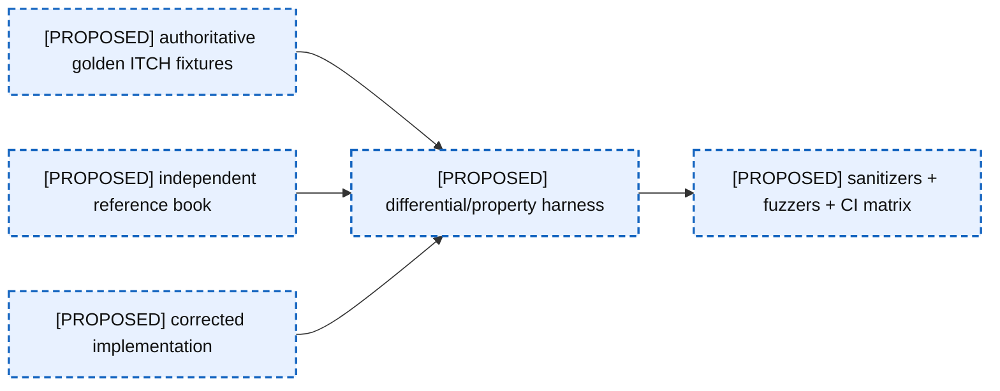

```mermaid
flowchart LR
    I["[PROPOSED] checked mapping + structured frame outcomes"]:::proposed
    P["[PROPOSED] exact/domain-valid decoder + metadata"]:::proposed
    R["[PROPOSED] lifecycle-validating symbol router"]:::proposed
    B["[PROPOSED] lossless Price(4), explicit policies, atomic OrderBook mutation"]:::proposed
    E["[PROPOSED] typed errors/anomaly counters"]:::proposed
    I -->|DecodeOutcome + offset| P
    P -->|typed event + metadata| R
    R -->|validated mutation command| B
    B -->|success/failure invariant result| E
    classDef current fill:#eef7ee,stroke:#1b5e20,stroke-width:2px,color:#111;
    classDef debt fill:#fff4d6,stroke:#b26a00,stroke-width:2px,color:#111;
    classDef invalid fill:#ffe8e8,stroke:#b71c1c,stroke-width:3px,color:#111;
    classDef proposed fill:#e8f1ff,stroke:#1565c0,stroke-width:2px,stroke-dasharray: 6 4,color:#111;
    classDef research fill:#f3f3f3,stroke:#666,stroke-width:2px,stroke-dasharray: 2 4,color:#111;
    classDef context fill:#fafafa,stroke:#777,stroke-width:2px,stroke-dasharray: 2 4,color:#111;
```

```mermaid
flowchart LR
    M["[PROPOSED] source/build/platform/workload manifest"]:::proposed
    W["[PROPOSED] add/cancel/reduce/replace/sweep/replay portfolio"]:::proposed
    T["[PROPOSED] gated timer + sound statistics"]:::proposed
    A["[PROPOSED] raw samples/counters/profiles"]:::proposed
    D["[PROPOSED] qualified claims + canonical docs"]:::proposed
    M --> W
    W --> T
    T --> A
    A --> D
    classDef current fill:#eef7ee,stroke:#1b5e20,stroke-width:2px,color:#111;
    classDef debt fill:#fff4d6,stroke:#b26a00,stroke-width:2px,color:#111;
    classDef invalid fill:#ffe8e8,stroke:#b71c1c,stroke-width:3px,color:#111;
    classDef proposed fill:#e8f1ff,stroke:#1565c0,stroke-width:2px,stroke-dasharray: 6 4,color:#111;
    classDef research fill:#f3f3f3,stroke:#666,stroke-width:2px,stroke-dasharray: 2 4,color:#111;
    classDef context fill:#fafafa,stroke:#777,stroke-width:2px,stroke-dasharray: 2 4,color:#111;
```

```mermaid
flowchart LR
    C["[DEBT] current implementation"]:::debt
    S0["[PROPOSED] preserve/classify evidence"]:::proposed
    S1["[PROPOSED] specify semantics + independent oracle"]:::proposed
    S2["[PROPOSED] transactional/runtime corrections"]:::proposed
    S3["[PROPOSED] protocol + measurement rebuild"]:::proposed
    L["[RESEARCH] later COR-09/BEN-08..10/DOC-04/FUT work"]:::research
    C -.-> S0
    S0 --> S1
    S1 --> S2
    S2 --> S3
    S3 -.->|only after acceptance| L
    classDef current fill:#eef7ee,stroke:#1b5e20,stroke-width:2px,color:#111;
    classDef debt fill:#fff4d6,stroke:#b26a00,stroke-width:2px,color:#111;
    classDef invalid fill:#ffe8e8,stroke:#b71c1c,stroke-width:3px,color:#111;
    classDef proposed fill:#e8f1ff,stroke:#1565c0,stroke-width:2px,stroke-dasharray: 6 4,color:#111;
    classDef research fill:#f3f3f3,stroke:#666,stroke-width:2px,stroke-dasharray: 2 4,color:#111;
    classDef context fill:#fafafa,stroke:#777,stroke-width:2px,stroke-dasharray: 2 4,color:#111;
```

# 12 — Near-Term Corrected Architecture

This chapter is a **PROPOSED** baseline, not a description of merged code. Near-term means COR-01–08, PRO-01–06, VER-01–06, BEN-01–07, DOC-01–03, and INF-01–03. COR-09, BEN-08–10, DOC-04, and FUT-01–07 remain later work or research.

### A12-01 — Corrected runtime baseline

| Diagram card field | Value |
|---|---|
| Purpose and scope | Define the proposed corrected runtime baseline and the evidence required before it can be relabeled CURRENT. |
| Evidence/status | PROPOSED backlog architecture only. |
| Source evidence | [orderbook.hpp](../../include/orderbook.hpp), [orderbook.cpp](../../src/orderbook.cpp), [price_level.hpp](../../include/price_level.hpp), [price_level.cpp](../../src/price_level.cpp), [object_pool.hpp](../../include/object_pool.hpp), [order.hpp](../../include/order.hpp) |
| Backlog | [COR-01](../../ENGINEERING_BACKLOG.md#cor-01--establish-a-lossless-price-domain-model), [COR-02](../../ENGINEERING_BACKLOG.md#cor-02--define-order-id-uniqueness-and-namespace-policy), [COR-03](../../ENGINEERING_BACKLOG.md#cor-03--define-zero-quantity-lifecycle-semantics), [COR-04](../../ENGINEERING_BACKLOG.md#cor-04--separate-reduce-and-quantity-increase-priority-semantics), [COR-05](../../ENGINEERING_BACKLOG.md#cor-05--harden-numeric-and-construction-boundaries), [COR-06](../../ENGINEERING_BACKLOG.md#cor-06--define-mutation-exception-safety-guarantees), [COR-07](../../ENGINEERING_BACKLOG.md#cor-07--define-capacity-and-growth-policy), [COR-08](../../ENGINEERING_BACKLOG.md#cor-08--separate-reconstruction-and-matching-semantics), [PRO-01](../../ENGINEERING_BACKLOG.md#pro-01--introduce-structured-framing-and-decode-outcomes), [PRO-02](../../ENGINEERING_BACKLOG.md#pro-02--validate-session-and-order-lifecycle-integrity), [PRO-03](../../ENGINEERING_BACKLOG.md#pro-03--evaluate-stock-locate-based-symbol-routing), [PRO-04](../../ENGINEERING_BACKLOG.md#pro-04--define-message-count-and-throughput-semantics), [PRO-05](../../ENGINEERING_BACKLOG.md#pro-05--preserve-diagnostic-feed-metadata), [PRO-06](../../ENGINEERING_BACKLOG.md#pro-06--specify-portable-file-mapping-and-prefault-behavior), [VER-01](../../ENGINEERING_BACKLOG.md#ver-01--build-protocol-golden-fixtures), [VER-02](../../ENGINEERING_BACKLOG.md#ver-02--build-a-reference-book-and-differential-invariant-harness), [VER-03](../../ENGINEERING_BACKLOG.md#ver-03--replace-the-invalid-allocation-check-with-a-trustworthy-methodology), [VER-04](../../ENGINEERING_BACKLOG.md#ver-04--repair-workload-lifecycle-accounting), [VER-05](../../ENGINEERING_BACKLOG.md#ver-05--add-sanitizer-fuzzing-and-boundary-verification-strategy), [VER-06](../../ENGINEERING_BACKLOG.md#ver-06--establish-artifact-and-replay-provenance), [BEN-01](../../ENGINEERING_BACKLOG.md#ben-01--make-build-and-benchmark-provenance-reproducible), [BEN-02](../../ENGINEERING_BACKLOG.md#ben-02--produce-a-complete-allocation-map-of-each-hot-operation), [BEN-03](../../ENGINEERING_BACKLOG.md#ben-03--replace-the-add-only-headline-with-a-workload-portfolio), [BEN-04](../../ENGINEERING_BACKLOG.md#ben-04--redesign-latency-statistics-and-timer-overhead-treatment), [BEN-05](../../ENGINEERING_BACKLOG.md#ben-05--verify-cpu-affinity-tsc-capability-and-platform-gating), [BEN-06](../../ENGINEERING_BACKLOG.md#ben-06--separate-workload-generation-from-profiled-book-operations), [BEN-07](../../ENGINEERING_BACKLOG.md#ben-07--reinvestigate-latency-tails-with-correlated-evidence), [DOC-01](../../ENGINEERING_BACKLOG.md#doc-01--reconcile-architecture-and-evidence-documentation), [DOC-02](../../ENGINEERING_BACKLOG.md#doc-02--align-language-standard-and-platform-claims), [DOC-03](../../ENGINEERING_BACKLOG.md#doc-03--define-performance-claim-vocabulary), [INF-01](../../ENGINEERING_BACKLOG.md#inf-01--establish-a-compiler-and-verification-ci-matrix), [INF-02](../../ENGINEERING_BACKLOG.md#inf-02--modernize-target-scoped-cmake-behavior), [INF-03](../../ENGINEERING_BACKLOG.md#inf-03--define-generated-artifact-lifecycle) |
| Findings | [HEL-001](11-current-technical-debt-overlay.md#hel-001), [HEL-002](11-current-technical-debt-overlay.md#hel-002), [HEL-003](11-current-technical-debt-overlay.md#hel-003), [HEL-004](11-current-technical-debt-overlay.md#hel-004), [HEL-005](11-current-technical-debt-overlay.md#hel-005), [HEL-011](11-current-technical-debt-overlay.md#hel-011), [HEL-012](11-current-technical-debt-overlay.md#hel-012), [HEL-021](11-current-technical-debt-overlay.md#hel-021), [HEL-037](11-current-technical-debt-overlay.md#hel-037), [HEL-048](11-current-technical-debt-overlay.md#hel-048) |
| Related atlas material | — |

- **Important edges**
  - I -->|DecodeOutcome + offset| P
  - P -->|typed event + metadata| R
  - R -->|validated mutation command| B
  - B -->|success/failure invariant result| E
- **What exists:** The backlog and reusable templates exist as planning evidence.
- **What does not exist:** None of the blue components is implemented merely by documenting it here.

### A12-02 — Verification pipeline

| Diagram card field | Value |
|---|---|
| Purpose and scope | Define the proposed verification pipeline and the evidence required before it can be relabeled CURRENT. |
| Evidence/status | PROPOSED backlog architecture only. |
| Source evidence | [orderbook.hpp](../../include/orderbook.hpp), [orderbook.cpp](../../src/orderbook.cpp), [price_level.hpp](../../include/price_level.hpp), [price_level.cpp](../../src/price_level.cpp), [object_pool.hpp](../../include/object_pool.hpp), [order.hpp](../../include/order.hpp) |
| Backlog | [COR-01](../../ENGINEERING_BACKLOG.md#cor-01--establish-a-lossless-price-domain-model), [COR-02](../../ENGINEERING_BACKLOG.md#cor-02--define-order-id-uniqueness-and-namespace-policy), [COR-03](../../ENGINEERING_BACKLOG.md#cor-03--define-zero-quantity-lifecycle-semantics), [COR-04](../../ENGINEERING_BACKLOG.md#cor-04--separate-reduce-and-quantity-increase-priority-semantics), [COR-05](../../ENGINEERING_BACKLOG.md#cor-05--harden-numeric-and-construction-boundaries), [COR-06](../../ENGINEERING_BACKLOG.md#cor-06--define-mutation-exception-safety-guarantees), [COR-07](../../ENGINEERING_BACKLOG.md#cor-07--define-capacity-and-growth-policy), [COR-08](../../ENGINEERING_BACKLOG.md#cor-08--separate-reconstruction-and-matching-semantics), [PRO-01](../../ENGINEERING_BACKLOG.md#pro-01--introduce-structured-framing-and-decode-outcomes), [PRO-02](../../ENGINEERING_BACKLOG.md#pro-02--validate-session-and-order-lifecycle-integrity), [PRO-03](../../ENGINEERING_BACKLOG.md#pro-03--evaluate-stock-locate-based-symbol-routing), [PRO-04](../../ENGINEERING_BACKLOG.md#pro-04--define-message-count-and-throughput-semantics), [PRO-05](../../ENGINEERING_BACKLOG.md#pro-05--preserve-diagnostic-feed-metadata), [PRO-06](../../ENGINEERING_BACKLOG.md#pro-06--specify-portable-file-mapping-and-prefault-behavior), [VER-01](../../ENGINEERING_BACKLOG.md#ver-01--build-protocol-golden-fixtures), [VER-02](../../ENGINEERING_BACKLOG.md#ver-02--build-a-reference-book-and-differential-invariant-harness), [VER-03](../../ENGINEERING_BACKLOG.md#ver-03--replace-the-invalid-allocation-check-with-a-trustworthy-methodology), [VER-04](../../ENGINEERING_BACKLOG.md#ver-04--repair-workload-lifecycle-accounting), [VER-05](../../ENGINEERING_BACKLOG.md#ver-05--add-sanitizer-fuzzing-and-boundary-verification-strategy), [VER-06](../../ENGINEERING_BACKLOG.md#ver-06--establish-artifact-and-replay-provenance), [BEN-01](../../ENGINEERING_BACKLOG.md#ben-01--make-build-and-benchmark-provenance-reproducible), [BEN-02](../../ENGINEERING_BACKLOG.md#ben-02--produce-a-complete-allocation-map-of-each-hot-operation), [BEN-03](../../ENGINEERING_BACKLOG.md#ben-03--replace-the-add-only-headline-with-a-workload-portfolio), [BEN-04](../../ENGINEERING_BACKLOG.md#ben-04--redesign-latency-statistics-and-timer-overhead-treatment), [BEN-05](../../ENGINEERING_BACKLOG.md#ben-05--verify-cpu-affinity-tsc-capability-and-platform-gating), [BEN-06](../../ENGINEERING_BACKLOG.md#ben-06--separate-workload-generation-from-profiled-book-operations), [BEN-07](../../ENGINEERING_BACKLOG.md#ben-07--reinvestigate-latency-tails-with-correlated-evidence), [DOC-01](../../ENGINEERING_BACKLOG.md#doc-01--reconcile-architecture-and-evidence-documentation), [DOC-02](../../ENGINEERING_BACKLOG.md#doc-02--align-language-standard-and-platform-claims), [DOC-03](../../ENGINEERING_BACKLOG.md#doc-03--define-performance-claim-vocabulary), [INF-01](../../ENGINEERING_BACKLOG.md#inf-01--establish-a-compiler-and-verification-ci-matrix), [INF-02](../../ENGINEERING_BACKLOG.md#inf-02--modernize-target-scoped-cmake-behavior), [INF-03](../../ENGINEERING_BACKLOG.md#inf-03--define-generated-artifact-lifecycle) |
| Findings | [HEL-001](11-current-technical-debt-overlay.md#hel-001), [HEL-002](11-current-technical-debt-overlay.md#hel-002), [HEL-003](11-current-technical-debt-overlay.md#hel-003), [HEL-004](11-current-technical-debt-overlay.md#hel-004), [HEL-005](11-current-technical-debt-overlay.md#hel-005), [HEL-011](11-current-technical-debt-overlay.md#hel-011), [HEL-012](11-current-technical-debt-overlay.md#hel-012), [HEL-021](11-current-technical-debt-overlay.md#hel-021), [HEL-037](11-current-technical-debt-overlay.md#hel-037), [HEL-048](11-current-technical-debt-overlay.md#hel-048) |
| Related atlas material | — |

- **Important edges**
  - G --> D
  - O --> D
  - C --> D
  - D --> S
- **What exists:** The backlog and reusable templates exist as planning evidence.
- **What does not exist:** None of the blue components is implemented merely by documenting it here.

### A12-03 — Benchmark and evidence pipeline

| Diagram card field | Value |
|---|---|
| Purpose and scope | Define the proposed benchmark and evidence pipeline and the evidence required before it can be relabeled CURRENT. |
| Evidence/status | PROPOSED backlog architecture only. |
| Source evidence | [orderbook.hpp](../../include/orderbook.hpp), [orderbook.cpp](../../src/orderbook.cpp), [price_level.hpp](../../include/price_level.hpp), [price_level.cpp](../../src/price_level.cpp), [object_pool.hpp](../../include/object_pool.hpp), [order.hpp](../../include/order.hpp) |
| Backlog | [COR-01](../../ENGINEERING_BACKLOG.md#cor-01--establish-a-lossless-price-domain-model), [COR-02](../../ENGINEERING_BACKLOG.md#cor-02--define-order-id-uniqueness-and-namespace-policy), [COR-03](../../ENGINEERING_BACKLOG.md#cor-03--define-zero-quantity-lifecycle-semantics), [COR-04](../../ENGINEERING_BACKLOG.md#cor-04--separate-reduce-and-quantity-increase-priority-semantics), [COR-05](../../ENGINEERING_BACKLOG.md#cor-05--harden-numeric-and-construction-boundaries), [COR-06](../../ENGINEERING_BACKLOG.md#cor-06--define-mutation-exception-safety-guarantees), [COR-07](../../ENGINEERING_BACKLOG.md#cor-07--define-capacity-and-growth-policy), [COR-08](../../ENGINEERING_BACKLOG.md#cor-08--separate-reconstruction-and-matching-semantics), [PRO-01](../../ENGINEERING_BACKLOG.md#pro-01--introduce-structured-framing-and-decode-outcomes), [PRO-02](../../ENGINEERING_BACKLOG.md#pro-02--validate-session-and-order-lifecycle-integrity), [PRO-03](../../ENGINEERING_BACKLOG.md#pro-03--evaluate-stock-locate-based-symbol-routing), [PRO-04](../../ENGINEERING_BACKLOG.md#pro-04--define-message-count-and-throughput-semantics), [PRO-05](../../ENGINEERING_BACKLOG.md#pro-05--preserve-diagnostic-feed-metadata), [PRO-06](../../ENGINEERING_BACKLOG.md#pro-06--specify-portable-file-mapping-and-prefault-behavior), [VER-01](../../ENGINEERING_BACKLOG.md#ver-01--build-protocol-golden-fixtures), [VER-02](../../ENGINEERING_BACKLOG.md#ver-02--build-a-reference-book-and-differential-invariant-harness), [VER-03](../../ENGINEERING_BACKLOG.md#ver-03--replace-the-invalid-allocation-check-with-a-trustworthy-methodology), [VER-04](../../ENGINEERING_BACKLOG.md#ver-04--repair-workload-lifecycle-accounting), [VER-05](../../ENGINEERING_BACKLOG.md#ver-05--add-sanitizer-fuzzing-and-boundary-verification-strategy), [VER-06](../../ENGINEERING_BACKLOG.md#ver-06--establish-artifact-and-replay-provenance), [BEN-01](../../ENGINEERING_BACKLOG.md#ben-01--make-build-and-benchmark-provenance-reproducible), [BEN-02](../../ENGINEERING_BACKLOG.md#ben-02--produce-a-complete-allocation-map-of-each-hot-operation), [BEN-03](../../ENGINEERING_BACKLOG.md#ben-03--replace-the-add-only-headline-with-a-workload-portfolio), [BEN-04](../../ENGINEERING_BACKLOG.md#ben-04--redesign-latency-statistics-and-timer-overhead-treatment), [BEN-05](../../ENGINEERING_BACKLOG.md#ben-05--verify-cpu-affinity-tsc-capability-and-platform-gating), [BEN-06](../../ENGINEERING_BACKLOG.md#ben-06--separate-workload-generation-from-profiled-book-operations), [BEN-07](../../ENGINEERING_BACKLOG.md#ben-07--reinvestigate-latency-tails-with-correlated-evidence), [DOC-01](../../ENGINEERING_BACKLOG.md#doc-01--reconcile-architecture-and-evidence-documentation), [DOC-02](../../ENGINEERING_BACKLOG.md#doc-02--align-language-standard-and-platform-claims), [DOC-03](../../ENGINEERING_BACKLOG.md#doc-03--define-performance-claim-vocabulary), [INF-01](../../ENGINEERING_BACKLOG.md#inf-01--establish-a-compiler-and-verification-ci-matrix), [INF-02](../../ENGINEERING_BACKLOG.md#inf-02--modernize-target-scoped-cmake-behavior), [INF-03](../../ENGINEERING_BACKLOG.md#inf-03--define-generated-artifact-lifecycle) |
| Findings | [HEL-001](11-current-technical-debt-overlay.md#hel-001), [HEL-002](11-current-technical-debt-overlay.md#hel-002), [HEL-003](11-current-technical-debt-overlay.md#hel-003), [HEL-004](11-current-technical-debt-overlay.md#hel-004), [HEL-005](11-current-technical-debt-overlay.md#hel-005), [HEL-011](11-current-technical-debt-overlay.md#hel-011), [HEL-012](11-current-technical-debt-overlay.md#hel-012), [HEL-021](11-current-technical-debt-overlay.md#hel-021), [HEL-037](11-current-technical-debt-overlay.md#hel-037), [HEL-048](11-current-technical-debt-overlay.md#hel-048) |
| Related atlas material | — |

- **Important edges**
  - M --> W
  - W --> T
  - T --> A
  - A --> D
- **What exists:** The backlog and reusable templates exist as planning evidence.
- **What does not exist:** None of the blue components is implemented merely by documenting it here.

### A12-04 — Current-to-corrected migration

| Diagram card field | Value |
|---|---|
| Purpose and scope | Define the proposed current-to-corrected migration and the evidence required before it can be relabeled CURRENT. |
| Evidence/status | PROPOSED backlog architecture only. |
| Source evidence | [orderbook.hpp](../../include/orderbook.hpp), [orderbook.cpp](../../src/orderbook.cpp), [price_level.hpp](../../include/price_level.hpp), [price_level.cpp](../../src/price_level.cpp), [object_pool.hpp](../../include/object_pool.hpp), [order.hpp](../../include/order.hpp) |
| Backlog | [COR-01](../../ENGINEERING_BACKLOG.md#cor-01--establish-a-lossless-price-domain-model), [COR-02](../../ENGINEERING_BACKLOG.md#cor-02--define-order-id-uniqueness-and-namespace-policy), [COR-03](../../ENGINEERING_BACKLOG.md#cor-03--define-zero-quantity-lifecycle-semantics), [COR-04](../../ENGINEERING_BACKLOG.md#cor-04--separate-reduce-and-quantity-increase-priority-semantics), [COR-05](../../ENGINEERING_BACKLOG.md#cor-05--harden-numeric-and-construction-boundaries), [COR-06](../../ENGINEERING_BACKLOG.md#cor-06--define-mutation-exception-safety-guarantees), [COR-07](../../ENGINEERING_BACKLOG.md#cor-07--define-capacity-and-growth-policy), [COR-08](../../ENGINEERING_BACKLOG.md#cor-08--separate-reconstruction-and-matching-semantics), [PRO-01](../../ENGINEERING_BACKLOG.md#pro-01--introduce-structured-framing-and-decode-outcomes), [PRO-02](../../ENGINEERING_BACKLOG.md#pro-02--validate-session-and-order-lifecycle-integrity), [PRO-03](../../ENGINEERING_BACKLOG.md#pro-03--evaluate-stock-locate-based-symbol-routing), [PRO-04](../../ENGINEERING_BACKLOG.md#pro-04--define-message-count-and-throughput-semantics), [PRO-05](../../ENGINEERING_BACKLOG.md#pro-05--preserve-diagnostic-feed-metadata), [PRO-06](../../ENGINEERING_BACKLOG.md#pro-06--specify-portable-file-mapping-and-prefault-behavior), [VER-01](../../ENGINEERING_BACKLOG.md#ver-01--build-protocol-golden-fixtures), [VER-02](../../ENGINEERING_BACKLOG.md#ver-02--build-a-reference-book-and-differential-invariant-harness), [VER-03](../../ENGINEERING_BACKLOG.md#ver-03--replace-the-invalid-allocation-check-with-a-trustworthy-methodology), [VER-04](../../ENGINEERING_BACKLOG.md#ver-04--repair-workload-lifecycle-accounting), [VER-05](../../ENGINEERING_BACKLOG.md#ver-05--add-sanitizer-fuzzing-and-boundary-verification-strategy), [VER-06](../../ENGINEERING_BACKLOG.md#ver-06--establish-artifact-and-replay-provenance), [BEN-01](../../ENGINEERING_BACKLOG.md#ben-01--make-build-and-benchmark-provenance-reproducible), [BEN-02](../../ENGINEERING_BACKLOG.md#ben-02--produce-a-complete-allocation-map-of-each-hot-operation), [BEN-03](../../ENGINEERING_BACKLOG.md#ben-03--replace-the-add-only-headline-with-a-workload-portfolio), [BEN-04](../../ENGINEERING_BACKLOG.md#ben-04--redesign-latency-statistics-and-timer-overhead-treatment), [BEN-05](../../ENGINEERING_BACKLOG.md#ben-05--verify-cpu-affinity-tsc-capability-and-platform-gating), [BEN-06](../../ENGINEERING_BACKLOG.md#ben-06--separate-workload-generation-from-profiled-book-operations), [BEN-07](../../ENGINEERING_BACKLOG.md#ben-07--reinvestigate-latency-tails-with-correlated-evidence), [DOC-01](../../ENGINEERING_BACKLOG.md#doc-01--reconcile-architecture-and-evidence-documentation), [DOC-02](../../ENGINEERING_BACKLOG.md#doc-02--align-language-standard-and-platform-claims), [DOC-03](../../ENGINEERING_BACKLOG.md#doc-03--define-performance-claim-vocabulary), [INF-01](../../ENGINEERING_BACKLOG.md#inf-01--establish-a-compiler-and-verification-ci-matrix), [INF-02](../../ENGINEERING_BACKLOG.md#inf-02--modernize-target-scoped-cmake-behavior), [INF-03](../../ENGINEERING_BACKLOG.md#inf-03--define-generated-artifact-lifecycle) |
| Findings | [HEL-001](11-current-technical-debt-overlay.md#hel-001), [HEL-002](11-current-technical-debt-overlay.md#hel-002), [HEL-003](11-current-technical-debt-overlay.md#hel-003), [HEL-004](11-current-technical-debt-overlay.md#hel-004), [HEL-005](11-current-technical-debt-overlay.md#hel-005), [HEL-011](11-current-technical-debt-overlay.md#hel-011), [HEL-012](11-current-technical-debt-overlay.md#hel-012), [HEL-021](11-current-technical-debt-overlay.md#hel-021), [HEL-037](11-current-technical-debt-overlay.md#hel-037), [HEL-048](11-current-technical-debt-overlay.md#hel-048) |
| Related atlas material | — |

- **Important edges**
  - C -.-> S0
  - S0 --> S1
  - S1 --> S2
  - S2 --> S3
  - S3 -.->|only after acceptance| L
- **What exists:** The backlog and reusable templates exist as planning evidence.
- **What does not exist:** None of the blue components is implemented merely by documenting it here.

## Promotion gates

| Proposed capability | Required proof before CURRENT | Journal template |
|---|---|---|
| Lossless typed Price(4) | exhaustive boundary/golden/differential tests; explicit display conversion | [ADR](../../ENGINEERING_BACKLOG.md#adr-template) |
| Lifecycle and priority policies | adversarial generated sequences and invariant projection | [Verification](../../ENGINEERING_BACKLOG.md#verification-template) |
| Structured parser outcomes | exact fixtures for success/unsupported/malformed/truncated/terminator/system failure | [ADR](../../ENGINEERING_BACKLOG.md#adr-template) |
| Atomic mutation boundary | failure injection at pool/hash/queue transitions with rollback checks | [Investigation](../../ENGINEERING_BACKLOG.md#investigation-template) |
| Benchmark manifests | source revision, dirty status, compile/link commands, binary hash, platform, workload, raw data | [Benchmark](../../ENGINEERING_BACKLOG.md#benchmark-template) |
| Target-scoped builds/CI | compiler/platform/configuration matrix plus optional tooling dependencies | [Infrastructure](../../ENGINEERING_BACKLOG.md#infrastructure-template) |

Engineering-journal files are planned, not present. Example paths such as `docs/engineering-journal/01-correctness/01-ITCH-Price-Representation.md` are intentionally non-clickable.
