```mermaid
flowchart LR
    IN["[PROPOSED] decoded instrument event"]:::proposed
    R["[PROPOSED] One book per symbol router/owner"]:::proposed
    B["[PROPOSED] One book per symbol state"]:::proposed
    PUB["[CONTEXT — NOT IMPLEMENTED] normalized publication"]:::context
    IN -->|instrument identity + sequence| R
    R -->|single-owner dispatch| B
    B -.->|snapshot/delta only| PUB
    classDef current fill:#eef7ee,stroke:#1b5e20,stroke-width:2px,color:#111;
    classDef debt fill:#fff4d6,stroke:#b26a00,stroke-width:2px,color:#111;
    classDef invalid fill:#ffe8e8,stroke:#b71c1c,stroke-width:3px,color:#111;
    classDef proposed fill:#e8f1ff,stroke:#1565c0,stroke-width:2px,stroke-dasharray: 6 4,color:#111;
    classDef research fill:#f3f3f3,stroke:#666,stroke-width:2px,stroke-dasharray: 2 4,color:#111;
    classDef context fill:#fafafa,stroke:#777,stroke-width:2px,stroke-dasharray: 2 4,color:#111;
```

```mermaid
flowchart LR
    IN["[PROPOSED] decoded instrument event"]:::proposed
    R["[PROPOSED] Single-writer multi-instrument shards router/owner"]:::proposed
    B["[PROPOSED] Single-writer multi-instrument shards state"]:::proposed
    PUB["[CONTEXT — NOT IMPLEMENTED] normalized publication"]:::context
    IN -->|instrument identity + sequence| R
    R -->|single-owner dispatch| B
    B -.->|snapshot/delta only| PUB
    classDef current fill:#eef7ee,stroke:#1b5e20,stroke-width:2px,color:#111;
    classDef debt fill:#fff4d6,stroke:#b26a00,stroke-width:2px,color:#111;
    classDef invalid fill:#ffe8e8,stroke:#b71c1c,stroke-width:3px,color:#111;
    classDef proposed fill:#e8f1ff,stroke:#1565c0,stroke-width:2px,stroke-dasharray: 6 4,color:#111;
    classDef research fill:#f3f3f3,stroke:#666,stroke-width:2px,stroke-dasharray: 2 4,color:#111;
    classDef context fill:#fafafa,stroke:#777,stroke-width:2px,stroke-dasharray: 2 4,color:#111;
```

```mermaid
flowchart LR
    IN["[PROPOSED] decoded instrument event"]:::proposed
    R["[PROPOSED] Dense ladders only for active instruments router/owner"]:::proposed
    B["[PROPOSED] Dense ladders only for active instruments state"]:::proposed
    PUB["[CONTEXT — NOT IMPLEMENTED] normalized publication"]:::context
    IN -->|instrument identity + sequence| R
    R -->|single-owner dispatch| B
    B -.->|snapshot/delta only| PUB
    classDef current fill:#eef7ee,stroke:#1b5e20,stroke-width:2px,color:#111;
    classDef debt fill:#fff4d6,stroke:#b26a00,stroke-width:2px,color:#111;
    classDef invalid fill:#ffe8e8,stroke:#b71c1c,stroke-width:3px,color:#111;
    classDef proposed fill:#e8f1ff,stroke:#1565c0,stroke-width:2px,stroke-dasharray: 6 4,color:#111;
    classDef research fill:#f3f3f3,stroke:#666,stroke-width:2px,stroke-dasharray: 2 4,color:#111;
    classDef context fill:#fafafa,stroke:#777,stroke-width:2px,stroke-dasharray: 2 4,color:#111;
```

```mermaid
flowchart LR
    IN["[PROPOSED] decoded instrument event"]:::proposed
    R["[PROPOSED] Segmented or sparse ladders router/owner"]:::proposed
    B["[PROPOSED] Segmented or sparse ladders state"]:::proposed
    PUB["[CONTEXT — NOT IMPLEMENTED] normalized publication"]:::context
    IN -->|instrument identity + sequence| R
    R -->|single-owner dispatch| B
    B -.->|snapshot/delta only| PUB
    classDef current fill:#eef7ee,stroke:#1b5e20,stroke-width:2px,color:#111;
    classDef debt fill:#fff4d6,stroke:#b26a00,stroke-width:2px,color:#111;
    classDef invalid fill:#ffe8e8,stroke:#b71c1c,stroke-width:3px,color:#111;
    classDef proposed fill:#e8f1ff,stroke:#1565c0,stroke-width:2px,stroke-dasharray: 6 4,color:#111;
    classDef research fill:#f3f3f3,stroke:#666,stroke-width:2px,stroke-dasharray: 2 4,color:#111;
    classDef context fill:#fafafa,stroke:#777,stroke-width:2px,stroke-dasharray: 2 4,color:#111;
```

# 13 — Multi-Symbol Evolution

These are alternatives, not a single roadmap. Each requires the corrected price/lifecycle/evidence baseline first.

### A13-01 — One book per symbol

| Diagram card field | Value |
|---|---|
| Purpose and scope | Evaluate one book per symbol as an independent multi-symbol ownership alternative. |
| Evidence/status | PROPOSED/RESEARCH; not implemented. |
| Source evidence | [orderbook.hpp](../../include/orderbook.hpp), [book_replay.hpp](../../include/book_replay.hpp), [13-production-redesign.md](../../docs/helios-study-guide/13-production-redesign.md) |
| Backlog | [COR-01](../../ENGINEERING_BACKLOG.md#cor-01--establish-a-lossless-price-domain-model), [PRO-02](../../ENGINEERING_BACKLOG.md#pro-02--validate-session-and-order-lifecycle-integrity), [PRO-03](../../ENGINEERING_BACKLOG.md#pro-03--evaluate-stock-locate-based-symbol-routing), [FUT-02](../../ENGINEERING_BACKLOG.md#fut-02--design-multi-symbol-single-writer-sharding), [FUT-04](../../ENGINEERING_BACKLOG.md#fut-04--evaluate-segmented-or-compressed-price-ladders) |
| Findings | [HEL-024](11-current-technical-debt-overlay.md#hel-024), [HEL-036](11-current-technical-debt-overlay.md#hel-036), [HEL-037](11-current-technical-debt-overlay.md#hel-037), [HEL-042](11-current-technical-debt-overlay.md#hel-042) |
| Related atlas material | — |

- **Important edges**
  - Ownership: a symbol-directory router owns a map of symbol → independently owned book.
  - Routing/concurrency: single writer can route sequentially; cross-book concurrency is external.
  - Publication remains outside the mutation owner.
- **What exists:** The current single-book/single-writer research core can inform the one book per symbol alternative.
- **What does not exist:** The routing, multi-instrument ownership, isolation, and publication required by one book per symbol are absent.

| Dimension | Analysis |
|---|---|
| Ownership and routing | a symbol-directory router owns a map of symbol → independently owned book |
| Memory | memory scales with full ladder/pool per configured symbol |
| Concurrency | single writer can route sequentially; cross-book concurrency is external |
| Failure isolation | book-level failure isolation, except shared router/process |
| Latency | Must be measured end-to-end; likely tradeoff follows routing/allocation shape, not asserted here. |
| Operational complexity | simple reasoning, potentially prohibitive eager memory |
| Assumption | few symbols or compact books |
| Justification | cleanest reference architecture and verification boundary |

### A13-02 — One book per stock locate

| Diagram card field | Value |
|---|---|
| Purpose and scope | Evaluate one book per stock locate as an independent multi-symbol ownership alternative. |
| Evidence/status | PROPOSED/RESEARCH; not implemented. |
| Source evidence | [orderbook.hpp](../../include/orderbook.hpp), [book_replay.hpp](../../include/book_replay.hpp), [13-production-redesign.md](../../docs/helios-study-guide/13-production-redesign.md) |
| Backlog | [COR-01](../../ENGINEERING_BACKLOG.md#cor-01--establish-a-lossless-price-domain-model), [PRO-02](../../ENGINEERING_BACKLOG.md#pro-02--validate-session-and-order-lifecycle-integrity), [PRO-03](../../ENGINEERING_BACKLOG.md#pro-03--evaluate-stock-locate-based-symbol-routing), [FUT-02](../../ENGINEERING_BACKLOG.md#fut-02--design-multi-symbol-single-writer-sharding), [FUT-04](../../ENGINEERING_BACKLOG.md#fut-04--evaluate-segmented-or-compressed-price-ladders) |
| Findings | [HEL-024](11-current-technical-debt-overlay.md#hel-024), [HEL-036](11-current-technical-debt-overlay.md#hel-036), [HEL-037](11-current-technical-debt-overlay.md#hel-037), [HEL-042](11-current-technical-debt-overlay.md#hel-042) |
| Related atlas material | — |

- **Important edges**
  - Ownership: session directory maps daily locate → independently owned book.
  - Routing/concurrency: single session writer routes O(1) after directory event.
  - Publication remains outside the mutation owner.
- **What exists:** The current single-book/single-writer research core can inform the one book per stock locate alternative.
- **What does not exist:** The routing, multi-instrument ownership, isolation, and publication required by one book per stock locate are absent.

| Dimension | Analysis |
|---|---|
| Ownership and routing | session directory maps daily locate → independently owned book |
| Memory | dense locate table plus book footprints; locate IDs reset by session |
| Concurrency | single session writer routes O(1) after directory event |
| Failure isolation | unknown/reused locate is a session anomaly |
| Latency | Must be measured end-to-end; likely tradeoff follows routing/allocation shape, not asserted here. |
| Operational complexity | excellent protocol-native routing; daily lifecycle complexity |
| Assumption | directory messages are modeled and session lifecycle is validated |
| Justification | removes raw-symbol comparison from ordinary lifecycle routing |

### A13-03 — Single-writer multi-instrument shards

| Diagram card field | Value |
|---|---|
| Purpose and scope | Evaluate single-writer multi-instrument shards as an independent multi-symbol ownership alternative. |
| Evidence/status | PROPOSED/RESEARCH; not implemented. |
| Source evidence | [orderbook.hpp](../../include/orderbook.hpp), [book_replay.hpp](../../include/book_replay.hpp), [13-production-redesign.md](../../docs/helios-study-guide/13-production-redesign.md) |
| Backlog | [COR-01](../../ENGINEERING_BACKLOG.md#cor-01--establish-a-lossless-price-domain-model), [PRO-02](../../ENGINEERING_BACKLOG.md#pro-02--validate-session-and-order-lifecycle-integrity), [PRO-03](../../ENGINEERING_BACKLOG.md#pro-03--evaluate-stock-locate-based-symbol-routing), [FUT-02](../../ENGINEERING_BACKLOG.md#fut-02--design-multi-symbol-single-writer-sharding), [FUT-04](../../ENGINEERING_BACKLOG.md#fut-04--evaluate-segmented-or-compressed-price-ladders) |
| Findings | [HEL-024](11-current-technical-debt-overlay.md#hel-024), [HEL-036](11-current-technical-debt-overlay.md#hel-036), [HEL-037](11-current-technical-debt-overlay.md#hel-037), [HEL-042](11-current-technical-debt-overlay.md#hel-042) |
| Related atlas material | — |

- **Important edges**
  - Ownership: router hashes/ranges instruments to shard queues; one owner thread per shard.
  - Routing/concurrency: no shared book mutation; ordering preserved per instrument inside a shard.
  - Publication remains outside the mutation owner.
- **What exists:** The current single-book/single-writer research core can inform the single-writer multi-instrument shards alternative.
- **What does not exist:** The routing, multi-instrument ownership, isolation, and publication required by single-writer multi-instrument shards are absent.

| Dimension | Analysis |
|---|---|
| Ownership and routing | router hashes/ranges instruments to shard queues; one owner thread per shard |
| Memory | partitioned books plus ingress queues and publication buffers |
| Concurrency | no shared book mutation; ordering preserved per instrument inside a shard |
| Failure isolation | thread/process shard can isolate instruments but requires recovery policy |
| Latency | Must be measured end-to-end; likely tradeoff follows routing/allocation shape, not asserted here. |
| Operational complexity | operationally highest of near alternatives |
| Assumption | sequencing, bounded buffering, snapshots, and per-shard capacity exist |
| Justification | scales ownership without locks in the book core |

### A13-04 — Dense ladders only for active instruments

| Diagram card field | Value |
|---|---|
| Purpose and scope | Evaluate dense ladders only for active instruments as an independent multi-symbol ownership alternative. |
| Evidence/status | PROPOSED/RESEARCH; not implemented. |
| Source evidence | [orderbook.hpp](../../include/orderbook.hpp), [book_replay.hpp](../../include/book_replay.hpp), [13-production-redesign.md](../../docs/helios-study-guide/13-production-redesign.md) |
| Backlog | [COR-01](../../ENGINEERING_BACKLOG.md#cor-01--establish-a-lossless-price-domain-model), [PRO-02](../../ENGINEERING_BACKLOG.md#pro-02--validate-session-and-order-lifecycle-integrity), [PRO-03](../../ENGINEERING_BACKLOG.md#pro-03--evaluate-stock-locate-based-symbol-routing), [FUT-02](../../ENGINEERING_BACKLOG.md#fut-02--design-multi-symbol-single-writer-sharding), [FUT-04](../../ENGINEERING_BACKLOG.md#fut-04--evaluate-segmented-or-compressed-price-ladders) |
| Findings | [HEL-024](11-current-technical-debt-overlay.md#hel-024), [HEL-036](11-current-technical-debt-overlay.md#hel-036), [HEL-037](11-current-technical-debt-overlay.md#hel-037), [HEL-042](11-current-technical-debt-overlay.md#hel-042) |
| Related atlas material | — |

- **Important edges**
  - Ownership: directory creates dense book lazily and retires under explicit policy.
  - Routing/concurrency: single writer remains straightforward; lifecycle around activation matters.
  - Publication remains outside the mutation owner.
- **What exists:** The current single-book/single-writer research core can inform the dense ladders only for active instruments alternative.
- **What does not exist:** The routing, multi-instrument ownership, isolation, and publication required by dense ladders only for active instruments are absent.

| Dimension | Analysis |
|---|---|
| Ownership and routing | directory creates dense book lazily and retires under explicit policy |
| Memory | pays dense footprint only for active set; churn allocates |
| Concurrency | single writer remains straightforward; lifecycle around activation matters |
| Failure isolation | allocation failure affects activating instrument |
| Latency | Must be measured end-to-end; likely tradeoff follows routing/allocation shape, not asserted here. |
| Operational complexity | moderate; needs eviction/session semantics |
| Assumption | active universe is small/stable enough and creation is outside critical bursts |
| Justification | retains direct-index performance for selected liquid instruments |

### A13-05 — Segmented or sparse ladders

| Diagram card field | Value |
|---|---|
| Purpose and scope | Evaluate segmented or sparse ladders as an independent multi-symbol ownership alternative. |
| Evidence/status | PROPOSED/RESEARCH; not implemented. |
| Source evidence | [orderbook.hpp](../../include/orderbook.hpp), [book_replay.hpp](../../include/book_replay.hpp), [13-production-redesign.md](../../docs/helios-study-guide/13-production-redesign.md) |
| Backlog | [COR-01](../../ENGINEERING_BACKLOG.md#cor-01--establish-a-lossless-price-domain-model), [PRO-02](../../ENGINEERING_BACKLOG.md#pro-02--validate-session-and-order-lifecycle-integrity), [PRO-03](../../ENGINEERING_BACKLOG.md#pro-03--evaluate-stock-locate-based-symbol-routing), [FUT-02](../../ENGINEERING_BACKLOG.md#fut-02--design-multi-symbol-single-writer-sharding), [FUT-04](../../ENGINEERING_BACKLOG.md#fut-04--evaluate-segmented-or-compressed-price-ladders) |
| Findings | [HEL-024](11-current-technical-debt-overlay.md#hel-024), [HEL-036](11-current-technical-debt-overlay.md#hel-036), [HEL-037](11-current-technical-debt-overlay.md#hel-037), [HEL-042](11-current-technical-debt-overlay.md#hel-042) |
| Related atlas material | — |

- **Important edges**
  - Ownership: book owns allocated price segments or ordered sparse levels.
  - Routing/concurrency: single writer possible; shared segment allocators are avoided.
  - Publication remains outside the mutation owner.
- **What exists:** The current single-book/single-writer research core can inform the segmented or sparse ladders alternative.
- **What does not exist:** The routing, multi-instrument ownership, isolation, and publication required by segmented or sparse ladders are absent.

| Dimension | Analysis |
|---|---|
| Ownership and routing | book owns allocated price segments or ordered sparse levels |
| Memory | footprint follows touched ranges; pointer/metadata overhead returns |
| Concurrency | single writer possible; shared segment allocators are avoided |
| Failure isolation | segment failure can be scoped to one book |
| Latency | Must be measured end-to-end; likely tradeoff follows routing/allocation shape, not asserted here. |
| Operational complexity | higher algorithmic and verification complexity |
| Assumption | price dispersion makes dense range waste dominant |
| Justification | candidate only after controlled FUT-04 benchmark disproves dense design |
