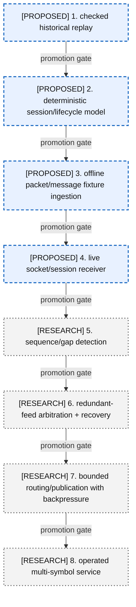
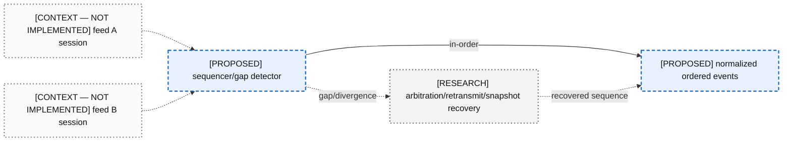
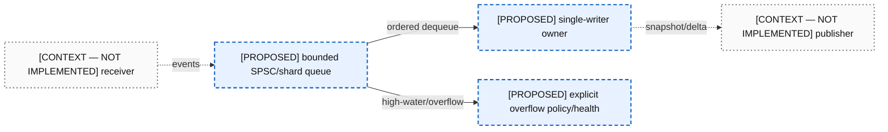

# 14 — Live Market-Data Evolution

All live components are outside the current book core. Kernel bypass is optional transport research only after correctness, recovery, and observability.

### A14-01 — Eight-stage live maturity ladder

| Diagram card field | Value |
|---|---|
| Purpose and scope | Sequence live-feed ambition behind correctness, session, recovery, and operational gates. |
| Evidence/status | PROPOSED stages 1–4; later stages are RESEARCH. |
| Source evidence | [itch_parser.hpp](../../include/itch_parser.hpp), [book_replay.hpp](../../include/book_replay.hpp), [13-production-redesign.md](../../docs/helios-study-guide/13-production-redesign.md) |
| Backlog | [PRO-01](../../ENGINEERING_BACKLOG.md#pro-01--introduce-structured-framing-and-decode-outcomes), [PRO-02](../../ENGINEERING_BACKLOG.md#pro-02--validate-session-and-order-lifecycle-integrity), [PRO-06](../../ENGINEERING_BACKLOG.md#pro-06--specify-portable-file-mapping-and-prefault-behavior), [FUT-02](../../ENGINEERING_BACKLOG.md#fut-02--design-multi-symbol-single-writer-sharding), [FUT-06](../../ENGINEERING_BACKLOG.md#fut-06--design-real-time-ingestion-boundaries) |
| Findings | [HEL-026](11-current-technical-debt-overlay.md#hel-026), [HEL-037](11-current-technical-debt-overlay.md#hel-037), [HEL-042](11-current-technical-debt-overlay.md#hel-042) |
| Related atlas material | — |

- **Important edges**
  - Every stage requires verification evidence from the previous one.
  - Networking does not enter the current core directly.
- **What exists:** Only the historical decoder and single-writer book concepts inform the eight-stage live maturity ladder view today.
- **What does not exist:** The live/recovery/publication components in the eight-stage live maturity ladder view are not implemented.

### A14-02 — Sequencing, redundancy, and recovery

| Diagram card field | Value |
|---|---|
| Purpose and scope | Keep sequencing, redundancy, and recovery outside the book mutation core with explicit ownership/failure edges. |
| Evidence/status | PROPOSED/RESEARCH/CONTEXT only. |
| Source evidence | [13-production-redesign.md](../../docs/helios-study-guide/13-production-redesign.md), [orderbook.hpp](../../include/orderbook.hpp) |
| Backlog | [PRO-02](../../ENGINEERING_BACKLOG.md#pro-02--validate-session-and-order-lifecycle-integrity), [PRO-05](../../ENGINEERING_BACKLOG.md#pro-05--preserve-diagnostic-feed-metadata), [FUT-02](../../ENGINEERING_BACKLOG.md#fut-02--design-multi-symbol-single-writer-sharding), [FUT-06](../../ENGINEERING_BACKLOG.md#fut-06--design-real-time-ingestion-boundaries) |
| Findings | [HEL-037](11-current-technical-debt-overlay.md#hel-037), [HEL-038](11-current-technical-debt-overlay.md#hel-038), [HEL-042](11-current-technical-debt-overlay.md#hel-042) |
| Related atlas material | — |

- **Important edges**
  - A -.-> S
  - B -.-> S
  - S -->|in-order| N
  - S -.->|gap/divergence| R
  - R -.->|recovered sequence| N
- **What exists:** Only the historical decoder and single-writer book concepts inform the sequencing, redundancy, and recovery view today.
- **What does not exist:** The live/recovery/publication components in the sequencing, redundancy, and recovery view are not implemented.

### A14-03 — Buffering and backpressure

| Diagram card field | Value |
|---|---|
| Purpose and scope | Keep buffering and backpressure outside the book mutation core with explicit ownership/failure edges. |
| Evidence/status | PROPOSED/RESEARCH/CONTEXT only. |
| Source evidence | [13-production-redesign.md](../../docs/helios-study-guide/13-production-redesign.md), [orderbook.hpp](../../include/orderbook.hpp) |
| Backlog | [PRO-02](../../ENGINEERING_BACKLOG.md#pro-02--validate-session-and-order-lifecycle-integrity), [PRO-05](../../ENGINEERING_BACKLOG.md#pro-05--preserve-diagnostic-feed-metadata), [FUT-02](../../ENGINEERING_BACKLOG.md#fut-02--design-multi-symbol-single-writer-sharding), [FUT-06](../../ENGINEERING_BACKLOG.md#fut-06--design-real-time-ingestion-boundaries) |
| Findings | [HEL-037](11-current-technical-debt-overlay.md#hel-037), [HEL-038](11-current-technical-debt-overlay.md#hel-038), [HEL-042](11-current-technical-debt-overlay.md#hel-042) |
| Related atlas material | — |

- **Important edges**
  - RX -.->|events| Q
  - Q -->|ordered dequeue| O
  - O -.->|snapshot/delta| P
  - Q -->|high-water/overflow| F
- **What exists:** Only the historical decoder and single-writer book concepts inform the buffering and backpressure view today.
- **What does not exist:** The live/recovery/publication components in the buffering and backpressure view are not implemented.

### A14-04 — Normalized publication boundary

| Diagram card field | Value |
|---|---|
| Purpose and scope | Keep normalized publication boundary outside the book mutation core with explicit ownership/failure edges. |
| Evidence/status | PROPOSED/RESEARCH/CONTEXT only. |
| Source evidence | [13-production-redesign.md](../../docs/helios-study-guide/13-production-redesign.md), [orderbook.hpp](../../include/orderbook.hpp) |
| Backlog | [PRO-02](../../ENGINEERING_BACKLOG.md#pro-02--validate-session-and-order-lifecycle-integrity), [PRO-05](../../ENGINEERING_BACKLOG.md#pro-05--preserve-diagnostic-feed-metadata), [FUT-02](../../ENGINEERING_BACKLOG.md#fut-02--design-multi-symbol-single-writer-sharding), [FUT-06](../../ENGINEERING_BACKLOG.md#fut-06--design-real-time-ingestion-boundaries) |
| Findings | [HEL-037](11-current-technical-debt-overlay.md#hel-037), [HEL-038](11-current-technical-debt-overlay.md#hel-038), [HEL-042](11-current-technical-debt-overlay.md#hel-042) |
| Related atlas material | — |

- **Important edges**
  - N --> B
  - B --> S
  - S -.-> C
  - K -.->|optional receiver optimization after proof| N
- **What exists:** Only the historical decoder and single-writer book concepts inform the normalized publication boundary view today.
- **What does not exist:** The live/recovery/publication components in the normalized publication boundary view are not implemented.
