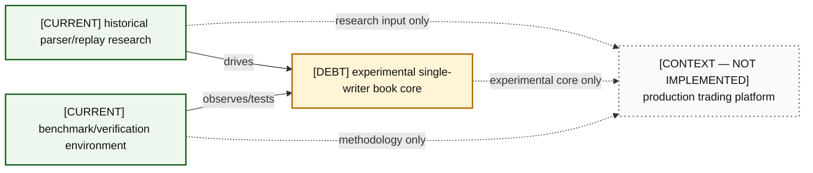

```mermaid
flowchart LR
    F["[CONTEXT — NOT IMPLEMENTED] redundant market-data feeds"]:::context
    N["[CONTEXT — NOT IMPLEMENTED] session/normalize/recovery"]:::context
    R["[CONTEXT — NOT IMPLEMENTED] instrument routing"]:::context
    B["[CONTEXT — NOT IMPLEMENTED] production books/publication"]:::context
    S["[CONTEXT — NOT IMPLEMENTED] strategies"]:::context
    K["[CONTEXT — NOT IMPLEMENTED] pre-trade risk"]:::context
    SOR["[CONTEXT — NOT IMPLEMENTED] SOR where applicable"]:::context
    G["[CONTEXT — NOT IMPLEMENTED] venue gateways"]:::context
    OMS["[CONTEXT — NOT IMPLEMENTED] OMS/order state"]:::context
    ER["[CONTEXT — NOT IMPLEMENTED] execution reports/drop copy"]:::context
    T["[CONTEXT — NOT IMPLEMENTED] telemetry/control plane"]:::context
    RR["[CONTEXT — NOT IMPLEMENTED] replay/research"]:::context
    H1["[CURRENT] Helios: historical parser/replay research"]:::current
    H2["[DEBT] Helios: experimental single-writer book core"]:::debt
    H3["[CURRENT] Helios: benchmark/verification environment"]:::current
    F -.->|packets/sessions| N
    N -.->|ordered normalized events| R
    R -.->|instrument events| B
    B -.->|market state| S
    S -.->|order intent| K
    K -.->|approved intent| SOR
    SOR -.->|venue choice| G
    G -.->|acks/fills| OMS
    ER -.->|independent executions| OMS
    OMS -.->|state/limits| K
    T -.->|configuration/health| N
    T -.->|configuration/health| G
    RR -.->|fixtures/scenarios| N
    H1 -.->|educational evidence only| RR
    H2 -.->|experimental comparison only| B
    H3 -.->|methodology only| RR
    classDef current fill:#eef7ee,stroke:#1b5e20,stroke-width:2px,color:#111;
    classDef debt fill:#fff4d6,stroke:#b26a00,stroke-width:2px,color:#111;
    classDef invalid fill:#ffe8e8,stroke:#b71c1c,stroke-width:3px,color:#111;
    classDef proposed fill:#e8f1ff,stroke:#1565c0,stroke-width:2px,stroke-dasharray: 6 4,color:#111;
    classDef research fill:#f3f3f3,stroke:#666,stroke-width:2px,stroke-dasharray: 2 4,color:#111;
    classDef context fill:#fafafa,stroke:#777,stroke-width:2px,stroke-dasharray: 2 4,color:#111;
```

# 15 — Production Trading-System Context

This is an educational platform context. It does not imply any proprietary firm architecture, deployment, or Helios implementation.

### A15-01 — Educational production platform context

| Diagram card field | Value |
|---|---|
| Purpose and scope | Explain a representative end-to-end trading-platform neighborhood and constrain Helios to three labeled roles. |
| Evidence/status | CONTEXT — NOT IMPLEMENTED except the three explicitly labeled Helios roles. |
| Source evidence | [README.md](../../README.md), [13-production-redesign.md](../../docs/helios-study-guide/13-production-redesign.md) |
| Backlog | [COR-08](../../ENGINEERING_BACKLOG.md#cor-08--separate-reconstruction-and-matching-semantics), [FUT-02](../../ENGINEERING_BACKLOG.md#fut-02--design-multi-symbol-single-writer-sharding), [FUT-06](../../ENGINEERING_BACKLOG.md#fut-06--design-real-time-ingestion-boundaries), [FUT-07](../../ENGINEERING_BACKLOG.md#fut-07--decide-whether-helios-will-ever-include-matching-engine-semantics) |
| Findings | [HEL-037](11-current-technical-debt-overlay.md#hel-037), [HEL-042](11-current-technical-debt-overlay.md#hel-042) |
| Related atlas material | — |

- **Important edges**
  - Normalization/recovery produces ordered events for routing and books.
  - Strategy intent passes risk before venue routing/gateways; reports reconcile OMS state.
  - Telemetry/control plane configures and observes; replay/research supplies offline scenarios.
  - All Helios-to-platform edges say educational, experimental, or methodology only.
- **What exists:** Helios has the three labeled research/experimental roles.
- **What does not exist:** Every other platform component and cross-system integration is context only.

### A15-02 — Helios role boundary

| Diagram card field | Value |
|---|---|
| Purpose and scope | Make the three legitimate Helios roles and their non-claims redrawable. |
| Evidence/status | Repository evidence for roles; surrounding systems are context. |
| Source evidence | [itch_parser.hpp](../../include/itch_parser.hpp), [book_replay.hpp](../../include/book_replay.hpp), [orderbook.hpp](../../include/orderbook.hpp), [benchmark_orderbook.cpp](../../benchmarks/benchmark_orderbook.cpp) |
| Backlog | [COR-08](../../ENGINEERING_BACKLOG.md#cor-08--separate-reconstruction-and-matching-semantics), [DOC-01](../../ENGINEERING_BACKLOG.md#doc-01--reconcile-architecture-and-evidence-documentation), [VER-01](../../ENGINEERING_BACKLOG.md#ver-01--build-protocol-golden-fixtures) |
| Findings | [HEL-011](11-current-technical-debt-overlay.md#hel-011), [HEL-042](11-current-technical-debt-overlay.md#hel-042) |
| Related atlas material | — |

- **Important edges**
  - The three Helios roles connect internally through real source paths.
  - Dotted platform edges explicitly deny production integration.
- **What exists:** Parser/replay research, book core, and benchmark/test environment.
- **What does not exist:** A production service, feed handler, trading stack, or deployment.

## Cross-system edge explanations

| Edge | Meaning and ownership boundary |
|---|---|
| Feeds → normalize/recovery | Session owners validate framing, sequence, duplicates, gaps, and redundancy before publication. |
| Normalize → routing → books | Ordered normalized events are routed by stable instrument identity; each book has one mutation owner. |
| Books → strategy | Consumers receive immutable snapshots/deltas, not mutable book pointers. |
| Strategy → risk → SOR/gateway | Intent becomes an order only after controls; SOR is optional and venue/business dependent. |
| Gateway/reports/drop copy → OMS | Acknowledgments and executions reconcile authoritative order state through explicit identifiers. |
| OMS → risk | Positions/open orders feed subsequent limits; this is not a book-core responsibility. |
| Telemetry/control → services | Operational state/configuration is separated from hot mutation ownership. |
| Replay/research → platform boundaries | Recorded/constructed scenarios validate components without claiming equivalence to live production. |
