# 16 — Capability Matrix

Controlled status values are: CURRENT, CURRENT-DEBT, INVALID, PROPOSED, RESEARCH, CONTEXT/NOT IMPLEMENTED, and OUT OF SCOPE.

### A16-01 — Capability status map

| Diagram card field | Value |
|---|---|
| Purpose and scope | Give a visual index from repository capability through correction and wider context. |
| Evidence/status | Mixed; every node carries its controlled status. |
| Source evidence | [README.md](../../README.md), [CMakeLists.txt](../../CMakeLists.txt) |
| Backlog | [COR-01](../../ENGINEERING_BACKLOG.md#cor-01--establish-a-lossless-price-domain-model), [VER-02](../../ENGINEERING_BACKLOG.md#ver-02--build-a-reference-book-and-differential-invariant-harness), [BEN-01](../../ENGINEERING_BACKLOG.md#ben-01--make-build-and-benchmark-provenance-reproducible), [FUT-02](../../ENGINEERING_BACKLOG.md#fut-02--design-multi-symbol-single-writer-sharding), [FUT-06](../../ENGINEERING_BACKLOG.md#fut-06--design-real-time-ingestion-boundaries) |
| Findings | [HEL-001](11-current-technical-debt-overlay.md#hel-001), [HEL-002](11-current-technical-debt-overlay.md#hel-002), [HEL-005](11-current-technical-debt-overlay.md#hel-005), [HEL-011](11-current-technical-debt-overlay.md#hel-011), [HEL-037](11-current-technical-debt-overlay.md#hel-037), [HEL-042](11-current-technical-debt-overlay.md#hel-042) |
| Related atlas material | — |

```mermaid
flowchart LR
    C["[CURRENT] core structures + historical tools"]:::current
    D["[DEBT] replay/measurement contracts"]:::debt
    I["[INVALID] Price(4)/duplicate/unsupported claims"]:::invalid
    P["[PROPOSED] corrected verified baseline"]:::proposed
    R["[RESEARCH] multi-symbol/live/alternative layouts"]:::research
    N["[CONTEXT — NOT IMPLEMENTED] production trading platform"]:::context
    O["[OUT OF SCOPE] proprietary architecture claim"]:::context
    C --> D
    D --> I
    I -.-> P
    P -.-> R
    R -.-> N
    N -.-> O
    classDef current fill:#eef7ee,stroke:#1b5e20,stroke-width:2px,color:#111;
    classDef debt fill:#fff4d6,stroke:#b26a00,stroke-width:2px,color:#111;
    classDef invalid fill:#ffe8e8,stroke:#b71c1c,stroke-width:3px,color:#111;
    classDef proposed fill:#e8f1ff,stroke:#1565c0,stroke-width:2px,stroke-dasharray: 6 4,color:#111;
    classDef research fill:#f3f3f3,stroke:#666,stroke-width:2px,stroke-dasharray: 2 4,color:#111;
    classDef context fill:#fafafa,stroke:#777,stroke-width:2px,stroke-dasharray: 2 4,color:#111;
```

- **Important edges**
  - Current mechanisms can coexist with invalid behavior; status is capability-specific.
  - Corrections and research remain dashed until evidence gates pass.
- **What exists:** Core book, parser/replay, benchmarks/tests, and artifacts exist.
- **What does not exist:** Corrected, multi-symbol, live, and production capabilities do not exist.

## Detailed matrix

| Capability | Status | Evidence | Present limitation | Backlog | Near-term target | Long-term possibility | Recruiting relevance |
|---|---|---|---|---|---|---|---|
| Integer domain types | CURRENT-DEBT | `include/types.hpp` | aliases permit unit ambiguity; decimal helper truncates | COR-01, COR-05 | lossless strong Price(4) policy | instrument-aware price type | High: fixed-point judgment |
| Intrusive FIFO levels | CURRENT-DEBT | `PriceLevel`, tests | priority increase policy undefined; internal membership not guarded | COR-04, VER-02 | verified mutation semantics | configurable venue semantics only if needed | Very High |
| Direct dense ladders | CURRENT-DEBT | `OrderBook` vectors | eager range footprint; range construction unsafe | COR-05, BEN-10 | safe configured domain | active/segmented/sparse alternatives | High |
| Occupancy bitmap/best caches | CURRENT-DEBT | bitmap code | word-scan tail unmeasured; invariant checker absent | BEN-09, VER-02 | verified cache/bitmap equivalence | hierarchical bitmap/alternative | High |
| Pooled stable order storage | CURRENT-DEBT | `ObjectPool<Order>` | growth cliffs; generic destruction contract | COR-07, BEN-02 | explicit capacity/allocation map | specialized pool/NUMA study | Very High |
| External-ID lookup | INVALID | `orders_[id]` | duplicate can orphan live order | COR-02 | reject/transactional uniqueness | measured index alternatives | Very High |
| Add/cancel/modify | CURRENT-DEBT | `src/orderbook.cpp` | zero quantity, priority, exception safety | COR-02–07 | atomic, typed, invariant-preserving APIs | richer semantics only by decision | Very High |
| Synthetic market sweep | CURRENT-DEBT | `executeMarketOrder` | reconstruction/matching boundary blurred | COR-03, COR-08 | explicitly separated API/model | matching scope decision | High |
| BinaryFILE framing | CURRENT-DEBT | `parseBuffer` | terminator/truncation/status conflated | PRO-01 | structured outcomes + offsets | live framing adapter | High |
| Modeled ITCH decoding | CURRENT-DEBT | `decode` A/F/E/C/X/D/U | minimum length/domain checks only | PRO-01, VER-01 | exact golden-verified decoding | more message families as justified | Very High |
| Lossless ITCH price replay | INVALID | `toCents` | Price(4) collisions | COR-01 | raw/strong Price(4) ticks | per-instrument tick metadata | Very High |
| Single-symbol filtering | CURRENT-DEBT | packed raw symbol | ignores stock-locate/session identity | PRO-03 | validated identity/router decision | per-locate/multi-symbol routing | High |
| Lifecycle/session validation | CONTEXT/NOT IMPLEMENTED | missing from replay | missing sequence/gap/terminator/anomaly model | PRO-02 | offline lifecycle validation | live session/recovery | Very High |
| Historical mmap ingestion | CURRENT-DEBT | replay executables | checks and prefault portability incomplete | PRO-06 | checked portable contract | separated live receiver | Medium |
| Parser-only CLI | CURRENT-DEBT | `itch_replay` target | argument/syscall checks incomplete | PRO-01, PRO-06 | robust exit/outcome model | fixture/debug tooling | Medium |
| Book replay CLI | CURRENT-DEBT | `itch_book_replay` | huge eager book, mixed counters/provenance | PRO-04, VER-06 | explicit metrics and manifest | research replay service | High |
| Core unit/stress tests | CURRENT-DEBT | registered `test_orderbook` | major subsystems and adversaries omitted | VER-02, VER-04 | independent oracle/property suite | continuous model checking/fuzzing | Very High |
| Golden protocol fixtures | PROPOSED | backlog only | none tracked | VER-01 | authoritative fixture set | shared conformance corpus | Very High |
| Sanitizer/fuzz/CI matrix | PROPOSED | backlog only | no CI | VER-05, INF-01 | compiler/config/sanitizer matrix | scheduled replay corpus | High |
| RDTSC benchmark | CURRENT-DEBT | benchmark + timer | platform gating/statistics/provenance flaws | BEN-01, BEN-04, BEN-05 | gated manifest-bound method | hardware-counter correlation | Very High |
| Workload portfolio | PROPOSED | backlog | headline add-only/growing state | BEN-03 | mixed steady-state operations | production-shaped trace portfolio | Very High |
| Profiling driver | CURRENT-DEBT | tracked but disconnected | generation/bookkeeping contaminates profile | BEN-06 | wired, isolated regions | counter/trace correlation | High |
| Evidence artifacts | CURRENT-DEBT | saved text/Markdown/SVG | mixed/stale provenance | VER-06, INF-03, DOC-01 | manifest and lifecycle | immutable experiment registry | High |
| Target-scoped build | PROPOSED | current global CMake contradicts it | mandatory GTest/global flags | INF-02 | target feature/options contracts | presets/toolchains/packageability | High |
| Multi-symbol ownership | RESEARCH | design only | one symbol/current huge dense footprint | FUT-02 | choose only after corrected baseline | sharded single-writer service | Very High |
| Live networking/recovery | CONTEXT/NOT IMPLEMENTED | no source | historical files only | FUT-06 | no near-term implementation before gates | sequenced redundant receiver | High if honestly scoped |
| Kernel bypass / FPGA | OUT OF SCOPE | explicit omission | no transport baseline to optimize | — | none | optional post-correctness research | Low now; strong only with evidence |
| Strategy/risk/OMS/routing | OUT OF SCOPE | explicit omission | not Helios’s purpose | — | none | educational integration boundary | Shows scope discipline |
| Production operation/monitoring | CONTEXT/NOT IMPLEMENTED | no source | no daemon/control/telemetry/recovery | FUT-06 | offline diagnostics first | operated service only after maturity | High if boundaries are clear |
