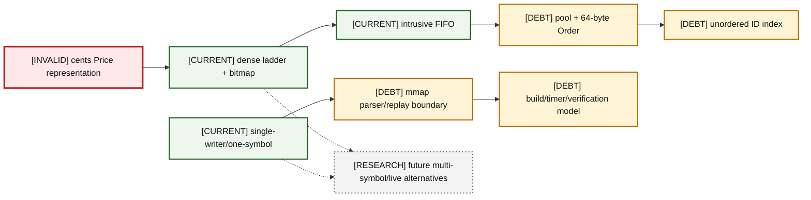

# 17 — Architecture Decision Index

Current choices are not automatically endorsed decisions. Each row records the benefit, cost, assumption, failure boundary, alternatives, reversibility, backlog, planned journal path, and an interview challenge. Journal paths are non-clickable because the files do not yet exist; reusable template links are live.

### A17-01 — Decision dependency map

| Diagram card field | Value |
|---|---|
| Purpose and scope | Show how domain and ownership choices constrain replay, measurement, and future scale. |
| Evidence/status | Repository-derived current decisions with debt. |
| Source evidence | [orderbook.hpp](../../include/orderbook.hpp), [orderbook.cpp](../../src/orderbook.cpp), [price_level.hpp](../../include/price_level.hpp), [price_level.cpp](../../src/price_level.cpp), [object_pool.hpp](../../include/object_pool.hpp), [order.hpp](../../include/order.hpp), [itch_parser.hpp](../../include/itch_parser.hpp), [book_replay.hpp](../../include/book_replay.hpp), [rdtsc_timer.hpp](../../include/rdtsc_timer.hpp), [CMakeLists.txt](../../CMakeLists.txt) |
| Backlog | [COR-01](../../ENGINEERING_BACKLOG.md#cor-01--establish-a-lossless-price-domain-model), [COR-02](../../ENGINEERING_BACKLOG.md#cor-02--define-order-id-uniqueness-and-namespace-policy), [COR-04](../../ENGINEERING_BACKLOG.md#cor-04--separate-reduce-and-quantity-increase-priority-semantics), [COR-07](../../ENGINEERING_BACKLOG.md#cor-07--define-capacity-and-growth-policy), [COR-08](../../ENGINEERING_BACKLOG.md#cor-08--separate-reconstruction-and-matching-semantics), [PRO-01](../../ENGINEERING_BACKLOG.md#pro-01--introduce-structured-framing-and-decode-outcomes), [BEN-01](../../ENGINEERING_BACKLOG.md#ben-01--make-build-and-benchmark-provenance-reproducible), [FUT-02](../../ENGINEERING_BACKLOG.md#fut-02--design-multi-symbol-single-writer-sharding), [FUT-04](../../ENGINEERING_BACKLOG.md#fut-04--evaluate-segmented-or-compressed-price-ladders), [FUT-06](../../ENGINEERING_BACKLOG.md#fut-06--design-real-time-ingestion-boundaries) |
| Findings | [HEL-001](11-current-technical-debt-overlay.md#hel-001), [HEL-002](11-current-technical-debt-overlay.md#hel-002), [HEL-004](11-current-technical-debt-overlay.md#hel-004), [HEL-005](11-current-technical-debt-overlay.md#hel-005), [HEL-035](11-current-technical-debt-overlay.md#hel-035), [HEL-042](11-current-technical-debt-overlay.md#hel-042) |
| Related atlas material | — |

- **Important edges**
  - Price domain constrains ladder indexing and reconstruction fidelity.
  - FIFO, pool, and index jointly form the multi-structure transaction.
  - Single-writer/one-symbol and historical boundaries constrain future routing and transport.
- **What exists:** The current decision mechanisms are visible in source.
- **What does not exist:** Research alternatives are undecided and unimplemented.

## Decision ledger

| Decision | Current choice | Benefit | Cost | Hidden assumption | Failure boundary | Alternatives | Reversibility | Backlog | Journal/template | Interview challenge |
|---|---|---|---|---|---|---|---|---|---|---|---|
| Price representation | integer cents in book; replay divides Price(4) | fast/direct index, no FP in state | lossy feed identity/range ceiling | cent ticks cover domain | parser→book conversion | raw Price(4), strong scaled type | high but data/API migration | [COR-01](../../ENGINEERING_BACKLOG.md#cor-01--establish-a-lossless-price-domain-model), [COR-05](../../ENGINEERING_BACKLOG.md#cor-05--harden-numeric-and-construction-boundaries) | `docs/engineering-journal/COR-01-price-representation.md` / [ADR template](../../ENGINEERING_BACKLOG.md#adr-template) | Counterexample with $1.0001/$1.0099 |
| Price ladder | dense vector per side | O(1) index/locality | large eager footprint/range coupling | bounded compact price domain | constructor/range/capacity | tree, segmented, sparse | medium | [COR-05](../../ENGINEERING_BACKLOG.md#cor-05--harden-numeric-and-construction-boundaries), [FUT-04](../../ENGINEERING_BACKLOG.md#fut-04--evaluate-segmented-or-compressed-price-ladders) | `docs/engineering-journal/COR-05-price-ladder.md` / [ADR template](../../ENGINEERING_BACKLOG.md#adr-template) | When does O(1) lose to footprint? |
| Occupancy bitmap | one bit per level + scans | fast cached-best refresh | scan tail and duplicate derived state | bitmap remains coherent | mutation invariant boundary | hierarchical bitmap/tree | medium | [BEN-09](../../ENGINEERING_BACKLOG.md#ben-09--measure-bitmap-refresh-complexity-and-alternatives), [VER-02](../../ENGINEERING_BACKLOG.md#ver-02--build-a-reference-book-and-differential-invariant-harness) | `docs/engineering-journal/BEN-09-occupancy-bitmap.md` / [BENCH template](../../ENGINEERING_BACKLOG.md#benchmark-template) | Prove best cache after last removal |
| FIFO | intrusive doubly linked Order links | O(1) append/unlink/no list node | couples Order layout/membership | one level membership; policy known | unlink/topology/priority | container nodes, index queue | medium | [COR-04](../../ENGINEERING_BACKLOG.md#cor-04--separate-reduce-and-quantity-increase-priority-semantics), [VER-02](../../ENGINEERING_BACKLOG.md#ver-02--build-a-reference-book-and-differential-invariant-harness) | `docs/engineering-journal/COR-04-fifo.md` / [ADR template](../../ENGINEERING_BACKLOG.md#adr-template) | Does quantity increase lose priority? |
| Object pool | chunked union slots/free list | stable addresses/reuse | growth cliffs/generic destructor flaw | T lifetime contract; spare capacity | construct/grow/destroy | PMR, fixed slab, arena | medium | [COR-07](../../ENGINEERING_BACKLOG.md#cor-07--define-capacity-and-growth-policy), [FUT-01](../../ENGINEERING_BACKLOG.md#fut-01--reassess-the-generic-objectpoolt-contract) | `docs/engineering-journal/COR-07-object-pool.md` / [ADR template](../../ENGINEERING_BACKLOG.md#adr-template) | What happens on live non-trivial teardown? |
| ID hash | std::unordered_map<ID,Order*> | average O(1), standard implementation | rehash/allocations/duplicate overwrite | IDs unique and reserve sufficient | identity transaction | flat/open-addressing/radix | high | [COR-02](../../ENGINEERING_BACKLOG.md#cor-02--define-order-id-uniqueness-and-namespace-policy), [BEN-08](../../ENGINEERING_BACKLOG.md#ben-08--reproduce-the-custom-hash-map-experiment), [FUT-03](../../ENGINEERING_BACKLOG.md#fut-03--evaluate-alternative-order-id-indexes) | `docs/engineering-journal/COR-02-id-hash.md` / [BENCH template](../../ENGINEERING_BACKLOG.md#benchmark-template) | Why was custom hashing slower? |
| Single writer | no locks inside book | deterministic ownership/simple invariants | no shared mutation scale | upstream serializes per book | API thread ownership | locks, actors, sharded writers | low for core | [FUT-02](../../ENGINEERING_BACKLOG.md#fut-02--design-multi-symbol-single-writer-sharding) | `docs/engineering-journal/FUT-02-single-writer.md` / [RFC template](../../ENGINEERING_BACKLOG.md#rfc-template) | Scale without locking the book |
| One symbol | BookReplay target symbol | small semantic surface | full file parsed; no instrument scale | raw symbol stable/adequate | routing/session identity | locate/per-symbol/shards | high | [PRO-03](../../ENGINEERING_BACKLOG.md#pro-03--evaluate-stock-locate-based-symbol-routing), [FUT-02](../../ENGINEERING_BACKLOG.md#fut-02--design-multi-symbol-single-writer-sharding) | `docs/engineering-journal/PRO-03-one-symbol.md` / [ADR template](../../ENGINEERING_BACKLOG.md#adr-template) | Why stock locate matters |
| mmap ingestion | MAP_PRIVATE historical scan | simple zero-copy-ish byte access | OS/page/check portability | regular nonempty file | syscall/mapping lifetime | read buffer/io_uring/socket | medium | [PRO-06](../../ENGINEERING_BACKLOG.md#pro-06--specify-portable-file-mapping-and-prefault-behavior), [FUT-06](../../ENGINEERING_BACKLOG.md#fut-06--design-real-time-ingestion-boundaries) | `docs/engineering-journal/PRO-06-mmap-ingestion.md` / [INV template](../../ENGINEERING_BACKLOG.md#investigation-template) | Separate page faults from parser cost |
| Symbol filter | packed eight raw bytes | single compact compare | copy/identity/session caveats | host byte representation irrelevant for equality | Add-only identity propagation | stock locate/directory | high | [PRO-03](../../ENGINEERING_BACKLOG.md#pro-03--evaluate-stock-locate-based-symbol-routing) | `docs/engineering-journal/PRO-03-symbol-filter.md` / [ADR template](../../ENGINEERING_BACKLOG.md#adr-template) | Optimization versus protocol-native key |
| Order alignment | alignas(64), sizeof 64 | one object starts per cache line | footprint/cache/TLB cost unisolated | false sharing/locality benefit | ABI/layout | natural/compact/hot-cold | high | [BEN-10](../../ENGINEERING_BACKLOG.md#ben-10--measure-compact-versus-cache-line-aligned-order-layouts), [FUT-05](../../ENGINEERING_BACKLOG.md#fut-05--investigate-prefetch-and-numa-behavior) | `docs/engineering-journal/BEN-10-order-alignment.md` / [BENCH template](../../ENGINEERING_BACKLOG.md#benchmark-template) | Evidence for a cache line per order |
| Parser/book boundary | Message callback then BookReplay | separates bytes from domain mutation | bool status/metadata loss | synchronous callback enough | decode outcome/lifetime | typed events/result stream | medium | [PRO-01](../../ENGINEERING_BACKLOG.md#pro-01--introduce-structured-framing-and-decode-outcomes), [PRO-05](../../ENGINEERING_BACKLOG.md#pro-05--preserve-diagnostic-feed-metadata) | `docs/engineering-journal/PRO-01-parserbook-boundary.md` / [ADR template](../../ENGINEERING_BACKLOG.md#adr-template) | Where should malformed input stop? |
| Callbacks | templated synchronous Fn | inlineable/no queue allocation | no structured flow control/lifetime extension | single-threaded immediate consumption | parse loop→consumer | iterator/range/event batch | medium | [PRO-01](../../ENGINEERING_BACKLOG.md#pro-01--introduce-structured-framing-and-decode-outcomes) | `docs/engineering-journal/PRO-01-callbacks.md` / [ADR template](../../ENGINEERING_BACKLOG.md#adr-template) | Backpressure is intentionally absent |
| Error model | bool/zero/silent skip/exit | small APIs | conflates causes/hides anomalies | happy-path experiment | each subsystem boundary | expected/result/error channel | medium | [PRO-01](../../ENGINEERING_BACKLOG.md#pro-01--introduce-structured-framing-and-decode-outcomes), [PRO-02](../../ENGINEERING_BACKLOG.md#pro-02--validate-session-and-order-lifecycle-integrity), [COR-06](../../ENGINEERING_BACKLOG.md#cor-06--define-mutation-exception-safety-guarantees) | `docs/engineering-journal/PRO-01-error-model.md` / [ADR template](../../ENGINEERING_BACKLOG.md#adr-template) | Enumerate every failure signal |
| Reconstruction vs matching | same book exposes replay and market sweep | reuse core structures | semantic claims blurred | rules compatible | public API/product scope | separate facades/engines | medium | [COR-08](../../ENGINEERING_BACKLOG.md#cor-08--separate-reconstruction-and-matching-semantics), [FUT-07](../../ENGINEERING_BACKLOG.md#fut-07--decide-whether-helios-will-ever-include-matching-engine-semantics) | `docs/engineering-journal/COR-08-reconstruction-vs-matching.md` / [ADR template](../../ENGINEERING_BACKLOG.md#adr-template) | Is Helios a matching engine? |
| Timer | calibrated RDTSC/RDTSCP + fallback | low overhead on supported x86 | gating/statistics/affinity gaps | invariant TSC/pinned stable core | platform capability | chrono/perf harness | high | [BEN-04](../../ENGINEERING_BACKLOG.md#ben-04--redesign-latency-statistics-and-timer-overhead-treatment), [BEN-05](../../ENGINEERING_BACKLOG.md#ben-05--verify-cpu-affinity-tsc-capability-and-platform-gating) | `docs/engineering-journal/BEN-04-timer.md` / [BENCH template](../../ENGINEERING_BACKLOG.md#benchmark-template) | Ticks are not CPU cycles |
| Build model | global flags + per-executable optimization | small CMake file | library flags/provenance/composability | one local configuration | target compile/link graph | target options/presets | high | [BEN-01](../../ENGINEERING_BACKLOG.md#ben-01--make-build-and-benchmark-provenance-reproducible), [INF-02](../../ENGINEERING_BACKLOG.md#inf-02--modernize-target-scoped-cmake-behavior) | `docs/engineering-journal/BEN-01-build-model.md` / [INFRA template](../../ENGINEERING_BACKLOG.md#infrastructure-template) | Why -O3 on executable misses library |
| Verification | one registered GoogleTest target | core regression smoke/stress | missing parser/replay/oracle; tautology | selected APIs imply internal integrity | test target/state visibility | differential/property/golden/fuzz | high | [VER-01](../../ENGINEERING_BACKLOG.md#ver-01--build-protocol-golden-fixtures), [VER-02](../../ENGINEERING_BACKLOG.md#ver-02--build-a-reference-book-and-differential-invariant-harness), [VER-05](../../ENGINEERING_BACKLOG.md#ver-05--add-sanitizer-fuzzing-and-boundary-verification-strategy) | `docs/engineering-journal/VER-01-verification.md` / [VER template](../../ENGINEERING_BACKLOG.md#verification-template) | Design an independent oracle |
| Capacity | pool/hash reserve + growth; huge replay book | simple startup/amortized operation | latency cliffs/eager footprint | memory available; growth acceptable | allocation/OS failure | fixed capacity/lazy/segmented | medium | [COR-07](../../ENGINEERING_BACKLOG.md#cor-07--define-capacity-and-growth-policy), [BEN-02](../../ENGINEERING_BACKLOG.md#ben-02--produce-a-complete-allocation-map-of-each-hot-operation), [BEN-10](../../ENGINEERING_BACKLOG.md#ben-10--measure-compact-versus-cache-line-aligned-order-layouts) | `docs/engineering-journal/COR-07-capacity.md` / [ADR template](../../ENGINEERING_BACKLOG.md#adr-template) | Name every allocation-capable path |
| Historical/live scope | historical BinaryFILE only | reproducible offline research | no session/recovery/network operations | offline results not live claims | system boundary | staged receiver/recovery | high | [PRO-02](../../ENGINEERING_BACKLOG.md#pro-02--validate-session-and-order-lifecycle-integrity), [FUT-06](../../ENGINEERING_BACKLOG.md#fut-06--design-real-time-ingestion-boundaries) | `docs/engineering-journal/PRO-02-historicallive-scope.md` / [RFC template](../../ENGINEERING_BACKLOG.md#rfc-template) | What must precede kernel bypass? |
