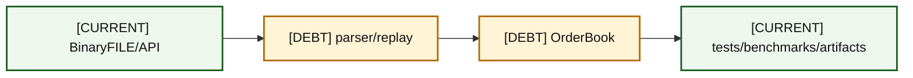
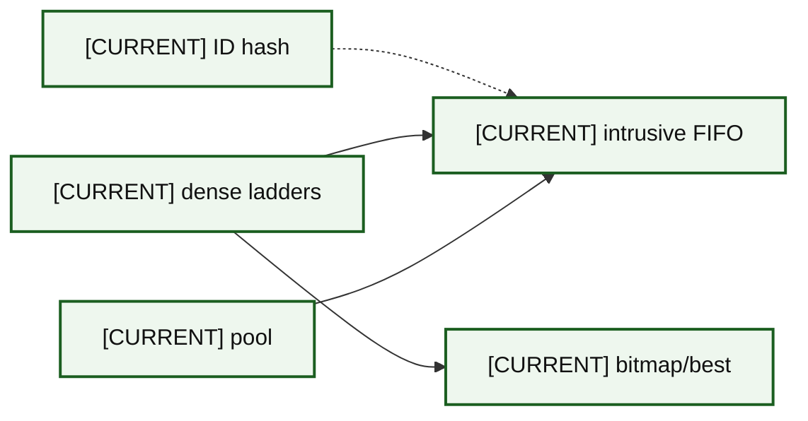
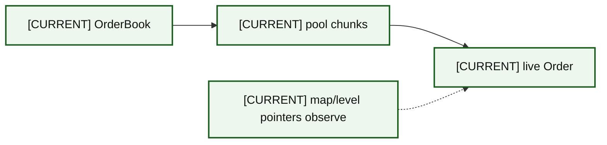
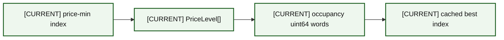
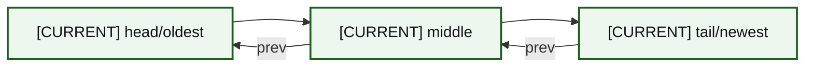
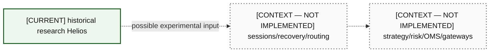
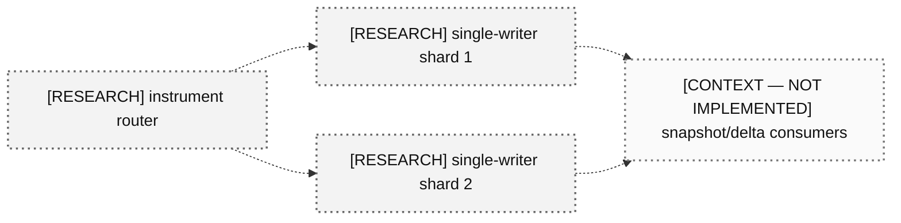

```mermaid
flowchart LR
    F["[CURRENT] framed bytes"]:::current
    D["[DEBT] decode bool"]:::debt
    S["[DEBT] symbol filter"]:::debt
    R["[INVALID] Price(4) / 100"]:::invalid
    B["[DEBT] lifecycle mutations"]:::debt
    F --> D
    D --> S
    S --> R
    R --> B
    classDef current fill:#eef7ee,stroke:#1b5e20,stroke-width:2px,color:#111;
    classDef debt fill:#fff4d6,stroke:#b26a00,stroke-width:2px,color:#111;
    classDef invalid fill:#ffe8e8,stroke:#b71c1c,stroke-width:3px,color:#111;
    classDef proposed fill:#e8f1ff,stroke:#1565c0,stroke-width:2px,stroke-dasharray: 6 4,color:#111;
    classDef research fill:#f3f3f3,stroke:#666,stroke-width:2px,stroke-dasharray: 2 4,color:#111;
    classDef context fill:#fafafa,stroke:#777,stroke-width:2px,stroke-dasharray: 2 4,color:#111;
```

```mermaid
flowchart LR
    M["[PROPOSED] manifest/platform gate"]:::proposed
    W["[PROPOSED] workload + warm-up"]:::proposed
    T["[PROPOSED] timed boundary"]:::proposed
    R["[PROPOSED] raw samples/statistics"]:::proposed
    C["[PROPOSED] narrow claim"]:::proposed
    M --> W
    W --> T
    T --> R
    R --> C
    classDef current fill:#eef7ee,stroke:#1b5e20,stroke-width:2px,color:#111;
    classDef debt fill:#fff4d6,stroke:#b26a00,stroke-width:2px,color:#111;
    classDef invalid fill:#ffe8e8,stroke:#b71c1c,stroke-width:3px,color:#111;
    classDef proposed fill:#e8f1ff,stroke:#1565c0,stroke-width:2px,stroke-dasharray: 6 4,color:#111;
    classDef research fill:#f3f3f3,stroke:#666,stroke-width:2px,stroke-dasharray: 2 4,color:#111;
    classDef context fill:#fafafa,stroke:#777,stroke-width:2px,stroke-dasharray: 2 4,color:#111;
```

# 18 — Interview Whiteboard Pack

Each board is deliberately small enough to redraw. Narration expands by adding invariants, failure cases, evidence, and alternatives—not by inventing production features.

### A18-01 — Whole system

| Diagram card field | Value |
|---|---|
| Purpose and scope | Provide a minimal, redrawable whole system interview board. |
| Evidence/status | CURRENT/DEBT where tracked; context/research explicitly marked. |
| Source evidence | [itch_parser.hpp](../../include/itch_parser.hpp), [book_replay.hpp](../../include/book_replay.hpp), [orderbook.hpp](../../include/orderbook.hpp) |
| Backlog | [DOC-01](../../ENGINEERING_BACKLOG.md#doc-01--reconcile-architecture-and-evidence-documentation), [COR-08](../../ENGINEERING_BACKLOG.md#cor-08--separate-reconstruction-and-matching-semantics), [COR-01](../../ENGINEERING_BACKLOG.md#cor-01--establish-a-lossless-price-domain-model), [BEN-01](../../ENGINEERING_BACKLOG.md#ben-01--make-build-and-benchmark-provenance-reproducible) |
| Findings | [HEL-001](11-current-technical-debt-overlay.md#hel-001), [HEL-005](11-current-technical-debt-overlay.md#hel-005), [HEL-042](11-current-technical-debt-overlay.md#hel-042) |
| Related atlas material | — |

- **Important edges**
  - F --> P
  - P --> B
  - B --> V
- **What exists:** The CURRENT/DEBT portions of the whole system board map to tracked code or evidence.
- **What does not exist:** Any PROPOSED, RESEARCH, or CONTEXT element on the whole system board remains unimplemented.

- **Drawing order:** input → decode/replay → book → evidence.
- **30 seconds:** Helios is an offline single-writer research system.
- **2 minutes:** Name parsing, filtering, structures, and current debt.
- **5 minutes:** Walk Add/cancel/replay, ownership, Price(4), and measurement boundaries.
- **15 minutes:** Defend choices, invalid claims, corrected baseline, and production exclusions.
- **Deliberate omission:** live platform internals.
- **Likely interruption:** “Is this production?”
- **Mistake to avoid:** drawing live feeds as current.

### A18-02 — Book internals

| Diagram card field | Value |
|---|---|
| Purpose and scope | Provide a minimal, redrawable book internals interview board. |
| Evidence/status | CURRENT/DEBT where tracked; context/research explicitly marked. |
| Source evidence | [orderbook.hpp](../../include/orderbook.hpp), [price_level.hpp](../../include/price_level.hpp), [object_pool.hpp](../../include/object_pool.hpp) |
| Backlog | [COR-02](../../ENGINEERING_BACKLOG.md#cor-02--define-order-id-uniqueness-and-namespace-policy), [VER-02](../../ENGINEERING_BACKLOG.md#ver-02--build-a-reference-book-and-differential-invariant-harness), [BEN-02](../../ENGINEERING_BACKLOG.md#ben-02--produce-a-complete-allocation-map-of-each-hot-operation) |
| Findings | [HEL-002](11-current-technical-debt-overlay.md#hel-002), [HEL-006](11-current-technical-debt-overlay.md#hel-006), [HEL-009](11-current-technical-debt-overlay.md#hel-009) |
| Related atlas material | — |

- **Important edges**
  - M -.-> Q
  - L --> Q
  - P --> Q
  - L --> B
- **What exists:** The CURRENT/DEBT portions of the book internals board map to tracked code or evidence.
- **What does not exist:** Any PROPOSED, RESEARCH, or CONTEXT element on the book internals board remains unimplemented.

- **Drawing order:** hash, two ladders, one queue, pool, bitmap.
- **30 seconds:** Four structures coordinate one live order.
- **2 minutes:** Explain owners versus observers and O(1)-average paths.
- **5 minutes:** Trace invariants and transaction windows.
- **15 minutes:** Compare alternatives and footprint/cache failure boundaries.
- **Deliberate omission:** parser and platform.
- **Likely interruption:** “Who owns Order?”
- **Mistake to avoid:** saying map owns Order.

### A18-03 — Add

| Diagram card field | Value |
|---|---|
| Purpose and scope | Provide a minimal, redrawable add interview board. |
| Evidence/status | CURRENT/DEBT where tracked; context/research explicitly marked. |
| Source evidence | [orderbook.cpp](../../src/orderbook.cpp), [object_pool.hpp](../../include/object_pool.hpp) |
| Backlog | [COR-02](../../ENGINEERING_BACKLOG.md#cor-02--define-order-id-uniqueness-and-namespace-policy), [COR-06](../../ENGINEERING_BACKLOG.md#cor-06--define-mutation-exception-safety-guarantees) |
| Findings | [HEL-002](11-current-technical-debt-overlay.md#hel-002), [HEL-021](11-current-technical-debt-overlay.md#hel-021) |
| Related atlas material | — |

- **Important edges**
  - A --> P
  - P --> M
  - M --> Q
  - Q --> B
- **What exists:** The CURRENT/DEBT portions of the add board map to tracked code or evidence.
- **What does not exist:** Any PROPOSED, RESEARCH, or CONTEXT element on the add board remains unimplemented.

- **Drawing order:** validate → acquire → index → append → derived state.
- **30 seconds:** Add is a multi-structure transaction.
- **2 minutes:** Show current ordering and fast path.
- **5 minutes:** Name duplicate and exception counterexamples.
- **15 minutes:** Describe atomic corrected commit/rollback and oracle tests.
- **Deliberate omission:** benchmark timing detail.
- **Likely interruption:** “What if hash insert throws?”
- **Mistake to avoid:** claiming exception safety.

### A18-04 — Cancel

| Diagram card field | Value |
|---|---|
| Purpose and scope | Provide a minimal, redrawable cancel interview board. |
| Evidence/status | CURRENT/DEBT where tracked; context/research explicitly marked. |
| Source evidence | [orderbook.cpp](../../src/orderbook.cpp), [price_level.cpp](../../src/price_level.cpp) |
| Backlog | [VER-02](../../ENGINEERING_BACKLOG.md#ver-02--build-a-reference-book-and-differential-invariant-harness), [BEN-09](../../ENGINEERING_BACKLOG.md#ben-09--measure-bitmap-refresh-complexity-and-alternatives) |
| Findings | [HEL-009](11-current-technical-debt-overlay.md#hel-009), [HEL-027](11-current-technical-debt-overlay.md#hel-027) |
| Related atlas material | — |

- **Important edges**
  - I --> Q
  - Q --> B
  - B --> M
  - M --> P
- **What exists:** The CURRENT/DEBT portions of the cancel board map to tracked code or evidence.
- **What does not exist:** Any PROPOSED, RESEARCH, or CONTEXT element on the cancel board remains unimplemented.

- **Drawing order:** lookup → unlink → derived state → erase → free.
- **30 seconds:** Cancel uses the ID index to remove in O(1) except best rescan.
- **2 minutes:** Explain middle unlink versus last-level branch.
- **5 minutes:** Prove membership/count/bitmap/cache invariants.
- **15 minutes:** Discuss scan tail, failure assumptions, and tests.
- **Deliberate omission:** protocol decode.
- **Likely interruption:** “Worst case?”
- **Mistake to avoid:** calling bitmap refresh always O(1).

### A18-05 — Replay

| Diagram card field | Value |
|---|---|
| Purpose and scope | Provide a minimal, redrawable replay interview board. |
| Evidence/status | CURRENT/DEBT where tracked; context/research explicitly marked. |
| Source evidence | [itch_parser.hpp](../../include/itch_parser.hpp), [book_replay.hpp](../../include/book_replay.hpp) |
| Backlog | [COR-01](../../ENGINEERING_BACKLOG.md#cor-01--establish-a-lossless-price-domain-model), [PRO-01](../../ENGINEERING_BACKLOG.md#pro-01--introduce-structured-framing-and-decode-outcomes), [PRO-02](../../ENGINEERING_BACKLOG.md#pro-02--validate-session-and-order-lifecycle-integrity) |
| Findings | [HEL-001](11-current-technical-debt-overlay.md#hel-001), [HEL-012](11-current-technical-debt-overlay.md#hel-012), [HEL-037](11-current-technical-debt-overlay.md#hel-037) |
| Related atlas material | — |

- **Important edges**
  - F --> D
  - D --> S
  - S --> R
  - R --> B
- **What exists:** The CURRENT/DEBT portions of the replay board map to tracked code or evidence.
- **What does not exist:** Any PROPOSED, RESEARCH, or CONTEXT element on the replay board remains unimplemented.

- **Drawing order:** frame → decode → filter → translate → mutate.
- **30 seconds:** Replay reconstructs one target symbol from historical order events.
- **2 minutes:** Name modeled types and ID-based follow-ups.
- **5 minutes:** Explain lossy price and missing lifecycle outcomes.
- **15 minutes:** Propose typed outcomes, locate routing, golden fixtures, and recovery boundary.
- **Deliberate omission:** synthetic matching details.
- **Likely interruption:** “Why not filter every message by symbol?”
- **Mistake to avoid:** calling final plausible state proof of correctness.

### A18-06 — Ownership

| Diagram card field | Value |
|---|---|
| Purpose and scope | Provide a minimal, redrawable ownership interview board. |
| Evidence/status | CURRENT/DEBT where tracked; context/research explicitly marked. |
| Source evidence | [object_pool.hpp](../../include/object_pool.hpp), [orderbook.hpp](../../include/orderbook.hpp) |
| Backlog | [COR-06](../../ENGINEERING_BACKLOG.md#cor-06--define-mutation-exception-safety-guarantees), [FUT-01](../../ENGINEERING_BACKLOG.md#fut-01--reassess-the-generic-objectpoolt-contract) |
| Findings | [HEL-013](11-current-technical-debt-overlay.md#hel-013), [HEL-021](11-current-technical-debt-overlay.md#hel-021) |
| Related atlas material | — |

- **Important edges**
  - B --> P
  - P --> O
  - M -.-> O
- **What exists:** The CURRENT/DEBT portions of the ownership board map to tracked code or evidence.
- **What does not exist:** Any PROPOSED, RESEARCH, or CONTEXT element on the ownership board remains unimplemented.

- **Drawing order:** book → pool → order; map/level dotted observation.
- **30 seconds:** Pool storage owns orders; indexes and queues hold raw observers.
- **2 minutes:** Explain placement construction/free list/stable address.
- **5 minutes:** Trace add/cancel/destruction exception windows.
- **15 minutes:** Discuss generic destructor debt and ownership-safe redesign.
- **Deliberate omission:** field offsets.
- **Likely interruption:** “Can pointers dangle?”
- **Mistake to avoid:** using arrows without ownership labels.

### A18-07 — Ladder and bitmap

| Diagram card field | Value |
|---|---|
| Purpose and scope | Provide a minimal, redrawable ladder and bitmap interview board. |
| Evidence/status | CURRENT/DEBT where tracked; context/research explicitly marked. |
| Source evidence | [orderbook.hpp](../../include/orderbook.hpp), [orderbook.cpp](../../src/orderbook.cpp) |
| Backlog | [BEN-09](../../ENGINEERING_BACKLOG.md#ben-09--measure-bitmap-refresh-complexity-and-alternatives), [BEN-10](../../ENGINEERING_BACKLOG.md#ben-10--measure-compact-versus-cache-line-aligned-order-layouts), [FUT-04](../../ENGINEERING_BACKLOG.md#fut-04--evaluate-segmented-or-compressed-price-ladders) |
| Findings | [HEL-017](11-current-technical-debt-overlay.md#hel-017), [HEL-027](11-current-technical-debt-overlay.md#hel-027), [HEL-036](11-current-technical-debt-overlay.md#hel-036) |
| Related atlas material | — |

- **Important edges**
  - P --> L
  - L --> W
  - W --> C
- **What exists:** The CURRENT/DEBT portions of the ladder and bitmap board map to tracked code or evidence.
- **What does not exist:** Any PROPOSED, RESEARCH, or CONTEXT element on the ladder and bitmap board remains unimplemented.

- **Drawing order:** price index → array → bit → cached best.
- **30 seconds:** Dense access is direct; bitmap finds next occupied best.
- **2 minutes:** Show bid highest/ask lowest and first/last transitions.
- **5 minutes:** Explain coherence invariant and word-scan cost.
- **15 minutes:** Compare hierarchical/sparse alternatives under measured workloads.
- **Deliberate omission:** hash index.
- **Likely interruption:** “Is it truly O(1)?”
- **Mistake to avoid:** ignoring configured price range.

### A18-08 — Intrusive FIFO

| Diagram card field | Value |
|---|---|
| Purpose and scope | Provide a minimal, redrawable intrusive fifo interview board. |
| Evidence/status | CURRENT/DEBT where tracked; context/research explicitly marked. |
| Source evidence | [order.hpp](../../include/order.hpp), [price_level.hpp](../../include/price_level.hpp), [price_level.cpp](../../src/price_level.cpp) |
| Backlog | [COR-04](../../ENGINEERING_BACKLOG.md#cor-04--separate-reduce-and-quantity-increase-priority-semantics), [VER-02](../../ENGINEERING_BACKLOG.md#ver-02--build-a-reference-book-and-differential-invariant-harness) |
| Findings | [HEL-004](11-current-technical-debt-overlay.md#hel-004), [HEL-009](11-current-technical-debt-overlay.md#hel-009) |
| Related atlas material | — |

- **Important edges**
  - H --> M
  - M --> T
  - T -->|prev| M
  - M -->|prev| H
- **What exists:** The CURRENT/DEBT portions of the intrusive fifo board map to tracked code or evidence.
- **What does not exist:** Any PROPOSED, RESEARCH, or CONTEXT element on the intrusive fifo board remains unimplemented.

- **Drawing order:** head ↔ middle ↔ tail.
- **30 seconds:** Orders carry queue links, removing separate nodes.
- **2 minutes:** Append at tail, execute head, unlink by pointer.
- **5 minutes:** Prove topology and aggregate/count preservation.
- **15 minutes:** Discuss quantity-increase priority and alternate containers.
- **Deliberate omission:** bitmaps.
- **Likely interruption:** “What if node belongs to two levels?”
- **Mistake to avoid:** saying intrusive implies ownership.

### A18-09 — Benchmark method

| Diagram card field | Value |
|---|---|
| Purpose and scope | Provide a minimal, redrawable benchmark method interview board. |
| Evidence/status | CURRENT/DEBT where tracked; context/research explicitly marked. |
| Source evidence | [benchmark_orderbook.cpp](../../benchmarks/benchmark_orderbook.cpp), [rdtsc_timer.hpp](../../include/rdtsc_timer.hpp), [CMakeLists.txt](../../CMakeLists.txt) |
| Backlog | [BEN-01](../../ENGINEERING_BACKLOG.md#ben-01--make-build-and-benchmark-provenance-reproducible), [BEN-03](../../ENGINEERING_BACKLOG.md#ben-03--replace-the-add-only-headline-with-a-workload-portfolio), [BEN-04](../../ENGINEERING_BACKLOG.md#ben-04--redesign-latency-statistics-and-timer-overhead-treatment), [BEN-05](../../ENGINEERING_BACKLOG.md#ben-05--verify-cpu-affinity-tsc-capability-and-platform-gating), [DOC-03](../../ENGINEERING_BACKLOG.md#doc-03--define-performance-claim-vocabulary) |
| Findings | [HEL-005](11-current-technical-debt-overlay.md#hel-005), [HEL-028](11-current-technical-debt-overlay.md#hel-028), [HEL-029](11-current-technical-debt-overlay.md#hel-029), [HEL-030](11-current-technical-debt-overlay.md#hel-030), [HEL-031](11-current-technical-debt-overlay.md#hel-031), [HEL-033](11-current-technical-debt-overlay.md#hel-033) |
| Related atlas material | — |

- **Important edges**
  - M --> W
  - W --> T
  - T --> R
  - R --> C
- **What exists:** The CURRENT/DEBT portions of the benchmark method board map to tracked code or evidence.
- **What does not exist:** Any PROPOSED, RESEARCH, or CONTEXT element on the benchmark method board remains unimplemented.

- **Drawing order:** manifest → workload → timing → raw data → claim.
- **30 seconds:** A benchmark is an experiment contract, not one number.
- **2 minutes:** Describe TSC gating, pre-generation, steady state, quantiles.
- **5 minutes:** Identify current add-only/provenance/statistical defects.
- **15 minutes:** Design mixed portfolio and counter/profile correlation.
- **Deliberate omission:** production latency SLOs.
- **Likely interruption:** “Are ticks cycles?”
- **Mistake to avoid:** quoting 26.6 ns as current universal latency.

### A18-10 — Current versus production

| Diagram card field | Value |
|---|---|
| Purpose and scope | Provide a minimal, redrawable current versus production interview board. |
| Evidence/status | CURRENT/DEBT where tracked; context/research explicitly marked. |
| Source evidence | [README.md](../../README.md), [13-production-redesign.md](../../docs/helios-study-guide/13-production-redesign.md) |
| Backlog | [COR-08](../../ENGINEERING_BACKLOG.md#cor-08--separate-reconstruction-and-matching-semantics), [FUT-06](../../ENGINEERING_BACKLOG.md#fut-06--design-real-time-ingestion-boundaries), [FUT-07](../../ENGINEERING_BACKLOG.md#fut-07--decide-whether-helios-will-ever-include-matching-engine-semantics) |
| Findings | [HEL-037](11-current-technical-debt-overlay.md#hel-037), [HEL-042](11-current-technical-debt-overlay.md#hel-042) |
| Related atlas material | — |

- **Important edges**
  - H -.->|possible experimental input| C
  - C -.-> P
- **What exists:** The CURRENT/DEBT portions of the current versus production board map to tracked code or evidence.
- **What does not exist:** Any PROPOSED, RESEARCH, or CONTEXT element on the current versus production board remains unimplemented.

- **Drawing order:** solid current island; dotted context rings.
- **30 seconds:** Helios is not a production trading system.
- **2 minutes:** Name exact current roles and exclusions.
- **5 minutes:** Explain sequencing, recovery, ownership, publication boundaries.
- **15 minutes:** Place Helios responsibly in an educational full platform.
- **Deliberate omission:** proprietary designs.
- **Likely interruption:** “Where does risk sit?”
- **Mistake to avoid:** drawing dotted context as shipped.

### A18-11 — Multi-symbol sharding

| Diagram card field | Value |
|---|---|
| Purpose and scope | Provide a minimal, redrawable multi-symbol sharding interview board. |
| Evidence/status | CURRENT/DEBT where tracked; context/research explicitly marked. |
| Source evidence | [orderbook.hpp](../../include/orderbook.hpp), [book_replay.hpp](../../include/book_replay.hpp), [13-production-redesign.md](../../docs/helios-study-guide/13-production-redesign.md) |
| Backlog | [FUT-02](../../ENGINEERING_BACKLOG.md#fut-02--design-multi-symbol-single-writer-sharding), [FUT-04](../../ENGINEERING_BACKLOG.md#fut-04--evaluate-segmented-or-compressed-price-ladders), [FUT-06](../../ENGINEERING_BACKLOG.md#fut-06--design-real-time-ingestion-boundaries) |
| Findings | [HEL-024](11-current-technical-debt-overlay.md#hel-024), [HEL-036](11-current-technical-debt-overlay.md#hel-036), [HEL-037](11-current-technical-debt-overlay.md#hel-037), [HEL-042](11-current-technical-debt-overlay.md#hel-042) |
| Related atlas material | — |

- **Important edges**
  - R -.-> S1
  - R -.-> S2
  - S1 -.-> P
  - S2 -.-> P
- **What exists:** The CURRENT/DEBT portions of the multi-symbol sharding board map to tracked code or evidence.
- **What does not exist:** Any PROPOSED, RESEARCH, or CONTEXT element on the multi-symbol sharding board remains unimplemented.

- **Drawing order:** router → owned shards → immutable publication.
- **30 seconds:** Scale by partitioning ownership, not shared book mutation.
- **2 minutes:** Explain per-instrument ordering and capacity.
- **5 minutes:** Cover sequencing, backpressure, failure isolation, snapshots.
- **15 minutes:** Compare per-symbol/locate/active/sparse alternatives and gates.
- **Deliberate omission:** thread API specifics.
- **Likely interruption:** “How rebalance hot symbols?”
- **Mistake to avoid:** claiming sharding is implemented.
