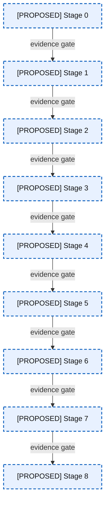

```mermaid
flowchart LR
    E["[PROPOSED] preserve evidence"]:::proposed
    S["[PROPOSED] specify semantic invariants"]:::proposed
    O["[PROPOSED] build independent oracles"]:::proposed
    C["[PROPOSED] correct implementation"]:::proposed
    V["[PROPOSED] differential/golden/sanitizer proof"]:::proposed
    E --> S
    S --> O
    O --> C
    C --> V
    classDef current fill:#eef7ee,stroke:#1b5e20,stroke-width:2px,color:#111;
    classDef debt fill:#fff4d6,stroke:#b26a00,stroke-width:2px,color:#111;
    classDef invalid fill:#ffe8e8,stroke:#b71c1c,stroke-width:3px,color:#111;
    classDef proposed fill:#e8f1ff,stroke:#1565c0,stroke-width:2px,stroke-dasharray: 6 4,color:#111;
    classDef research fill:#f3f3f3,stroke:#666,stroke-width:2px,stroke-dasharray: 2 4,color:#111;
    classDef context fill:#fafafa,stroke:#777,stroke-width:2px,stroke-dasharray: 2 4,color:#111;
```

```mermaid
flowchart LR
    I["[PROPOSED] reviewed implementation"]:::proposed
    V["[PROPOSED] passing independent verification"]:::proposed
    M["[PROPOSED] manifest-bound measurement"]:::proposed
    D["[PROPOSED] reconciled canonical docs"]:::proposed
    C["[PROPOSED] narrowly defensible claim"]:::proposed
    I --> V
    V --> M
    M --> D
    D --> C
    classDef current fill:#eef7ee,stroke:#1b5e20,stroke-width:2px,color:#111;
    classDef debt fill:#fff4d6,stroke:#b26a00,stroke-width:2px,color:#111;
    classDef invalid fill:#ffe8e8,stroke:#b71c1c,stroke-width:3px,color:#111;
    classDef proposed fill:#e8f1ff,stroke:#1565c0,stroke-width:2px,stroke-dasharray: 6 4,color:#111;
    classDef research fill:#f3f3f3,stroke:#666,stroke-width:2px,stroke-dasharray: 2 4,color:#111;
    classDef context fill:#fafafa,stroke:#777,stroke-width:2px,stroke-dasharray: 2 4,color:#111;
```

# 19 — Implementation Sequence

This translates backlog Stages 0–8 into an architecture migration. It is planning only; no item is marked implemented by this atlas.

### A19-01 — Stages 0–8 migration

| Diagram card field | Value |
|---|---|
| Purpose and scope | Make learning-first dependencies explicit from evidence preservation to possible expansion. |
| Evidence/status | PROPOSED backlog sequence. |
| Source evidence | [16-study-plan.md](../../docs/helios-study-guide/16-study-plan.md) |
| Backlog | [VER-06](../../ENGINEERING_BACKLOG.md#ver-06--establish-artifact-and-replay-provenance), [BEN-01](../../ENGINEERING_BACKLOG.md#ben-01--make-build-and-benchmark-provenance-reproducible), [DOC-01](../../ENGINEERING_BACKLOG.md#doc-01--reconcile-architecture-and-evidence-documentation), [INF-03](../../ENGINEERING_BACKLOG.md#inf-03--define-generated-artifact-lifecycle), [COR-01](../../ENGINEERING_BACKLOG.md#cor-01--establish-a-lossless-price-domain-model), [VER-01](../../ENGINEERING_BACKLOG.md#ver-01--build-protocol-golden-fixtures), [COR-06](../../ENGINEERING_BACKLOG.md#cor-06--define-mutation-exception-safety-guarantees), [PRO-01](../../ENGINEERING_BACKLOG.md#pro-01--introduce-structured-framing-and-decode-outcomes), [INF-02](../../ENGINEERING_BACKLOG.md#inf-02--modernize-target-scoped-cmake-behavior), [BEN-08](../../ENGINEERING_BACKLOG.md#ben-08--reproduce-the-custom-hash-map-experiment), [DOC-02](../../ENGINEERING_BACKLOG.md#doc-02--align-language-standard-and-platform-claims), [FUT-02](../../ENGINEERING_BACKLOG.md#fut-02--design-multi-symbol-single-writer-sharding) |
| Findings | [HEL-001](11-current-technical-debt-overlay.md#hel-001), [HEL-005](11-current-technical-debt-overlay.md#hel-005), [HEL-011](11-current-technical-debt-overlay.md#hel-011), [HEL-042](11-current-technical-debt-overlay.md#hel-042), [HEL-048](11-current-technical-debt-overlay.md#hel-048) |
| Related atlas material | — |

- **Important edges**
  - Every arrow is an evidence gate, not merely calendar order.
  - Architectural expansion waits until semantics, verification, protocol, and measurement are defensible.
- **What exists:** The tracked backlog defines all stages and items.
- **What does not exist:** No stage completion is implied.

### A19-02 — Verification before correction

| Diagram card field | Value |
|---|---|
| Purpose and scope | Show why preservation/specification/oracles precede invasive state changes. |
| Evidence/status | PROPOSED sequence from backlog. |
| Source evidence | [09-testing-and-correctness.md](../../docs/helios-study-guide/09-testing-and-correctness.md) |
| Backlog | [VER-06](../../ENGINEERING_BACKLOG.md#ver-06--establish-artifact-and-replay-provenance), [COR-01](../../ENGINEERING_BACKLOG.md#cor-01--establish-a-lossless-price-domain-model), [COR-02](../../ENGINEERING_BACKLOG.md#cor-02--define-order-id-uniqueness-and-namespace-policy), [VER-01](../../ENGINEERING_BACKLOG.md#ver-01--build-protocol-golden-fixtures), [VER-02](../../ENGINEERING_BACKLOG.md#ver-02--build-a-reference-book-and-differential-invariant-harness), [COR-06](../../ENGINEERING_BACKLOG.md#cor-06--define-mutation-exception-safety-guarantees) |
| Findings | [HEL-001](11-current-technical-debt-overlay.md#hel-001), [HEL-002](11-current-technical-debt-overlay.md#hel-002), [HEL-009](11-current-technical-debt-overlay.md#hel-009), [HEL-011](11-current-technical-debt-overlay.md#hel-011), [HEL-021](11-current-technical-debt-overlay.md#hel-021) |
| Related atlas material | — |

- **Important edges**
  - The oracle is designed from the contract rather than copied from current mechanics.
  - Evidence preservation allows before/after claims to remain auditable.
- **What exists:** Backlog contracts and current artifacts exist.
- **What does not exist:** The proposed oracle and corrected implementation do not.

### A19-03 — Claims promotion pipeline

| Diagram card field | Value |
|---|---|
| Purpose and scope | Tie implementation, verification, measurement, and documentation to newly defensible claims. |
| Evidence/status | PROPOSED evidence lifecycle. |
| Source evidence | [08-benchmarking-and-measurement.md](../../docs/helios-study-guide/08-benchmarking-and-measurement.md) |
| Backlog | [VER-02](../../ENGINEERING_BACKLOG.md#ver-02--build-a-reference-book-and-differential-invariant-harness), [VER-06](../../ENGINEERING_BACKLOG.md#ver-06--establish-artifact-and-replay-provenance), [BEN-01](../../ENGINEERING_BACKLOG.md#ben-01--make-build-and-benchmark-provenance-reproducible), [DOC-01](../../ENGINEERING_BACKLOG.md#doc-01--reconcile-architecture-and-evidence-documentation), [DOC-03](../../ENGINEERING_BACKLOG.md#doc-03--define-performance-claim-vocabulary), [INF-03](../../ENGINEERING_BACKLOG.md#inf-03--define-generated-artifact-lifecycle) |
| Findings | [HEL-005](11-current-technical-debt-overlay.md#hel-005), [HEL-007](11-current-technical-debt-overlay.md#hel-007), [HEL-009](11-current-technical-debt-overlay.md#hel-009), [HEL-033](11-current-technical-debt-overlay.md#hel-033), [HEL-048](11-current-technical-debt-overlay.md#hel-048) |
| Related atlas material | — |

- **Important edges**
  - Correct code is necessary but not sufficient for a performance claim.
  - Documentation is downstream of source, verification, and reproducible evidence.
- **What exists:** Current source, partial tests, and historical artifacts provide inputs.
- **What does not exist:** The promotion pipeline is not automated or complete.

## Phase ledger

| Stage | Objective | Backlog items | Changed components | Strengthened invariants | Prerequisite tests/oracles | Produced evidence | Risk | Rollback | Newly defensible claim |
|---:|---|---|---|---|---|---|---|---|---|
| 0 | Preserve/classify evidence | [VER-06](../../ENGINEERING_BACKLOG.md#ver-06--establish-artifact-and-replay-provenance), [BEN-01](../../ENGINEERING_BACKLOG.md#ben-01--make-build-and-benchmark-provenance-reproducible), [DOC-01](../../ENGINEERING_BACKLOG.md#doc-01--reconcile-architecture-and-evidence-documentation), [INF-03](../../ENGINEERING_BACKLOG.md#inf-03--define-generated-artifact-lifecycle) | artifacts, build/report boundary | evidence labels/provenance | artifact inventory and hashes | manifest/catalog | low; accidental reinterpretation | copy/restore originals; no source behavior changes | historical claims are classified, not yet reproduced |
| 1 | Define semantic model | [COR-01](../../ENGINEERING_BACKLOG.md#cor-01--establish-a-lossless-price-domain-model), [COR-02](../../ENGINEERING_BACKLOG.md#cor-02--define-order-id-uniqueness-and-namespace-policy), [COR-03](../../ENGINEERING_BACKLOG.md#cor-03--define-zero-quantity-lifecycle-semantics), [COR-04](../../ENGINEERING_BACKLOG.md#cor-04--separate-reduce-and-quantity-increase-priority-semantics), [COR-05](../../ENGINEERING_BACKLOG.md#cor-05--harden-numeric-and-construction-boundaries), [COR-08](../../ENGINEERING_BACKLOG.md#cor-08--separate-reconstruction-and-matching-semantics) | types, public APIs, replay/book contract | Price(4), ID, quantity, FIFO, numeric, scope | spec examples/counterexamples | ADRs and invariant contract | high conceptual migration | retain compatibility adapter until oracle passes | the intended semantics are explicit |
| 2 | Build independent verification | [VER-01](../../ENGINEERING_BACKLOG.md#ver-01--build-protocol-golden-fixtures), [VER-02](../../ENGINEERING_BACKLOG.md#ver-02--build-a-reference-book-and-differential-invariant-harness), [INF-01](../../ENGINEERING_BACKLOG.md#inf-01--establish-a-compiler-and-verification-ci-matrix), [VER-05](../../ENGINEERING_BACKLOG.md#ver-05--add-sanitizer-fuzzing-and-boundary-verification-strategy), [VER-04](../../ENGINEERING_BACKLOG.md#ver-04--repair-workload-lifecycle-accounting) | fixtures, reference model, test/CI graph | all state and protocol invariants observable | goldens, differential oracle, lifecycle accounting | failing baseline corpus/CI matrix | medium tooling/coupling | run new harness beside old tests | known defects are reproducible and future fixes falsifiable |
| 3 | Correct transitions/failures | [COR-02](../../ENGINEERING_BACKLOG.md#cor-02--define-order-id-uniqueness-and-namespace-policy), [COR-03](../../ENGINEERING_BACKLOG.md#cor-03--define-zero-quantity-lifecycle-semantics), [COR-04](../../ENGINEERING_BACKLOG.md#cor-04--separate-reduce-and-quantity-increase-priority-semantics), [COR-05](../../ENGINEERING_BACKLOG.md#cor-05--harden-numeric-and-construction-boundaries), [COR-06](../../ENGINEERING_BACKLOG.md#cor-06--define-mutation-exception-safety-guarantees), [COR-07](../../ENGINEERING_BACKLOG.md#cor-07--define-capacity-and-growth-policy), [FUT-01](../../ENGINEERING_BACKLOG.md#fut-01--reassess-the-generic-objectpoolt-contract), [COR-09](../../ENGINEERING_BACKLOG.md#cor-09--resolve-ambiguous-and-no-op-public-apis) | book transaction, pool, public surface | uniqueness, progress, priority, rollback, capacity, lifetime | Stage-2 oracle + failure injection | passing corrected corpus/capacity contract | high state corruption risk | feature flag/compat adapter; revert one policy at a time | core mutations preserve specified invariants |
| 4 | Complete protocol boundary | [PRO-01](../../ENGINEERING_BACKLOG.md#pro-01--introduce-structured-framing-and-decode-outcomes), [PRO-02](../../ENGINEERING_BACKLOG.md#pro-02--validate-session-and-order-lifecycle-integrity), [PRO-03](../../ENGINEERING_BACKLOG.md#pro-03--evaluate-stock-locate-based-symbol-routing), [PRO-05](../../ENGINEERING_BACKLOG.md#pro-05--preserve-diagnostic-feed-metadata), [PRO-06](../../ENGINEERING_BACKLOG.md#pro-06--specify-portable-file-mapping-and-prefault-behavior), [PRO-04](../../ENGINEERING_BACKLOG.md#pro-04--define-message-count-and-throughput-semantics) | framing, decode outcomes, session router, metadata, mapping, metrics | exact decoding, lifecycle validity, counted populations | goldens + session anomaly fixtures | typed outcome traces and portable replay evidence | high replay compatibility | retain raw offsets/events for comparison | supported historical replay behavior is precisely stated |
| 5 | Rebuild measurement foundation | [INF-02](../../ENGINEERING_BACKLOG.md#inf-02--modernize-target-scoped-cmake-behavior), [VER-03](../../ENGINEERING_BACKLOG.md#ver-03--replace-the-invalid-allocation-check-with-a-trustworthy-methodology), [BEN-02](../../ENGINEERING_BACKLOG.md#ben-02--produce-a-complete-allocation-map-of-each-hot-operation), [BEN-03](../../ENGINEERING_BACKLOG.md#ben-03--replace-the-add-only-headline-with-a-workload-portfolio), [BEN-04](../../ENGINEERING_BACKLOG.md#ben-04--redesign-latency-statistics-and-timer-overhead-treatment), [BEN-05](../../ENGINEERING_BACKLOG.md#ben-05--verify-cpu-affinity-tsc-capability-and-platform-gating), [BEN-06](../../ENGINEERING_BACKLOG.md#ben-06--separate-workload-generation-from-profiled-book-operations), [BEN-07](../../ENGINEERING_BACKLOG.md#ben-07--reinvestigate-latency-tails-with-correlated-evidence) | CMake, allocation instrumentation, benchmark/profile harness | measurement boundaries/provenance/platform validity | corrected oracle + CI + manifests | raw mixed-workload samples/counters/profiles | high methodology churn | keep old artifacts historical; never overwrite | specific workload/platform claims become reproducible |
| 6 | Controlled optimization | [BEN-08](../../ENGINEERING_BACKLOG.md#ben-08--reproduce-the-custom-hash-map-experiment), [BEN-09](../../ENGINEERING_BACKLOG.md#ben-09--measure-bitmap-refresh-complexity-and-alternatives), [BEN-10](../../ENGINEERING_BACKLOG.md#ben-10--measure-compact-versus-cache-line-aligned-order-layouts), [FUT-03](../../ENGINEERING_BACKLOG.md#fut-03--evaluate-alternative-order-id-indexes), [FUT-05](../../ENGINEERING_BACKLOG.md#fut-05--investigate-prefetch-and-numa-behavior), [FUT-04](../../ENGINEERING_BACKLOG.md#fut-04--evaluate-segmented-or-compressed-price-ladders) | index, bitmap, Order/pool, ladder | semantic equivalence under variants | Stage-5 harness + differential oracle | accepted/rejected experiment journals | medium performance regressions | select baseline via build variant | only measured variants earn optimization claims |
| 7 | Truthful recruiting artifact | [DOC-02](../../ENGINEERING_BACKLOG.md#doc-02--align-language-standard-and-platform-claims), [DOC-03](../../ENGINEERING_BACKLOG.md#doc-03--define-performance-claim-vocabulary), [DOC-04](../../ENGINEERING_BACKLOG.md#doc-04--clean-repository-hygiene-and-unfinished-artifacts), [DOC-01](../../ENGINEERING_BACKLOG.md#doc-01--reconcile-architecture-and-evidence-documentation) | README/docs/repository artifacts | claims match source/evidence | link/coverage checks + reproduced results | canonical architecture and vocabulary | low behavior risk; communication risk | preserve historical docs with labels | public claims are evidence-backed and limitations explicit |
| 8 | Consider expansion | [FUT-02](../../ENGINEERING_BACKLOG.md#fut-02--design-multi-symbol-single-writer-sharding), [FUT-06](../../ENGINEERING_BACKLOG.md#fut-06--design-real-time-ingestion-boundaries), [FUT-07](../../ENGINEERING_BACKLOG.md#fut-07--decide-whether-helios-will-ever-include-matching-engine-semantics) | routing/shards, ingestion boundary, matching scope | single ownership, sequencing, recovery, semantic separation | all prior gates + RFC-specific prototypes | accepted/deferred RFCs | very high surface/operational risk | keep experimental core standalone | only selected future scope is defensible as a design, not implementation |
## Complete epic and item coverage

| Epic | All items | Stage placement |
|---|---|---|
| Epic 1 — Correctness | COR-01, COR-02, COR-03, COR-04, COR-05, COR-06, COR-07, COR-08, COR-09 | 1, 3 |
| Epic 2 — Protocol Compliance | PRO-01, PRO-02, PRO-03, PRO-04, PRO-05, PRO-06 | 4 |
| Epic 3 — Verification | VER-01, VER-02, VER-03, VER-04, VER-05, VER-06 | 0, 2, 5 |
| Epic 4 — Benchmarking and Profiling | BEN-01, BEN-02, BEN-03, BEN-04, BEN-05, BEN-06, BEN-07, BEN-08, BEN-09, BEN-10 | 0, 5, 6 |
| Epic 5 — Documentation | DOC-01, DOC-02, DOC-03, DOC-04 | 0, 7 |
| Epic 6 — Infrastructure | INF-01, INF-02, INF-03 | 0, 2, 5 |
| Epic 7 — Future Work | FUT-01, FUT-02, FUT-03, FUT-04, FUT-05, FUT-06, FUT-07 | 3, 6, 8 |

All 45 distinct backlog IDs appear above. Stage-list numbering in the backlog repeats some correctness work between semantic definition and implementation; this atlas preserves that intentional two-pass migration.
