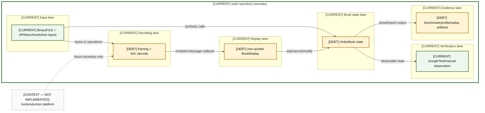

# Helios Visual Architecture Atlas

This atlas is a repository-grounded visual map of Helios as it exists, the debt that prevents stronger claims, and carefully separated evolution paths. It is for maintainers, systems interview preparation, reviewers, and engineers planning corrective work.

> **Truth disclaimer:** `CURRENT` means tracked implementation evidence exists, not that behavior is correct or production-ready. `DEBT` and `INVALID` are current code paths with known limitations. `PROPOSED`, `RESEARCH`, `CONTEXT — NOT IMPLEMENTED`, and `OUT OF SCOPE` never sit inside the solid current boundary. The original conversational audit has **no repository URI**; the tracked derivative evidence is the [study-guide debt ledger](../helios-study-guide/12-technical-debt-and-limitations.md) and [engineering backlog](../../ENGINEERING_BACKLOG.md).

### AOV-01 — Helios architecture swimlane

| Diagram card field | Value |
|---|---|
| Purpose and scope | One export-ready map of input, decoding, replay, book state, verification, and evidence; the solid CURRENT boundary ends before production context. |
| Evidence/status | Mixed: repository evidence with debt called out; production is context only. |
| Source evidence | [README.md](../../README.md), [itch_parser.hpp](../../include/itch_parser.hpp), [book_replay.hpp](../../include/book_replay.hpp), [orderbook.hpp](../../include/orderbook.hpp), [CMakeLists.txt](../../CMakeLists.txt) |
| Backlog | [COR-01](../../ENGINEERING_BACKLOG.md#cor-01--establish-a-lossless-price-domain-model), [PRO-01](../../ENGINEERING_BACKLOG.md#pro-01--introduce-structured-framing-and-decode-outcomes), [VER-02](../../ENGINEERING_BACKLOG.md#ver-02--build-a-reference-book-and-differential-invariant-harness), [BEN-01](../../ENGINEERING_BACKLOG.md#ben-01--make-build-and-benchmark-provenance-reproducible), [DOC-01](../../ENGINEERING_BACKLOG.md#doc-01--reconcile-architecture-and-evidence-documentation) |
| Findings | [HEL-001](11-current-technical-debt-overlay.md#hel-001), [HEL-005](11-current-technical-debt-overlay.md#hel-005), [HEL-011](11-current-technical-debt-overlay.md#hel-011), [HEL-012](11-current-technical-debt-overlay.md#hel-012), [HEL-042](11-current-technical-debt-overlay.md#hel-042) |
| Related atlas material | — |

- **Important edges**
  - BinaryFILE bytes become modeled messages before BookReplay performs symbol-aware mutations.
  - Tests and artifacts observe the book; they do not own book state.
  - The dotted production edge is educational context, never a claim of implementation.
- **What exists:** Historical parsing, single-symbol replay, an in-memory single-writer book, tests, benchmarks, and saved artifacts.
- **What does not exist:** Live sessions, recovery, routing, OMS, risk, gateways, kernel bypass, FPGA, distributed publication, and production monitoring.

## Navigation

- [00 — Legend And Evidence Rules](00-legend-and-evidence-rules.md)
- [01 — Current System Context](01-current-system-context.md)
- [02 — Current Container Architecture](02-current-container-architecture.md)
- [03 — Current Component Architecture](03-current-component-architecture.md)
- [04 — Source And Build Architecture](04-source-and-build-architecture.md)
- [05 — Runtime Dataflows](05-runtime-dataflows.md)
- [06 — Order Lifecycle State Machines](06-order-lifecycle-state-machines.md)
- [07 — Memory Ownership And Layout](07-memory-ownership-and-layout.md)
- [08 — Correctness Invariants](08-correctness-invariants.md)
- [09 — Performance Cost Model](09-performance-cost-model.md)
- [10 — Failure And Error Model](10-failure-and-error-model.md)
- [11 — Current Technical Debt Overlay](11-current-technical-debt-overlay.md)
- [12 — Near Term Corrected Architecture](12-near-term-corrected-architecture.md)
- [13 — Multi Symbol Evolution](13-multi-symbol-evolution.md)
- [14 — Live Market Data Evolution](14-live-market-data-evolution.md)
- [15 — Production Trading System Context](15-production-trading-system-context.md)
- [16 — Capability Matrix](16-capability-matrix.md)
- [17 — Architecture Decision Index](17-architecture-decision-index.md)
- [18 — Interview Whiteboard Pack](18-interview-whiteboard-pack.md)
- [19 — Implementation Sequence](19-implementation-sequence.md)
- [Diagram Catalog](DIAGRAM_CATALOG.md)

## Suggested routes

| Audience | Route |
|---|---|
| New maintainer | 00 → 01 → 03 → 05 → 08 → 11 |
| Correctness work | 06 → 08 → 10 → 11 → 12 → 19 |
| Performance review | 04 → 07 → 09 → 10 → 11 |
| Evolution design | 12 → 13 → 14 → 15 → 16 |
| Interview whiteboarding | 01 → 03 → 05 → 18 |

The [catalog](DIAGRAM_CATALOG.md) is the machine-checkable index. Mermaid source is intentionally kept in Markdown; no SVG export is claimed because Mermaid CLI is not installed locally.
