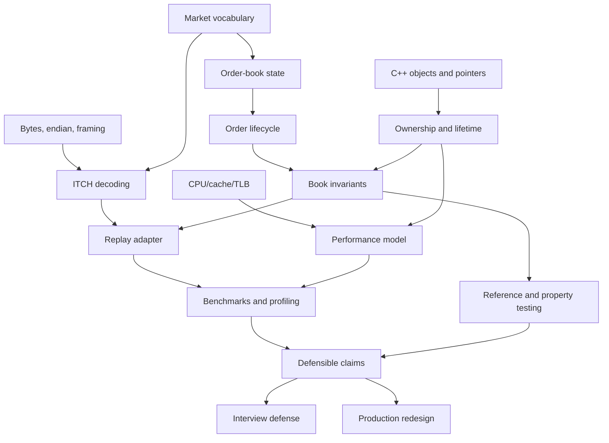

# 00 — Learning Map

## What to learn first

Helios combines four subjects. Learn them in this order:

1. **Market state:** bids, asks, price levels, order references, and price-time priority.
2. **State-machine correctness:** add, reduce, delete, execute, and replace transitions plus invariants.
3. **C++ memory model:** object lifetime, pointers, containers, placement construction, and ownership.
4. **Performance evidence:** caches, branches, TLBs, allocators, timing, and experimental design.

Starting with cache optimizations before understanding the state machine is dangerous: fast code that merges legal prices or orphans orders is not a successful order book.

## Concept dependency graph



## Repository files by concept

| Concept | Primary files | Supporting chapters |
|---|---|---|
| Scalar domains and price conversion | `include/types.hpp` | 01, 04, 07 |
| Order representation | `include/order.hpp` | 04, 05, 06 |
| FIFO level state | `include/price_level.hpp`, `src/price_level.cpp` | 03, 04 |
| Pooled lifetime | `include/object_pool.hpp` | 05, 06 |
| Book state machine | `include/orderbook.hpp`, `src/orderbook.cpp` | 03–06 |
| Binary parsing | `include/itch_parser.hpp` | 07 |
| Replay translation | `include/book_replay.hpp` | 03, 07 |
| Timing | `include/rdtsc_timer.hpp` | 08 |
| Microbenchmark | `benchmarks/benchmark_orderbook.cpp` | 08 |
| End-to-end replay | `benchmarks/itch_book_replay.cpp` | 07, 08, 10 |
| Test confidence | `tests/test_orderbook.cpp` | 09 |
| Build graph | `CMakeLists.txt` | 10 |

## Beginner path

1. Read [01 — First principles](01-project-from-first-principles.md).
2. Manually simulate the tiny books in that chapter.
3. Read the `types.hpp`, `order.hpp`, and `price_level` file guides.
4. Read the add and cancel flows in [03](03-end-to-end-execution-flows.md).
5. Checkpoint: explain a bid, ask, spread, level, FIFO, and cancellation without notes.

## Intermediate path

1. Read [02 — Architecture](02-complete-architecture.md).
2. Read [04 — Invariants](04-data-structures-and-invariants.md) and [05 — Ownership](05-memory-ownership-and-lifetimes.md).
3. Walk through `OrderBook::addOrder`, `cancelOrder`, and `executeMarketOrder` with pencil-and-paper state.
4. Read [07 — ITCH](07-itch-protocol-and-replay-semantics.md).
5. Checkpoint: trace a framed `U` message into cancel-old/add-new state without notes.

## Advanced path

1. Read [06 — CPU model](06-cpu-cache-and-performance-model.md).
2. Read [08 — Measurement](08-benchmarking-and-measurement.md).
3. Challenge every saved result using evidence labels.
4. Read [12 — Technical debt](12-technical-debt-and-limitations.md) and design verification for three findings.
5. Read [13 — Production redesign](13-production-redesign.md).
6. Checkpoint: defend the architecture for ten minutes, then identify where its domain assumptions break.

## Suggested first complete reading order

```text
README → 00 → 01 → types/order/price-level guides → 02 → 03 →
04 → 05 → orderbook/object-pool guides → 07 → parser/replay guides →
06 → 08 → benchmark guides → 09 → test guides → 10 → 11 →
12 → 13 → 14 → 15 → 16
```

## Oral checkpoints

### Checkpoint A — five minutes

- What does an order book store?
- Why do order IDs and price levels require different indexes?
- Why is Helios not a matching engine?

### Checkpoint B — fifteen minutes

- Draw the hash map, price ladder, one intrusive queue, bitmap, and pool.
- Trace add and cancel.
- State five invariants and one violation example for each.

### Checkpoint C — twenty minutes

- Draw BinaryFILE → parser → message → replay → book.
- Decode the fields of `A` and `U` conceptually.
- Explain `Price(4)` and the current precision defect.

### Checkpoint D — thirty minutes

- Explain the 26.6 ns result’s measured boundary.
- Name at least five confounders or limitations.
- Propose a reference-model verification and a reproducible benchmark manifest.

## Recurring exercises

- **Trace:** choose one order reference and follow every pointer/container it touches.
- **Invariant:** after each mutation, list which redundant state was updated.
- **Ownership:** label every pointer as owner or observer.
- **Evidence:** label each performance statement RE, EV, INF, or historical/unverified.
- **Defense:** give a concise limitation before an interviewer discovers it for you.

