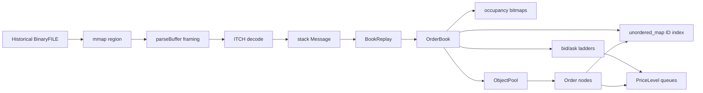
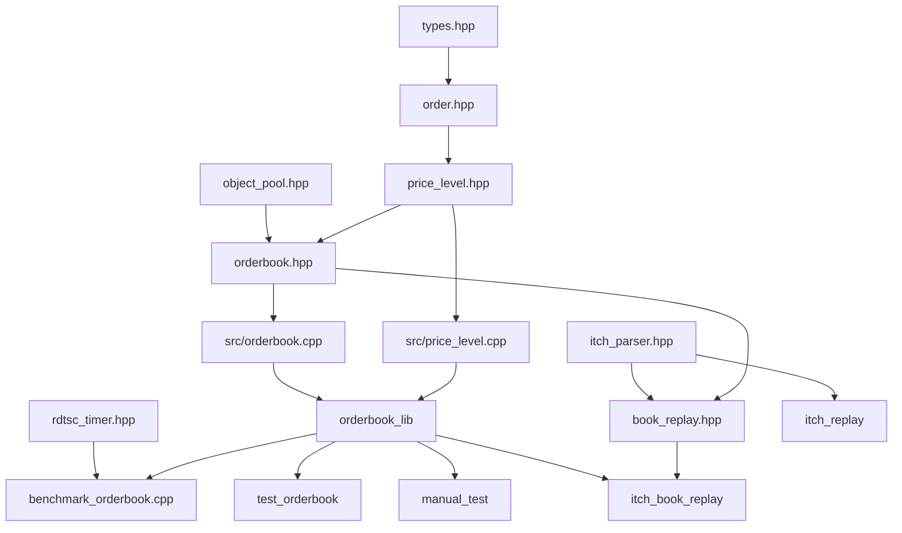
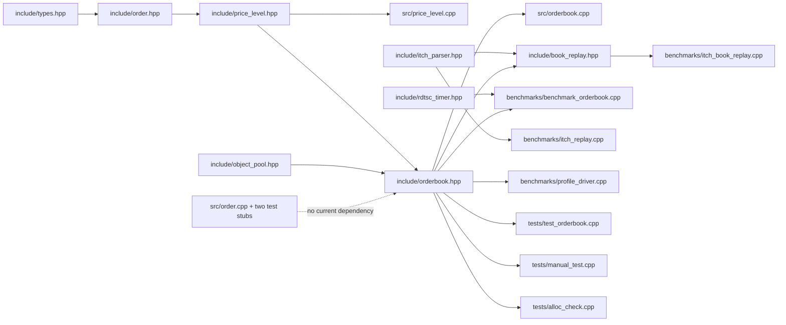
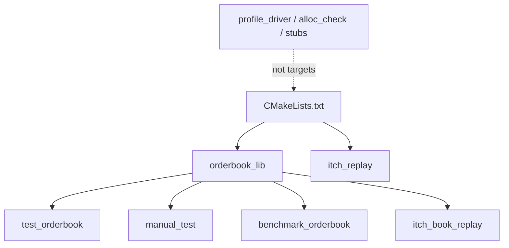
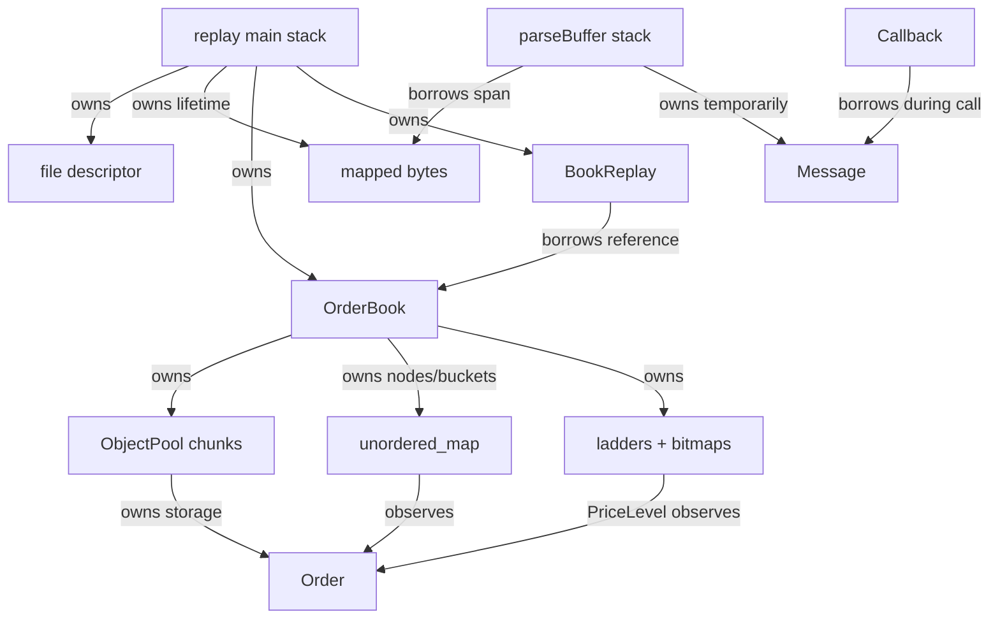
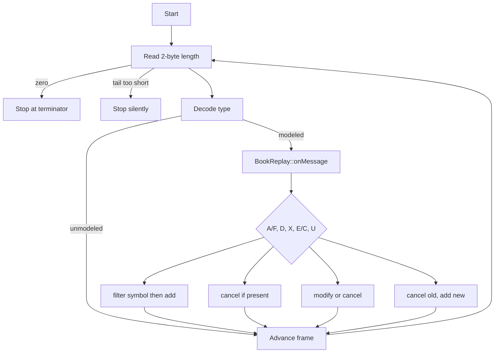

# 02 — Complete Architecture

## System view



The architecture deliberately separates byte interpretation, feed-event semantics, and generic book mechanics. That separation is good. The price scale crossing from replay into the book is currently a leaky boundary.

## Directory structure and ownership of concerns

```text
Helios/
├── include/       public/domain headers; parser, replay, pool, timer are header-only
├── src/           out-of-line PriceLevel and OrderBook mutations; Order stub
├── benchmarks/    microbenchmark, profiler driver, parser replay, book replay
├── tests/         registered GTest, manual demos, allocation experiment, stubs
├── docs/          historical architecture, optimization, profile, and result evidence
├── CMakeLists.txt build graph and compiler policy
├── run_itch_replays.sh experiment orchestration
└── README.md      public narrative and historical headline claims
```

The directory names do not perfectly equal build boundaries. `include/itch_parser.hpp`, `include/book_replay.hpp`, `include/object_pool.hpp`, and `include/rdtsc_timer.hpp` contain implementations compiled into consumers. `benchmarks/profile_driver.cpp`, `tests/alloc_check.cpp`, `src/order.cpp`, and two stub test sources are tracked but absent from the CMake graph. The `docs/` directory mixes explanation with historical generated evidence; [the coverage catalog](TRACKED_FILE_COVERAGE.md) classifies every artifact.

## Module responsibilities

| Module | Responsibility | Does not own |
|---|---|---|
| `types.hpp` | Scalar domains and formatting/conversion helpers | State |
| `Order` | One live order plus queue links | Its neighbors |
| `PriceLevel` | FIFO topology and level aggregates | Order storage |
| `ObjectPool` | Raw chunks, construction slots, free list | Hash/list indexes |
| `OrderBook` | Coordinates all indexes and derived state | External callers/replay |
| `itch_parser.hpp` | Frame and decode bytes | Mapped bytes after callback |
| `BookReplay` | Map modeled ITCH events into one book | Book or input buffer |
| replay executable | File descriptor and mapping lifecycle | Order internals |

## Dependency graph



Header-only modules move implementation into every consuming translation unit. `OrderBook` and `PriceLevel` non-inline methods are compiled into `orderbook_lib`.

## Source-file relationship graph



The arrows mean source-level inclusion/consumption, not ownership. For example, `BookReplay` includes the parser and book types but owns neither decoded callback objects nor the referenced book. The build graph below is intentionally different: not every relationship becomes a separately compiled target edge.

## Build graph



The current generated commands show `gnu++17`. In a no-build-type local configuration, `orderbook_lib` receives global `-O2`; the benchmark translation unit additionally receives `-O3 -march=native`. Executable flags do not retroactively recompile the library.

## Ownership graph



No smart pointer owns an individual live `Order`; the pool owns its storage collectively. Hash and level pointers are non-owning.

## Data-flow boundary table

| Boundary | Data crossing | Validity | Errors today | Cleanliness |
|---|---|---|---|---|
| File → mapping | OS virtual-memory region | Until `munmap` | Several calls unchecked | Leaky operational boundary |
| Mapping → framing | byte pointer + size | Parsing call | Truncation silently stops | Incomplete error contract |
| Framing → decode | message body + declared length | Decode call | `false` conflates cases | Leaky |
| Decode → callback | const `Message&` | Callback only | No typed error | Lifetime clean, error weak |
| Callback → replay | normalized fields | Callback only | Missing order silently ignored | Policy implicit |
| Replay → book | side, cents price, quantity, ID | Mutation | precision/range loss | Semantically leaky |
| Book → structures | indexes/pointers/counters | Book lifetime | no invariant checker | Strong coordination required |

## Control-flow graph: modeled replay



## Generated artifacts

The workspace contains CMake caches, dependency files, object files, executables, a static library, test logs, compile commands, and clangd indexes. They are not authored modules. Useful evidence includes:

- `compile_commands.json`: actual per-translation-unit flags;
- `flags.make` and `link.txt`: target build behavior;
- `LastTest.log`: what the registered test target ran;
- binary symbols: which compiled methods entered each executable.

Opaque indexes and binaries are not educational source substitutes.

## Boundary defense questions

1. Why does `BookReplay` depend on both parser and book types?
2. Would a typed variant of message structs make the parser/replay boundary cleaner?
3. Why is the `Message&` callback lifetime safe now, and how could storing it become unsafe?
4. Where should price-scale conversion live?
5. Which layer should detect update-before-add anomalies?
