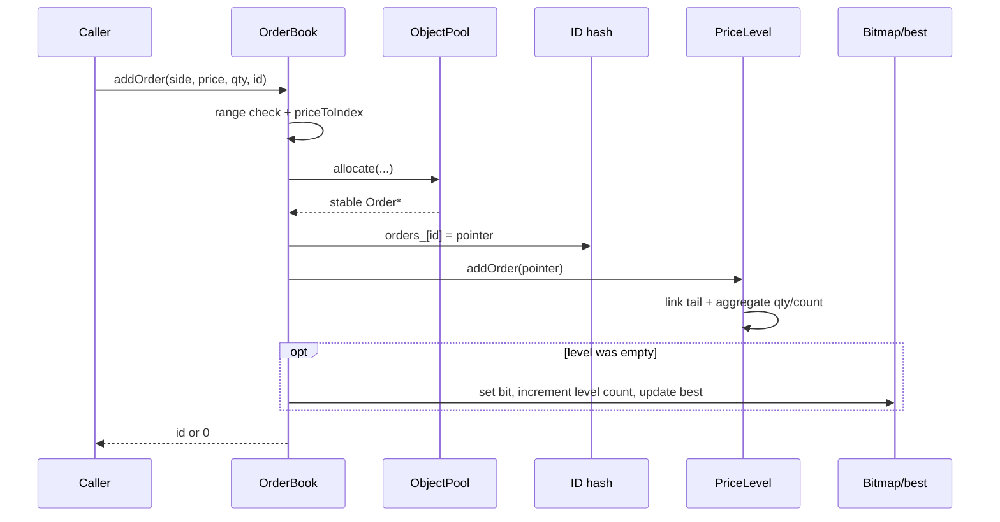
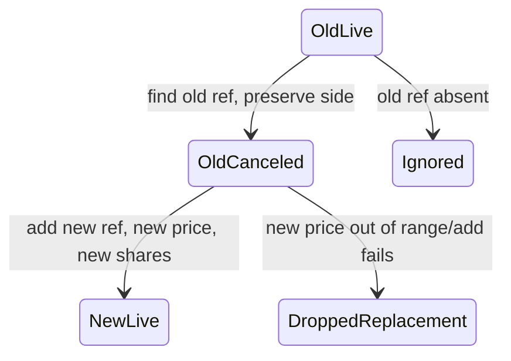
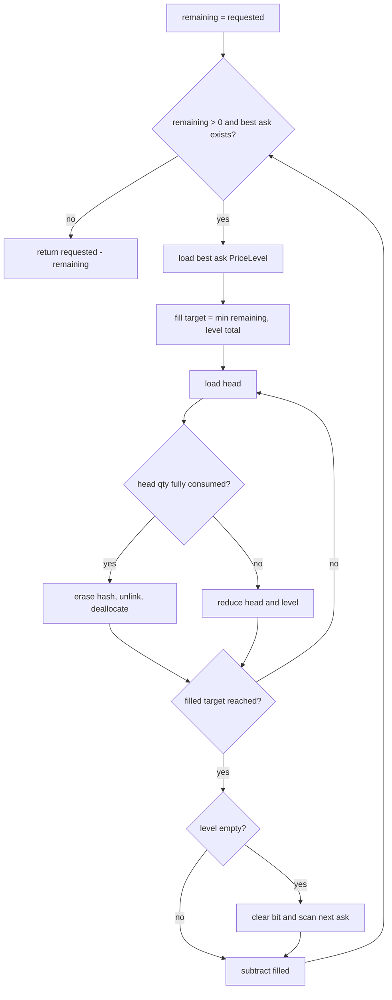

# 03 — End-to-End Execution Flows

This chapter follows control, state, ownership, allocation, and likely CPU work. Exact instructions depend on compiler and hardware.

## Constructing `OrderBook`

### Call sequence

```text
OrderBook(min, max, pool_cap)
  → compute num_levels
  → allocate two PriceLevel vectors
  → allocate two bitmap vectors
  → ObjectPool(pool_cap) → allocate first Slot[] chunk → thread free list
  → initialize each bid/ask PriceLevel price
  → unordered_map::reserve(pool_cap)
```

### Before/after

Before: no state. After: every price index exists but is empty; bitmaps are zero; best indexes are `-1`; pool contains only free slots; map contains no live ID.

### Memory/allocation

Several large allocations occur before the first order. The pool writes one pointer into every free slot, touching its chunk. Constructor work is O(price range + pool capacity), not O(1).

### Failures

Reversed ranges can produce a huge unsigned level count. Any vector, chunk, or reserve allocation can throw.

## Adding an order



### Preconditions

- price in configured range;
- ID unique for correct current behavior;
- quantity nonzero if progress invariants are expected;
- side is a valid enum value.

### Postconditions

- one live constructed pool object;
- exactly one hash entry and one queue membership;
- aggregates/counters/bitmap/best consistent.

### Likely CPU work

Dependent pool-head load, order cache-line writes, hash/bucket access and node allocation, direct ladder address, tail-link writes, and biased branches for side/empty/best.

### Failure window

If hash insertion throws after pool allocation, no rollback returns the order to the pool. A duplicate ID overwrites the index pointer and leaves the old queue node orphaned.

## Canceling an order

```text
find ID → load Order* → derive price index → unlink from side level →
if level empty: clear bit, decrement active levels, scan for new best →
erase hash node → destroy Order → push slot onto pool free list → decrement total
```

Known-order removal is O(1) average except for hash behavior, allocator behavior, and occasional O(bitmap words) best refresh.

## Reducing and modifying

`BookReplay::onReduce` first finds the order. If remaining quantity is greater than the reduction, it calls `modifyOrder` with the new absolute quantity. Otherwise it cancels.

`modifyOrder` computes a signed delta, writes the order quantity, and adjusts its level aggregate. It does not change queue position. Reduction therefore keeps priority; increase also keeps priority under the current generic API.

## ITCH replacement



The replacement gets a new pool object and tail position. The operation is not atomic if allocation/insertion fails.

## ITCH partial and full execution

- `E` and `C` both call `onReduce(orderRef, executedShares)`.
- Partial execution changes quantity in place.
- Full-or-over execution cancels and deallocates the order.
- `C` includes an execution price, but displayed book quantity is still reduced at the resting order’s price; the execution price is relevant to trade reporting, not queue location.

## Synthetic market buy

A BUY consumes the ask side.



A synthetic market sell mirrors this flow on bids, using the highest occupied bid.

### Zero-quantity failure

If a nonempty best level has aggregate zero, the computed fill is zero, no head is removed, and the outer loop exits without progress. This is why zero-quantity semantics are an invariant issue.

## Parsing one BinaryFILE message

1. Ensure two bytes remain.
2. Read a big-endian 16-bit payload length.
3. Stop if length is zero.
4. Stop if the declared payload extends beyond the buffer.
5. Decode the body at `offset + 2`.
6. If modeled and long enough, invoke callback with a stack-local `Message`.
7. Advance by prefix plus payload regardless of modeled type.

The callback must not retain the `Message&` because the object dies or is replaced after the call.

## Decoding supported types

| Type | Essential decoded fields | Replay mutation |
|---|---|---|
| `A` | timestamp, ref, side, shares, stock, price | filter; add |
| `F` | same plus ignored attribution bytes | filter; add |
| `E` | timestamp, ref, executed shares | reduce/cancel |
| `C` | same plus execution price | reduce/cancel |
| `X` | timestamp, ref, canceled shares | reduce/cancel |
| `D` | timestamp, ref | cancel |
| `U` | timestamp, old ref, new ref, shares, price | cancel old; add new |

See [07](07-itch-protocol-and-replay-semantics.md) for exact layouts.

## Filtering one symbol

Only add messages contain the symbol needed by current routing. The replay compares the message’s raw eight bytes with a space-padded target packed into `uint64_t`. Later lifecycle messages are accepted only if their globally unique order reference exists in the target book.

## Replaying a file

```text
validate CLI → open → fstat → mmap → madvise → touch pages →
construct very large OrderBook → construct BookReplay → parse all frames →
apply modeled target lifecycle → print timing/state → munmap → close
```

The mapped file is owned by `main`; parser and callback borrow it. `t1` is captured before book construction, so book construction is included in the reported process phase. This matters because replay initializes large ladders, a pool chunk, and hash capacity before parsing.

## Cross-flow resource and failure ledger

This table makes the same questions explicit for every requested flow. “Allocation” means potential allocation in the current implementation, not a guarantee that the allocator is called on every invocation.

| Flow | State before → after | Memory/hash/list/bitmap work | Likely decisions | Failure/anomaly |
|---|---|---|---|---|
| Construct book | no object → empty valid book | allocate/initialize two level vectors, two bitmaps, pool block/free list, hash buckets | normalized pool chunk size | reversed/overflowing range, allocation exception |
| Add | absent ID → one live queued ID | pool pop/growth; map node/rehash; tail link; aggregate/count; maybe bit/best | range, side, level empty, better price | duplicate orphan, zero qty, allocation rollback gap |
| Cancel | live ID → absent/free slot | hash find/erase; middle/head/tail unlink; aggregate/count; maybe clear/scan; pool push | ID found, side, level empty, was best | missing ID; corrupt/stale pointer; bitmap scan tail |
| Reduce | positive live qty → smaller qty or absent | two hash lookups through adapter/book; aggregate write or full cancel sequence | ID exists, shares below remaining | zero/over reduction policy; missing lifecycle ref |
| Modify | live qty → absolute new qty | hash find; order and aggregate writes; no relink | ID exists, delta sign | zero stays live; increase keeps priority; signed narrowing |
| ITCH Replace | old live → old absent + new live | old lookup/cancel/deallocate then fresh Add allocation/index/link | old exists; new Add accepted | non-atomic loss, duplicate new ID, range/price loss |
| ITCH partial Execute | live → lower remaining | same as Reduce; C's execution price is decoded but not a queue price | remaining greater than executed | malformed excess; metadata discarded |
| ITCH full Execute | live → absent | same as Cancel | executed shares at least remaining | over-execution treated as full removal |
| Synthetic market buy | asks → quantity consumed best-to-worse | repeated best ask/head loads; hash erase; unlink/free; bitmap scans | full/partial head, level empty, progress | zero level stops; long dependent sweep |
| Synthetic market sell | bids → quantity consumed best-to-worse | mirror using highest bid | same mirrored branches | same mirrored failures |
| Parse frame | offset → next offset/stop | sequential prefix/payload loads; stack `Message`; stock copies | zero, truncation, supported type | silent termination/conflated status |
| Decode A/F/E/C/X/D/U | zeroed message → populated selected fields | explicit byte loads/shifts; Add stock copies | type and minimum length | extra length/domain unchecked |
| Symbol filter | decoded Add → admitted/ignored | eight-byte local copy/compare | raw bytes equal target | truncation at target construction; locate ignored |
| Replay file | mapped bytes → final book/counters | page access + all decoder/adapter/book work | every frame/event branch | gaps/session not modeled; denominator ambiguity |
| Primary benchmark | generated inputs → samples/grown books | repeated Add plus timer fences/sample vectors/sorts | affinity/platform, capacity paths | unchecked affinity/TSC; biased statistic |
| Tests | fixtures → assertions/process status | fresh book per test plus driver RNG/I/O | test branches | missing oracle; tautology/stale IDs |
| Destroy book | live state → released containers/blocks | reverse member destruction; bulk block free | none at API level | live non-trivial pooled destructors skipped |

## Running the primary benchmark

1. Choose/request a core and call affinity without checking success.
2. Calibrate TSC for about 200 ms.
3. measure the minimum empty timer pair.
4. generate 200,000 inputs outside timing.
5. construct/warm a book and batch-time 200,000 adds.
6. repeat seven per-op runs, each with a new book and additional warm-up adds.
7. sort each run and take quantiles.
8. report medians of run-level quantiles and maxima.

## Running tests

CMake registers one executable, `test_orderbook`. GoogleTest constructs a fresh fixture book per test. Seven basic and six stress/performance tests run. Only assertion behavior, not printed timing, determines pass/fail.

## Destroying the book

Members are destroyed in reverse declaration order. The pool frees chunks before the non-owning map and level vectors are destroyed. Their pointer values become dangling temporarily, but their destructors do not dereference pointed-to `Order` objects. Live `Order` destructors are not individually invoked by the pool destructor; current `Order` has no resource-owning destructor, but the generic pool contract is incomplete.

## Flow-tracing exercise

Draw state for IDs 10 and 11 at the same ask, partially execute ID 10, replace ID 11 at a new price/ref, then delete ID 10. After every event list:

- hash keys;
- queue head/tail and links;
- level quantities/counts;
- bitmap bits;
- best index;
- pool allocated count.
