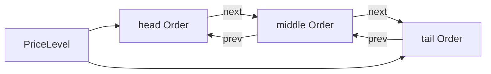

# 04 — Data Structures and Invariants

## Why invariants matter

Helios stores the same logical fact in several forms: an order is in a hash index, a linked queue, aggregate counters, a bitmap, and cached best state. Performance comes from this redundancy; correctness requires all copies to agree.

### Explain like I am five

Imagine a library with a card catalog, shelves, shelf labels, and a sign naming the first nonempty shelf. A book is not correctly stored merely because one of those looks right. Every representation must agree.

## `std::unordered_map<OrderId, Order*>`

### Role

Maps an exchange/order API reference directly to its pooled object for cancel, reduce, modify, execution, and replacement.

### Model

A bucket array chooses a bucket from the hashed ID; a node stores the key/pointer and collision linkage. Average lookup is O(1), but worst-case lookup and rehash are not.

### Practical CPU behavior

- bucket access may be cache-friendly when the bucket array is hot;
- node access is pointer chasing;
- node insertion ordinarily allocates;
- random cancellation produces irregular accesses;
- `reserve` avoids early bucket rehash but not per-entry nodes.

### Failure mode

`orders_[id] = pointer` overwrites an existing value. The old order remains queued but is no longer reachable by ID.

## Direct-mapped price ladders

Two `vector<PriceLevel>` objects cover every tick in `[min_price, max_price]`.

```text
index = price - min_price
price = min_price + index
```

Access is O(1), contiguous, and allocation-free after construction. Memory is O(price range) for each side even when few prices are occupied.

The design wins for a narrow, dense instrument domain and loses for sparse/wide domains or thousands of symbols.

## Occupancy bitmaps

Bit `i` is one exactly when ladder level `i` is nonempty.

```text
word = i >> 6
bit  = i & 63
```

Setting and clearing are O(1). Finding a best price scans words and then uses count-leading/trailing-zero builtins. Current refresh starts at a global endpoint, making worst-case work O(number of bitmap words).

## Intrusive doubly linked list

Each `Order` contains `prev` and `next`. `PriceLevel` stores head/tail.



Append and removal with a known pointer are O(1). The cost is two pointers per order and dependent loads during traversal.

## `PriceLevel`

`PriceLevel` is a non-owning aggregate:

- `price_`: identity of the preallocated slot;
- `head_`, `tail_`: order observers;
- `total_qty_`: cached sum;
- `order_count_`: cached length.

It assumes callers provide a valid order belonging to the level. It cannot independently prove ownership.

## `Order`

The order is both domain record and list node. `alignas(64)` plus static assertions require one 64-byte-aligned, 64-byte object. Fields include ID, price, quantity, two links, timestamp, side, and type.

The “hot/cold” comments do not create separate cache regions; one line fetch brings the whole object.

## `ObjectPool`

A `Slot` union contains either raw aligned bytes for a live `T` or a next-free pointer. Free slots form a LIFO list. Placement `new` starts object lifetime in a slot; explicit destructor call ends it before the slot returns to the free list.

Pool allocate/deallocate are O(1) while a free slot exists. Chunk growth is O(chunk size) because every new slot is threaded into the free list.

## Fixed-point price

An integer is exact only relative to an agreed scale. `10050` can mean `$100.50` under cents or `$1.0050` under Price(4). The type alias alone cannot prevent this category error.

## Cached best indexes

`best_bid_idx_` and `best_ask_idx_` avoid searching on every query. They are derived state:

- best bid is greatest occupied bid index;
- best ask is least occupied ask index;
- `-1` means no occupied level.

## Complete invariant set

### Identity and reachability

1. Every live ID maps to exactly one live `Order`.
2. Every live order is the value of exactly one ID entry.
3. Every live order belongs to exactly one side/price queue.
4. Every queued order is reachable from the ID index.
5. The map key equals `order.id`.

### Queue topology

6. Empty level means `head == tail == nullptr`, count zero, quantity zero.
7. Nonempty head has `prev == nullptr`; tail has `next == nullptr`.
8. For every `a.next == b`, `b.prev == a`.
9. Traversal reaches exactly `order_count` unique nodes and terminates.
10. Each queued order’s side/price agrees with its containing ladder.

### Aggregates and global state

11. Level quantity equals the sum of queued quantities.
12. Global total equals reachable live orders, queue counts, map size, and pool live count.
13. Side active-level count equals the number of nonempty levels.

### Bitmap and best state

14. Bitmap bit set iff corresponding level is nonempty.
15. Best index `-1` iff side has no occupied bit.
16. Best bid equals greatest set bid bit; best ask equals least set ask bit.

### Pool state

17. Each slot is exactly one of live object or free-list member.
18. No live slot appears in the free list.
19. Every live order address belongs to one owned chunk and remains stable until deallocation.

## Preservation example: cancel middle node

Before: `A <-> B <-> C`, total 60, count 3. Cancel B quantity 20.

Updates:

- `A.next = C`, `C.prev = A`;
- total becomes 40; count becomes 2;
- hash entry B erased; B returned to pool;
- bitmap/best unchanged because level remains nonempty.

## Violation examples

### Duplicate ID

Adding B with A’s ID overwrites the hash pointer. A remains queued, violating invariants 2, 4, 5, and 12.

### Zero quantity

A zero order creates a nonempty, bitmap-occupied level with total zero. Structural invariants may hold, but the progress invariant for market consumption fails.

### Missed bitmap clear

Removing the last order without clearing the bit makes best-price queries point at an empty level, violating 14–16.

## Interview defense

Cancellation is “O(1) average with a known ID” because hash lookup is average O(1) and intrusive unlink is O(1). It is not a worst-case constant-time guarantee: hashing, allocation/deallocation, and best bitmap refresh complicate the path.

