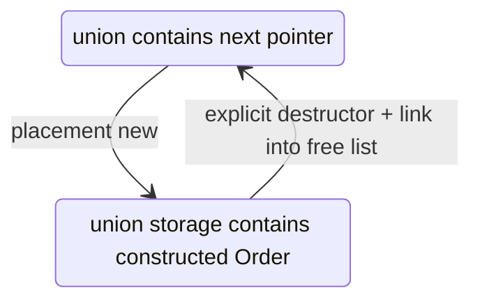
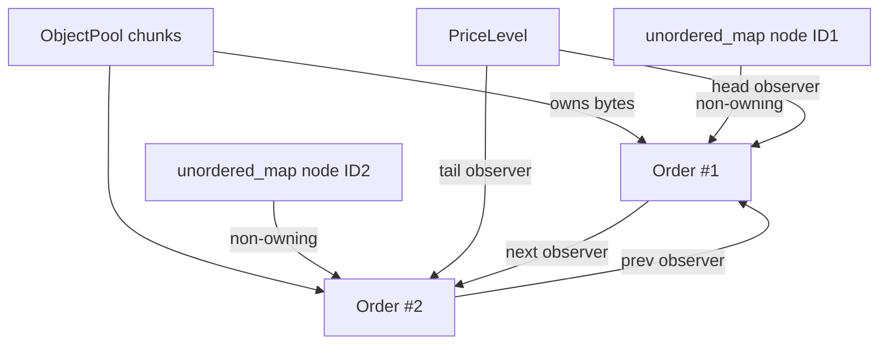

# 05 — Memory Ownership and Lifetimes

## Core vocabulary

- **Raw storage:** bytes with size/alignment but no live object yet.
- **Object lifetime:** interval during which a C++ object exists in storage.
- **Placement new:** constructs an object at a caller-supplied address.
- **Owning pointer/container:** responsible for eventual destruction/deallocation.
- **Non-owning pointer:** observes an object whose lifetime is controlled elsewhere.
- **Stable address:** address does not change while the object remains live.

## Ownership table

| Resource | Owner | Observers | End of lifetime |
|---|---|---|---|
| Ladder vector storage | `OrderBook` | book methods | vector destruction |
| Bitmap storage | `OrderBook` | book methods | vector destruction |
| Hash nodes/buckets | `orders_` | book methods | erase/map destruction |
| Pool chunks | `ObjectPool` | free list and live orders | pool destruction |
| Live `Order` object | collectively `ObjectPool` storage | map and one level | explicit `deallocate` or raw chunk destruction debt |
| Mapped file | replay `main` | parser | `munmap` |
| File descriptor | replay `main` | OS mapping setup | `close` |
| Decoded `Message` | parser stack | callback | callback return/loop iteration |
| `BookReplay` | replay `main` stack | callback closure | end of `main` |
| `OrderBook&` inside replay | external `main` stack | `BookReplay` | book must outlive replay |

## Pool slot state machine



Reinterpreting the object address as `Slot*` works because union members begin at the union address and storage is the selected region for construction.

## Stable addresses

Chunks are separately allocated arrays owned by `unique_ptr`. Moving a `unique_ptr` inside the `chunks_` vector does not move its pointee array, so live order addresses remain stable even if the vector reallocates.

Stable addresses enable:

- raw pointers in `unordered_map` values;
- intrusive neighbor pointers;
- O(1) removal.

## Pointer relationship diagram



## Add allocation map

| Step | Allocation? | Owner after success |
|---|---|---|
| Pool pop | No, if free slot exists | Pool |
| Pool grow | Yes, chunk array and possibly chunk-vector growth | Pool |
| Construct order | No allocation intrinsic to placement new | Pool slot |
| Hash insert | Ordinarily allocates node; may rehash buckets | Map |
| Queue append | No | Existing objects |
| Bitmap update | No after construction | Book vector |

This is why pooled orders do not imply an allocation-free add path.

## Cancel deallocation map

- hash erase releases the hash node through its allocator;
- pool deallocation destroys the order and reuses storage rather than freeing the chunk;
- vectors remain allocated;
- map bucket capacity normally remains.

## Callback lifetime

`parseBuffer` creates `Message m` in the loop and passes `const Message&` to the callback. Reading it synchronously is safe. Storing its address or reference for later use would dangle.

## Mapped bytes

The parser borrows `const uint8_t*` into an `mmap` region. Any decoded view pointing into the region would be valid only until `munmap`; the current `Message` copies fields, so it does not retain byte pointers.

## Destruction order

`OrderBook` uses the default destructor. Members die in reverse declaration order. The pool is declared last, so its chunks are released before the map and level vectors. Those structures then contain invalid pointer values, but their destructors do not dereference the pointed-to orders.

### Technical debt

The generic pool does not call destructors for objects still live when the pool dies. Current `Order` owns no external resource, so raw deallocation has no observable resource leak; a generic nontrivial `T` could leak logical resources or violate required destructor effects.

## Exception safety

The add transition is multi-step:

```text
free slot → live object → hash indexed → queue indexed → derived state
```

If an exception occurs after an earlier step, rollback must undo completed transitions. Current code does not guard the pool allocation before hash insertion. The design offers neither a documented basic nor strong guarantee.

## Pool growth slow path

When no free slot exists, `addChunk`:

1. allocates a `Slot[]` array;
2. writes every slot to build the free list;
3. may grow the vector of chunk owners.

That is a deterministic but potentially large latency discontinuity.

## Dangling-pointer risks

- deallocate before unlink/erase;
- retain an `Order*` returned by `getOrder` after mutation;
- duplicate IDs orphaning a queued pointer;
- corrupt neighbor links;
- storing callback references;
- using mapped data after cleanup.

## Interview exercise

Explain why `getOrder` returning `const Order*` prevents mutation through that pointer but does not extend lifetime or make concurrent access safe.

