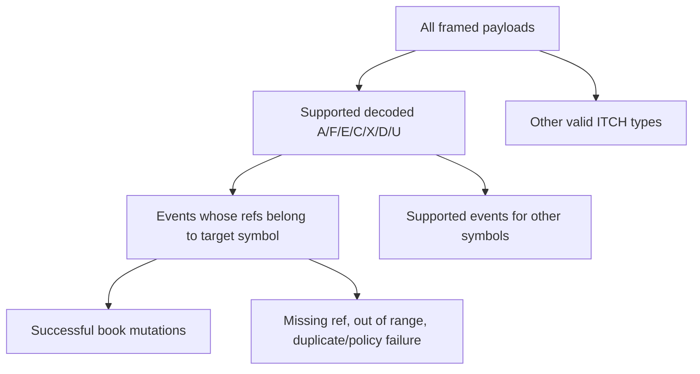

# 07 — ITCH Protocol and Replay Semantics

## Sources and scope

- **Externally verified fact:** Nasdaq TotalView-ITCH 5.0 defines the message fields and Price(4) representation: <https://www.nasdaqtrader.com/content/technicalsupport/specifications/dataproducts/NQTVITCHSpecification.pdf>
- **Externally verified fact:** Historical BinaryFILE uses a two-byte big-endian payload length and a zero-length terminator: <https://nasdaqtrader.com/content/technicalSupport/specifications/dataproducts/binaryfile.pdf>
- **Repository evidence:** Helios models seven order-lifecycle message types, not the full ITCH feed.

## BinaryFILE framing

```text
+----------------------+--------------------------+
| uint16 big-endian N  | N payload bytes          |
+----------------------+--------------------------+
```

Length zero terminates the session. If the file ends without the empty message, the BinaryFILE specification says it is incomplete. Helios currently stops at a truncated tail without reporting that distinction.

## Big endian

“Big endian” means the most significant byte comes first. For bytes `12 34`, `rdU16` computes `0x1234` by shifting `0x12` eight bits and OR-ing `0x34`.

Helios does not cast packed bytes to C++ structs. This is correct because struct padding, alignment, and host byte order could disagree with the wire layout.

## Common header

Modeled ITCH messages use:

| Offset | Length | Field |
|---:|---:|---|
| 0 | 1 | message type |
| 1 | 2 | stock locate |
| 3 | 2 | tracking number |
| 5 | 6 | nanoseconds since midnight |

Helios decodes timestamp but discards stock locate and tracking number.

## `A` — Add Order, 36 bytes

| Offset | Length | Field | Helios destination |
|---:|---:|---|---|
| 11 | 8 | order reference | `orderRef` |
| 19 | 1 | `B`/`S` | `side` |
| 20 | 4 | shares | `shares` |
| 24 | 8 | padded stock | `rawStock`, trimmed `stock` |
| 32 | 4 | Price(4) | `price` |

Replay compares the raw stock, converts side, divides price by 100, and calls external-ID `addOrder`.

## `F` — Add with MPID, 40 bytes

The first 36 bytes match `A`; bytes 36–39 contain attribution. Helios ignores attribution, which is acceptable for a non-attributed displayed quantity book but should be stated as scope.

## `E` — Order Executed, 31 bytes

| Offset | Length | Field |
|---:|---:|---|
| 11 | 8 | order reference |
| 19 | 4 | executed shares |
| 23 | 8 | match number, ignored |

Replay reduces the referenced order; if execution consumes the remaining quantity, it cancels/removes it.

## `C` — Order Executed with Price, 36 bytes

Adds printable flag at offset 31 and execution Price(4) at 32. Helios decodes the price but does not use it in book mutation. This is appropriate for locating the resting displayed order: its queue price remains its add/replace price. A time-and-sales subsystem would need the execution price and match metadata.

## `X` — Order Cancel, 23 bytes

| Offset | Length | Field |
|---:|---:|---|
| 11 | 8 | order reference |
| 19 | 4 | canceled shares |

This is a reduction, not necessarily full deletion.

## `D` — Order Delete, 19 bytes

Carries the reference at offset 11. All displayed remainder is removed.

## `U` — Order Replace, 35 bytes

| Offset | Length | Field |
|---:|---:|---|
| 11 | 8 | original reference |
| 19 | 8 | new reference |
| 27 | 4 | new total displayed shares |
| 31 | 4 | new Price(4) |

The protocol omits side and stock because they remain those of the original order. Replay must find the old order to recover side, remove it, and add a new order with new identity/priority.

## Stock locate

Nasdaq describes stock locate as a low-valued daily instrument identifier intended for array indexing and placed consistently in stock-dependent messages. Helios filters raw symbol bytes only on add messages and relies on order-reference lookup thereafter.

For multi-symbol replay, a directory-derived locate router is the protocol-native design. Locate values cannot be assumed stable across days.

## Timestamp

A 48-bit unsigned integer counts nanoseconds since midnight. `rdU48` shifts and accumulates six bytes. The decoded value is useful for ordering diagnostics and cutoff snapshots, but current `BookReplay` does not pass it into `Order`.

## Order references

Lifecycle messages refer to the order reference from add or the new reference from replace. The replay strategy “only add target orders; later updates naturally miss for other symbols” assumes session-unique references and correct lifecycle order.

## Symbol fields

ITCH symbols are eight ASCII bytes, left-justified and space-padded. Helios stores both:

- raw eight bytes for fixed comparison;
- nine-byte null-terminated, trimmed text for display/general use.

## The price-precision defect

ITCH Price(4) means raw integer units of `$0.0001`.

```text
raw 1,001 = $0.1001
raw 1,099 = $0.1099
```

Current replay:

```text
toCents(raw) = raw / 100
1,001 / 100 = 10
1,099 / 100 = 10
```

Both become price 10 cents and enter the same FIFO queue.

Correct price order before conversion:

```text
$0.1001 is a better bid than $0.0999
$0.1001 is a better ask than $0.1099
```

After collision, Helios substitutes arrival order for true price priority at the merged level. It can also report incorrect best prices and spread. This is `HEL-001`, a correctness failure, not formatting loss.

The configured replay ladder ends at 500,000 cents (`$5,000`), while the protocol supports a much wider Price(4) domain. This is `HEL-017`.

## Message-count taxonomy



Current returned `parseBuffer` count is `Supported`, not `All`, `Target`, or `Accepted`. Elapsed parsing time includes scanning `All`.

## Malformed and anomalous cases missing today

- declared frame extends beyond file;
- supported type shorter than required;
- supported type with unexpected extra length;
- invalid side byte;
- zero shares;
- duplicate add reference;
- update before add;
- update after delete;
- replace with missing original;
- replacement ID already live;
- no BinaryFILE terminator;
- price outside book range.

## Interview summary

The byte offsets for modeled messages are sound. The replay semantics for reduce/delete/replace are directionally sound. The price scale, session integrity, anomaly reporting, and full-protocol accounting are not production-correct.

