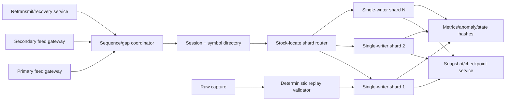

# 13 — Production Redesign Exercise

> Educational architecture exercise only. This is not a claim about any specific exchange or trading firm.

## Experimental Helios versus production infrastructure

| Concern | Helios today | Production-oriented need |
|---|---|---|
| Input | one historical file | redundant sequenced live channels plus replay |
| Integrity | framing only | gaps, duplicates, session and lifecycle anomalies |
| Instruments | one symbol string | daily symbol directory and locate routing |
| Ownership | one local book | explicit single-writer shards |
| Recovery | restart replay manually | snapshots, journals, gap fills, deterministic recovery |
| Capacity | configured vectors/pool | planned limits, alerts, fail policy |
| Observability | final counters/text | continuous anomaly, lag, capacity, and health metrics |
| Deployment | local CMake | reproducible artifacts, staged rollout, rollback |

## Hypothetical architecture

## Feed gateways

Gateways own network/session transport, timestamp arrival, validate packet envelopes, and emit sequenced payloads. They should not directly share mutable book structures.

## Redundancy and sequencing

Two feeds may carry equivalent sequence streams with different loss/latency. A coordinator tracks expected sequence, drops duplicates, detects gaps, buffers bounded future messages, and requests recovery or fails according to policy.

## Session management

Session identity prevents accidentally joining messages from different trading days. Start/end events, BinaryFILE termination, directory readiness, and clock/day transitions become explicit states.

## Symbol directory and routing

Stock directory messages build a daily locate→instrument table. The router maps locate to a single-writer shard. A shard owns every mutable structure for its instruments, avoiding locks on the ordinary mutation path.

## Multi-symbol sharding

Sharding choices include:

- hash symbol/locate to workers;
- balance expected message rate and memory, not symbol count alone;
- pin workers and allocate memory on intended NUMA nodes;
- communicate through bounded single-producer/single-consumer queues where ownership transfers clearly.

## Capacity planning

Plan and observe:

- peak live orders per symbol/shard;
- active price domain;
- hash load factor;
- pool high-water mark/growth;
- queue backlog;
- recovery buffer;
- snapshot size/time;
- memory/TLB footprint.

Capacity exhaustion needs a named policy: fail-stop, reject/drop with degraded flag, expand on a slow path, or transfer workload. Silent partial books are unacceptable.

## Snapshots and recovery

A snapshot records a consistent sequence number and book state. Recovery loads a snapshot, replays captured events after that sequence, and verifies a deterministic state hash. The raw feed capture is the ultimate audit trail.

## Observability

Minimum counters:

- last/expected sequence and gap duration;
- duplicate/late messages;
- malformed/unsupported messages;
- add/update/delete anomalies;
- duplicate IDs and unknown references;
- rejected prices/quantities;
- live orders/levels and capacity high-water marks;
- processing lag and queue depth;
- snapshot/recovery results;
- state hashes at checkpoints.

## Backpressure

Bounded queues prevent unbounded memory growth. If consumers fall behind, policy must prioritize correctness: alarm, switch source, shed nonessential analytics, or fail rather than silently corrupt sequence.

## Failure policy

Classify failures:

- **fatal correctness:** gap unrecoverable, invariant violation, duplicate live identity;
- **recoverable:** transient loss with successful retransmit;
- **data quality/anomaly:** unknown lifecycle reference counted and investigated;
- **performance degradation:** queue lag/capacity threshold crossed.

## Deployment safety

- reproducible binaries and configs;
- shadow replay against captured sessions;
- deterministic state comparison with incumbent/reference;
- canary channels/shards;
- rollback preserving raw capture;
- runbooks for gaps, lag, capacity, and state mismatch.

## Benchmark environments

Separate:

1. component microbenchmarks;
2. isolated shard replay;
3. full gateway-to-book throughput;
4. burst and recovery scenarios;
5. long soak tests;
6. production telemetry comparison.

## Staged migration from Helios

1. Correct price and state contracts.
2. Build reference/differential verification.
3. Add session/lifecycle diagnostics to historical replay.
4. Add stock directory/locate multi-symbol offline routing.
5. Introduce single-writer shards with deterministic offline streams.
6. Add snapshots/state hashes and recovery replay.
7. Add captured sequenced transport inputs.
8. Only then study live gateways, redundancy, and kernel/network optimization.

## Professor’s challenge

Explain why a faster parser is not the first production step when the current price domain and lifecycle completeness are not verified.

