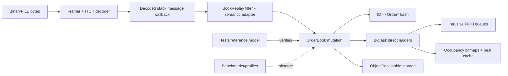

# Interview Defense Guide

This is an oral-exam workbook, not a script to memorize. The strongest answer separates three things: what the repository does, why the design was reasonable for its experimental scope, and what evidence would be required to make a stronger claim.

## The opening answer

### Beginner

Helios reads recorded Nasdaq market messages and rebuilds one stock's visible order book. It stores buy and sell orders, groups them by price, preserves arrival order within a price, and measures how the data structures behave. It is a learning and measurement project, not an exchange.

### Thirty seconds

“Helios is a single-threaded C++ limit-order-book and Nasdaq TotalView-ITCH 5.0 replay experiment. The book uses an ID hash index for cancellation, direct-indexed price ladders with occupancy bitmaps for best-price discovery, intrusive FIFO queues for price-time order, and pooled stable-address orders. An mmap-backed BinaryFILE parser feeds a one-symbol replay adapter. The interesting work is not the headline latency; it is making the state invariants, protocol units, allocator behavior, and benchmark boundaries explicit. The audit also found two central correctness defects—Price(4) precision loss and duplicate-ID corruption—that I would fix before relying on results.”

### Two minutes

Start at the external contract. BinaryFILE supplies a two-byte big-endian length followed by an ITCH payload. The parser checks framing, decodes selected order-lifecycle types into stack-local messages, and invokes a callback. `BookReplay` filters Add messages by the eight-byte stock field and translates supported lifecycle events to an `OrderBook`.

Inside the book, `unordered_map<OrderId, Order*>` gives average constant-time identity lookup. An order's stable address comes from `ObjectPool<Order>`. The order is linked directly into a `PriceLevel` FIFO, avoiding a container node allocation for the queue. Bid and ask levels are direct arrays indexed by `price - minPrice`; bitmaps say which levels are occupied, and cached best indexes avoid searches until the best level empties.

That design trades memory proportional to configured price range for predictable indexing. It is strongest for one symbol with a bounded, reasonably dense price domain. It loses for many sparse or widely priced symbols. Current replay is a reconstruction experiment: exchange-reported execute/delete/replace events drive state. The synthetic market-order API is a separate simulator and should not be described as Nasdaq matching.

Performance measurements need qualification. Pooling removes allocation of the `Order` payload, not `unordered_map` nodes; growth and rehash are slow paths. Existing add-only and cycle benchmarks establish results only for their exact workload and build. Historical provenance is incomplete, and current timer validation is insufficient for universal nanosecond or worst-case claims.

### Ten-minute structure

Draw the diagram below. Spend roughly two minutes each on ingress, state representation, mutation transaction, and performance/evidence; reserve two minutes for limitations and evolution.

End with calibrated limitations: incomplete protocol validation, cents conversion defect, duplicate policy, missing oracle/fuzzing, non-transactional allocation failure, one-symbol capacity model, and incomplete benchmark provenance. That admission demonstrates ownership of the system.

## Layered answer matrix by subsystem

Use the shortest column that fits the interviewer's time. The ten-minute entry is an outline: draw the named whiteboard, then walk mechanism → invariant → evidence → limit.

| Subsystem | Beginner | 30 seconds | 2 minutes | 10-minute/whiteboard route |
|---|---|---|---|---|
| Parser/framing | Finds each message and reads its fields. | Two-byte big-endian BinaryFILE framing surrounds explicit-offset ITCH decoding; no packed struct casts. | Explain bounds, seven schemas, stack callback lifetime, and supported-vs-malformed ambiguity. | Draw byte frame and A/U layouts; derive every offset; enumerate terminal/error categories; cite `itch_parser.hpp`; admit exact/domain validation and fuzzing gaps. |
| Replay/filter | Translates feed events for one stock into book changes. | Raw eight-byte Add symbols select the target; later events route through admitted order references. | Explain add establishment, reduce/delete/execute, old→new Replace, counters, and borrowed book. | Draw event state machine and counter funnel; demonstrate Price(4) collision; cite `book_replay.hpp`; admit range, metadata, locate, and atomicity limits. |
| Book coordinator | Keeps all views of orders synchronized. | Each mutation updates ID index, level queue, aggregates, occupancy, best cache, counts, and pool lifetime. | Trace Add/Cancel and state why duplicate checks and commit ordering matter. | Draw seven representations; prove transaction for every operation/failure point; cite `orderbook.cpp`; admit HEL-002/003/004/021. |
| Ladders/bitmaps | Price selects a shelf; bits show non-empty shelves. | Dense arrays give arithmetic access; bitmaps and cached extrema find best prices without tree traversal. | Explain range-memory trade, empty transitions, and word scans. | Draw index/word/bit math for both sides; prove best invariant; cite `orderbook.hpp`; admit range ceiling, scan bound, eager memory. |
| Intrusive queues | Each order carries links to neighbors. | Stable pooled orders form FIFO lists with constant pointer unlink once located. | Trace singleton/head/tail/middle and cached aggregates. | Draw all transition tables; prove topology/count/quantity; cite `price_level.cpp`; admit pointer chasing and trusted preconditions. |
| ID hash | Maps feed identity to the actual order. | `unordered_map<OrderId, Order*>` gives average-constant lookup but owns allocating hash nodes. | Explain stable pointee address, rehash, collision, and duplicate failure. | Draw buckets→node→Order→neighbors; compare chaining/open addressing/dense handles; cite field/add paths; admit no worst-case bound. |
| Object pool | Reuses lockers for orders. | Block-owned slots alternate between free-list link and placement-constructed `Order`, preserving addresses. | Explain raw storage, lifetime start/end, LIFO reuse, growth, and map allocations outside pool. | Draw slot state machine and exception points; cite `object_pool.hpp`; admit generic teardown/rollback/growth debt. |
| Synthetic execution | Removes best opposite-side orders until quantity is filled. | A buy walks asks low-to-high; a sell walks bids high-to-low; equal-price orders are FIFO. | Explain partial/full head paths and bitmap refresh, then state this is simulation rather than Nasdaq matching. | Trace a multi-level sweep with all hash/list/pool writes; cite `executeMarketOrder`; admit zero-qty progress and missing venue rules. |
| Benchmarks/timer | Times a named operation under named conditions. | Batch and per-op TSC measurements study Add, but current environment validation/statistics/provenance limit the claim. | Define boundaries, workload growth, map allocations, calibration, affinity, percentiles, and source flag split. | Draw timer instruction and experiment pipeline; cite source plus manifest; challenge every denominator/statistic; admit that saved 26.6 ns is historical. |
| Tests/oracle | Checks examples; a future slow model would independently check every state transition. | Current GTest covers basic book paths, not parser/replay/pool comprehensively, and one invariant is tautological. | Explain unit/property/differential/fuzz/sanitizer/golden layers and state hash. | Draw fast book beside map/deque oracle; execute generated operations and compare after each; cite test source; admit current false-confidence gaps. |
| Build/tooling | Decides which files and flags form each binary. | CMake builds a two-source library and several clients; target flags do not retroactively optimize the library. | Explain header-only consumers, registered test, excluded sources, C++17 mismatch, global versus target flags. | Draw translation units and compile/link commands for Debug/Release; cite CMake/compile commands; admit absent CI/presets/manifests. |
| Production evolution | Give each symbol one owner and surround it with feed integrity. | Gateways sequence redundant feeds, a directory routes locates, single-writer shards own books, and snapshots/telemetry support recovery. | Explain gaps, bounded queues, capacity/failure policies, NUMA, deterministic replay hashes. | Draw [13's](13-production-redesign.md) full architecture and staged migration; explicitly label it educational, not firm-specific knowledge. |

For each row, likely follow-ups are: “What invariant can fail?”, “Where can allocation occur?”, “What measurement supports that?”, and “When would another design win?” The ideal response cites the named source mechanism and one limitation. A weak response repeats the abstraction—“hashing is O(1), arrays are fast, tests pass”—without conditions or independent evidence.

## Defense cards by subsystem

Each card gives an analogy, precise model, whiteboard focus, evidence, and a challenge response.

### Order book and direct ladders

- **Explain like I am five:** numbered shelves hold orders; the price tells us exactly which shelf to open.
- **Precise model:** two `vector<PriceLevel>` objects cover an inclusive configured integer-price interval. Index is price minus minimum. Per-side bitmaps summarize non-empty levels; cached indexes name current best.
- **Why:** deterministic address computation avoids tree traversal and per-level node allocation.
- **Evidence to cite:** `OrderBook` fields and range checks; bitmap updates; best refresh paths. Complexity is conditional on the configured span.
- **Admit:** memory is O(price range), initial construction is eager, and next-best refresh scans bitmap words. HEL-017/018/027/036 apply.
- **Hostile challenge:** “Why not `std::map`? Your vector is absurd for every Nasdaq symbol.”
- **Ideal answer:** “For one bounded symbol, direct indexing buys a single arithmetic lookup and contiguous level metadata. It is not my universal design. For many symbols or broad sparse domains I would measure a segmented ladder, adaptive hot band, or tree/flat sparse structure. The deciding variables are active-price density, domain width, memory budget, and tail targets.”
- **Weak answer:** “Arrays are O(1), maps are O(log n), so arrays are always faster.”
- **What is evaluated:** ability to connect asymptotics to density, memory hierarchy, and workload.

### Occupancy bitmaps and cached best price

- **Analogy:** a floor directory marks which aisles contain products; a bookmark points at today's closest aisle.
- **Precise model:** one bit per price level. Add sets a bit on empty-to-nonempty transition; removal clears it on nonempty-to-empty transition. Cached best changes incrementally, then a word scan plus bit operation finds the next occupied price.
- **Evidence:** the bitmap and refresh code, not stale documentation.
- **Admit:** correctness depends on transition ordering; scan is not universal O(1); a hierarchical summary could bound larger ranges.
- **Challenge:** “Can best price be stale?”
- **Ideal answer:** enumerate the invariant: cached index is sentinel iff no occupied bit exists; otherwise its bit is set, level non-empty, and no better bit is set. Then enumerate every operation that can change occupancy.
- **Weak answer:** “The tests pass, so no.”

### Intrusive price-level queues

- **Analogy:** each person carries the links to the people ahead and behind instead of standing inside a separate queue node.
- **Precise model:** `Order::prev/next` link a stable-address object into exactly one `PriceLevel`; level owns no order memory. Given an `Order*`, unlink is constant pointer rewiring.
- **Evidence:** `PriceLevel` head/tail transitions and `Order` link fields.
- **Admit:** cancellation is average O(1), not worst-case O(1), because locating the pointer uses `unordered_map`; pointer chasing hurts locality; link corruption is dangerous.
- **Challenge:** “Is cancellation really O(1)?”
- **Ideal answer:** “Unlink is worst-case O(1) once I have the pointer. Lookup is average O(1), with collision/rehash/allocator caveats. End-to-end cancellation inherits those caveats.”
- **Weak answer:** “Yes, because it is a doubly linked list.”

### ID index

- **Analogy:** a phone book maps a unique order number to the order's physical location.
- **Precise model:** `unordered_map<OrderId, Order*>`; map owns buckets/nodes, not `Order`; pointers stay valid because pooled order addresses do not move.
- **Evidence:** field type and add/cancel lookup flows.
- **Admit:** duplicate handling is critically wrong, hash nodes allocate, worst case is linear, iteration order is irrelevant, and rehash is a latency cliff.
- **Challenge:** “Why not open addressing?”
- **Ideal answer:** “The standard map made the first correct architecture easy and provides stable mapped pointers independent of its nodes. Open addressing could improve locality and allocation control, but deletion/tombstones, load factor, growth, and adversarial/worst-case behavior must be measured. My historical custom-map note is not reproducible evidence.”
- **Weak answer:** “The STL is slow.”

### Object pool

- **Analogy:** reuse labeled lockers instead of building a new locker for every arriving order.
- **Precise model:** blocks contain a `Slot` union of raw aligned storage and free-list link. Acquire pops a slot and placement-constructs `T`; release destroys the object and pushes the slot. Blocks keep addresses stable.
- **Evidence:** `object_pool.hpp`, pool capacity and free-list operations.
- **Admit:** the map still allocates; block growth remains; generic destruction is invalid for live non-trivial `T`; exception rollback is incomplete.
- **Challenge:** “Is the hot path allocation-free?”
- **Ideal answer:** “Only conditionally. Order payload acquisition is allocation-free while a pool block has free slots. Map insertion can allocate or rehash, and pool expansion allocates. I would state capacity preconditions and verify with allocator instrumentation.”
- **Weak answer:** “Yes, I wrote an object pool.”

### Parser and BinaryFILE framing

- **Analogy:** framing finds each envelope's boundary; decoding reads the labeled fields inside it.
- **Precise model:** read two-byte big-endian payload length, bounds-check the frame, dispatch on byte zero, decode multi-byte fields by explicit big-endian offsets, and invoke a synchronous callback with a stack object.
- **Evidence:** supported sizes A36/F40/E31/C36/X23/D19/U35 and the field offsets in [07](07-itch-protocol-and-replay-semantics.md).
- **Admit:** minimum rather than exact validation, weak error taxonomy, no full-message coverage, and callback messages expire on return.
- **Challenge:** “Why not reinterpret-cast a packed struct?”
- **Ideal answer:** “Explicit byte decoding avoids alignment, padding, object-lifetime, and host-endianness assumptions. It is verbose, so fixtures and specification-linked offsets are mandatory.”
- **Weak answer:** “Packed structs are unsafe” without naming why.

### Replay adapter and symbol filtering

- **Analogy:** a translator chooses one team's events and converts the feed's vocabulary into the book's vocabulary.
- **Precise model:** Add establishes ID/side/quantity/price; later lifecycle messages locate by ID. Delete/cancel/execute/replace map to local mutations. Stock-text filtering occurs on Adds; later events carry identity through the order reference.
- **Evidence:** `BookReplay` dispatch and counters.
- **Admit:** Price(4) conversion is corrupting, price ceiling rejects valid data, locate metadata is unused, and state-machine anomalies lack rich classification.
- **Challenge:** “What is wrong with the price conversion?”
- **Ideal answer:** “ITCH Price(4) uses 1/10,000-dollar units. Dividing by 100 converts to cents and is many-to-one: 10001 and 10099 both become 100. That merges levels and can change best-price ordering. The internal canonical unit should be raw Price(4) ticks or a scale-tagged integer.”
- **Weak answer:** “Floating point might be inaccurate.” The actual defect is integer scale loss.

### Reconstruction versus matching

- **Beginner:** replay copies what the exchange reported; matching decides what should trade.
- **Precise model:** ITCH is an outbound market-data stream. Helios reconstructs displayed order state for selected lifecycle events. Its synthetic market-order method consumes local queues but lacks the venue's complete order types, hidden liquidity, auctions, routing, risk, and rulebook.
- **Challenge:** “Why is this not a matching engine?”
- **Ideal answer:** “Because it does not accept participant order entry and determine authoritative executions under venue rules. It consumes executions already decided by Nasdaq. The synthetic sweep is a data-structure exercise, not exchange emulation.”
- **Weak answer:** “It matches market orders, so it basically is.”

### Benchmarks and timer

- **Analogy:** a stopwatch result means little unless you state the course, runner, start/finish lines, and conditions.
- **Precise model:** cycle reads bracket an operation; conversion uses a calibration assumption; affinity attempts reduce migration; reports aggregate samples. The code under test may live in separately compiled translation units.
- **Evidence:** actual timer instructions, compile commands, sample retention, counters, and checked OS calls—not README prose.
- **Admit:** current affinity/capability checks are insufficient, non-x86 fallback is invalid, overhead subtraction and tail labels are weak, workload is add-heavy, provenance incomplete.
- **Challenge:** “What does 26.6 ns prove?”
- **Ideal answer:** “At most, it is an historical observed statistic for one named operation boundary, workload, build, input state, and machine. Without its full manifest and raw samples it is not independently reproducible, not a worst-case guarantee, and not universal order-book throughput.”
- **Weak answer:** “It proves the book runs in 26.6 ns.”

### Tests and verification

- **Analogy:** examples inspect a few stepping stones; an oracle checks that every step follows the map.
- **Precise model:** current GTest coverage exercises basic book behavior but not parser/replay/pool boundaries comprehensively. Strong verification would compare each generated mutation against a deliberately slow map/deque reference and validate internal invariants after every step.
- **Evidence:** registered CTest targets and assertions.
- **Admit:** tautological checks, FIFO ambiguity, stale driver state, stub tests, no fuzz/sanitizer/fixture pipeline.
- **Challenge:** “How would you prove replay correctness?”
- **Ideal answer:** “Not by one final book snapshot. I would use official-field fixtures, malformed framing tests, a typed event trace, differential mutation against a reference model, invariant checks after every event, deterministic state hashes, and end-to-end golden captures with provenance.”
- **Weak answer:** “Add more unit tests.”

### Single-threading and scaling

- **Analogy:** one careful clerk owns each ledger, while a dispatcher assigns different ledgers to different clerks.
- **Precise model:** present mutation is single-writer, so no locks/atomics are required inside a book. Multi-symbol scale should normally shard symbols across owning event loops and preserve per-symbol order, rather than let many threads mutate one book.
- **Admit:** ingress sequencing, cross-shard operations, hot-symbol imbalance, NUMA placement, snapshots, and backpressure remain architecture work.
- **Challenge:** “Why is the project single-threaded?”
- **Ideal answer:** “Per-symbol ordering is inherently sequential. A single writer simplifies invariants and avoids coherence traffic. Scale comes first from independent symbol ownership, with measured partitioning and explicit cross-shard services—not from adding locks to every order.”
- **Weak answer:** “Threads are slow.”

## Rapid-fire hostile questions

| Question | Ideal core | Common weak answer | What is being evaluated |
|---|---|---|---|
| What assumptions make the ladder viable? | Bounded integer domain, acceptable range memory, enough access density, one/few books. | Arrays are fastest. | Workload modeling. |
| What happens on duplicate IDs? | Current code can orphan the prior node; reject before mutation and count anomaly. | ITCH never does that. | Defensive invariants. |
| Why fixed point? | Exact equality/order and deterministic arithmetic; scale must match Price(4). | Floating point is slow. | Numeric semantics. |
| Which optimization did you reverse? | Explain custom hash experiment as historical, then admit source/provenance is missing and no causal claim is defensible. | My custom map was worse. | Intellectual honesty. |
| What would you fix first? | Price units and duplicate atomicity, then independent oracle/protocol fixtures, then measurement harness. | Make it faster. | Priority judgment. |
| How many allocations per add? | Conditional: pool zero when stocked; map node may allocate; rehash/block growth exceptional. Measure exact implementation/build. | Zero. | Whole-object graph reasoning. |
| Does `mmap` load the file? | It maps address space; pages fault on access unless already resident/prepared. | Yes, into memory. | OS model. |
| Does `RDTSCP` serialize everything? | It has specific ordering semantics; fences and CPUID/platform validation still matter. | Yes. | Instruction-level rigor. |
| Is `unordered_map` O(1)? | Average under hash/load assumptions; worst-case linear, rehash and allocation spikes. | Yes. | Complexity precision. |
| Can the book recover after a missing ITCH frame? | No session/sequence recovery exists; offline bytes are trusted. | The parser skips it. | Layered system scope. |

## Mock whiteboard exercises

### Exercise 1 — transactional Add

Draw these representations: pool slot, map entry, queue links, level aggregate/count, occupancy bit, best cache, global order count. Choose a commit order. At every possible allocation/exception point, show either full rollback or no visible mutation. Then explain how duplicate detection precedes acquisition.

### Exercise 2 — prove best-bid maintenance

For add at worse/equal/better price and removal at non-best/best/last level, state preconditions and prove the cached best invariant. Include an empty-book sentinel. Derive bitmap scan direction for bids and asks.

### Exercise 3 — Price(4) counterexample

Write raw prices 10001, 10050, and 10099. Convert with current `/100`; all become 100 cents. Show three feed levels becoming one queue. Explain why the error affects order, not merely display formatting.

### Exercise 4 — benchmark design

Design separate experiments for hash lookup, successful add with reserved capacity, block growth, rehash, random cancel, next-best scan gaps, and replay throughput. For each: define timed boundary, state distribution, controls, raw outputs, machine/build manifest, and falsifiable hypothesis.

### Exercise 5 — multi-symbol scale

Draw feed ingress, sequence validation, directory mapping, dispatcher, N single-writer shards, snapshot service, and telemetry. Explain how an order-replace remains ordered with its original symbol and how you handle a hot-symbol shard.

### Exercise 6 — differential oracle

Use `std::map<Price, deque<ReferenceOrder>>` plus an ID map in the oracle. Generate adds/cancels/reduces/deletes/replaces/executions. After each event compare accepted/rejected status, best prices, aggregate levels, per-level FIFO IDs, order count, and deterministic hash.

## The evidence discipline answer

When asked to defend any claim, use this sequence:

1. **Contract:** what precisely is promised?
2. **Mechanism:** which source symbols implement it?
3. **Invariant:** what must remain true?
4. **Evidence:** which test or measurement independently distinguishes failure?
5. **Boundary:** under which input, capacity, build, and hardware assumptions?
6. **Limitation:** what is not proved?

Example: “Cancellation unlinks in constant time once `Order*` is known (mechanism). The map lookup is average constant time, not bounded worst-case (boundary). Pool release is constant pointer work if the pointer is valid (mechanism/invariant). Existing tests cover basic removal but not collision/adversarial allocation paths (evidence limitation). Therefore I call it average O(1) lifecycle cancellation, not guaranteed constant-latency cancellation.”

## Questions to answer without notes

1. Recite the seven correlated representations touched by Add.
2. State the exact raw unit of ITCH Price(4) and demonstrate HEL-001 numerically.
3. Explain why stable addresses are required by both the hash index and intrusive links.
4. Prove head/middle/tail unlink correctness.
5. Explain why a cleared best level triggers a scan and give its worst-case bound.
6. Name every allocator that may participate in a successful add.
7. Separate framing, decoding, filtering, lifecycle validation, mutation, and anomaly accounting.
8. Explain why current replay is deterministic yet not necessarily correct or complete.
9. Define what metadata would make one benchmark result reproducible.
10. Give a migration path to multi-symbol throughput that preserves single-writer semantics.

If an answer becomes defensive, return to the contract. A senior engineer earns trust by naming the limits before the interviewer has to discover them.
